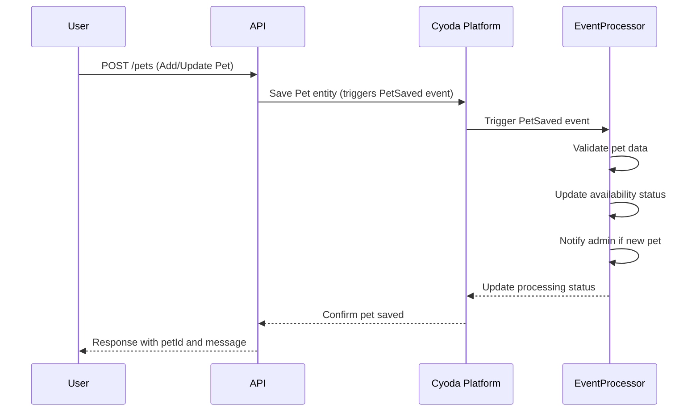
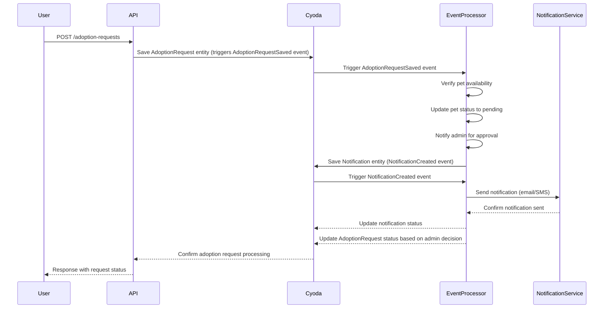
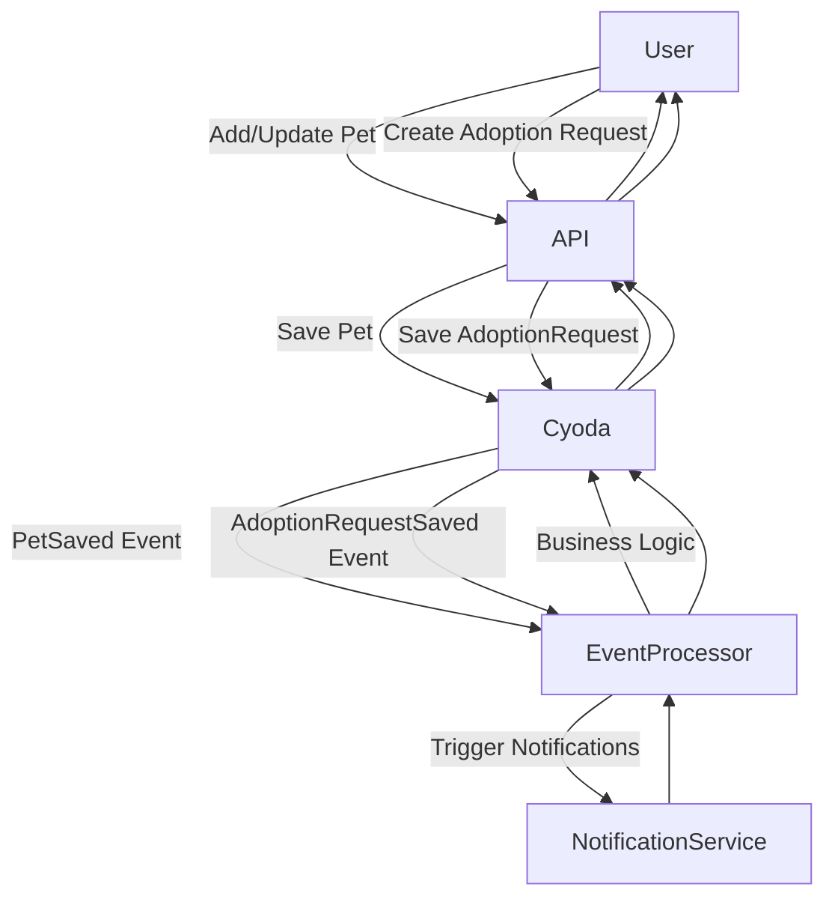

# Purrfect Pets API Functional Requirements - Event-Driven Architecture (EDA)

## 1. Business Entities

- **Pet**  
  Attributes: `id`, `name`, `type` (cat, dog, etc.), `age`, `status` (available, adopted), `description`

- **User**  
  Attributes: `id`, `name`, `email`, `role` (customer, admin)

- **AdoptionRequest**  
  Attributes: `id`, `petId`, `userId`, `status` (pending, approved, rejected), `requestDate`

- **Notification** (Orchestration entity)  
  Attributes: `id`, `type` (email, SMS), `recipientId`, `message`, `status`

## 2. API Endpoints

### POST Endpoints (Trigger events & business logic)

- **POST /pets**  
  Add or update a pet entity. Triggers `PetSaved` event.

- **POST /users**  
  Add or update a user entity. Triggers `UserSaved` event.

- **POST /adoption-requests**  
  Create or update an adoption request. Triggers `AdoptionRequestSaved` event and initiates adoption workflow.

- **POST /notifications**  
  Create notification entries to send alerts to users. Triggers `NotificationCreated` event.

### GET Endpoints (Retrieve results only)

- **GET /pets**  
  Retrieve list of pets with filters (optional) by type or status.

- **GET /pets/{id}**  
  Retrieve pet details.

- **GET /users/{id}**  
  Retrieve user details.

- **GET /adoption-requests/{userId}**  
  Retrieve adoption requests made by a user.

## 3. Event Processing Workflows

- **PetSaved**  
  - Validate pet data  
  - Update pet availability status  
  - Notify admins if a new pet is added

- **UserSaved**  
  - Validate user data  
  - Send welcome notification

- **AdoptionRequestSaved**  
  - Verify pet availability  
  - Update pet status to "pending adoption"  
  - Notify admin for approval  
  - On approval/rejection, update request status and notify user

- **NotificationCreated**  
  - Send notification via external service (email/SMS)  
  - Update notification status

## 4. Request/Response Formats

### POST /pets

**Request**
```json
{
  "id": "optional-for-update",
  "name": "Whiskers",
  "type": "cat",
  "age": 2,
  "status": "available",
  "description": "Playful tabby cat"
}
```

**Response**
```json
{
  "message": "Pet saved successfully",
  "petId": "123"
}
```

### POST /adoption-requests

**Request**
```json
{
  "petId": "123",
  "userId": "456"
}
```

**Response**
```json
{
  "message": "Adoption request created",
  "requestId": "789",
  "status": "pending"
}
```

### GET /pets

**Response**
```json
[
  {
    "id": "123",
    "name": "Whiskers",
    "type": "cat",
    "age": 2,
    "status": "available",
    "description": "Playful tabby cat"
  }
]
```

---

## Mermaid Diagrams

### Entity Creation and Event Processing Flow


```mermaid
sequenceDiagram
  participant User
  participant API
  participant Cyoda as Cyoda Platform
  participant EventProcessor

  User->>API: POST /pets (Add/Update Pet)
  API->>Cyoda: Save Pet entity (triggers PetSaved event)
  Cyoda->>EventProcessor: Trigger PetSaved event
  EventProcessor->>EventProcessor: Validate pet data
  EventProcessor->>EventProcessor: Update availability status
  EventProcessor->>EventProcessor: Notify admin if new pet
  EventProcessor-->>Cyoda: Update processing status
  Cyoda-->>API: Confirm pet saved
  API-->>User: Response with petId and message
```

### Adoption Request and Notification Workflow


```mermaid
sequenceDiagram
  participant User
  participant API
  participant Cyoda
  participant EventProcessor
  participant NotificationService

  User->>API: POST /adoption-requests
  API->>Cyoda: Save AdoptionRequest entity (triggers AdoptionRequestSaved event)
  Cyoda->>EventProcessor: Trigger AdoptionRequestSaved event
  EventProcessor->>EventProcessor: Verify pet availability
  EventProcessor->>EventProcessor: Update pet status to pending
  EventProcessor->>EventProcessor: Notify admin for approval
  EventProcessor->>Cyoda: Save Notification entity (NotificationCreated event)
  Cyoda->>EventProcessor: Trigger NotificationCreated event
  EventProcessor->>NotificationService: Send notification (email/SMS)
  NotificationService-->>EventProcessor: Confirm notification sent
  EventProcessor-->>Cyoda: Update notification status
  EventProcessor-->>Cyoda: Update AdoptionRequest status based on admin decision
  Cyoda-->>API: Confirm adoption request processing
  API-->>User: Response with request status
```

### User Interaction Pattern Overview


```mermaid
flowchart TD
  User -->|Add/Update Pet| API
  API -->|Save Pet| Cyoda
  Cyoda -->|PetSaved Event| EventProcessor
  EventProcessor -->|Business Logic| Cyoda
  Cyoda --> API
  API --> User

  User -->|Create Adoption Request| API
  API -->|Save AdoptionRequest| Cyoda
  Cyoda -->|AdoptionRequestSaved Event| EventProcessor
  EventProcessor -->|Trigger Notifications| NotificationService
  NotificationService --> EventProcessor
  EventProcessor --> Cyoda
  Cyoda --> API
  API --> User
```

---

Please let me know if you need any adjustments or additional details!