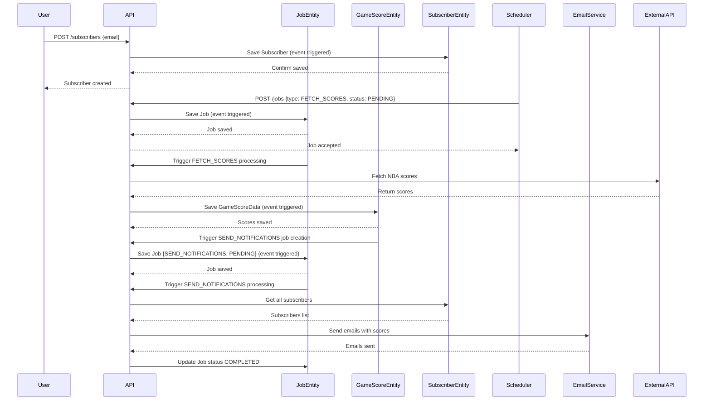

# Functional Requirements for NBA Score Notification App (EDA Approach)

## 1. Business Entities

| Entity Name    | Description                                      | Priority          |
|----------------|-------------------------------------------------|-------------------|
| Job            | Orchestration entity representing scheduled tasks (data fetch, notification send) | High (orchestration) |
| Subscriber     | Business entity representing users subscribed for email notifications | Medium (business)  |
| GameScoreData  | Business entity holding daily fetched NBA game scores | Medium (business)  |

---

## 2. API Endpoints

### POST Endpoints (Add/Update Entities, trigger events)

- **POST /subscribers**  
  Add or update a subscriber (email subscription).  
  Request:  
  ```json
  {
    "email": "user@example.com"
  }
  ```  
  Response:  
  ```json
  {
    "id": "subscriberId",
    "email": "user@example.com"
  }
  ```

- **POST /gamescores**  
  Add or update daily NBA game scores (typically called by internal scheduled job or API).  
  Request:  
  ```json
  {
    "date": "YYYY-MM-DD",
    "games": [
      {
        "homeTeam": "Lakers",
        "awayTeam": "Warriors",
        "homeScore": 110,
        "awayScore": 105
      }
    ]
  }
  ```  
  Response:  
  ```json
  {
    "date": "YYYY-MM-DD",
    "gameCount": 1
  }
  ```

- **POST /jobs**  
  Create or update a Job entity to trigger tasks like fetching scores or sending notifications.  
  Request:  
  ```json
  {
    "type": "FETCH_SCORES" | "SEND_NOTIFICATIONS",
    "status": "PENDING" | "COMPLETED"
  }
  ```  
  Response:  
  ```json
  {
    "jobId": "job123",
    "type": "FETCH_SCORES",
    "status": "PENDING"
  }
  ```

---

### GET Endpoints (Retrieve results, no external calls)

- **GET /subscribers**  
  Retrieve list of subscribers.  
  Response:  
  ```json
  [
    {
      "id": "subscriberId",
      "email": "user@example.com"
    }
  ]
  ```

- **GET /gamescores?date=YYYY-MM-DD**  
  Retrieve game scores for a specific date.  
  Response:  
  ```json
  {
    "date": "YYYY-MM-DD",
    "games": [
      {
        "homeTeam": "Lakers",
        "awayTeam": "Warriors",
        "homeScore": 110,
        "awayScore": 105
      }
    ]
  }
  ```

- **GET /jobs?status=...**  
  Retrieve jobs filtered by status (optional).  
  Response:  
  ```json
  [
    {
      "jobId": "job123",
      "type": "FETCH_SCORES",
      "status": "PENDING"
    }
  ]
  ```

---

## 3. Event Processing Workflows

- **Subscriber Added/Updated**  
  → Event triggers validation and confirmation (optional)  
  → Subscriber ready for notifications

- **GameScoreData Added/Updated**  
  → Event triggers creation of a notification job (Job with type SEND_NOTIFICATIONS)  
  → Notifications sent to all subscribers with latest scores

- **Job Created/Updated**  
  → If Job type = FETCH_SCORES and status = PENDING:  
  &nbsp;&nbsp;&nbsp;&nbsp;→ Fetch NBA scores from external API  
  &nbsp;&nbsp;&nbsp;&nbsp;→ Save GameScoreData entity (triggers event)  
  &nbsp;&nbsp;&nbsp;&nbsp;→ Update Job status to COMPLETED  
  → If Job type = SEND_NOTIFICATIONS and status = PENDING:  
  &nbsp;&nbsp;&nbsp;&nbsp;→ Retrieve latest GameScoreData  
  &nbsp;&nbsp;&nbsp;&nbsp;→ Send notification emails to Subscribers  
  &nbsp;&nbsp;&nbsp;&nbsp;→ Update Job status to COMPLETED

---

## 4. Mermaid Diagram: User-App Interaction and Event Processing


```mermaid
sequenceDiagram
    participant User
    participant API
    participant JobEntity
    participant GameScoreEntity
    participant SubscriberEntity
    participant Scheduler
    participant EmailService

    User->>API: POST /subscribers {email}
    API->>SubscriberEntity: Save Subscriber (event triggered)
    SubscriberEntity-->>API: Confirm saved
    API-->>User: Subscriber created

    Scheduler->>API: POST /jobs {type: FETCH_SCORES, status: PENDING}
    API->>JobEntity: Save Job (event triggered)
    JobEntity-->>API: Job saved
    API-->>Scheduler: Job accepted

    JobEntity->>API: Trigger FETCH_SCORES processing
    API->>ExternalAPI: Fetch NBA scores
    ExternalAPI-->>API: Return scores
    API->>GameScoreEntity: Save GameScoreData (event triggered)
    GameScoreEntity-->>API: Scores saved

    GameScoreEntity->>API: Trigger SEND_NOTIFICATIONS job creation
    API->>JobEntity: Save Job {SEND_NOTIFICATIONS, PENDING} (event triggered)
    JobEntity-->>API: Job saved

    JobEntity->>API: Trigger SEND_NOTIFICATIONS processing
    API->>SubscriberEntity: Get all subscribers
    SubscriberEntity-->>API: Subscribers list
    API->>EmailService: Send emails with scores
    EmailService-->>API: Emails sent
    API->>JobEntity: Update Job status COMPLETED
```

---

You can use this as the foundation for your implementation. If you need any adjustments, feel free to ask!