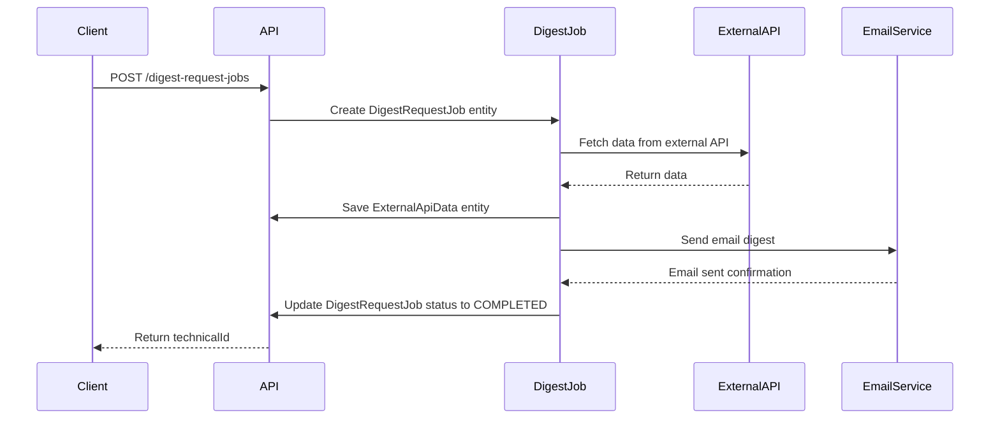
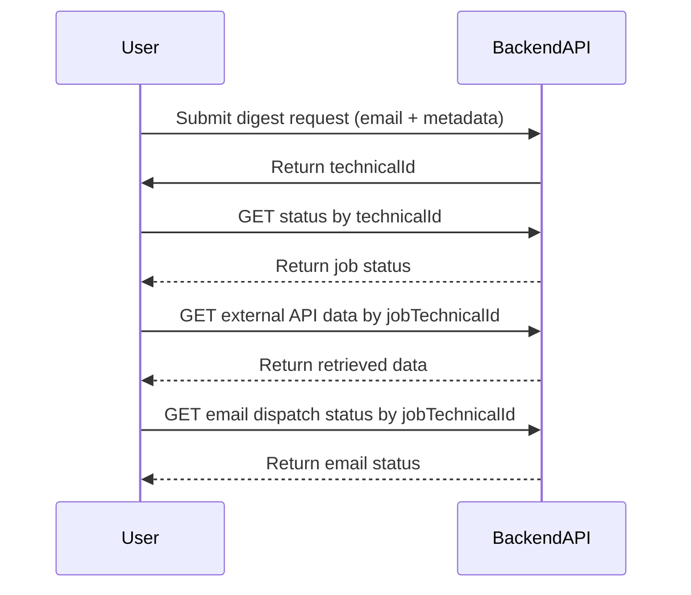

### 1. Entity Definitions

``` 
DigestRequestJob:
- email: String (Recipient email address for the digest)
- requestMetadata: String (Additional info related to the request, e.g., request source or parameters)
- status: String (Current processing status: PENDING, COMPLETED, FAILED)
- createdAt: String (Timestamp of creation)
- completedAt: String (Timestamp of completion)

ExternalApiData:
- jobTechnicalId: String (Reference to DigestRequestJob technicalId)
- dataPayload: String (Raw data retrieved from external API)
- retrievedAt: String (Timestamp of data retrieval)

EmailDispatchRecord:
- jobTechnicalId: String (Reference to DigestRequestJob technicalId)
- email: String (Recipient email address)
- dispatchStatus: String (Status of email dispatch: PENDING, SENT, FAILED)
- sentAt: String (Timestamp when email was sent)
```

---

### 2. Process Method Flows

``` 
processDigestRequestJob() Flow:
1. Initial State: DigestRequestJob entity created with status = PENDING
2. Validation: Optionally validate email format and requestMetadata if criteria defined
3. Processing:
   a. Trigger data retrieval from external API (e.g., call petstore.swagger.io endpoints)
   b. Save retrieved data as ExternalApiData entity linked to the job
4. Email Compilation & Dispatch:
   a. Format data into digest email content
   b. Create EmailDispatchRecord entity with status = PENDING
   c. Send email to specified address
   d. Update EmailDispatchRecord with SENT or FAILED status and timestamp
5. Completion:
   a. Update DigestRequestJob status to COMPLETED or FAILED
   b. Set completedAt timestamp
```

``` 
processExternalApiData() Flow:
1. Triggered automatically after ExternalApiData creation
2. Perform any data enrichment or transformation if needed (optional)
3. Ready data for email compilation (handled in processDigestRequestJob)
```

``` 
processEmailDispatchRecord() Flow:
1. Triggered after EmailDispatchRecord creation with status = PENDING
2. Attempt to send email using configured email service
3. Update dispatchStatus and sentAt timestamp accordingly
```

---

### 3. API Endpoints Design

- **POST /digest-request-jobs**
  - Description: Create a new digest request job, triggers the entire workflow.
  - Request Body Example:
    ```json
    {
      "email": "user@example.com",
      "requestMetadata": "source:web"
    }
    ```
  - Response:
    ```json
    {
      "technicalId": "string"
    }
    ```

- **GET /digest-request-jobs/{technicalId}**
  - Description: Retrieve status and basic info of DigestRequestJob by technicalId.
  - Response Example:
    ```json
    {
      "technicalId": "string",
      "email": "user@example.com",
      "status": "COMPLETED",
      "createdAt": "2024-06-01T12:00:00Z",
      "completedAt": "2024-06-01T12:05:00Z"
    }
    ```

- **GET /external-api-data/{jobTechnicalId}**
  - Description: Retrieve raw data fetched from external API for a given job.
  - Response Example:
    ```json
    {
      "jobTechnicalId": "string",
      "dataPayload": "{...}",
      "retrievedAt": "2024-06-01T12:01:00Z"
    }
    ```

- **GET /email-dispatch-record/{jobTechnicalId}**
  - Description: Retrieve email dispatch status for a given job.
  - Response Example:
    ```json
    {
      "jobTechnicalId": "string",
      "email": "user@example.com",
      "dispatchStatus": "SENT",
      "sentAt": "2024-06-01T12:03:00Z"
    }
    ```

---

### 4. Visual Representations

#### DigestRequestJob Lifecycle State Diagram


```mermaid
stateDiagram-v2
    [*] --> Created
    Created --> Processing : processDigestRequestJob()
    Processing --> Completed : success
    Processing --> Failed : error
    Completed --> [*]
    Failed --> [*]
```

#### Event-Driven Processing Chain


```mermaid
sequenceDiagram
    participant Client
    participant API
    participant DigestJob
    participant ExternalAPI
    participant EmailService

    Client->>API: POST /digest-request-jobs
    API->>DigestJob: Create DigestRequestJob entity
    DigestJob->>ExternalAPI: Fetch data from external API
    ExternalAPI-->>DigestJob: Return data
    DigestJob->>API: Save ExternalApiData entity
    DigestJob->>EmailService: Send email digest
    EmailService-->>DigestJob: Email sent confirmation
    DigestJob->>API: Update DigestRequestJob status to COMPLETED
    API-->>Client: Return technicalId
```

#### User Interaction Sequence Flow


```mermaid
sequenceDiagram
    participant User
    participant BackendAPI

    User->>BackendAPI: Submit digest request (email + metadata)
    BackendAPI->>User: Return technicalId

    User->>BackendAPI: GET status by technicalId
    BackendAPI-->>User: Return job status

    User->>BackendAPI: GET external API data by jobTechnicalId
    BackendAPI-->>User: Return retrieved data

    User->>BackendAPI: GET email dispatch status by jobTechnicalId
    BackendAPI-->>User: Return email status
```
