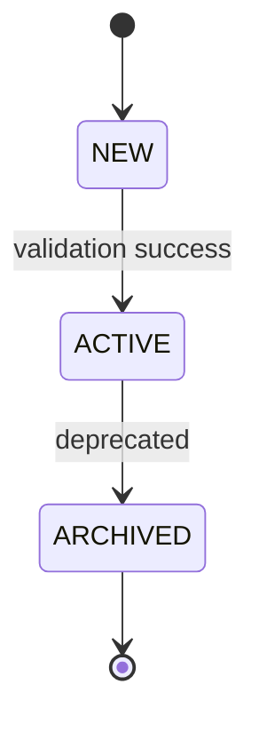
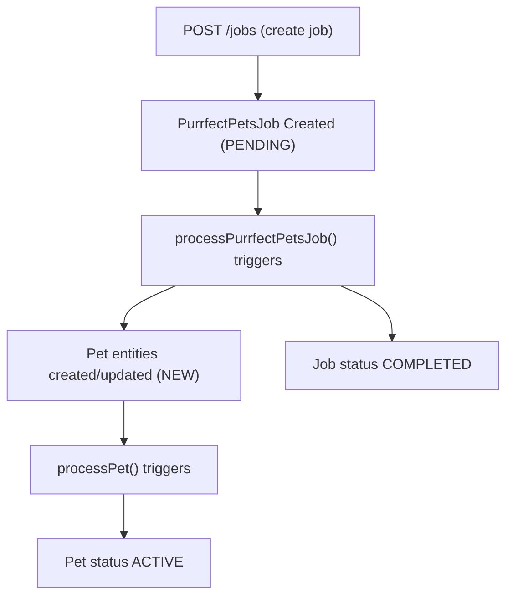
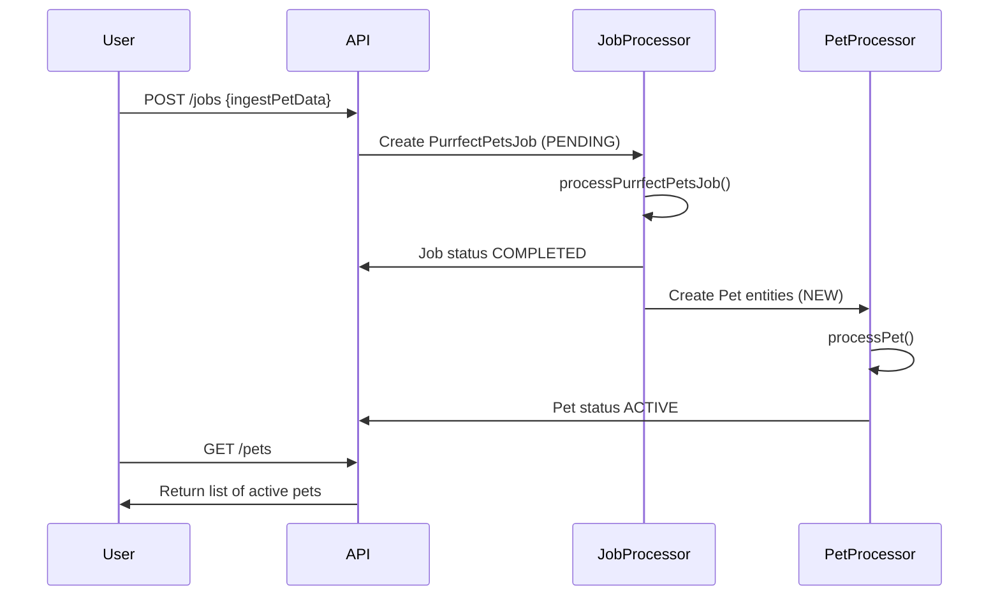

### 1. Entity Definitions

``` 
PurrfectPetsJob:  
- jobId: String (unique identifier for the job)  
- action: String (type of operation, e.g., "ingestPetData")  
- payload: JSON (input data relevant to the job)  
- status: StatusEnum (PENDING, PROCESSING, COMPLETED, FAILED)  

Pet:  
- petId: String (unique identifier of the pet)  
- name: String (pet's name)  
- category: String (e.g., cat, dog, bird)  
- status: String (available, pending, sold)  
- photoUrls: List<String> (images of the pet)  
- tags: List<String> (descriptive tags)  
- status: StatusEnum (NEW, ACTIVE, ARCHIVED)  
```

### 2. Process Method Flows

```
processPurrfectPetsJob() Flow:  
1. Initial State: Job created with PENDING status  
2. Validation: Validate the action and payload structure  
3. Execution: Perform the specified action (e.g., ingest Pet data from Petstore API)  
4. Pet Entity Creation/Update: Create new Pet entities or new Pet states (immutable)  
5. Completion: Update Job status to COMPLETED or FAILED based on outcome  
6. Notification: Log or notify downstream systems of job completion  

processPet() Flow:  
1. Initial State: Pet entity created with NEW status  
2. Verification: Check mandatory fields (name, category, status)  
3. Activation: Set status to ACTIVE after validation  
4. Indexing/Search Prep: Prepare pet data for search/filtering  
5. Completion: Confirm Pet is ready for retrieval  
```

### 3. API Endpoints Design

| HTTP Method | Endpoint               | Description                                | Request Body (JSON)                    | Response Body (JSON)                 |
|-------------|------------------------|--------------------------------------------|--------------------------------------|------------------------------------|
| POST        | /jobs                  | Create a new PurrfectPetsJob (triggers event) | `{ "action": "ingestPetData", "payload": {...} }` | `{ "jobId": "...", "status": "PENDING" }` |
| POST        | /pets                  | Create a new Pet entity (immutable state)  | `{ "name": "...", "category": "...", "status": "...", "photoUrls": [...], "tags": [...] }` | `{ "petId": "...", "status": "NEW" }`       |
| GET         | /pets                  | Retrieve list of Pets                       | N/A                                  | `[ { "petId": "...", "name": "...", ... }, ... ]` |
| GET         | /pets/{petId}          | Retrieve a single Pet                       | N/A                                  | `{ "petId": "...", "name": "...", ... }`         |

### 4. Request/Response Formats

**POST /jobs**  
Request:  
```json
{
  "action": "ingestPetData",
  "payload": {
    "sourceUrl": "https://petstore.swagger.io/v2/pet/findByStatus?status=available"
  }
}
```  
Response:  
```json
{
  "jobId": "job123",
  "status": "PENDING"
}
```

**POST /pets**  
Request:  
```json
{
  "name": "Whiskers",
  "category": "cat",
  "status": "available",
  "photoUrls": ["http://example.com/photo1.jpg"],
  "tags": ["cute", "small"]
}
```  
Response:  
```json
{
  "petId": "pet456",
  "status": "NEW"
}
```

**GET /pets**  
Response:  
```json
[
  {
    "petId": "pet456",
    "name": "Whiskers",
    "category": "cat",
    "status": "available",
    "photoUrls": ["http://example.com/photo1.jpg"],
    "tags": ["cute", "small"]
  }
]
```

---

### Mermaid Diagrams

**Entity Lifecycle State Diagram (for PurrfectPetsJob):**


```mermaid
stateDiagram-v2
    [*] --> PENDING
    PENDING --> PROCESSING : processPurrfectPetsJob()
    PROCESSING --> COMPLETED : success
    PROCESSING --> FAILED : error
    COMPLETED --> [*]
    FAILED --> [*]
```

**Entity Lifecycle State Diagram (for Pet):**


```mermaid
stateDiagram-v2
    [*] --> NEW
    NEW --> ACTIVE : validation success
    ACTIVE --> ARCHIVED : deprecated
    ARCHIVED --> [*]
```

**Event-Driven Processing Chain:**


```mermaid
graph TD
    ClientPOSTJob["POST /jobs (create job)"] --> JobCreated["PurrfectPetsJob Created (PENDING)"]
    JobCreated --> processJob["processPurrfectPetsJob() triggers"]
    processJob --> PetCreated["Pet entities created/updated (NEW)"]
    PetCreated --> processPet["processPet() triggers"]
    processPet --> PetActive["Pet status ACTIVE"]
    processJob --> JobCompleted["Job status COMPLETED"]
```

**User Interaction Sequence Flow:**


```mermaid
sequenceDiagram
    participant User
    participant API
    participant JobProcessor
    participant PetProcessor

    User->>API: POST /jobs {ingestPetData}
    API->>JobProcessor: Create PurrfectPetsJob (PENDING)
    JobProcessor->>JobProcessor: processPurrfectPetsJob()
    JobProcessor->>API: Job status COMPLETED
    JobProcessor->>PetProcessor: Create Pet entities (NEW)
    PetProcessor->>PetProcessor: processPet()
    PetProcessor->>API: Pet status ACTIVE
    User->>API: GET /pets
    API->>User: Return list of active pets
```

---

If you need any additions or further clarifications, please let me know!