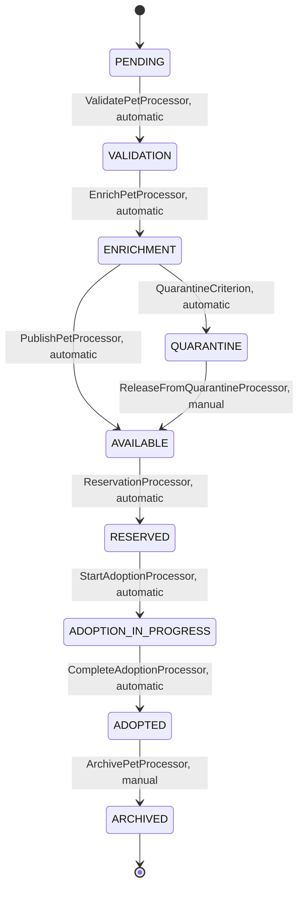
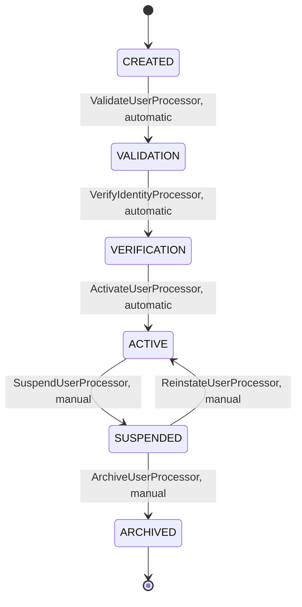
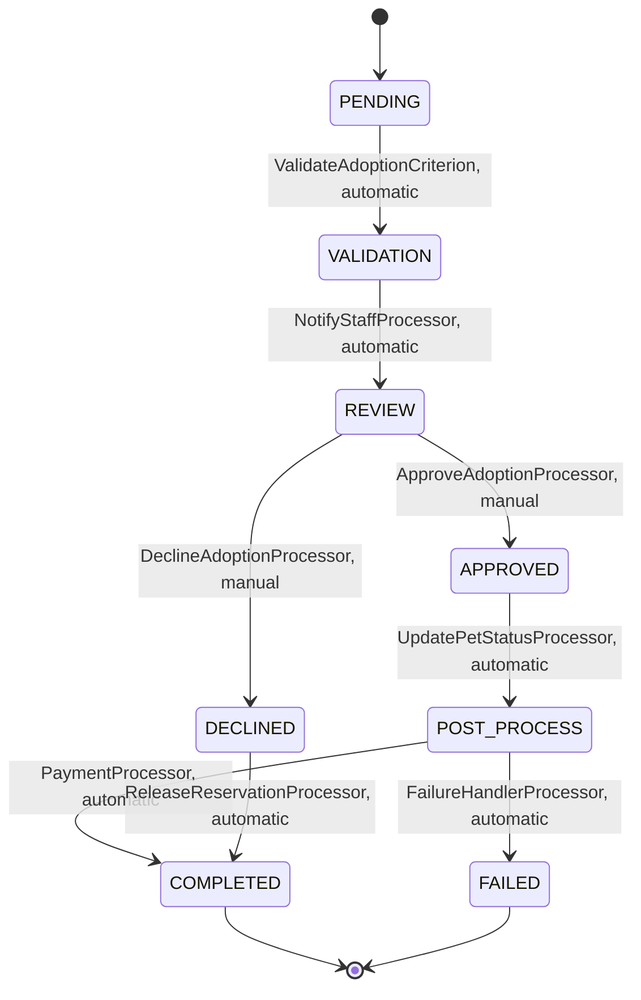

### 1. Entity Definitions

```
Pet:
- id: String (domain id)
- externalId: String (id from Petstore API if applicable)
- name: String (pet name)
- species: String (dog/cat/etc)
- breed: String (breed description)
- ageMonths: Integer (age in months)
- sex: String (M/F/unknown)
- size: String (small/medium/large)
- color: String (description)
- description: String (free text)
- status: String (available/reserved/adopted/quarantine/archived)
- photos: Array of String (URLs)
- arrivalDate: String (ISO date)
- source: String (Petstore/Manual/Shelter)
- adoptedByUserId: String (user id if adopted) 
- healthRecords: Array of String (references)
- createdAt: String (ISO timestamp)
- updatedAt: String (ISO timestamp)
```

```
User:
- id: String (domain id)
- name: String (full name)
- email: String (contact email)
- phone: String (contact phone)
- role: String (customer/admin/shelter_staff)
- address: String (postal address)
- favorites: Array of String (pet ids)
- createdAt: String (ISO timestamp)
- updatedAt: String (ISO timestamp)
```

```
AdoptionJob:
- id: String (domain id)
- petId: String (target pet id)
- userId: String (requesting user id)
- requestType: String (adoption/reservation)
- requestedAt: String (ISO timestamp)
- status: String (pending/validation/review/approved/declined/completed/failed)
- decisionBy: String (staff/admin id)
- processedAt: String (ISO timestamp)
- fee: Number (adoption fee)
- notes: String (free text for staff)
- resultDetails: String (optional summary)
```

Note: Defaulting to 3 entities (Pet, User, AdoptionJob) as you did not request more. If you want additional entities (e.g., PetSyncJob, Review), ask and I will add up to 10.

---

### 2. Entity workflows

Pet workflow:
1. Initial State: Pet created (created via PetSync or as a result of a processor) with PENDING status
2. Validation: Automatic checks (required fields, photo limits)
3. Enrichment: Automatic enrichment (map externalId metadata, healthRecords)
4. Publish: Manual or automatic transition to AVAILABLE (if passes criteria) or QUARANTINE (if needs vet)
5. Reservation/Adoption transitions: RESERVED when an AdoptionJob reserves it; ADOPTION_IN_PROGRESS while AdoptionJob processes; ADOPTED when AdoptionJob completes; ARCHIVED for removed pets
6. Notifications: System notifies interested users on status changes


```mermaid
stateDiagram-v2
    [*] --> PENDING
    PENDING --> VALIDATION : ValidatePetProcessor, automatic
    VALIDATION --> ENRICHMENT : EnrichPetProcessor, automatic
    ENRICHMENT --> AVAILABLE : PublishPetProcessor, automatic
    ENRICHMENT --> QUARANTINE : QuarantineCriterion, automatic
    AVAILABLE --> RESERVED : ReservationProcessor, automatic
    RESERVED --> ADOPTION_IN_PROGRESS : StartAdoptionProcessor, automatic
    ADOPTION_IN_PROGRESS --> ADOPTED : CompleteAdoptionProcessor, automatic
    ADOPTED --> ARCHIVED : ArchivePetProcessor, manual
    QUARANTINE --> AVAILABLE : ReleaseFromQuarantineProcessor, manual
    ARCHIVED --> [*]
```

Pet workflow processors and criteria:
- Processors:
  - ValidatePetProcessor (checks required fields, photo count)
  - EnrichPetProcessor (map external metadata, compute ageCategory)
  - PublishPetProcessor (sets status AVAILABLE and notifies feed)
  - ReservationProcessor (locks pet for a user)
  - CompleteAdoptionProcessor (finalize adoption, set adoptedByUserId)
- Criteria:
  - QuarantineCriterion (returns true if healthRecords require vet check)
  - PhotoLimitCriterion (checks max photos)
  - RequiredFieldsCriterion (ensures name, species, status)

User workflow:
1. Initial State: User created with CREATED status
2. Validation: Automatic contact format checks and sanction screening
3. Verification: Manual or automatic identity/contact verification
4. Activation: Move to ACTIVE after verification
5. Suspension/Archive: Manual actions for fraud or inactivity


```mermaid
stateDiagram-v2
    [*] --> CREATED
    CREATED --> VALIDATION : ValidateUserProcessor, automatic
    VALIDATION --> VERIFICATION : VerifyIdentityProcessor, automatic
    VERIFICATION --> ACTIVE : ActivateUserProcessor, automatic
    ACTIVE --> SUSPENDED : SuspendUserProcessor, manual
    SUSPENDED --> ACTIVE : ReinstateUserProcessor, manual
    SUSPENDED --> ARCHIVED : ArchiveUserProcessor, manual
    ARCHIVED --> [*]
```

User processors and criteria:
- Processors:
  - ValidateUserProcessor (email/phone format, required fields)
  - VerifyIdentityProcessor (trigger manual verification or third party check)
  - ActivateUserProcessor (set role-specific defaults)
  - SuspendUserProcessor (mark account suspended)
- Criteria:
  - UserContactVerifiedCriterion (true if email/phone validated)
  - UserSanctionCheckCriterion (checks blacklists)

AdoptionJob workflow (orchestration entity) — POST endpoint creates an AdoptionJob event and starts processing:
1. Initial State: AdoptionJob created with PENDING status (event)
2. Validation: Automatic criteria check pet availability and user status
3. Review: Automatic staff notification and optional manual review
4. Decision: Manual approve or decline by staff OR automatic decision (if rules allow)
5. Post-Decision Processing: on APPROVED, update Pet (status -> ADOPTION_IN_PROGRESS then ADOPTED), charge fee, notify user; on DECLINED, release reservation and notify
6. Completion: mark job COMPLETED or FAILED and emit notifications/logs


```mermaid
stateDiagram-v2
    [*] --> PENDING
    PENDING --> VALIDATION : ValidateAdoptionCriterion, automatic
    VALIDATION --> REVIEW : NotifyStaffProcessor, automatic
    REVIEW --> APPROVED : ApproveAdoptionProcessor, manual
    REVIEW --> DECLINED : DeclineAdoptionProcessor, manual
    APPROVED --> POST_PROCESS : UpdatePetStatusProcessor, automatic
    POST_PROCESS --> COMPLETED : PaymentProcessor, automatic
    DECLINED --> COMPLETED : ReleaseReservationProcessor, automatic
    COMPLETED --> [*]
    POST_PROCESS --> FAILED : FailureHandlerProcessor, automatic
    FAILED --> [*]
```

AdoptionJob processors and criteria:
- Processors:
  - NotifyStaffProcessor (creates work item for staff)
  - ApproveAdoptionProcessor (applies staff decision, sets decisionBy)
  - UpdatePetStatusProcessor (sets Pet.status to ADOPTION_IN_PROGRESS then ADOPTED)
  - PaymentProcessor (charge or record fee)
  - ReleaseReservationProcessor (unlock pet if declined)
  - FailureHandlerProcessor (log and notify on errors)
- Criteria:
  - ValidateAdoptionCriterion (pet exists, pet.status == available or reserved by same user, user.status == active)
  - DuplicateRequestCriterion (no conflicting active jobs for same pet)

---

### 3. Pseudo code for processor classes

Note: processors run when an entity is persisted and Cyoda starts the workflow. Pseudocode below shows intent and side effects.

ValidatePetProcessor
```
class ValidatePetProcessor {
  process(pet) {
    if missing(pet.name) or missing(pet.species) then throw ValidationError
    if pet.photos.length > 8 then throw ValidationError
    pet.updatedAt = now()
    persist(pet)
  }
}
```

EnrichPetProcessor
```
class EnrichPetProcessor {
  process(pet) {
    if pet.externalId present then pet.description += " Source: " + pet.source
    pet.ageCategory = computeAgeCategory(pet.ageMonths)
    persist(pet)
  }
}
```

ReservationProcessor
```
class ReservationProcessor {
  process(pet, userId) {
    lock(pet)
    if pet.status != available then throw ConflictError
    pet.status = reserved
    pet.updatedAt = now()
    pet.reservedBy = userId
    persist(pet)
    notifyInterestedUsers(pet)
  }
}
```

ValidateAdoptionCriterion
```
class ValidateAdoptionCriterion {
  test(job) {
    pet = loadPet(job.petId)
    user = loadUser(job.userId)
    return pet != null && user != null && pet.status == available && user.status == active
  }
}
```

UpdatePetStatusProcessor
```
class UpdatePetStatusProcessor {
  process(job) {
    pet = loadPet(job.petId)
    pet.status = adoption_in_progress
    persist(pet)
    // after payment or finalization
    pet.status = adopted
    pet.adoptedByUserId = job.userId
    persist(pet)
  }
}
```

NotifyStaffProcessor
```
class NotifyStaffProcessor {
  process(job) {
    createWorkItemForStaff(job)
    sendEmailToStaff(job)
  }
}
```

PaymentProcessor
```
class PaymentProcessor {
  process(job) {
    if job.fee > 0 then chargePayment(job.userId, job.fee)
    job.processedAt = now()
    persist(job)
  }
}
```

FailureHandlerProcessor
```
class FailureHandlerProcessor {
  process(job, error) {
    job.status = failed
    job.resultDetails = error.message
    persist(job)
    notifyAdmin(error, job)
  }
}
```

---

### 4. API Endpoints Design Rules

Rules applied:
- AdoptionJob is an orchestration entity -> provide POST to create it and GET by technicalId to retrieve job state/result.
- Business entities Pet and User are created/updated via processors (process methods). No POST endpoints are provided for creating Pet or User — they are created by workflows (e.g., admin action creates an AdoptionJob or a PetSync job). Retrieval endpoints (GET by technicalId) are provided for Pet and User.

Endpoints and JSON formats

1) Create Adoption Job (POST triggers event)
- POST /jobs/adoption
- Request (create triggers processing only)
```json
{
  "petId": "string",
  "userId": "string",
  "requestType": "adoption",
  "notes": "string",
  "fee": 25.0
}
```
- Response (must return only technicalId)
```json
{
  "technicalId": "job-1234567890"
}
```

2) Get Adoption Job by technicalId
- GET /jobs/adoption/{technicalId}
- Response
```json
{
  "id": "string",
  "petId": "string",
  "userId": "string",
  "requestType": "adoption",
  "requestedAt": "2025-08-22T12:00:00Z",
  "status": "approved",
  "decisionBy": "staff-1",
  "processedAt": "2025-08-22T13:00:00Z",
  "fee": 25.0,
  "notes": "string",
  "resultDetails": "Adoption completed"
}
```

3) Get Pet by technicalId (read only retrieval)
- GET /pets/{technicalId}
- Response
```json
{
  "id": "string",
  "externalId": "petstore-123",
  "name": "Mittens",
  "species": "cat",
  "breed": "Tabby",
  "ageMonths": 18,
  "sex": "F",
  "size": "small",
  "color": "brown",
  "description": "Playful",
  "status": "available",
  "photos": ["https://.../1.jpg"],
  "arrivalDate": "2025-07-01",
  "source": "Petstore",
  "adoptedByUserId": null,
  "healthRecords": [],
  "createdAt": "2025-07-01T10:00:00Z",
  "updatedAt": "2025-07-02T11:00:00Z"
}
```

4) Get User by technicalId (read only retrieval)
- GET /users/{technicalId}
- Response
```json
{
  "id": "string",
  "name": "Jane Doe",
  "email": "jane@example.com",
  "phone": "+10000000000",
  "role": "customer",
  "address": "123 Main St",
  "favorites": ["pet-1","pet-2"],
  "createdAt": "2025-06-01T09:00:00Z",
  "updatedAt": "2025-07-01T12:00:00Z"
}
```

Notes on GET by condition and other POST endpoints:
- No GET by condition endpoints included by default. Add them only if you explicitly want search endpoints (e.g., GET /pets?species=cat).
- If you want a PetSync orchestration entity (to ingest Petstore API) I can add a POST /jobs/pet-sync job that triggers ingestion and creation of Pet entities via processors.

---

If you want, next I can:
- Add a PetSyncJob orchestration entity to model ingesting the Petstore catalog.
- Add search GET by condition endpoints (pets by species, status).
- Expand processors with more detailed pseudo code or map exact criteria names for Cyoda. Which would you like to add or change?