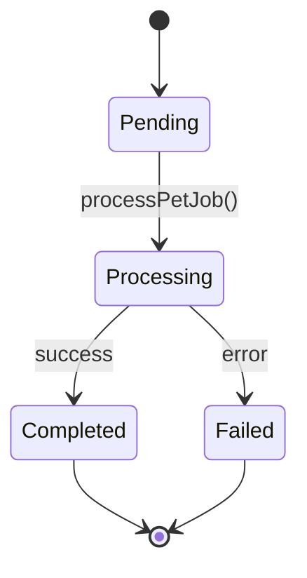
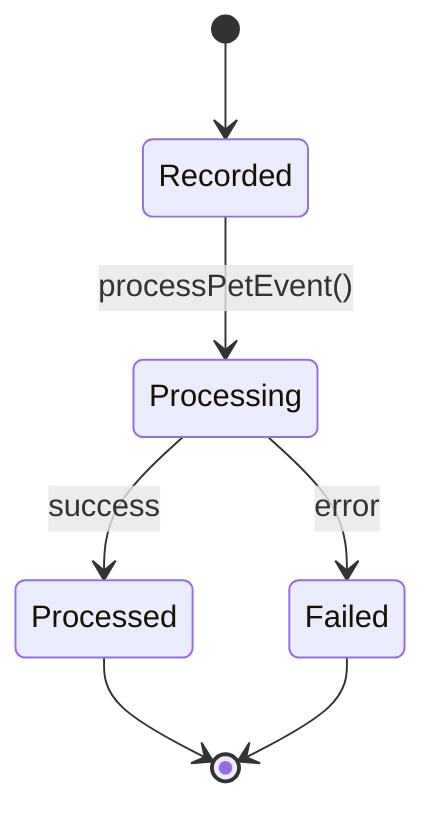
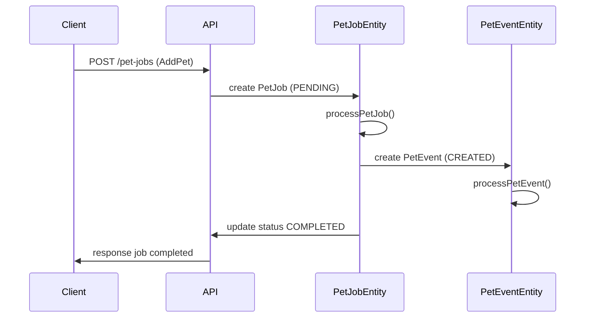

Certainly! Here is the well-formatted final version of your 'Purrfect Pets' API functional requirements following the Event-Driven Architecture approach:

---

### 1. Entity Definitions

``` 
PetJob:
- jobId: String (unique identifier for the job)
- jobType: String (type of job e.g., "AddPet", "UpdatePetInfo")
- payload: JSON (data related to the pet operation)
- status: StatusEnum (PENDING, PROCESSING, COMPLETED, FAILED)

Pet:
- petId: String (unique identifier for the pet)
- name: String (pet's name)
- species: String (e.g., Cat, Dog, Bird)
- age: Integer (pet's age)
- status: StatusEnum (ACTIVE, INACTIVE) 

PetEvent:
- eventId: String (unique identifier for the event)
- petId: String (linked pet identifier)
- eventType: String (e.g., CREATED, UPDATED)
- eventTimestamp: DateTime (when event occurred)
- status: StatusEnum (RECORDED, PROCESSED)
```

---

### 2. Process Method Flows

```
processPetJob() Flow:
1. Initial State: PetJob created with PENDING status
2. Validation: Verify jobType and payload structure
3. Execution: Perform action based on jobType (e.g., add pet, update pet info)
4. Event Creation: Generate corresponding PetEvent (e.g., CREATED for new pet)
5. Completion: Update PetJob status to COMPLETED or FAILED
6. Notification: Optionally notify downstream consumers or logs
```

```
processPetEvent() Flow:
1. Initial State: PetEvent created with RECORDED status
2. Processing: Apply business rules or trigger further workflows if needed
3. Completion: Update PetEvent status to PROCESSED
```

---

### 3. API Endpoints & Request/Response Formats

- **POST /pet-jobs**  
  Create a new PetJob (triggers processing)  
  Request JSON:  
  ```json
  {
    "jobType": "AddPet",
    "payload": {
      "name": "Whiskers",
      "species": "Cat",
      "age": 3
    }
  }
  ```  
  Response JSON:  
  ```json
  {
    "jobId": "job-1234",
    "status": "PENDING"
  }
  ```

- **GET /pets/{petId}**  
  Retrieve pet information  
  Response JSON:  
  ```json
  {
    "petId": "pet-5678",
    "name": "Whiskers",
    "species": "Cat",
    "age": 3,
    "status": "ACTIVE"
  }
  ```

- **GET /pet-jobs/{jobId}**  
  Retrieve job status and result  
  Response JSON:  
  ```json
  {
    "jobId": "job-1234",
    "jobType": "AddPet",
    "status": "COMPLETED"
  }
  ```

---

### 4. Visual Representations

**PetJob Entity Lifecycle**


```mermaid
stateDiagram-v2
    [*] --> Pending
    Pending --> Processing : processPetJob()
    Processing --> Completed : success
    Processing --> Failed : error
    Completed --> [*]
    Failed --> [*]
```

**PetEvent Entity Lifecycle**


```mermaid
stateDiagram-v2
    [*] --> Recorded
    Recorded --> Processing : processPetEvent()
    Processing --> Processed : success
    Processing --> Failed : error
    Processed --> [*]
    Failed --> [*]
```

**Event-Driven Processing Chain**


```mermaid
sequenceDiagram
    participant Client
    participant API
    participant PetJobEntity
    participant PetEventEntity

    Client->>API: POST /pet-jobs (AddPet)
    API->>PetJobEntity: create PetJob (PENDING)
    PetJobEntity->>PetJobEntity: processPetJob()
    PetJobEntity->>PetEventEntity: create PetEvent (CREATED)
    PetEventEntity->>PetEventEntity: processPetEvent()
    PetJobEntity->>API: update status COMPLETED
    API->>Client: response job completed
```

---

If you need any further adjustments, feel free to ask. Otherwise, this will be the basis for your backend implementation on Cyoda with Java Spring Boot.

Thank you!