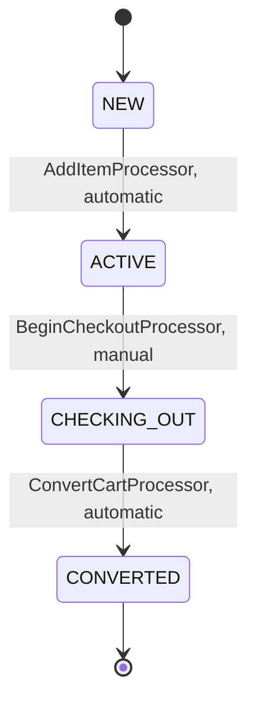
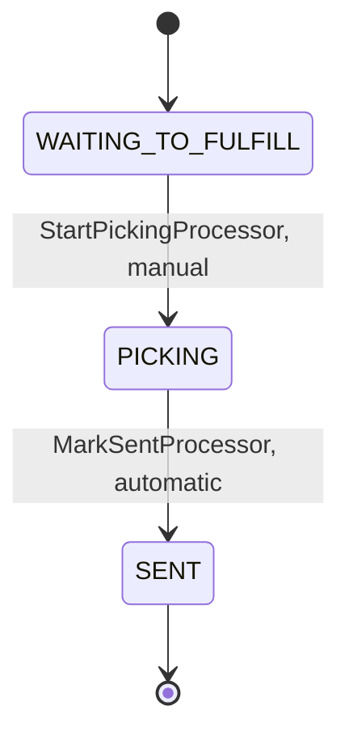
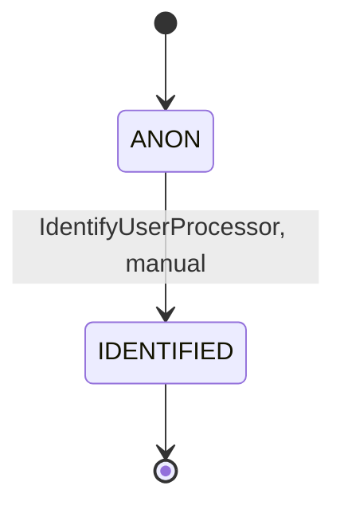
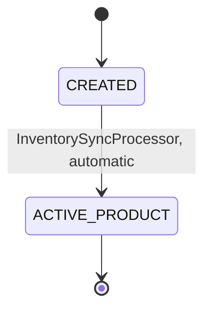
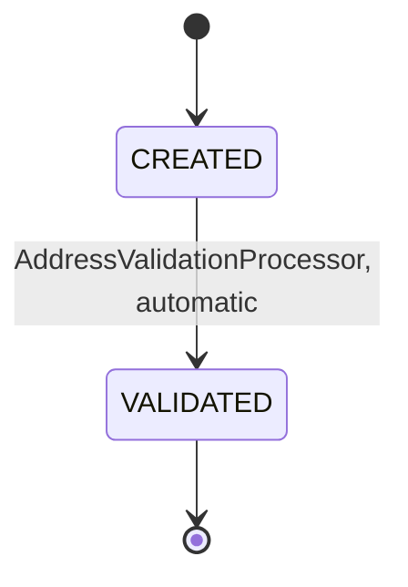

### 1. Entity Definitions
```
Product:
- id: string (business id, e.g., SKU)
- name: string (display name)
- description: string (marketing text)
- price: decimal (unit price)
- currency: string (ISO currency)
- availableQuantity: integer (stock)

Cart:
- id: string (business id)
- userId: string (nullable for ANON)
- status: string (NEW/ACTIVE/CHECKING_OUT/CONVERTED)
- items: array (list of {productId:string, quantity:integer, unitPrice:decimal})
- totalAmount: decimal
- createdAt: timestamp
- updatedAt: timestamp

Order:
- id: string (business id)
- cartId: string (originating cart)
- userId: string
- status: string (WAITING_TO_FULFILL/PICKING/SENT)
- itemsSnapshot: array (captured product details and qty)
- totalAmount: decimal
- shippingAddressId: string
- billingAddressId: string
- createdAt: timestamp
- updatedAt: timestamp

User:
- id: string
- email: string (nullable)
- name: string (nullable)
- identificationStatus: string (ANON/IDENTIFIED)
- createdAt: timestamp
- updatedAt: timestamp

Address:
- id: string
- userId: string
- line1: string
- line2: string
- city: string
- postalCode: string
- region: string
- country: string
- phone: string
```

### 2. Entity workflows

Cart workflow:
1. Initial State: NEW — Cart persisted event starts workflow.
2. Activation: item(s) added → status ACTIVE (automatic via AddItemProcessor).
3. Checkout start: user triggers checkout → status CHECKING_OUT (manual).
4. Conversion: checkout completes → status CONVERTED (automatic, ConvertCartProcessor creates Order).
5. Terminal: CONVERTED (immutable).


```mermaid
stateDiagram-v2
    [*] --> NEW
    NEW --> ACTIVE : AddItemProcessor, automatic
    ACTIVE --> CHECKING_OUT : BeginCheckoutProcessor, manual
    CHECKING_OUT --> CONVERTED : ConvertCartProcessor, automatic
    CONVERTED --> [*]
```

Processors: AddItemProcessor, CalculateCartTotalsProcessor, BeginCheckoutProcessor, ConvertCartProcessor  
Criteria: CartHasItemsCriterion, StockAvailableCriterion

Order workflow:
1. Initial State: WAITING_TO_FULFILL — created when cart converts.
2. Picking: warehouse picks items → status PICKING (manual/system).
3. Sent: shipment created → status SENT (automatic).
4. Terminal: SENT.


```mermaid
stateDiagram-v2
    [*] --> WAITING_TO_FULFILL
    WAITING_TO_FULFILL --> PICKING : StartPickingProcessor, manual
    PICKING --> SENT : MarkSentProcessor, automatic
    SENT --> [*]
```

Processors: CreateOrderProcessor, StartPickingProcessor, MarkSentProcessor, NotifyCustomerProcessor  
Criteria: InventoryReservedCriterion, ShipmentCreatedCriterion

User identification workflow:
1. Initial State: ANON — user persisted as anonymous.
2. Identification: user logs in / provides identity → IDENTIFIED (manual transition).
3. Terminal: IDENTIFIED.


```mermaid
stateDiagram-v2
    [*] --> ANON
    ANON --> IDENTIFIED : IdentifyUserProcessor, manual
    IDENTIFIED --> [*]
```

Processors: IdentifyUserProcessor, LinkAnonCartsProcessor  
Criteria: ValidCredentialsCriterion

Product workflow (simple):
1. Initial State: CREATED — product persisted.
2. Inventory sync: InventorySyncProcessor runs (automatic).
3. Terminal: ACTIVE_PRODUCT.


```mermaid
stateDiagram-v2
    [*] --> CREATED
    CREATED --> ACTIVE_PRODUCT : InventorySyncProcessor, automatic
    ACTIVE_PRODUCT --> [*]
```

Processors: InventorySyncProcessor  
Criteria: None (simple flow)

Address workflow (simple validation):
1. Initial State: CREATED — address persisted.
2. Validation: AddressValidationProcessor runs (automatic).
3. Terminal: VALIDATED / INVALID (for simplicity keep terminal VALIDATED).


```mermaid
stateDiagram-v2
    [*] --> CREATED
    CREATED --> VALIDATED : AddressValidationProcessor, automatic
    VALIDATED --> [*]
```

Processors: AddressValidationProcessor  
Criteria: AddressFormatCriterion

### 3. Pseudo code for processor classes

AddItemProcessor
```
onEvent(cart, eventPayload):
  item = eventPayload.item
  if item exists in cart.items:
    increment quantity
  else:
    append item with unitPrice resolved from Product
  persist cart.status = ACTIVE
  call CalculateCartTotalsProcessor(cart)
```

CalculateCartTotalsProcessor
```
onEvent(cart):
  total = 0
  for each item in cart.items:
    total += item.unitPrice * item.quantity
  cart.totalAmount = total
  persist cart
```

BeginCheckoutProcessor
```
onEvent(cart):
  if CartHasItemsCriterion(cart) is false:
    throw BusinessError("Cart has no items")
  persist cart.status = CHECKING_OUT
```

ConvertCartProcessor
```
onEvent(cart):
  if CartHasItemsCriterion(cart) is false:
    throw BusinessError("Cart empty")
  if StockAvailableCriterion(cart) is false:
    throw BusinessError("Stock not available")
  order = new Order()
  order.cartId = cart.id
  order.userId = cart.userId
  order.itemsSnapshot = deepCopy(cart.items)
  order.totalAmount = cart.totalAmount
  order.status = WAITING_TO_FULFILL
  persist order
  persist cart.status = CONVERTED
```

CreateOrderProcessor
```
onEvent(order):
  for each item in order.itemsSnapshot:
    reserve inventory (decrement availableQuantity)
  persist inventory changes
  notify warehouse via NotifyCustomerProcessor or integration
```

IdentifyUserProcessor
```
onEvent(user, credentials):
  if ValidCredentialsCriterion(credentials) is false:
    throw AuthenticationError
  user.identificationStatus = IDENTIFIED
  persist user
  call LinkAnonCartsProcessor(user)
```

AddressValidationProcessor
```
onEvent(address):
  if AddressFormatCriterion(address) is false:
    mark address invalid or raise event
  else:
    persist address as VALIDATED
```

Example Criteria (behavior):
- CartHasItemsCriterion(cart): returns true if cart.items length > 0
- StockAvailableCriterion(cart): checks for each item product.availableQuantity >= requested qty
- ValidCredentialsCriterion(credentials): verify credentials (login or token)
- AddressFormatCriterion(address): basic field checks (postalCode, country)

Notes:
- Processors run as part of entity workflow triggered by persistence (persist event => process method invoked).
- Keep processors idempotent and resilient to retries.

### 4. API Endpoints Design Rules (EDA)

Rules applied:
- POST endpoints create entities (trigger persistence event), response MUST contain only technicalId.
- GET by technicalId available for all POST-created entities.
- GET by non-technical fields included only if explicitly requested (not included here).
- POST for orchestration entities (orders, carts) included. Business entities (Product/User) are created via POST as well (triggers workflows).

Example endpoints and JSON formats:

POST /products
Request:
```json
{ "id":"sku-123", "name":"Tote", "description":"Reusable tote", "price":19.99, "currency":"USD", "availableQuantity":100 }
```
Response:
```json
{ "technicalId":"tx-product-001" }
```

GET /products/{technicalId}
Response:
```json
{ "technicalId":"tx-product-001", "entity": { "id":"sku-123", "name":"Tote", "description":"Reusable tote", "price":19.99, "currency":"USD", "availableQuantity":100 } }
```

POST /carts
Request:
```json
{ "id":"cart-1", "userId":null, "items":[], "status":"NEW" }
```
Response:
```json
{ "technicalId":"tx-cart-001" }
```

GET /carts/{technicalId}
Response:
```json
{ "technicalId":"tx-cart-001", "entity": { "id":"cart-1", "userId":null, "status":"NEW", "items":[], "totalAmount":0.0, "createdAt":"2025-01-01T00:00:00Z", "updatedAt":"2025-01-01T00:00:00Z" } }
```

POST /orders
Request:
```json
{ "id":"order-1", "cartId":"cart-1", "userId":"user-1", "status":"WAITING_TO_FULFILL", "itemsSnapshot":[], "totalAmount":0.0 }
```
Response:
```json
{ "technicalId":"tx-order-001" }
```

GET /orders/{technicalId}
Response:
```json
{ "technicalId":"tx-order-001", "entity": { "id":"order-1", "cartId":"cart-1", "userId":"user-1", "status":"WAITING_TO_FULFILL", "itemsSnapshot":[], "totalAmount":0.0 } }
```

POST /users
Request:
```json
{ "id":"user-1", "email":"a@x.com", "name":"Alice", "identificationStatus":"ANON" }
```
Response:
```json
{ "technicalId":"tx-user-001" }
```

GET /users/{technicalId}
Response:
```json
{ "technicalId":"tx-user-001", "entity": { "id":"user-1", "email":"a@x.com", "name":"Alice", "identificationStatus":"ANON" } }
```

POST /addresses
Request:
```json
{ "id":"addr-1","userId":"user-1","line1":"123 Main St","line2":"","city":"Townsville","postalCode":"12345","region":"Region","country":"US","phone":"555-0100" }
```
Response:
```json
{ "technicalId":"tx-addr-001" }
```

GET /addresses/{technicalId}
Response:
```json
{ "technicalId":"tx-addr-001", "entity": { "id":"addr-1","userId":"user-1","line1":"123 Main St","city":"Townsville","postalCode":"12345","region":"Region","country":"US","phone":"555-0100" } }
```

Business rules preserved:
- Persisting entity triggers Cyoda process.
- Cart->Convert creates Order and marks Cart CONVERTED.
- POST only returns technicalId. Use GET to fetch entity details and workflow state.
- Processors and criteria given to implement Java classes for Cyoda workflows.

Example Ready-to-Copy User Response
```markdown
Please apply the updated functional requirements and API spec with fixed mermaid diagrams. Keep entities: Product, Cart, Order, User, Address. Implement processors and criteria as listed. I confirm POST endpoints return only technicalId and GET by technicalId is required for each created entity. No additional GET-by-field endpoints needed.
```

finish_discussion