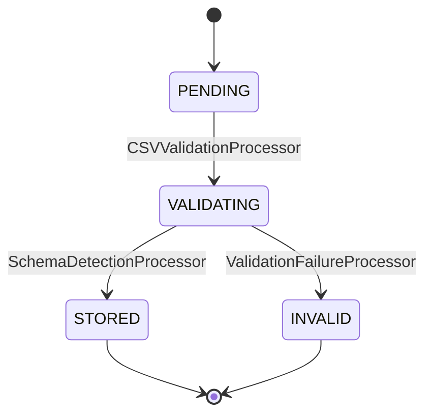
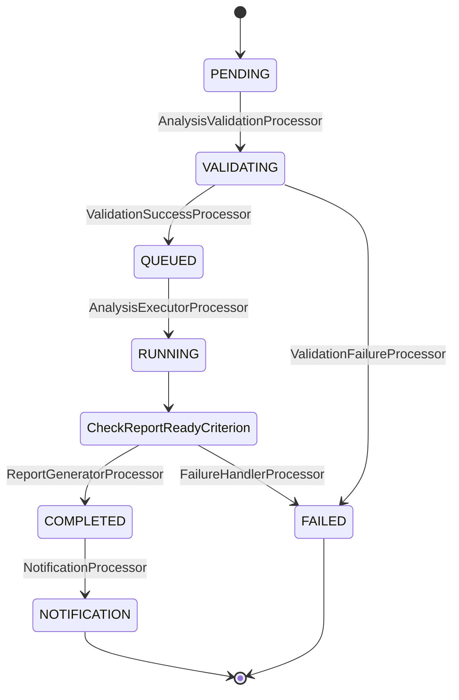
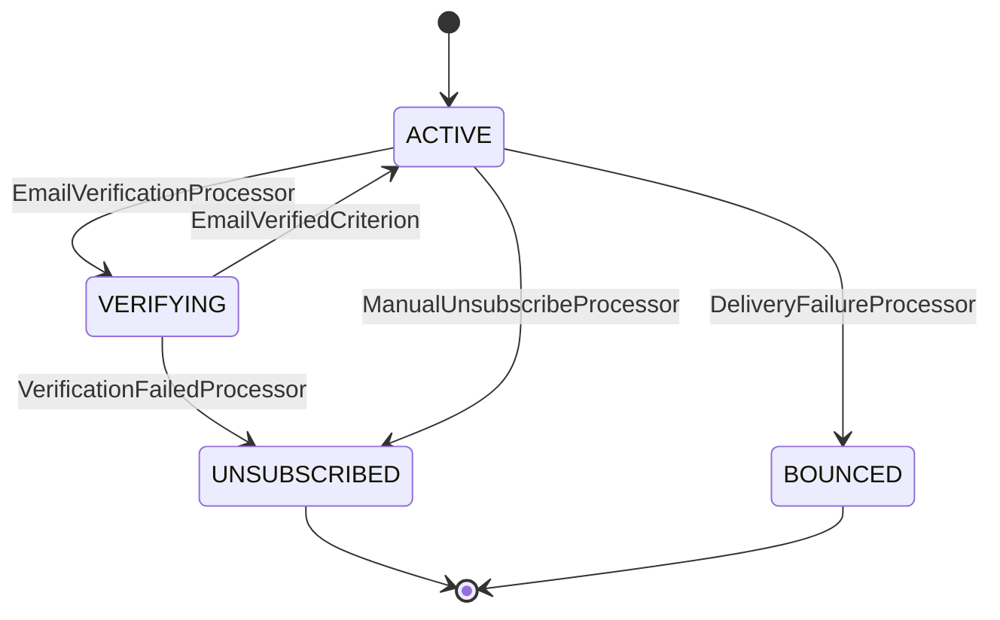
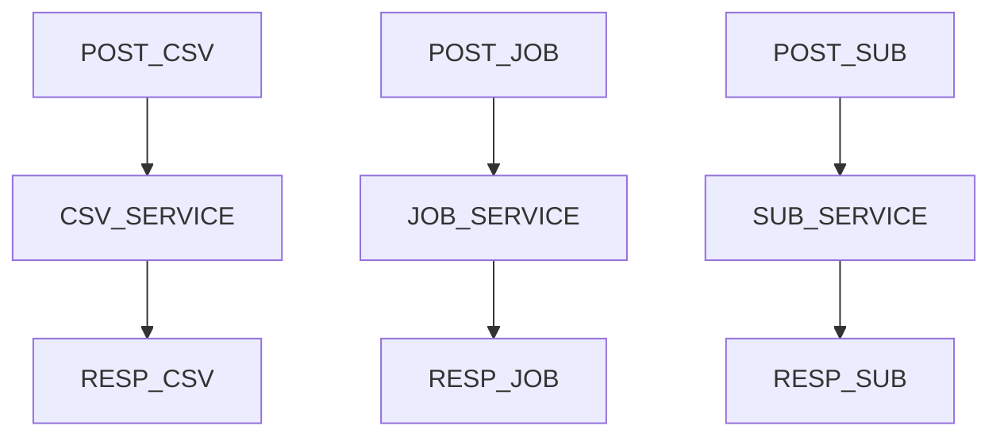

### 1. Entity Definitions
```
CSVFile:
- id: string (internal id referencing the persisted CSV entity)
- source_type: string (upload | url | email origin indicator)
- source_location: string (upload path or URL or email metadata)
- filename: string (original file name)
- uploaded_at: datetime (time of ingestion event)
- size_bytes: long (file size)
- detected_schema: map (column name -> type sample)
- row_count: integer (rows counted after ingest)
- status: string (PENDING | VALID | INVALID | STORED)
- error_message: string (validation or ingest error)

AnalysisJob:
- id: string (internal id for the orchestration job)
- job_name: string (human readable)
- csvfile_id: string (linked CSVFile id)
- analysis_type: string (summary | timeseries | anomaly | custom)
- parameters: map (group_by, metrics, date_range, thresholds)
- schedule: string (on_upload | manual | cron expression)
- status: string (PENDING | VALIDATING | QUEUED | RUNNING | COMPLETED | FAILED)
- started_at: datetime
- completed_at: datetime
- report_location: string (path/uri where report is stored)
- report_summary: string (short text summary)

Subscriber:
- id: string (internal id)
- email: string (recipient email)
- name: string (recipient name)
- subscribed_jobs: list of string (job ids or job patterns)
- preferred_format: string (pdf | html | csv)
- frequency: string (immediate | daily | weekly)
- status: string (ACTIVE | UNSUBSCRIBED | BOUNCED)
- created_at: datetime
```

### 2. Entity workflows

CSVFile workflow:
1. Initial State: CSVFile created with PENDING status (event triggers validation)
2. Validation (automatic): detect schema, sample rows, check size/format
3. If valid -> STORED; if invalid -> INVALID (error recorded)
4. On STORED -> emit event to allow AnalysisJob workflows to reference this CSV


```mermaid
stateDiagram-v2
    [*] --> PENDING
    PENDING --> VALIDATING : CSVValidationProcessor
    VALIDATING --> STORED : SchemaDetectionProcessor
    VALIDATING --> INVALID : ValidationFailureProcessor
    STORED --> [*]
    INVALID --> [*]
```

Processors and criteria for CSVFile:
- Processors: CSVIngestProcessor, CSVValidationProcessor, SchemaDetectionProcessor, ValidationFailureProcessor
- Criteria: IsSchemaValidCriterion, IsFileParsableCriterion

AnalysisJob workflow:
1. Initial State: Job created with PENDING status (creation is an event)
2. Validation (automatic): check job parameters and CSV availability
3. Queued -> RUNNING (manual start or automatic per schedule)
4. RUNNING -> COMPLETED or FAILED (report generated or error)
5. COMPLETED -> NOTIFICATION step: send reports to Subscribers
6. After notifications -> archived / terminal


```mermaid
stateDiagram-v2
    [*] --> PENDING
    PENDING --> VALIDATING : AnalysisValidationProcessor
    VALIDATING --> QUEUED : ValidationSuccessProcessor
    VALIDATING --> FAILED : ValidationFailureProcessor
    QUEUED --> RUNNING : AnalysisExecutorProcessor
    RUNNING --> CheckReportReadyCriterion
    CheckReportReadyCriterion --> COMPLETED : ReportGeneratorProcessor
    CheckReportReadyCriterion --> FAILED : FailureHandlerProcessor
    COMPLETED --> NOTIFICATION : NotificationProcessor
    NOTIFICATION --> [*]
    FAILED --> [*]
```

Processors and criteria for AnalysisJob:
- Processors: AnalysisValidationProcessor, ValidationSuccessProcessor, AnalysisExecutorProcessor, ReportGeneratorProcessor, NotificationProcessor, FailureHandlerProcessor
- Criteria: IsCsvAvailableCriterion, CheckReportReadyCriterion

Subscriber workflow:
1. Initial State: Subscriber created with ACTIVE (or PENDING if verification required)
2. Verification (automatic optional): send verification email; on success -> ACTIVE
3. ACTIVE -> UNSUBSCRIBED (manual by user) or BOUNCED (automatic if delivery fails repeatedly)
4. UNSUBSCRIBED/Bounced -> terminal


```mermaid
stateDiagram-v2
    [*] --> ACTIVE
    ACTIVE --> VERIFYING : EmailVerificationProcessor
    VERIFYING --> ACTIVE : EmailVerifiedCriterion
    VERIFYING --> UNSUBSCRIBED : VerificationFailedProcessor
    ACTIVE --> UNSUBSCRIBED : ManualUnsubscribeProcessor
    ACTIVE --> BOUNCED : DeliveryFailureProcessor
    UNSUBSCRIBED --> [*]
    BOUNCED --> [*]
```

Processors and criteria for Subscriber:
- Processors: EmailVerificationProcessor, ManualUnsubscribeProcessor, DeliveryFailureProcessor
- Criteria: EmailVerifiedCriterion, DeliveryRetryCriterion

### 3. Pseudo code for processor classes (concise examples)

CSVValidationProcessor
```
class CSVValidationProcessor {
  void process(CSVFile csv) {
    if not parseable(csv.source_location) then
      csv.status = INVALID
      csv.error_message = "cannot parse"
      emitEvent(csv)
      return
    csv.detected_schema = detectSchema(csv)
    csv.row_count = countRows(csv)
    csv.status = STORED
    persist(csv)
    emitEvent(csv)
  }
}
```

AnalysisExecutorProcessor
```
class AnalysisExecutorProcessor {
  void process(AnalysisJob job) {
    csv = fetchCsv(job.csvfile_id)
    report = runAnalysis(csv, job.parameters)
    job.report_location = storeReport(report)
    job.report_summary = summarize(report)
    job.status = COMPLETED
    persist(job)
    emitEvent(job)
  }
}
```

NotificationProcessor
```
class NotificationProcessor {
  void process(AnalysisJob job) {
    subs = findSubscribers(job.id, job.schedule)
    for s in subs:
      format = s.preferred_format
      sendEmail(s.email, job.report_location, format)
    logDelivery(job.id, subs)
  }
}
```

### 4. API Endpoints Design Rules

Rules followed:
- POST endpoints create entities and return only technicalId
- GET by technicalId available for entities created via POST
- GET by condition only if explicitly required (not added)
- POST used for CSV ingestion and Job creation; Subscriber can be added via POST

Endpoints and JSON structures

1) POST /csvfiles
- request JSON:
```json
{ "source_type":"upload","source_location":"s3://bucket/file.csv","filename":"file.csv" }
```
- response JSON:
```json
{ "technicalId":"<generated-id>" }
```

2) GET /csvfiles/{technicalId}
- response JSON: full CSVFile entity (fields as defined)

3) POST /analysisjobs
- request JSON:
```json
{ "job_name":"Weekly Report","csvfile_id":"<csv-id>","analysis_type":"summary","parameters":{ "group_by":"country" }, "schedule":"on_upload" }
```
- response JSON:
```json
{ "technicalId":"<generated-id>" }
```

4) GET /analysisjobs/{technicalId}
- response JSON: full AnalysisJob entity

5) POST /subscribers
- request JSON:
```json
{ "email":"user@example.com","name":"Alice","subscribed_jobs":[ "<job-id>" ], "preferred_format":"pdf","frequency":"immediate" }
```
- response JSON:
```json
{ "technicalId":"<generated-id>" }
```

6) GET /subscribers/{technicalId}
- response JSON: full Subscriber entity

Visualize request/response flows (simple mermaid flow)

```mermaid
flowchart TD
    POST_CSV --> CSV_SERVICE
    CSV_SERVICE --> RESP_CSV
    POST_JOB --> JOB_SERVICE
    JOB_SERVICE --> RESP_JOB
    POST_SUB --> SUB_SERVICE
    SUB_SERVICE --> RESP_SUB
```

Notes and next decisions
- If you want a separate Report entity or Segments for subscribers, ask to expand entities (up to 10).  
- Confirm preferred report formats and whether CSV ingestion should support recurring remote sources (cron) so we can refine schedules and criteria.