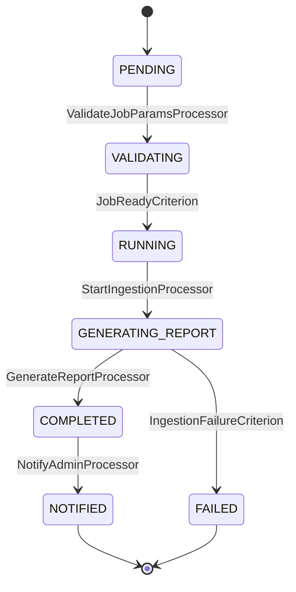
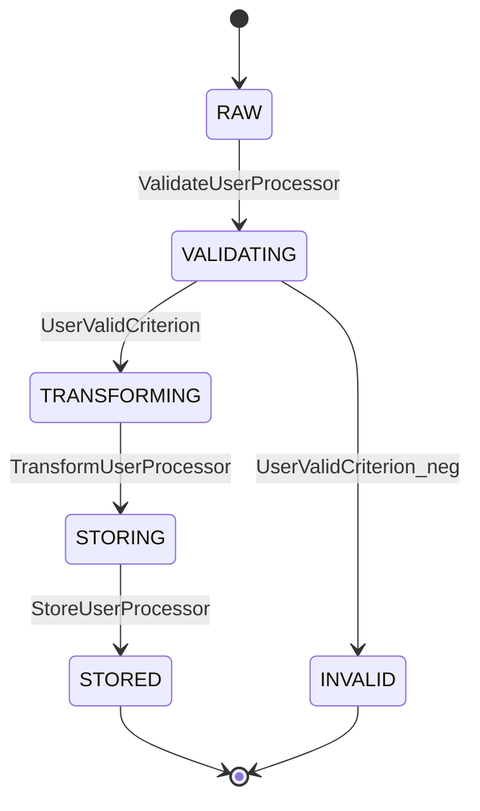
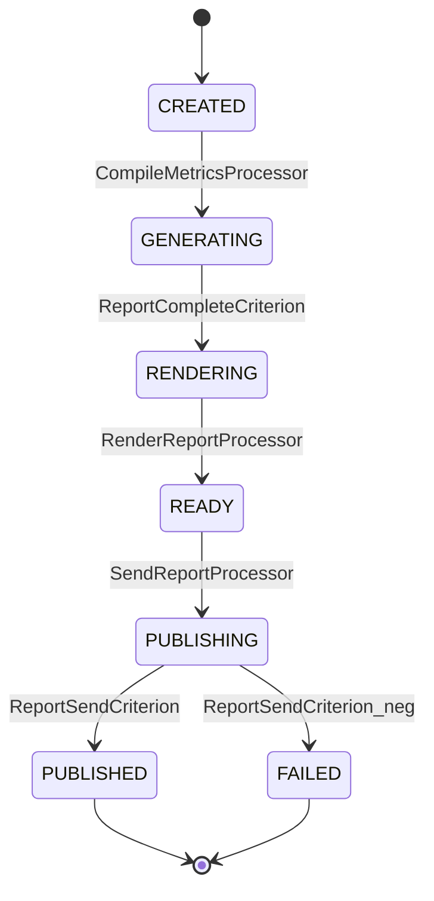

### 1. Entity Definitions

```
BatchJob:
- jobName: String (human name for the scheduled batch run)
- scheduleCron: String (description of when job should run, e.g., monthly start)
- runMonth: String (YYYY-MM for the run)
- createdAt: String (timestamp when job entity persisted)
- startedAt: String (timestamp when processing started)
- finishedAt: String (timestamp when processing finished)
- status: String (PENDING/VALIDATING/RUNNING/COMPLETED/FAILED)
- summary: String (short run summary / error summary)

User:
- id: Integer (source API id)
- fullName: String (user full name)
- username: String (username)
- email: String (email address)
- phone: String (phone)
- address: String (freeform address)
- sourceFetchedAt: String (timestamp when fetched from Fakerest)
- validationStatus: String (RAW/VALID/INVALID)
- transformedAt: String (timestamp when transformations applied)
- storedAt: String (timestamp when saved)

MonthlyReport:
- month: String (YYYY-MM the report covers)
- generatedAt: String (timestamp when report created)
- totalUsers: Integer (count)
- newUsers: Integer (count)
- invalidUsers: Integer (count)
- fileRef: String (reference to report artifact)
- status: String (CREATED/GENERATING/READY/PUBLISHED/FAILED)
- deliveryAt: String (timestamp when sent to admin)
```

Notes: 3 entities chosen (default). If you want more entities (up to 10) tell me and I will expand.

---

### 2. Entity workflows

BatchJob workflow:
1. Initial State: Job created with PENDING status (persisting BatchJob is the event that triggers Cyoda to start the workflow).
2. Validation: Automatic validation of job parameters and schedule.
3. Execution: Automatic ingestion of users (produces User entities), transformation and storage.
4. Reporting: Automatic generation of MonthlyReport for the run month.
5. Completion: Job moves to COMPLETED or FAILED.
6. Notification: Automatic notification step that records delivery result.

Mermaid state diagram for BatchJob:

```mermaid
stateDiagram-v2
    [*] --> PENDING
    PENDING --> VALIDATING : ValidateJobParamsProcessor
    VALIDATING --> RUNNING : JobReadyCriterion
    RUNNING --> GENERATING_REPORT : StartIngestionProcessor
    GENERATING_REPORT --> COMPLETED : GenerateReportProcessor
    GENERATING_REPORT --> FAILED : IngestionFailureCriterion
    COMPLETED --> NOTIFIED : NotifyAdminProcessor
    NOTIFIED --> [*]
    FAILED --> [*]
```

BatchJob processors and criteria
- Processors (3-5): ValidateJobParamsProcessor, StartIngestionProcessor, GenerateReportProcessor, NotifyAdminProcessor
- Criteria (1-2): JobReadyCriterion, IngestionFailureCriterion

User workflow:
1. Initial State: RAW (user created by ingestion event)
2. Validation: Automatic validation of fields and deduplication checks
3. Transformation: Automatic normalize/enrich fields
4. Storage: Automatic persist to target database
5. Post-check: Mark VALID/INVALID and emit metrics for reporting (automatic)

Mermaid state diagram for User:

```mermaid
stateDiagram-v2
    [*] --> RAW
    RAW --> VALIDATING : ValidateUserProcessor
    VALIDATING --> TRANSFORMING : UserValidCriterion
    VALIDATING --> INVALID : UserValidCriterion_neg
    TRANSFORMING --> STORING : TransformUserProcessor
    STORING --> STORED : StoreUserProcessor
    STORED --> [*]
    INVALID --> [*]
```

User processors and criteria
- Processors (3): ValidateUserProcessor, TransformUserProcessor, StoreUserProcessor
- Criteria (2): UserValidCriterion, DuplicateUserCriterion

MonthlyReport workflow:
1. Initial State: CREATED when report entity is emitted by Job
2. Generation: Compile metrics and render report file
3. Ready: Mark report as READY with fileRef
4. Publishing: Send report to admin email(s)
5. Completion: Mark PUBLISHED or FAILED

Mermaid state diagram for MonthlyReport:

```mermaid
stateDiagram-v2
    [*] --> CREATED
    CREATED --> GENERATING : CompileMetricsProcessor
    GENERATING --> RENDERING : ReportCompleteCriterion
    RENDERING --> READY : RenderReportProcessor
    READY --> PUBLISHING : SendReportProcessor
    PUBLISHING --> PUBLISHED : ReportSendCriterion
    PUBLISHING --> FAILED : ReportSendCriterion_neg
    PUBLISHED --> [*]
    FAILED --> [*]
```

MonthlyReport processors and criteria
- Processors (3-4): CompileMetricsProcessor, RenderReportProcessor, SendReportProcessor
- Criteria (1-2): ReportCompleteCriterion, ReportSendCriterion

---

### 3. Pseudo code for processor classes

ValidateJobParamsProcessor
```
function process(batchJob):
    verify batchJob.scheduleCron non empty
    verify runMonth format YYYY-MM
    if any check fails:
        set batchJob.status = FAILED
        set batchJob.summary = validation errors
    else:
        set batchJob.status = VALIDATING
```

StartIngestionProcessor
```
function process(batchJob):
    set batchJob.startedAt = now
    set batchJob.status = RUNNING
    users = fetchUsersFromFakerest()
    for each u in users:
        create User entity with validationStatus RAW and sourceFetchedAt now
    record ingestion summary in batchJob.summary
```

GenerateReportProcessor
```
function process(batchJob):
    set batchJob.status = GENERATING_REPORT
    metrics = aggregateUserMetrics(batchJob.runMonth)
    report = create MonthlyReport with month runMonth, generatedAt now, metrics, status CREATED
    persist report
```

NotifyAdminProcessor
```
function process(batchJob):
    for each report created by this job:
        trigger SendReportProcessor(report)
    set batchJob.status = COMPLETED
    set batchJob.finishedAt = now
```

ValidateUserProcessor
```
function process(user):
    if email invalid or required fields missing:
        set user.validationStatus = INVALID
    else if isDuplicate(user):
        set user.validationStatus = INVALID
    else:
        set user.validationStatus = VALID
```

TransformUserProcessor
```
function process(user):
    normalize name casing, phone format
    enrich missing fields if available
    set user.transformedAt = now
```

StoreUserProcessor
```
function process(user):
    persist transformed user to target store
    set user.storedAt = now
```

CompileMetricsProcessor
```
function process(report):
    compute totalUsers newUsers invalidUsers for report.month
    attach metrics to report
    set report.status = GENERATING
```

RenderReportProcessor
```
function process(report):
    render summary file (CSV/PDF) and produce fileRef
    set report.fileRef = fileRef
    set report.status = READY
```

SendReportProcessor
```
function process(report):
    attempt send to admin email
    if success:
        set report.status = PUBLISHED
        set report.deliveryAt = now
    else:
        set report.status = FAILED
```

---

### 4. API Endpoints Design Rules

Rules applied:
- Only BatchJob is created via POST (orchestration entity). Creating the BatchJob triggers the whole EDA processing in Cyoda.
- POST responses return only technicalId.
- GET endpoints provided for retrieving stored results (jobs, users, reports).
- GET by condition not added (not requested).

Endpoints and JSON formats

1) Create BatchJob (triggers ingestion/reporting)
POST /jobs
Request:
```json
{
  "jobName": "MonthlyUserBatch",
  "scheduleCron": "0 0 1 * *",
  "runMonth": "2025-09"
}
```
Response (must contain only technicalId):
```json
{
  "technicalId": "job-0001-uuid"
}
```

2) Get BatchJob by technicalId
GET /jobs/{technicalId}
Response:
```json
{
  "jobName": "MonthlyUserBatch",
  "scheduleCron": "0 0 1 * *",
  "runMonth": "2025-09",
  "createdAt": "2025-09-01T00:00:00Z",
  "startedAt": "2025-09-01T00:01:00Z",
  "finishedAt": "2025-09-01T00:10:00Z",
  "status": "COMPLETED",
  "summary": "ingested 100 users, 5 invalid"
}
```

3) Get User by id
GET /users/{id}
Response:
```json
{
  "id": 42,
  "fullName": "John Doe",
  "username": "jdoe",
  "email": "jdoe@example.com",
  "phone": "+1-555-0100",
  "address": "123 Main St",
  "sourceFetchedAt": "2025-09-01T00:01:00Z",
  "validationStatus": "VALID",
  "transformedAt": "2025-09-01T00:02:00Z",
  "storedAt": "2025-09-01T00:03:00Z"
}
```

4) Get MonthlyReport by id
GET /reports/{month}
Response:
```json
{
  "month": "2025-09",
  "generatedAt": "2025-09-01T00:05:00Z",
  "totalUsers": 100,
  "newUsers": 95,
  "invalidUsers": 5,
  "fileRef": "reports/2025-09-user-report.pdf",
  "status": "PUBLISHED",
  "deliveryAt": "2025-09-01T00:06:00Z"
}
```

---

If this representation matches your expectations, confirm and I will:
- add optional entities (Notification, AuditLog, Archive) if you want them, or
- expand processors/criteria names and acceptance criteria per state, or
- generate a concise list of testable acceptance criteria for each workflow.