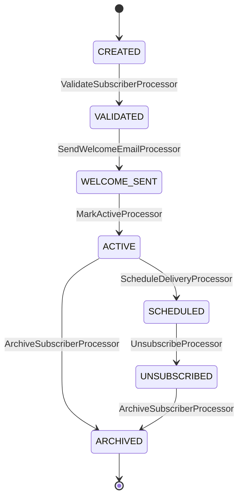
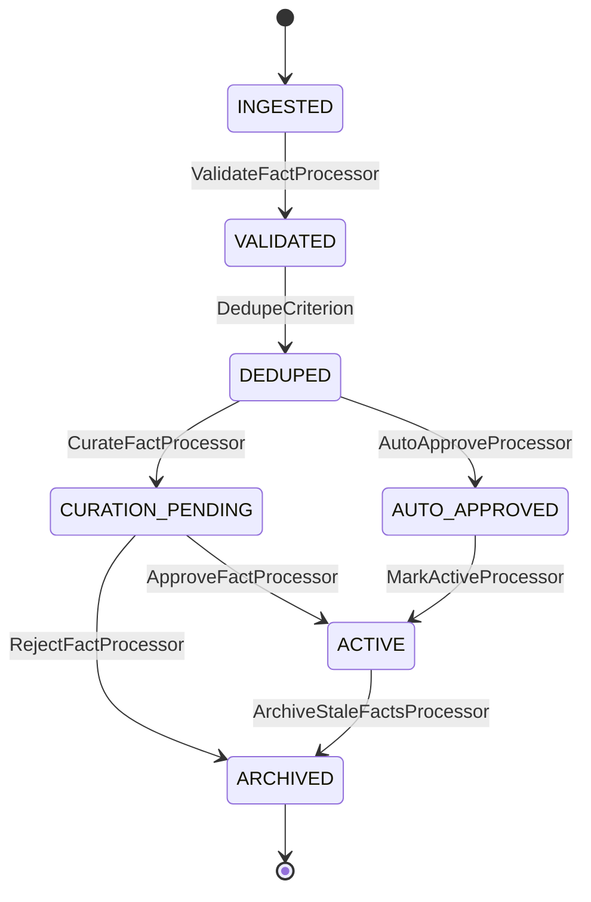
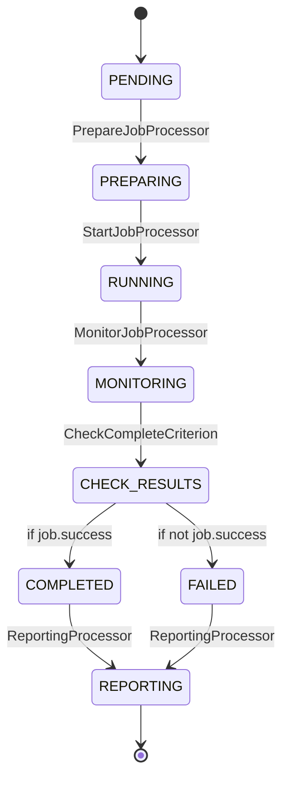
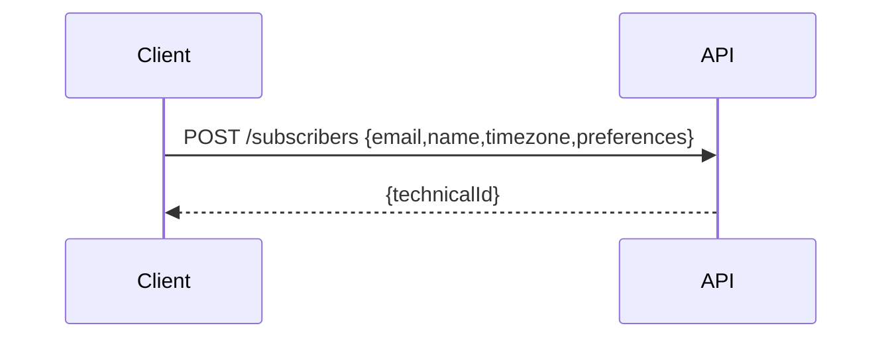
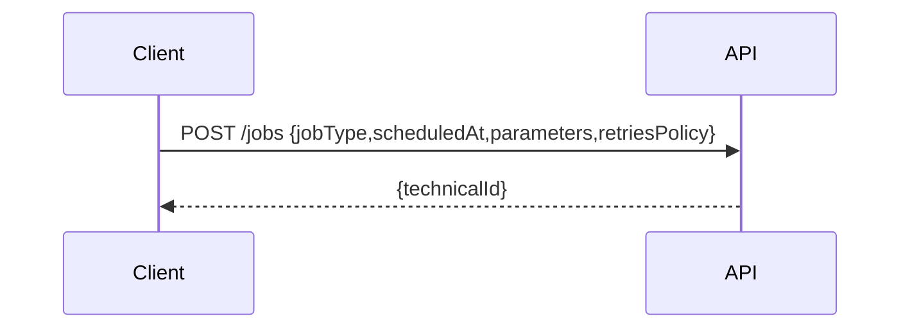
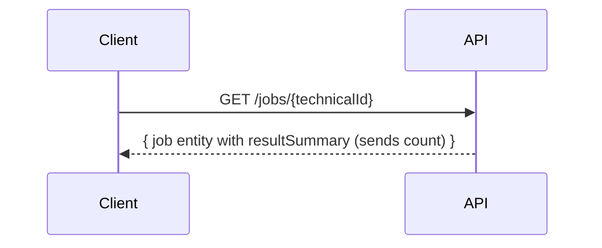

### Final Functional Requirements (as confirmed)

---

### 1. Entity Definitions
```
Subscriber:
- id: String (business id)
- email: String (subscriber email)
- name: String (display name)
- timezone: String (subscriber timezone for logging)
- subscription_status: String (active/paused/unsubscribed/archived)
- signup_date: String (ISO timestamp)
- preferences: Object (tags, other user prefs)
- last_delivery_id: String (reference to last delivery record)

CatFact:
- id: String (business id)
- fact_text: String (the cat fact content)
- source: String (api/source identifier)
- source_created_at: String (original timestamp from source)
- fetched_at: String (when ingested)
- language: String
- tags: Array of String
- curated_by: String (user id if manually edited)
- curated_at: String (ISO timestamp)
- status: String (active/archived)

Job:
- id: String (business id)
- jobType: String (INGEST_FACTS or DELIVER_WEEKLY or OTHER)
- parameters: Object (job-specific params e.g., sources, batchSize, globalSendDay)
- scheduledAt: String (ISO timestamp)
- status: String (PENDING/RUNNING/COMPLETED/FAILED)
- createdAt: String (ISO timestamp)
- resultSummary: Object (counts: processed, failed, sent)
- retriesPolicy: Object (maxRetries: Integer)  // job-level override; default 2 for sends
```

Notes:
- Three entities: Subscriber, CatFact, Job (no additional entities).
- Single global send day is provided via Job.parameters.globalSendDay for delivery jobs; platform default used if omitted.
- Retry policy default = 2 for send attempts; can be overridden per job via Job.retriesPolicy.

---

### 2. Entity workflows

Subscriber workflow (single-click subscription; active immediately; global send day scheduling)
1. Initial State: Created and validated → subscription_status = active (single opt-in)
2. Welcome: Send welcome email (automatic)
3. Scheduled: Subscriber is eligible and scheduled for weekly send on the global send day (automatic)
4. Pause/Unsubscribe: Manual user action (manual)
5. Bounce/Problem Handling: If bounces exceed threshold or hard-bounce, mark archived (automatic)
6. Archive: GDPR removal or repeated failures (manual/automatic)


```mermaid
stateDiagram-v2
    [*] --> CREATED
    CREATED --> VALIDATED : ValidateSubscriberProcessor
    VALIDATED --> WELCOME_SENT : SendWelcomeEmailProcessor
    WELCOME_SENT --> ACTIVE : MarkActiveProcessor
    ACTIVE --> SCHEDULED : ScheduleDeliveryProcessor
    SCHEDULED --> UNSUBSCRIBED : UnsubscribeProcessor
    ACTIVE --> ARCHIVED : ArchiveSubscriberProcessor
    UNSUBSCRIBED --> ARCHIVED : ArchiveSubscriberProcessor
    ARCHIVED --> [*]
```

Processors & Criteria (Subscriber)
- Processors (4): ValidateSubscriberProcessor, SendWelcomeEmailProcessor, ScheduleDeliveryProcessor, ArchiveSubscriberProcessor
- Criteria (1-2): BounceThresholdCriterion, ActiveEligibilityCriterion

---

CatFact workflow (ingested by ingestion job; validation, dedupe, curation)
1. Initial State: Ingested (created during INGEST_FACTS job)
2. Validation: Validate text length and language (automatic)
3. Deduplication: Check duplicates (automatic)
4. Curation: Auto-approve if passes heuristics; otherwise send to manual curation (automatic/manual)
5. Active/Archived: Active if approved; archived if duplicate or rejected


```mermaid
stateDiagram-v2
    [*] --> INGESTED
    INGESTED --> VALIDATED : ValidateFactProcessor
    VALIDATED --> DEDUPED : DedupeCriterion
    DEDUPED --> AUTO_APPROVED : AutoApproveProcessor
    DEDUPED --> CURATION_PENDING : CurateFactProcessor
    CURATION_PENDING --> ACTIVE : ApproveFactProcessor
    CURATION_PENDING --> ARCHIVED : RejectFactProcessor
    AUTO_APPROVED --> ACTIVE : MarkActiveProcessor
    ACTIVE --> ARCHIVED : ArchiveStaleFactsProcessor
    ARCHIVED --> [*]
```

Processors & Criteria (CatFact)
- Processors (4): ValidateFactProcessor, AutoApproveProcessor, CurateFactProcessor, ArchiveStaleFactsProcessor
- Criteria (2): DedupeCriterion, LanguageSupportedCriterion

---

Job workflow (orchestration for ingestion & delivery; default retry policy for sends = 2)
1. Initial State: Job created with status PENDING (POST /jobs triggers event)
2. Preparation: Validate parameters, set retriesPolicy (automatic)
3. Execution:
   - INGEST_FACTS: FetchFactsProcessor creates CatFact entities (persist triggers CatFact workflow)
   - DELIVER_WEEKLY: BuildDeliveryBatchProcessor creates per-subscriber delivery records and enqueues SendEmailProcessor tasks
4. Monitoring / Retries: Retry send tasks up to retriesPolicy.maxRetries (default 2) (automatic)
5. Completion: Update status to COMPLETED or FAILED and fill resultSummary
6. Notification: Emit reporting/send metrics (system collects sends KPI)


```mermaid
stateDiagram-v2
    [*] --> PENDING
    PENDING --> PREPARING : PrepareJobProcessor
    PREPARING --> RUNNING : StartJobProcessor
    RUNNING --> MONITORING : MonitorJobProcessor
    MONITORING --> CHECK_RESULTS : CheckCompleteCriterion
    CHECK_RESULTS --> FAILED : if not job.success
    CHECK_RESULTS --> COMPLETED : if job.success
    COMPLETED --> REPORTING : ReportingProcessor
    FAILED --> REPORTING : ReportingProcessor
    REPORTING --> [*]
```

Processors & Criteria (Job)
- Processors (5): PrepareJobProcessor, StartJobProcessor, FetchFactsProcessor, BuildDeliveryBatchProcessor, ReportingProcessor
- Criteria (2): CheckCompleteCriterion, RetryAllowedCriterion

---

### 3. Pseudo code for processor and criterion classes

ValidateSubscriberProcessor
```
process(subscriber):
  if isValidEmail(subscriber.email) and not isBlacklisted(subscriber.email):
    subscriber.subscription_status = active    // single-click
    subscriber.signup_date = now()
    persist(subscriber)
  else:
    subscriber.subscription_status = archived
    persist(subscriber)
    emit ErrorEvent(subscriber.id, reason)
```

SendWelcomeEmailProcessor
```
process(subscriber):
  emailId = sendEmail(to=subscriber.email, template=WELCOME)
  recordOutbound(emailId, entity=Subscriber, entityId=subscriber.id)
  // No confirmation required; subscriber already active
```

ScheduleDeliveryProcessor
```
process(subscriber, job):
  // Global single send day:
  sendDay = job.parameters.globalSendDay or platformDefaultSendDay
  nextSendDate = calculateNextDate(sendDay, subscriber.timezone)
  createDeliveryRecord(subscriberId=subscriber.id, scheduledAt=nextSendDate, status=PENDING)
```

FetchFactsProcessor
```
process(job):
  for src in job.parameters.sources:
    facts = fetchFromSource(src)
    for f in facts:
      fact = mapToCatFact(f, source=src)
      persist(fact)  // triggers CatFact workflow
  updateJobResultSummary(job, processed=..., failed=...)
```

BuildDeliveryBatchProcessor
```
process(job):
  subscribers = findActiveSubscribers()
  for s in subscribers:
    fact = selectFactForSubscriber(s)
    delivery = createDeliveryRecord(subscriberId=s.id, factId=fact.id, scheduledAt=job.scheduledAt, attempts=0)
    enqueueSendTask(delivery.id)
  updateJobResultSummary(job, queued = count(subscribers))
```

SendEmailProcessor
```
process(delivery):
  delivery.attempts += 1
  result = sendEmail(to=delivery.subscriber.email, body=delivery.fact.fact_text)
  if result.success:
    delivery.status = SENT
    delivery.sent_at = now()
    persist(delivery)
    emit SendSucceededEvent(delivery.id)
  else:
    if delivery.attempts <= delivery.job.retriesPolicy.maxRetries (default 2):
      scheduleRetry(delivery.id, backoff=computeBackoff(delivery.attempts))
    else:
      delivery.status = FAILED
      persist(delivery)
      emit SendFailedEvent(delivery.id, reason=result.error)
```

DedupeCriterion
```
evaluate(catFact):
  return not existsFactWithSameNormalizedText(catFact.fact_text)
```

RetryAllowedCriterion
```
evaluate(delivery):
  return delivery.attempts < delivery.job.retriesPolicy.maxRetries
```

ReportingProcessor
```
process(job):
  // Collects sends KPI only
  sends = countOutboundEvents(job.id, type=SendSucceededEvent)
  job.resultSummary.sent = sends
  persist(job)
  emit JobReportAvailable(job.id)
```

Notes:
- Send retries are constrained to 2 by default (user-specified). The job may override via retriesPolicy.
- Delivery records and outbound events are used to compute sends KPI.

---

### 4. API Endpoints Design Rules (finalized)

Rules enforced:
- POST endpoints create orchestration entities (and subscribers) and must return only technicalId.
- POST /subscribers uses single opt-in (subscriber becomes active immediately).
- Global send day is provided in Job.parameters.globalSendDay for delivery jobs; otherwise platform default is used.
- Retry policy default = 2 for send tasks; can be overridden per job through Job.retriesPolicy.
- GET endpoints only return stored results. GET by technicalId present for POST-created entities.
- Reporting focuses on sends KPI (available via job.resultSummary and dedicated report endpoint).

API endpoints

1) Create subscriber (single-click subscription)
- POST /subscribers
  - Request JSON:
    {
      "email": "string",
      "name": "string",
      "timezone": "string",
      "preferences": { "tags": ["string"] }
    }
  - Response JSON:
    { "technicalId": "string" }

- GET /subscribers/{technicalId}
  - Response JSON: Full Subscriber entity (as defined in Entity Definitions)

2) Create job (orchestration)
- POST /jobs
  - Request JSON:
    {
      "jobType": "INGEST_FACTS | DELIVER_WEEKLY",
      "scheduledAt": "ISO timestamp (optional for immediate jobs)",
      "parameters": {
         "sources": ["https://api.example.com/facts"],
         "batchSize": 100,
         "globalSendDay": "Monday"   // optional; system default if absent
      },
      "retriesPolicy": { "maxRetries": 2 } // optional; default 2 for deliveries
    }
  - Response JSON:
    { "technicalId": "string" }

- GET /jobs/{technicalId}
  - Response JSON: Full Job entity including resultSummary (sends count)

3) Read a CatFact (read-only; CatFacts are created by ingestion jobs)
- GET /catfacts/{technicalId}
  - Response JSON: Full CatFact entity

4) Reporting (sends KPI)
- GET /reports/sends?from=2025-01-01&to=2025-01-07
  - Response JSON:
    {
      "from": "ISO",
      "to": "ISO",
      "totalSends": 1234
    }
  - (Optional) GET /jobs/{technicalId}/report returns job.resultSummary with sent count

API request/response flows (Mermaid sequence diagrams)


```mermaid
sequenceDiagram
    participant Client
    participant API
    Client->>API: POST /subscribers {email,name,timezone,preferences}
    API-->>Client: {technicalId}
```


```mermaid
sequenceDiagram
    participant Client
    participant API
    Client->>API: POST /jobs {jobType,scheduledAt,parameters,retriesPolicy}
    API-->>Client: {technicalId}
```


```mermaid
sequenceDiagram
    participant Client
    participant API
    Client->>API: GET /jobs/{technicalId}
    API-->>Client: { job entity with resultSummary (sends count) }
```

Important EDA behaviours:
- POST /subscribers and POST /jobs persist entities and immediately emit events that start workflows (Subscriber workflow and Job workflow respectively).
- CatFact creations are performed by ingestion job processors; persisting a CatFact emits its own CatFact workflow events for validation/dedup/curation.
- SendEmailProcessor failures trigger retry logic (maxRetries default 2) implemented by RetryAllowedCriterion and enqueued retries.

---

Example Ready-to-Copy User Response
```
I confirm:
- Single-click subscription (subscriber becomes active immediately).
- Single global send day (set in Job.parameters.globalSendDay or use platform default).
- Reporting KPI: sends only.
- Retry policy: 2 retries for send attempts (default; can override per job).

Please proceed with the updated workflows, processors, and API spec.
```

If you are satisfied with this finalized functional requirements specification, I will finish the discussion now. finish_discussion