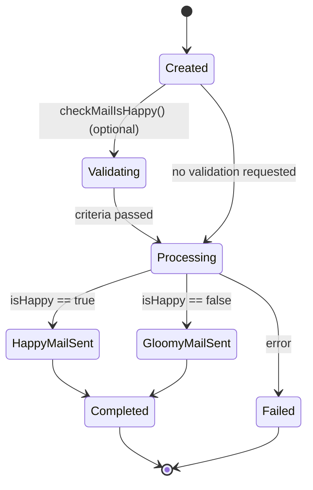
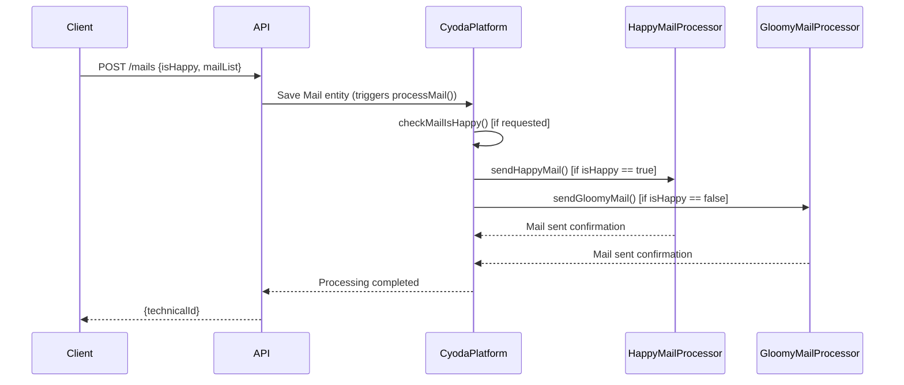
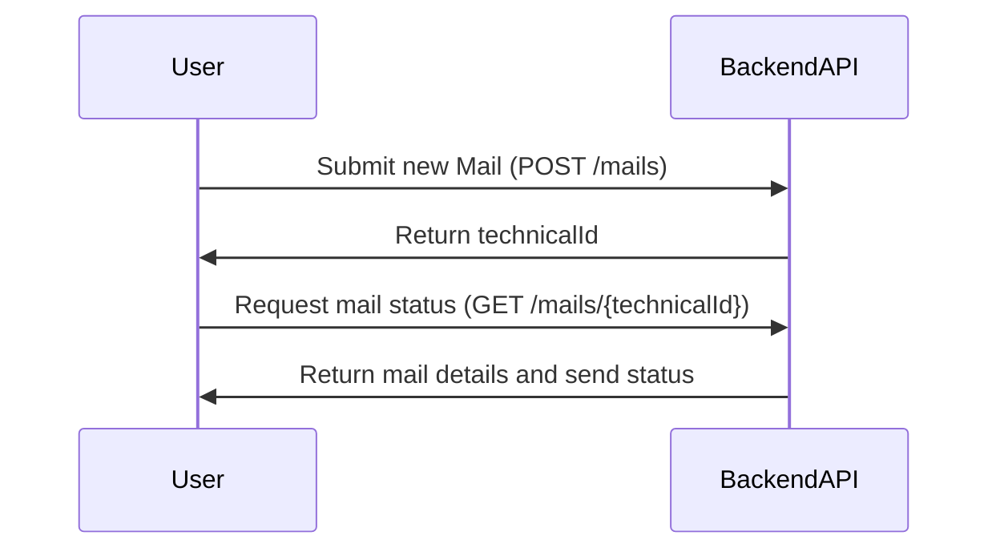

### 1. Entity Definitions

``` 
Mail: 
- isHappy: boolean (indicates if the mail is happy or gloomy)
- mailList: List<String> (list of recipient email addresses)
```

### 2. Process Method Flows

```
processMail() Flow:
1. Initial State: Mail entity is created and persisted (immutable creation).
2. Criteria Validation: If requested, checkMailIsHappy() is invoked to validate or determine if mail is happy or gloomy.
3. Processing Decision: Based on `isHappy` field,
   - If true, trigger sendHappyMail() processor event.
   - If false, trigger sendGloomyMail() processor event.
4. Mail Sending: The corresponding processor sends mails to all addresses in `mailList`.
5. Completion: Processing completes, mail sending status is recorded as part of event history.
```

### 3. API Endpoints Design Rules

- **POST /mails**
  - Description: Create a new `Mail` entity, triggers `processMail()` event automatically.
  - Request body example:
    ```json
    {
      "isHappy": true,
      "mailList": ["user1@example.com", "user2@example.com"]
    }
    ```
  - Response:
    ```json
    {
      "technicalId": "string"  // datastore-generated unique id for this mail event
    }
    ```
- **GET /mails/{technicalId}**
  - Description: Retrieve stored mail event/result by its `technicalId`.
  - Response example:
    ```json
    {
      "technicalId": "string",
      "isHappy": true,
      "mailList": ["user1@example.com", "user2@example.com"],
      "status": "COMPLETED"
    }
    ```

- No update or delete endpoints as per EDA principles (immutable creation only).

### 4. Event Processing Workflows

- Saving a new `Mail` triggers `processMail()`.
- Optionally, if validation is requested, `checkMailIsHappy()` can be triggered before processing.
- Depending on `isHappy`, either `sendHappyMail()` or `sendGloomyMail()` processors are triggered automatically by Cyoda platform.
- Each processor sends mail to all recipients in `mailList`.
- System records completion or failure status as part of event history.

---

### Visual Representations

#### Entity Lifecycle State Diagram


```mermaid
stateDiagram-v2
    [*] --> Created
    Created --> Validating : checkMailIsHappy() (optional)
    Validating --> Processing : criteria passed
    Created --> Processing : no validation requested
    Processing --> HappyMailSent : isHappy == true
    Processing --> GloomyMailSent : isHappy == false
    HappyMailSent --> Completed
    GloomyMailSent --> Completed
    Processing --> Failed : error
    Completed --> [*]
    Failed --> [*]
```

#### Event-Driven Processing Chain


```mermaid
sequenceDiagram
    participant Client
    participant API
    participant CyodaPlatform
    participant HappyMailProcessor
    participant GloomyMailProcessor

    Client->>API: POST /mails {isHappy, mailList}
    API->>CyodaPlatform: Save Mail entity (triggers processMail())
    CyodaPlatform->>CyodaPlatform: checkMailIsHappy() [if requested]
    CyodaPlatform->>HappyMailProcessor: sendHappyMail() [if isHappy == true]
    CyodaPlatform->>GloomyMailProcessor: sendGloomyMail() [if isHappy == false]
    HappyMailProcessor-->>CyodaPlatform: Mail sent confirmation
    GloomyMailProcessor-->>CyodaPlatform: Mail sent confirmation
    CyodaPlatform-->>API: Processing completed
    API-->>Client: {technicalId}
```

#### User Interaction Sequence Flow


```mermaid
sequenceDiagram
    participant User
    participant BackendAPI

    User->>BackendAPI: Submit new Mail (POST /mails)
    BackendAPI->>User: Return technicalId
    User->>BackendAPI: Request mail status (GET /mails/{technicalId})
    BackendAPI->>User: Return mail details and send status
```

---

This completes the functional requirements definition for your happy mail application using Event-Driven Architecture principles on the Cyoda platform. If you have any further adjustments or want to add additional entities or criteria, feel free to ask!