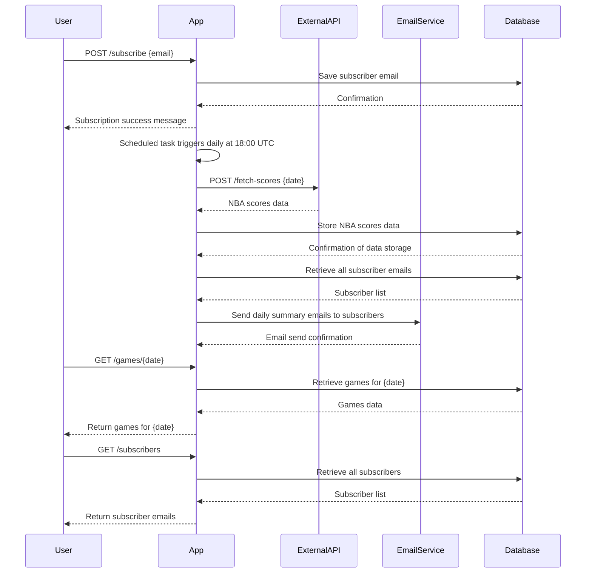

# Functional Requirements and API Design

## API Endpoints

### 1. Subscribe User  
**POST /subscribe**  
- Description: Adds a user email to the subscription list.  
- Request Body:  
```json
{
  "email": "user@example.com"
}
```  
- Response:  
```json
{
  "message": "Subscription successful",
  "email": "user@example.com"
}
```

---

### 2. Fetch and Store NBA Scores  
**POST /fetch-scores**  
- Description: Triggers fetching NBA scores from external API for a given date, stores data locally, and sends notifications.  
- Request Body:  
```json
{
  "date": "YYYY-MM-DD"
}
```  
- Response:  
```json
{
  "message": "Scores fetched, stored, and notifications sent",
  "date": "YYYY-MM-DD"
}
```

---

### 3. Get All Subscribers  
**GET /subscribers**  
- Description: Retrieves the list of all subscribed emails.  
- Response:  
```json
{
  "subscribers": [
    "user1@example.com",
    "user2@example.com"
  ]
}
```

---

### 4. Get All Games Data  
**GET /games/all**  
- Description: Retrieves all stored NBA games data. Pagination and filtering can be added later as needed.  
- Response Example:  
```json
{
  "games": [
    {
      "gameId": "1234",
      "date": "YYYY-MM-DD",
      "homeTeam": "Team A",
      "awayTeam": "Team B",
      "homeScore": 100,
      "awayScore": 98
    }
  ]
}
```

---

### 5. Get Games by Date  
**GET /games/{date}**  
- Description: Retrieves all NBA games for a specific date.  
- Response Example:  
```json
{
  "date": "YYYY-MM-DD",
  "games": [
    {
      "gameId": "1234",
      "homeTeam": "Team A",
      "awayTeam": "Team B",
      "homeScore": 100,
      "awayScore": 98
    }
  ]
}
```

---

# User-App Interaction (Sequence Diagram)


```mermaid
sequenceDiagram
    participant User
    participant App
    participant ExternalAPI
    participant EmailService
    participant Database

    User->>App: POST /subscribe {email}
    App->>Database: Save subscriber email
    Database-->>App: Confirmation
    App-->>User: Subscription success message

    App->>App: Scheduled task triggers daily at 18:00 UTC
    App->>ExternalAPI: POST /fetch-scores {date}
    ExternalAPI-->>App: NBA scores data
    App->>Database: Store NBA scores data
    Database-->>App: Confirmation of data storage
    App->>Database: Retrieve all subscriber emails
    Database-->>App: Subscriber list
    App->>EmailService: Send daily summary emails to subscribers
    EmailService-->>App: Email send confirmation

    User->>App: GET /games/{date}
    App->>Database: Retrieve games for {date}
    Database-->>App: Games data
    App-->>User: Return games for {date}

    User->>App: GET /subscribers
    App->>Database: Retrieve all subscribers
    Database-->>App: Subscriber list
    App-->>User: Return subscriber emails
```