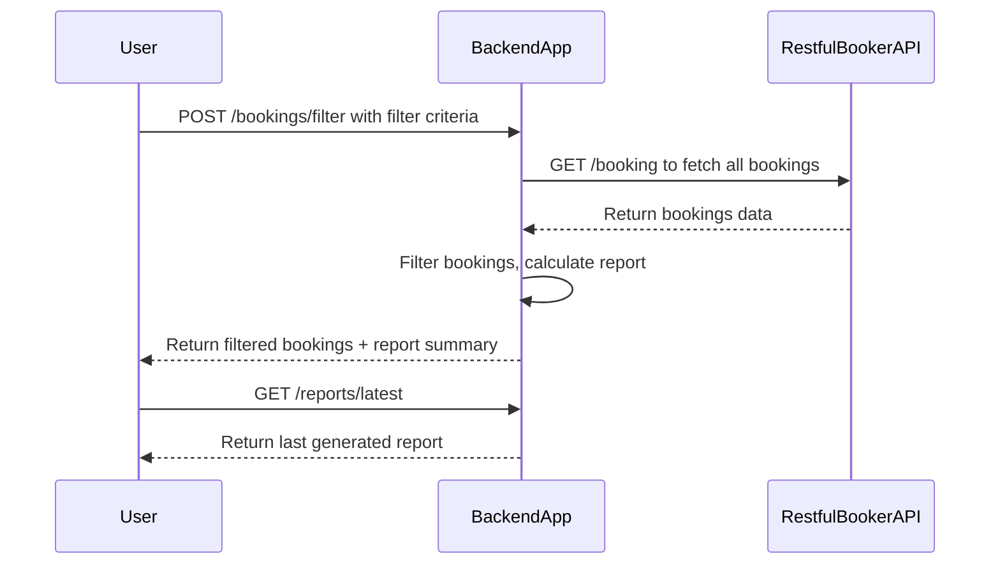
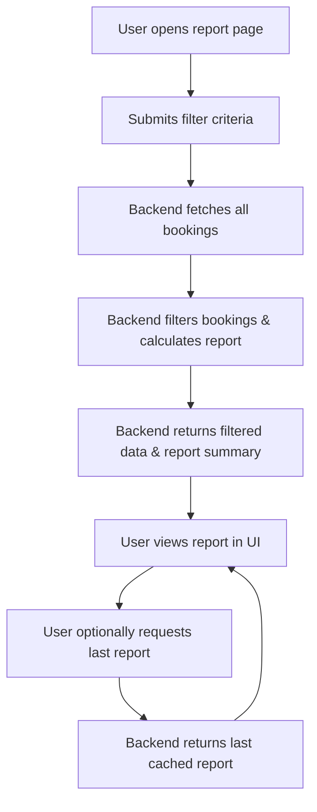

# Functional Requirements and API Design

## API Endpoints

### 1. Retrieve and Filter Bookings  
**POST** `/bookings/filter`  
- **Description:** Accepts filter criteria, fetches bookings from the external Restful Booker API, applies filters, and calculates summary reports.  
- **Request Body (JSON):**
```json
{
  "dateFrom": "2024-01-01",         // optional, ISO-8601 format
  "dateTo": "2024-01-31",           // optional
  "minTotalPrice": 100,             // optional
  "maxTotalPrice": 500,             // optional
  "depositPaid": true               // optional
}
```
- **Response Body (JSON):**
```json
{
  "filteredBookings": [
    {
      "bookingId": 1,
      "firstName": "John",
      "lastName": "Doe",
      "totalPrice": 200,
      "depositPaid": true,
      "bookingDates": {
        "checkin": "2024-01-10",
        "checkout": "2024-01-15"
      }
    }
  ],
  "report": {
    "totalRevenue": 3500,
    "averageBookingPrice": 250,
    "bookingCount": 14
  }
}
```

### 2. Retrieve Last Generated Report  
**GET** `/reports/latest`  
- **Description:** Returns the last generated booking report summary (cached or stored in-app).  
- **Response Body (JSON):**
```json
{
  "totalRevenue": 3500,
  "averageBookingPrice": 250,
  "bookingCount": 14,
  "dateRange": {
    "from": "2024-01-01",
    "to": "2024-01-31"
  }
}
```

---

## Business Logic Flow
- POST `/bookings/filter` triggers:
  - Fetch all bookings from external API
  - Apply filters locally (date range, price range, deposit paid)
  - Calculate report metrics (total revenue, average price, count)
  - Store or cache the report for retrieval by GET `/reports/latest`

---

## User-App Interaction Sequence Diagram


```mermaid
sequenceDiagram
    participant User
    participant BackendApp
    participant RestfulBookerAPI

    User->>BackendApp: POST /bookings/filter with filter criteria
    BackendApp->>RestfulBookerAPI: GET /booking to fetch all bookings
    RestfulBookerAPI-->>BackendApp: Return bookings data
    BackendApp->>BackendApp: Filter bookings, calculate report
    BackendApp-->>User: Return filtered bookings + report summary

    User->>BackendApp: GET /reports/latest
    BackendApp-->>User: Return last generated report
```

---

## User Journey Diagram


```mermaid
flowchart TD
    A[User opens report page] --> B[Submits filter criteria]
    B --> C[Backend fetches all bookings]
    C --> D[Backend filters bookings & calculates report]
    D --> E[Backend returns filtered data & report summary]
    E --> F[User views report in UI]
    F --> G[User optionally requests last report]
    G --> H[Backend returns last cached report]
    H --> F
```
