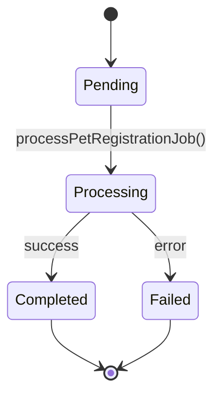
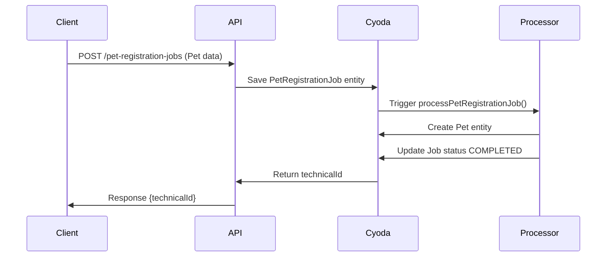
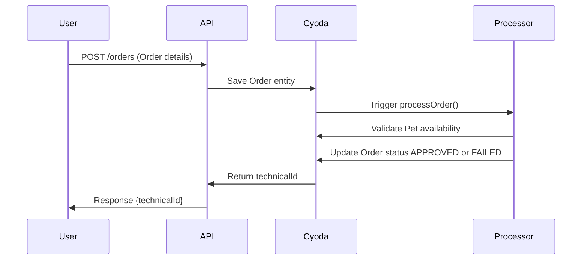

Certainly! Here is the well-formatted final version of the functional requirements for your "Purrfect Pets" API app following the Event-Driven Architecture principles:

---

### 1. Entity Definitions

``` 
PetRegistrationJob:  # Orchestration entity handling pet ingestion and processing
- petName: String (Name of the pet)
- petType: String (Type/species of the pet, e.g., Cat, Dog)
- petStatus: String (Status such as AVAILABLE, PENDING, SOLD)
- ownerName: String (Name of the pet owner)
- createdAt: DateTime (Timestamp of job creation)
- status: StatusEnum (PENDING, PROCESSING, COMPLETED, FAILED)

Pet:  # Business domain entity representing pets
- petId: String (Unique pet identifier from Petstore)
- name: String (Pet name)
- category: String (Pet category/type)
- photoUrls: List<String> (Image URLs)
- tags: List<String> (Descriptive tags)
- status: StatusEnum (AVAILABLE, PENDING, SOLD)

Order:  # Business domain entity for purchasing pets
- orderId: String (Unique order identifier)
- petId: String (Referenced Pet id)
- quantity: Integer (Number of pets ordered)
- shipDate: DateTime (Shipment expected date)
- status: StatusEnum (PLACED, APPROVED, DELIVERED)
```

---

### 2. Process Method Flows

```
processPetRegistrationJob() Flow:
1. Initial State: Job created with PENDING status
2. Validation: Check pet data completeness and correctness (e.g., petName, petType)
3. Processing: Create immutable Pet entity record with AVAILABLE or PENDING status
4. Completion: Update Job status to COMPLETED if Pet created successfully, else FAILED
5. Notification: (Optional) Log or notify system of new Pet registration

processPet() Flow:
1. Initial State: Pet entity created with status AVAILABLE/PENDING
2. Validation: Check for required pet fields and valid status
3. Processing: None (Pet data is mostly static unless new registrations arrive)
4. Completion: Mark Pet as ACTIVE/AVAILABLE for listing

processOrder() Flow:
1. Initial State: Order created with PLACED status
2. Validation: Verify petId exists and quantity is positive
3. Processing: Reserve pet stock and update availability if needed
4. Completion: Update Order status to APPROVED or FAILED based on stock
5. Notification: (Optional) Trigger shipment or payment processing workflow
```

---

### 3. API Endpoints Design

| Entity               | POST Endpoint (Create)        | GET by technicalId         | GET by condition (optional)        |
|----------------------|------------------------------|----------------------------|-----------------------------------|
| PetRegistrationJob   | `/pet-registration-jobs`       | `/pet-registration-jobs/{id}` | Not required                      |
| Pet                  | `/pets`                      | `/pets/{id}`               | `/pets?status=AVAILABLE&category=Cat` (optional) |
| Order                | `/orders`                    | `/orders/{id}`             | `/orders?status=PLACED` (optional)  |

- POST endpoints return only `technicalId` (system-generated)
- Immutable creation only; no update/delete endpoints unless explicitly requested later

---

### 4. Request/Response Formats

**POST /pet-registration-jobs**

Request:

```json
{
  "petName": "Fluffy",
  "petType": "Cat",
  "petStatus": "AVAILABLE",
  "ownerName": "Alice"
}
```

Response:

```json
{
  "technicalId": "job-12345"
}
```

---

**POST /pets**

Request:

```json
{
  "petId": "pet-001",
  "name": "Fluffy",
  "category": "Cat",
  "photoUrls": ["http://example.com/fluffy.jpg"],
  "tags": ["cute", "small"],
  "status": "AVAILABLE"
}
```

Response:

```json
{
  "technicalId": "pet-67890"
}
```

---

**POST /orders**

Request:

```json
{
  "orderId": "order-001",
  "petId": "pet-001",
  "quantity": 1,
  "shipDate": "2024-07-01T10:00:00Z",
  "status": "PLACED"
}
```

Response:

```json
{
  "technicalId": "order-54321"
}
```

---

### 5. Mermaid Diagrams

**PetRegistrationJob Lifecycle State Diagram**


```mermaid
stateDiagram-v2
    [*] --> Pending
    Pending --> Processing : processPetRegistrationJob()
    Processing --> Completed : success
    Processing --> Failed : error
    Completed --> [*]
    Failed --> [*]
```

---

**Event-Driven Processing Chain**


```mermaid
sequenceDiagram
    participant Client
    participant API
    participant Cyoda
    participant Processor

    Client->>API: POST /pet-registration-jobs (Pet data)
    API->>Cyoda: Save PetRegistrationJob entity
    Cyoda->>Processor: Trigger processPetRegistrationJob()
    Processor->>Cyoda: Create Pet entity
    Processor->>Cyoda: Update Job status COMPLETED
    Cyoda->>API: Return technicalId
    API->>Client: Response {technicalId}
```

---

**User Interaction Sequence for Ordering a Pet**


```mermaid
sequenceDiagram
    participant User
    participant API
    participant Cyoda
    participant Processor

    User->>API: POST /orders (Order details)
    API->>Cyoda: Save Order entity
    Cyoda->>Processor: Trigger processOrder()
    Processor->>Cyoda: Validate Pet availability
    Processor->>Cyoda: Update Order status APPROVED or FAILED
    Cyoda->>API: Return technicalId
    API->>User: Response {technicalId}
```

---

If you need any additions or further clarifications, please let me know!