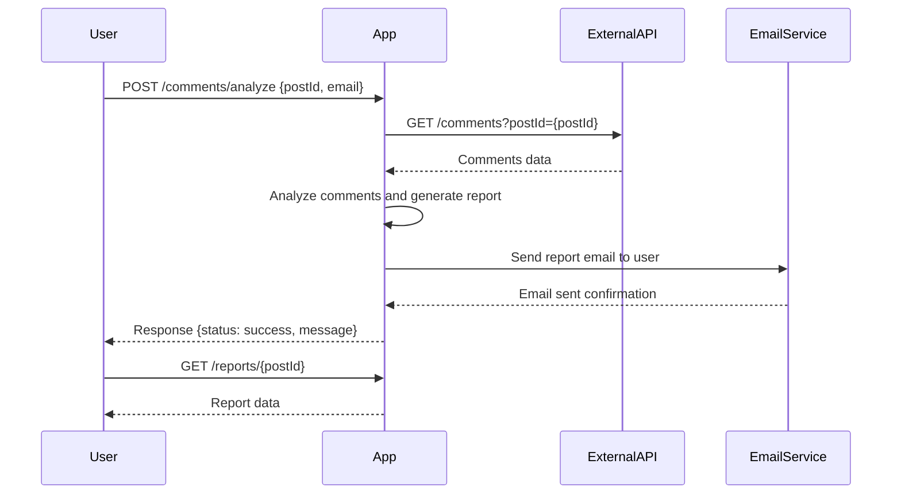

# Functional Requirements and API Design

## API Endpoints

### 1. POST /comments/analyze  
- **Purpose:** Ingest comments data from external API by `postId`, analyze comments, generate and send report via email.  
- **Request Body:**  
```json
{
  "postId": 1,
  "email": "recipient@example.com"
}
```  
- **Response:**  
```json
{
  "status": "success",
  "message": "Report generated and sent to recipient@example.com"
}
```  
- **Description:**  
This endpoint triggers the ingestion of comments data from `https://jsonplaceholder.typicode.com/comments?postId={postId}`, performs analysis on the comments, generates a report, and sends it to the specified email address.

---

### 2. GET /reports/{postId}  
- **Purpose:** Retrieve the last generated report for a given `postId`.  
- **Response:**  
```json
{
  "postId": 1,
  "report": {
    "summary": "Sentiment analysis shows mostly positive comments with key topics being 'voluptate', 'accusantium', and 'laudantium'.",
    "analysisDetails": {
      "sentimentScore": 0.75,
      "wordFrequency": {
        "voluptate": 5,
        "accusantium": 3,
        "laudantium": 4
      }
    }
  },
  "generatedAt": "2024-06-01T12:00:00Z"
}
```  
- **Description:**  
Returns the stored report for the specified postId if available.

---

## Business Logic Flow

- POST /comments/analyze receives `postId` and `email`.
- Application calls external API to fetch comments for the `postId`.
- Comments data is analyzed (e.g., sentiment analysis, keyword extraction).
- Report is generated.
- Report is sent by email.
- Report is stored for retrieval via GET endpoint.

---

## User-App Interaction Sequence Diagram


```mermaid
sequenceDiagram
    participant User
    participant App
    participant ExternalAPI
    participant EmailService

    User->>App: POST /comments/analyze {postId, email}
    App->>ExternalAPI: GET /comments?postId={postId}
    ExternalAPI-->>App: Comments data
    App->>App: Analyze comments and generate report
    App->>EmailService: Send report email to user
    EmailService-->>App: Email sent confirmation
    App-->>User: Response {status: success, message}
    
    User->>App: GET /reports/{postId}
    App-->>User: Report data
```

---

*Please let me know if you want me to proceed with implementation or adjust any part!*