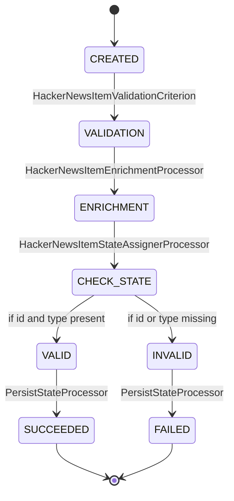
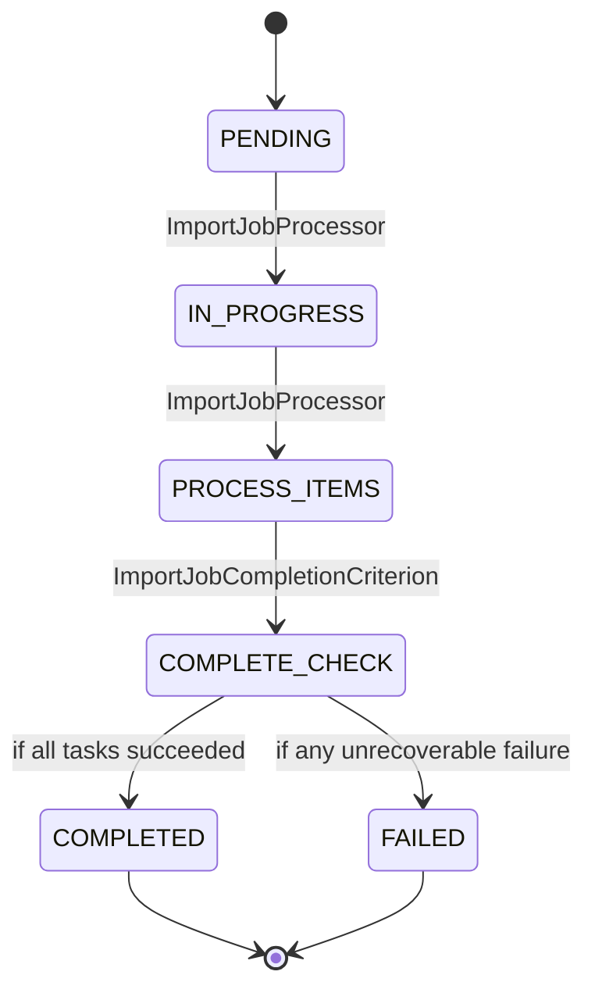
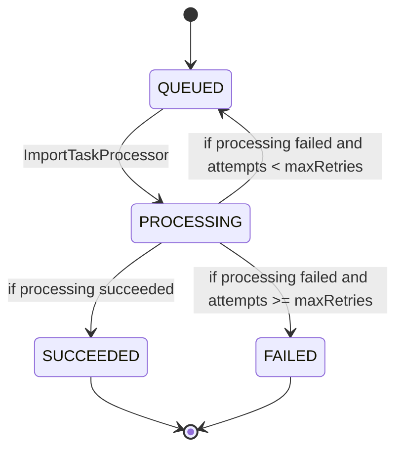
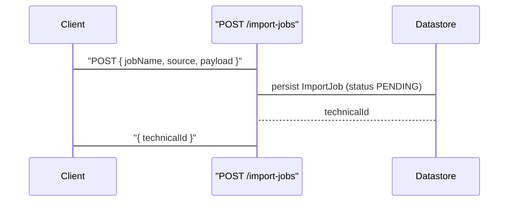
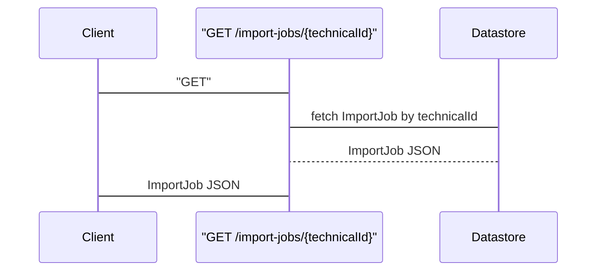
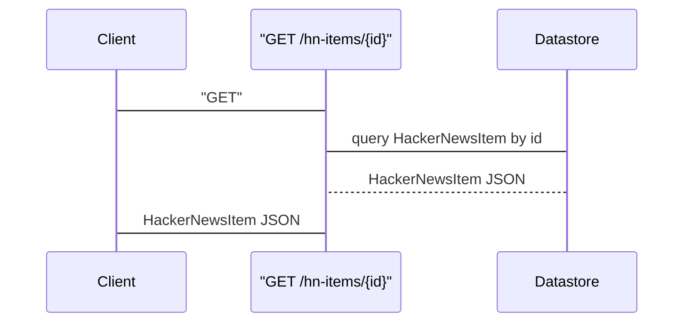

### 1. Entity Definitions
```
HackerNewsItem:
- originalJson: String (the original Firebase-format Hacker News JSON exactly as received)
- id: Long (the Hacker News item id extracted from originalJson, if present)
- type: String (the Hacker News item type extracted from originalJson, if present)
- importTimestamp: Instant (enriched timestamp when the item was imported; kept separate from the original JSON)
- state: String (VALID or INVALID; assigned after validation that fields id and type are present)
- validationErrors: String (optional short message describing why state = INVALID)
- createdAt: Instant (when this entity record was created in the datastore)

ImportJob:
- jobName: String (human-friendly name for the job)
- source: String (optional identifier of where the payload originated)
- payload: String (the raw Firebase-format Hacker News JSON provided for this job)
- status: String (PENDING, IN_PROGRESS, COMPLETED, FAILED)
- itemsCreatedCount: Integer (number of HackerNewsItem entities created/updated as part of this job)
- createdAt: Instant (when the job was persisted)
- completedAt: Instant (when the job finished processing, if applicable)

ImportTask:
- jobTechnicalId: String (reference to the ImportJob technicalId that created this task)
- hnItemId: Long (the Hacker News id if it could be parsed)
- status: String (QUEUED, PROCESSING, SUCCEEDED, FAILED)
- attempts: Integer (number of processing attempts performed)
- errorMessage: String (short description if processing failed)
- createdAt: Instant
- lastUpdatedAt: Instant
```

Notes:
- Max 3 entities used (HackerNewsItem, ImportJob, ImportTask) as no explicit entities were provided by the user.
- The requirement that "When saving an item, it must validate that the fields id and type are present" is preserved exactly: validation ensures presence of id and type.
- The requirement that "Each item is enriched with an import timestamp, kept separate from the original JSON, and assigned a state: VALID if the required fields are present, or INVALID otherwise" is preserved exactly.

---

### 2. Entity Workflows

HackerNewsItem workflow:
1. Initial State: CREATED (entity record created by an ImportJob/processor with originalJson set and importTimestamp populated)
2. Validation (automatic): Validate that id and type are present in originalJson
3. Enrichment (automatic): Set importTimestamp (kept separate from originalJson)
4. Finalization (automatic):
   - If id and type present -> state = VALID -> SUCCEEDED
   - Otherwise -> state = INVALID, store validationErrors -> FAILED

mermaid state diagram for HackerNewsItem

```mermaid
stateDiagram-v2
    [*] --> CREATED
    CREATED --> VALIDATION : HackerNewsItemValidationCriterion
    VALIDATION --> ENRICHMENT : HackerNewsItemEnrichmentProcessor
    ENRICHMENT --> CHECK_STATE : HackerNewsItemStateAssignerProcessor
    CHECK_STATE --> VALID : if id and type present
    CHECK_STATE --> INVALID : if id or type missing
    VALID --> SUCCEEDED : PersistStateProcessor
    INVALID --> FAILED : PersistStateProcessor
    SUCCEEDED --> [*]
    FAILED --> [*]
```

Processor and Criterion classes needed for HackerNewsItem:
- HackerNewsItemValidationCriterion
  - Responsibility: Check presence of id and type inside originalJson.
  - Pseudocode:
    - parse originalJson as JSON
    - if json.has("id") and json.has("type") then pass else fail
- HackerNewsItemEnrichmentProcessor
  - Responsibility: Populate importTimestamp (Instant.now()) and optionally extract id/type into fields.
  - Pseudocode:
    - parsed = parse(originalJson)
    - entity.importTimestamp = now()
    - if parsed.has("id") set entity.id = parsed.getLong("id")
    - if parsed.has("type") set entity.type = parsed.getString("type")
- HackerNewsItemStateAssignerProcessor
  - Responsibility: Set state = VALID or INVALID and set validationErrors when invalid.
  - Pseudocode:
    - if entity.id != null and entity.type != null then entity.state = "VALID" else entity.state = "INVALID"; if invalid set validationErrors = "missing id and/or type"
- PersistStateProcessor
  - Responsibility: Persist / update the HackerNewsItem record in datastore

ImportJob workflow:
1. Initial State: PENDING (job persisted with payload)
2. Start Processing (automatic): JobProcessor picks PENDING jobs and transitions to IN_PROGRESS
3. Item Creation (automatic): For the job payload, create an ImportTask and persist a HackerNewsItem record (CREATED) with originalJson set
4. Monitoring/Retry (automatic): ImportTask processors attempt to process HackerNewsItem; on failures update ImportTask
5. Completion (automatic): Update itemsCreatedCount and set job status to COMPLETED or FAILED
6. Notification (optional/manual): humans can query job status or retry failed tasks

mermaid state diagram for ImportJob

```mermaid
stateDiagram-v2
    [*] --> PENDING
    PENDING --> IN_PROGRESS : ImportJobProcessor
    IN_PROGRESS --> PROCESS_ITEMS : ImportJobProcessor
    PROCESS_ITEMS --> COMPLETE_CHECK : ImportJobCompletionCriterion
    COMPLETE_CHECK --> COMPLETED : if all tasks succeeded
    COMPLETE_CHECK --> FAILED : if any unrecoverable failure
    COMPLETED --> [*]
    FAILED --> [*]
```

Processor and Criterion classes needed for ImportJob:
- ImportJobProcessor
  - Responsibility: Trigger creation of ImportTask(s) and persist HackerNewsItem(s) with originalJson from job.payload. Update status to IN_PROGRESS while working.
  - Pseudocode:
    - mark job.status = IN_PROGRESS; persist
    - create ImportTask with jobTechnicalId referencing job, hnItemId if payload contains id, status = QUEUED
    - persist HackerNewsItem with originalJson = job.payload, importTimestamp = now() (or let item processors set)
    - enqueue ImportTask for processing
- ImportJobCompletionCriterion
  - Responsibility: Determine whether all tasks for the job succeeded or if job failed.

ImportTask workflow:
1. Initial State: QUEUED (task created by ImportJobProcessor)
2. Processing (automatic): ImportTaskProcessor picks QUEUED tasks, sets status = PROCESSING, invokes logic to validate and finalize the HackerNewsItem
3. Success/Failure:
   - On success -> status = SUCCEEDED
   - On failure -> increment attempts; if attempts < maxRetries -> re-queue (QUEUED); else -> status = FAILED
4. Finalization (automatic): Update ImportJob counters and status summary

mermaid state diagram for ImportTask

```mermaid
stateDiagram-v2
    [*] --> QUEUED
    QUEUED --> PROCESSING : ImportTaskProcessor
    PROCESSING --> SUCCEEDED : if processing succeeded
    PROCESSING --> FAILED : if processing failed and attempts >= maxRetries
    PROCESSING --> QUEUED : if processing failed and attempts < maxRetries
    SUCCEEDED --> [*]
    FAILED --> [*]
```

Processor and Criterion classes needed for ImportTask:
- ImportTaskProcessor
  - Responsibility: Orchestrate processing of a single item: call validation criterion, enrichment processor, assign state, persist HackerNewsItem; handle retries.
  - Pseudocode:
    - set task.status = PROCESSING; persist
    - retrieve HackerNewsItem by job reference or originalJson
    - call HackerNewsItemValidationCriterion on HackerNewsItem
    - call HackerNewsItemEnrichmentProcessor to set importTimestamp and extract id/type
    - call HackerNewsItemStateAssignerProcessor to mark VALID/INVALID and set validationErrors
    - persist HackerNewsItem
    - if HackerNewsItem.state == VALID then task.status = SUCCEEDED else task.status = FAILED
    - persist task
- RetryCriterion (optional)
  - Responsibility: decide whether to retry based on attempts count and error type

---

### 3. API Endpoints (Rules applied)
- POST endpoints: create orchestration entity ImportJob (triggers EDA workflows). POST returns only technicalId (datastore technical id).
- GET endpoints: retrieval endpoints for ImportJob (by technicalId) and HackerNewsItem (by hn id).
- GET by condition: GET HackerNewsItem by its id (explicit user requirement).
- GET all: optional — not included unless requested.

API endpoints summary:
- POST /import-jobs
  - Purpose: Create an ImportJob with a single Hacker News JSON payload. This triggers automated processing: ImportJobProcessor will create ImportTask and persist HackerNewsItem (CREATED) which will then be validated and enriched.
  - Request JSON:
    - { jobName: string, source: string (optional), payload: <Firebase-format HN JSON as object> }
  - Response JSON:
    - { technicalId: string }  // only the technicalId, nothing else

- GET /import-jobs/{technicalId}
  - Purpose: Retrieve job status and metrics.
  - Response JSON:
    - { technicalId: string, jobName: string, source: string, status: string, itemsCreatedCount: integer, createdAt: string (ISO instant), completedAt: string|null }

- GET /hn-items/{id}
  - Purpose: Retrieve a stored Hacker News item by its Hacker News id (the id field inside originalJson). Returns the original JSON together with its state and importTimestamp.
  - Response JSON:
    - {
        originalJson: <original Firebase-format HN JSON as object>,
        id: long|null,
        type: string|null,
        importTimestamp: string (ISO instant),
        state: string (VALID|INVALID),
        validationErrors: string|null,
        createdAt: string (ISO instant)
      }

Request/Response format visualizations (Mermaid):

POST /import-jobs request -> response

```mermaid
sequenceDiagram
    participant Client
    participant API as "POST /import-jobs"
    participant Datastore
    Client -> API : "POST { jobName, source, payload }"
    API -> Datastore : persist ImportJob (status PENDING)
    Datastore --> API : technicalId
    API -> Client : "{ technicalId }"
```

GET /import-jobs/{technicalId} request -> response

```mermaid
sequenceDiagram
    participant Client
    participant API as "GET /import-jobs/{technicalId}"
    participant Datastore
    Client -> API : "GET"
    API -> Datastore : fetch ImportJob by technicalId
    Datastore --> API : ImportJob JSON
    API -> Client : ImportJob JSON
```

GET /hn-items/{id} request -> response

```mermaid
sequenceDiagram
    participant Client
    participant API as "GET /hn-items/{id}"
    participant Datastore
    Client -> API : "GET"
    API -> Datastore : query HackerNewsItem by id
    Datastore --> API : HackerNewsItem JSON
    API -> Client : HackerNewsItem JSON
```

Notes on payload shapes:
- POST /import-jobs request example (JSON)
  - {
      "jobName": "import-single-item",
      "source": "manual-api",
      "payload": { ... <Firebase-format HN JSON object> ... }
    }
- POST /import-jobs response example
  - { "technicalId": "job_0001" }
- GET /hn-items/{id} response example
  - {
      "originalJson": { ... original firebase JSON ... },
      "id": 12345,
      "type": "story",
      "importTimestamp": "2025-08-15T12:34:56Z",
      "state": "VALID",
      "validationErrors": null,
      "createdAt": "2025-08-15T12:34:56Z"
    }

---

### 4. Important Business Rules & Behavior (preserved exactly)
- When saving an item, it must validate that the fields id and type are present.
- Each item is enriched with an import timestamp, kept separate from the original JSON, and assigned a state: VALID if the required fields are present, or INVALID otherwise.
- The service must also allow retrieval of an item by its id, returning the original JSON together with its state and import timestamp.
- The original Firebase-format Hacker News JSON must be stored exactly as received (originalJson field).
- POST endpoints return only entity technicalId.

---

### 5. Implementation notes (functional concerns only)
- Persistence of HackerNewsItem should keep originalJson exactly as received; importTimestamp must be a separate field.
- Validation is strictly the presence of id and type fields in the original JSON.
- Upsert/versioning behavior not specified here — default processing will create or update the HackerNewsItem record associated with the job (behaviour can be clarified if needed).
- Errors encountered during processing should be captured in ImportTask.errorMessage and HackerNewsItem.validationErrors when relevant.

**Please review the generated entities and workflows. If you need any changes, please let me know. Feel free to click Approve if this requirement meets your expectations or if you are ready to proceed.**