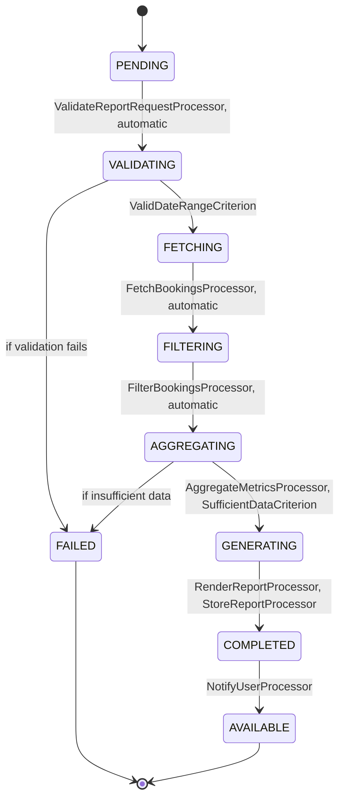
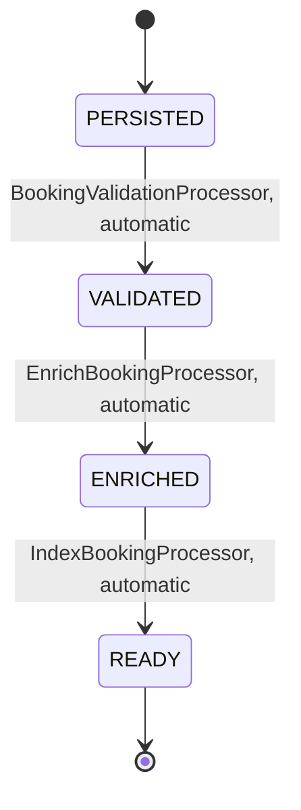
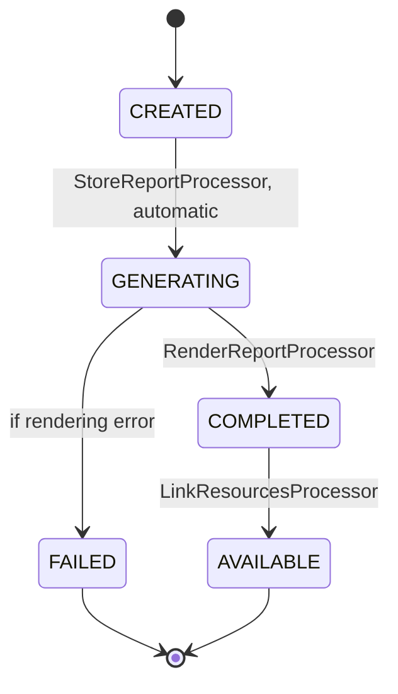

### 1. Entity Definitions
```
Booking:
- bookingId: Integer (ID from Restful Booker API)
- firstname: String (guest first name)
- lastname: String (guest last name)
- totalprice: Number (booking price)
- depositpaid: Boolean (deposit status)
- checkin: String (ISO date)
- checkout: String (ISO date)
- additionalneeds: String (notes)
- source: String (source of ingestion, e.g., RestfulBooker)
- persistedAt: String (timestamp when stored)

ReportJob:
- name: String (human name for the report job)
- requestedBy: String (user id or name)
- filters: Object (date range, price range, deposit status)
- includeCharts: Boolean (include visualization)
- status: String (PENDING/VALIDATING/FETCHING/AGGREGATING/COMPLETED/FAILED)
- requestedAt: String (timestamp)
- completedAt: String (timestamp)

Report:
- reportId: String (business id)
- jobTechnicalId: String (link to ReportJob technicalId)
- name: String (report name)
- createdBy: String
- criteria: Object (applied filters summary)
- totalRevenue: Number
- averageBookingPrice: Number
- bookingsCount: Integer
- bookingsSample: Array (subset of Booking objects)
- visualizationUrl: String (optional)
- generatedAt: String
- status: String (GENERATED/FAILED)
```

### 2. Entity workflows

ReportJob workflow:
1. Initial State: PENDING (created via POST → triggers Cyoda workflow, automatic)
2. Validation: VALIDATING (ValidateReportRequestProcessor, ValidDateRangeCriterion) — automatic
3. Fetching: FETCHING (FetchBookingsProcessor) — automatic
4. Filtering: FILTERING (FilterBookingsProcessor) — automatic
5. Aggregation: AGGREGATING (AggregateMetricsProcessor, SufficientDataCriterion) — automatic
6. Report Generation: GENERATING (RenderReportProcessor, StoreReportProcessor) — automatic
7. Completion: COMPLETED or FAILED (NotifyUserProcessor) — automatic/manual (retry)
8. Result Available: AVAILABLE (GET endpoints can retrieve Report and Bookings)


```mermaid
stateDiagram-v2
    [*] --> PENDING
    PENDING --> VALIDATING : ValidateReportRequestProcessor, automatic
    VALIDATING --> FETCHING : ValidDateRangeCriterion
    FETCHING --> FILTERING : FetchBookingsProcessor, automatic
    FILTERING --> AGGREGATING : FilterBookingsProcessor, automatic
    AGGREGATING --> GENERATING : AggregateMetricsProcessor, SufficientDataCriterion
    GENERATING --> COMPLETED : RenderReportProcessor, StoreReportProcessor
    COMPLETED --> AVAILABLE : NotifyUserProcessor
    VALIDATING --> FAILED : if validation fails
    AGGREGATING --> FAILED : if insufficient data
    FAILED --> [*]
    AVAILABLE --> [*]
```

Booking workflow (triggered when bookings are fetched/persisted by processors):
1. Initial State: PERSISTED (system persists fetched booking)
2. Validation: VALIDATED (BookingValidationProcessor) — automatic
3. Enrichment: ENRICHED (EnrichBookingProcessor — e.g., currency/format) — automatic
4. READY: READY (indexed/available for queries)


```mermaid
stateDiagram-v2
    [*] --> PERSISTED
    PERSISTED --> VALIDATED : BookingValidationProcessor, automatic
    VALIDATED --> ENRICHED : EnrichBookingProcessor, automatic
    ENRICHED --> READY : IndexBookingProcessor, automatic
    READY --> [*]
```

Report workflow (business artifact created by ReportJob processors):
1. Initial State: CREATED (created by StoreReportProcessor)
2. Generating: GENERATING (RenderReportProcessor)
3. Completed: COMPLETED (visuals ready) or FAILED
4. Available: AVAILABLE (accessible via GET)


```mermaid
stateDiagram-v2
    [*] --> CREATED
    CREATED --> GENERATING : StoreReportProcessor, automatic
    GENERATING --> COMPLETED : RenderReportProcessor
    COMPLETED --> AVAILABLE : LinkResourcesProcessor
    GENERATING --> FAILED : if rendering error
    FAILED --> [*]
    AVAILABLE --> [*]
```

Processors and Criteria needed (summary)
- Processors: ValidateReportRequestProcessor, FetchBookingsProcessor, FilterBookingsProcessor, AggregateMetricsProcessor, RenderReportProcessor, StoreReportProcessor, NotifyUserProcessor, BookingValidationProcessor, EnrichBookingProcessor, IndexBookingProcessor, LinkResourcesProcessor.
- Criteria: ValidDateRangeCriterion, BookingsFetchedCriterion, SufficientDataCriterion.

### 3. Pseudo code for processor classes
```text
ValidateReportRequestProcessor:
  input: ReportJob
  if filters.dateRange invalid -> mark job FAILED
  else -> pass

FetchBookingsProcessor:
  input: ReportJob
  call Cyoda external fetch (Restful Booker) using filters
  persist each Booking (triggers Booking workflow)
  set job.metadata.bookingsFetchedCount

FilterBookingsProcessor:
  input: ReportJob
  load persisted Bookings for date range/price/deposit
  produce filtered list

AggregateMetricsProcessor:
  input: filtered bookings
  totalRevenue = sum(totalprice)
  averageBookingPrice = totalRevenue / count
  bookingsCount = count

RenderReportProcessor:
  input: aggregates, filtered bookings, includeCharts
  build JSON report
  if includeCharts -> generate chart artifact (link)

StoreReportProcessor:
  input: report payload
  persist Report entity
  attach reportId to job

NotifyUserProcessor:
  input: job, report
  create notification entry / mark job COMPLETED
```

Keep processors idempotent and small; criteria evaluate data presence (e.g., SufficientDataCriterion returns true if bookingsCount > 0).

### 4. API Endpoints Design Rules

Rules applied: only ReportJob is created via POST (orchestration). Booking and Report are produced by processors and retrievable via GET.

Endpoints (design + JSON samples)

- POST /report-jobs
  - Purpose: create a report generation job (triggers Cyoda workflow)
  - Request:
```json
{
  "name": "June revenue report",
  "requestedBy": "analyst_1",
  "filters": {
    "dateFrom": "2025-06-01",
    "dateTo": "2025-06-30",
    "minPrice": 0,
    "maxPrice": 1000,
    "depositPaid": null
  },
  "includeCharts": true
}
```
  - Response (must return only technicalId):
```json
{
  "technicalId": "rj-123456"
}
```

- GET /report-jobs/{technicalId}
  - Purpose: retrieve job status and metadata
  - Response:
```json
{
  "technicalId": "rj-123456",
  "name": "June revenue report",
  "status": "COMPLETED",
  "requestedBy": "analyst_1",
  "requestedAt": "2025-07-01T10:00:00Z",
  "completedAt": "2025-07-01T10:01:30Z",
  "reportTechnicalId": "rep-98765"
}
```

- GET /reports/{reportTechnicalId}
  - Purpose: retrieve generated report
  - Response:
```json
{
  "reportId": "rep-98765",
  "name": "June revenue report",
  "createdBy": "analyst_1",
  "generatedAt": "2025-07-01T10:01:30Z",
  "totalRevenue": 12345.67,
  "averageBookingPrice": 245.9,
  "bookingsCount": 50,
  "visualizationUrl": "/artifacts/rep-98765/chart.png",
  "bookingsSample": [ { "bookingId": 1, "firstname": "John", "totalprice": 200 }, { "bookingId": 2, "firstname": "Jane", "totalprice": 300 } ]
}
```

- GET /bookings
  - Purpose: query persisted bookings (supports filters)
  - Query params: dateFrom, dateTo, minPrice, maxPrice, depositPaid
  - Response (paged):
```json
{
  "items": [
    { "bookingId": 1, "firstname": "John", "totalprice": 200, "depositpaid": true, "checkin": "2025-06-05", "checkout": "2025-06-07" }
  ],
  "total": 50,
  "page": 1,
  "pageSize": 50
}
```

Notes and questions
- I used 3 entities as default. If you want additional entities (User, Schedule, ExportArtifact) I can expand up to 10.
- Clarifying questions: Do you want recurring/scheduled reports (cron) or only ad-hoc jobs? Preferred output formats (PDF/CSV/PNG)? Any retention policy for persisted Bookings/Reports?