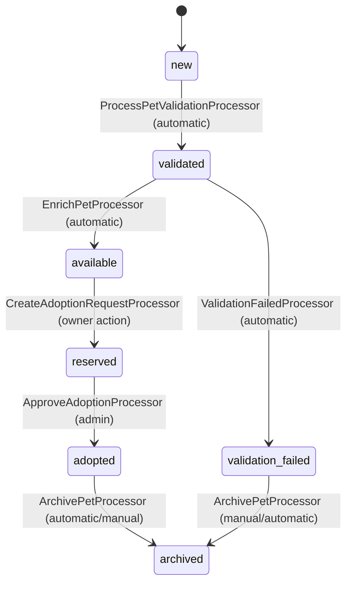
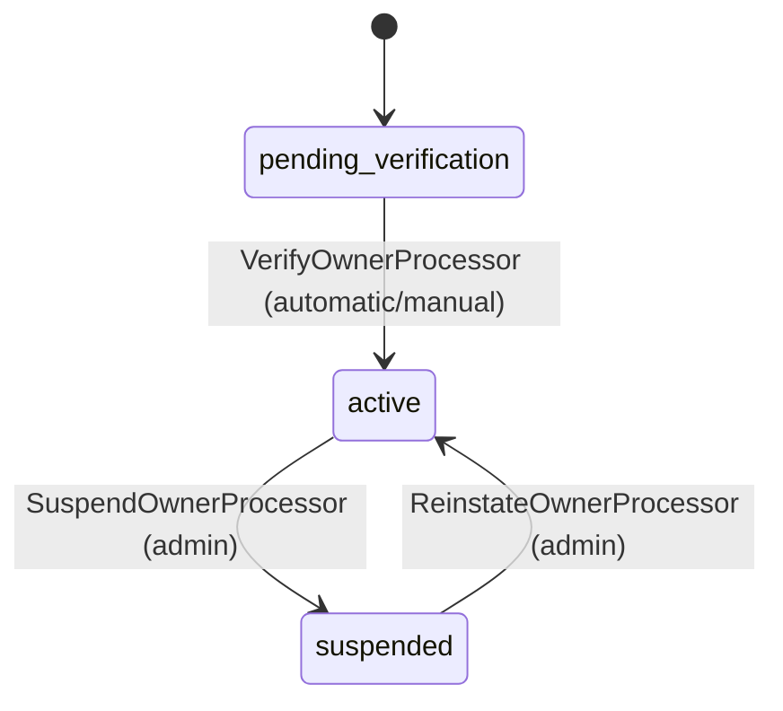
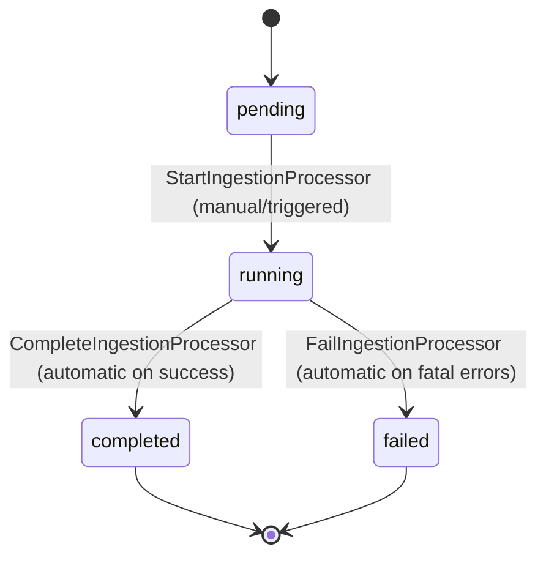

# Functional Requirements

This document defines the current, canonical functional requirements for the Pet adoption prototype. It specifies entities, allowed states/statuses, workflows, processors, acceptance criteria, pseudocode, and API rules. All naming is normalized and consistent across sections.

---

## 1. Entity Definitions
All timestamps are ISO 8601 strings. All `id` fields are stable business IDs (if provided by source) or generated technical IDs prefixed with an entity-specific namespace (e.g. `pet_`, `owner_`, `job_`). Every persisted entity includes audit fields: `createdAt`, `updatedAt`.

Entities:

- Pet
  - id: string (unique business or generated id, e.g. `pet_001`)
  - technicalId: string (internal id if separate from business id, optional)
  - name: string (required)
  - species: string (required; e.g. dog, cat)
  - breed: string (free-text; normalized during enrichment)
  - age: number (years; optional if unknown)
  - gender: string (male | female | unknown)
  - status: string enum (one of: `new`, `validated`, `available`, `reserved`, `adopted`, `archived`, `validation_failed`)
  - bio: string (optional description)
  - photos: array[string] (URLs; validated for accessibility during enrichment)
  - location: string (city or shelter name)
  - adoptionRequests: array[object] (see AdoptionRequest embedded structure below) *OR* an array of AdoptionRequest ids if separate entity model is used
  - createdAt: string (ISO timestamp)
  - updatedAt: string (ISO timestamp)

- AdoptionRequest (embedded object inside Pet.adoptionRequests or as a separate entity if chosen)
  - requestId: string (unique within system)
  - ownerId: string (id of the requesting Owner)
  - requestedAt: string (ISO timestamp)
  - notes: string (optional)
  - status: string enum (one of: `pending`, `complete`, `approved`, `rejected`, `cancelled`)
  - processedAt: string (ISO timestamp; optional)

- Owner
  - id: string (business or generated id, e.g. `owner_xyz789`)
  - name: string (full name)
  - contact: object
    - email: string
    - phone: string (optional)
  - address: string (optional)
  - favorites: array[string] (pet ids)
  - adoptedPets: array[string] (pet ids)
  - accountStatus: string enum (one of: `pending_verification`, `active`, `suspended`)
  - createdAt: string (ISO timestamp)
  - updatedAt: string (ISO timestamp)

- PetIngestionJob
  - jobId: string (business/technical id, e.g. `job_abc123`)
  - source: string (Petstore API url or descriptor)
  - requestedBy: string (user id or system)
  - startedAt: string (ISO timestamp; optional)
  - completedAt: string (ISO timestamp; optional)
  - status: string enum (one of: `pending`, `running`, `completed`, `failed`)
  - importedCount: number
  - errors: array[string]
  - createdAt: string (ISO timestamp)
  - updatedAt: string (ISO timestamp)

Notes:
- AdoptionRequest can be embedded (simple model) or modeled as its own top-level entity. Both are supported conceptually; choose one and use the relevant API semantics. If separate, AdoptionRequest gets its own endpoints and lifecycle.
- All enum values above are authoritative; processors and workflows must set only these values.

---

## 2. Workflows (Canonical)
Workflows are expressed as state transitions on the authoritative `status` field for each entity. Processor names and emitted events are specified below. All transitions must be idempotent and tolerant of retries.

### 2.1 Pet workflow
Canonical states (pet.status): `new` -> `validated` -> `available` -> `reserved` -> `adopted` -> `archived`.

Transitions and rules:
1. Persisted initial state: `new` (created by ingestion or manual creation).
2. Validation: ProcessPetValidationProcessor runs automatically on new pets. If validation fails, pet.status = `validation_failed` (or `archived` if the policy is to immediately archive). If validation succeeds, pet.status = `validated`.
3. Enrichment: EnrichPetProcessor runs automatically on `validated` pets. On success it sets pet.status = `available`. If enrichment fails (e.g. unreachable images), it may set pet.status = `validation_failed` or leave in `validated` for manual review depending on severity.
4. Reservation: When an Owner requests adoption, CreateAdoptionRequestProcessor adds an entry to pet.adoptionRequests with status `pending` and sets pet.status = `reserved` only if business rules require exclusive reservation; otherwise pet.status may remain `available` and AdoptionRequest status tracks interest.
5. Approval (adoption): ApproveAdoptionProcessor sets the adoptionRequest.status = `approved`, pet.status = `adopted`, and adds the pet id to Owner.adoptedPets. This transition requires admin validation/approval.
6. Post-adoption: PostAdoptionProcessor emits notifications, performs owner updates, and optionally marks pet as an archive candidate.
7. Archive: ArchivePetProcessor sets pet.status = `archived` (manual or automatic cleanup) and archives related metadata.

State diagram (canonical labels):


```mermaid
stateDiagram-v2
    [*] --> new
    new --> validated : ProcessPetValidationProcessor (automatic)
    validated --> available : EnrichPetProcessor (automatic)
    available --> reserved : CreateAdoptionRequestProcessor (owner action)
    reserved --> adopted : ApproveAdoptionProcessor (admin)
    adopted --> archived : ArchivePetProcessor (automatic/manual)
    validated --> validation_failed : ValidationFailedProcessor (automatic)
    validation_failed --> archived : ArchivePetProcessor (manual/automatic)
```

Processors and criteria (Pet):
- Processors: ProcessPetValidationProcessor, EnrichPetProcessor, CreateAdoptionRequestProcessor, ApproveAdoptionProcessor, PostAdoptionProcessor, ArchivePetProcessor, ValidationFailedProcessor
- Criteria / validators: PetValidCriterion (checks required fields, species/name present), PhotoAccessibleCriterion (checks images reachable / size constraints), AdoptionRequestCompleteCriterion (validates owner's contact and completeness)

Idempotency: CreatePet/CreatePetProcessor must deduplicate on business id or canonical unique key to avoid duplicate pets on repeated ingestion of the same record.

### 2.2 Owner workflow
Canonical owner.accountStatus: `pending_verification` -> `active` -> `suspended`.

Transitions:
1. Created: Owners start as `pending_verification` after POST signup.
2. Verification: VerifyOwnerProcessor runs automatic email verification or manual review; on success set `active`.
3. Suspension / Reinstate: Admins can set `suspended` and reinstate to `active`.

State diagram (canonical labels):


```mermaid
stateDiagram-v2
    [*] --> pending_verification
    pending_verification --> active : VerifyOwnerProcessor (automatic/manual)
    active --> suspended : SuspendOwnerProcessor (admin)
    suspended --> active : ReinstateOwnerProcessor (admin)
```

Processors and criteria (Owner):
- Processors: VerifyOwnerProcessor, ActivateOwnerProcessor (often part of verification), SuspendOwnerProcessor, ReinstateOwnerProcessor
- Criteria: OwnerContactValidCriterion (email format, optional phone format)

### 2.3 PetIngestionJob workflow
Job statuses: `pending` -> `running` -> `completed` | `failed`.

Behavior:
- Creating a job sets status = `pending` and returns a `technicalId` immediately.
- StartIngestionProcessor marks status = `running`, records `startedAt`, and iterates over source records.
- For each record it calls CreatePetProcessor (idempotent), increments importedCount, and collects per-record errors.
- On success sets status = `completed` and records `completedAt` and final summary.
- On unrecoverable error sets status = `failed` with `errors`.

State diagram:


```mermaid
stateDiagram-v2
    [*] --> pending
    pending --> running : StartIngestionProcessor (manual/triggered)
    running --> completed : CompleteIngestionProcessor (automatic on success)
    running --> failed : FailIngestionProcessor (automatic on fatal errors)
    completed --> [*]
    failed --> [*]
```

Processors and criteria (Jobs):
- Processors: StartIngestionProcessor, FetchPetstoreProcessor, CreatePetProcessor, CompleteIngestionProcessor, FailIngestionProcessor
- Criteria: SourceReachableCriterion (network checks), ImportThresholdCriterion (rate/size limits), DuplicateDetectionCriterion (avoid re-importing same pet)

Reliability considerations:
- Jobs should support resumable pagination and continuation tokens when the source supports them.
- Jobs should persist progress and be restartable.

---

## 3. Processors — Concise Pseudocode and Rules
All processors must log actions, emit domain events for important transitions, and be idempotent.

ProcessPetValidationProcessor:
```
class ProcessPetValidationProcessor {
  void process(Pet pet) {
    if (pet.name == null || pet.name.trim().isEmpty() || pet.species == null) {
      pet.status = "validation_failed";
      emitEvent("PetValidationFailed", pet.id, reason="missing required fields");
      persist(pet);
      return;
    }
    // basic checks pass
    pet.status = "validated";
    persist(pet);
    emitEvent("PetValidated", pet.id);
  }
}
```

EnrichPetProcessor:
```
class EnrichPetProcessor {
  void process(Pet pet) {
    // normalize breed, validate/transform photos, populate derived fields
    normalizeBreed(pet);
    if (!allPhotosAccessible(pet.photos)) {
      // policy: either mark for manual review or fail validation
      pet.status = "validation_failed"; // or remain "validated" for manual review
      persist(pet);
      emitEvent("PetEnrichmentFailed", pet.id);
      return;
    }
    pet.status = "available";
    persist(pet);
    emitEvent("PetEnriched", pet.id);
  }
}
```

CreatePetProcessor (used by ingestion):
```
class CreatePetProcessor {
  void process(sourceRecord) {
    Pet pet = mapRecordToPet(sourceRecord);
    // idempotency: deduplicate using business id or computed fingerprint
    if (existsPetWithBusinessId(pet.id)) {
      // update existing as needed, but do not create duplicate
      updatePetIfChanged(pet);
      return;
    }
    persist(pet); // triggers pet workflow processors
  }
}
```

ApproveAdoptionProcessor:
```
class ApproveAdoptionProcessor {
  void process(Pet pet, AdoptionRequest request) {
    // business validations
    request.status = "approved";
    request.processedAt = now();
    pet.status = "adopted";
    persist(pet);
    updateOwnerWithAdoptedPet(request.ownerId, pet.id);
    emitEvent("PetAdopted", pet.id, ownerId=request.ownerId, requestId=request.requestId);
  }
}
```

StartIngestionProcessor / FetchPetstoreProcessor:
```
class StartIngestionProcessor {
  void process(PetIngestionJob job) {
    job.status = "running"; job.startedAt = now(); persist(job);
    try {
      for each page from source {
        records = FetchPetstoreProcessor.fetchPage(page);
        for (record in records) {
          try { CreatePetProcessor.process(record); job.importedCount++; }
          catch (e) { job.errors.add(e.message); }
        }
      }
      job.status = "completed"; job.completedAt = now(); persist(job);
    } catch (fatal) {
      job.status = "failed"; job.errors.add(fatal.message); job.completedAt = now(); persist(job);
    }
  }
}
```

Error handling and retries:
- Processors should retry transient failures with exponential backoff.
- Non-transient failures should be captured in entity.errors and reported.

---

## 4. API Endpoints Design Rules
General rules:
- POST endpoints return only a minimal object containing a `technicalId` (and should set HTTP Location header to the resource URL). This enables asynchronous processing and workflow initiation.
- POST endpoints start the associated workflow (e.g. ingestion job or owner signup). Processing is asynchronous unless explicitly documented.
- GET endpoints return the stored, authoritative representation for the entity.
- Idempotency keys (Idempotency-Key header) are supported on POST endpoints creating resources to avoid duplicates.
- Authentication/authorization rules apply but are outside scope here.

Concrete endpoints (minimal canonical examples):

1) Create Pet Ingestion Job (orchestration)
- POST /jobs/ingestPets
  - Request body:
    {
      "source": "https://petstore.example/api/pets",
      "requestedBy": "user_123"
    }
  - Response (201 Created):
    {
      "technicalId": "job_abc123"
    }
  - Location header: /jobs/ingestPets/job_abc123

- GET /jobs/ingestPets/{technicalId}
  - Response:
    {
      "jobId":"job_abc123",
      "source":"https://petstore.example/api/pets",
      "status":"completed",
      "importedCount":24,
      "errors":[],
      "startedAt":"...",
      "completedAt":"..."
    }

2) Create Owner (signup)
- POST /owners
  - Request body:
    {
      "name":"Alex Doe",
      "contact":{"email":"alex@example.com","phone":"555-0100"},
      "address":"City"
    }
  - Response (201 Created):
    {
      "technicalId":"owner_xyz789"
    }
  - Location header: /owners/owner_xyz789

- GET /owners/{technicalId}
  - Response:
    {
      "id":"owner_xyz789",
      "name":"Alex Doe",
      "contact":{"email":"alex@example.com","phone":"555-0100"},
      "favorites":[],
      "adoptedPets":[],
      "accountStatus":"active",
      "createdAt":"..."
    }

3) Read Pet
- GET /pets/{id}
  - Response:
    {
      "id":"pet_001",
      "name":"Mittens",
      "species":"cat",
      "breed":"Tabby",
      "age":2,
      "status":"available",
      "location":"Shelter A",
      "photos":["https://..."],
      "createdAt":"..."
    }

4) Adoption request (example)
- POST /pets/{petId}/adoptionRequests
  - Request body:
    {
      "ownerId":"owner_xyz789",
      "notes":"I have a fenced yard"
    }
  - Response:
    {
      "technicalId":"request_req123"
    }
  - Behavior: creates an AdoptionRequest (embedded or separate), sets request.status=`pending`, may set pet.status=`reserved` depending on reservation policy.

Notes and assumptions:
- Pet creation by ingestion is the default path; manual creation endpoints may be added but must trigger the same pipeline.
- AdoptionRequests are stored on the Pet (embedded) unless a separate AdoptionRequest entity is chosen; if separate, POST/GET endpoints for AdoptionRequest will be provided.
- POST endpoints should support an Idempotency-Key header to avoid duplicate creation.
- All entities expose GET by technicalId for resources created via POST.

---

## 5. Additional Non-functional and Operational Rules
- All state transitions should emit domain events (e.g., PetValidated, PetEnriched, AdoptionRequested, PetAdopted) that other systems may subscribe to.
- Processors must be resilient: retry on transient errors, log failures, and mark entities with error details for manual inspection.
- Duplicate detection: ingestion must deduplicate based on source-provided business id or stable fingerprint.
- Security: sensitive owner contact details must be handled per policy (not exposed in public endpoints unless authorized).

---

If you want, I can also:
- Switch AdoptionRequest to a top-level entity and add its endpoints and workflow.
- Add OpenAPI schema snippets for the endpoints above.
- Add example event payloads for emitted domain events.

If this updated functional requirements file looks correct, confirm and I will commit it to the repository (already saved to the specified path).