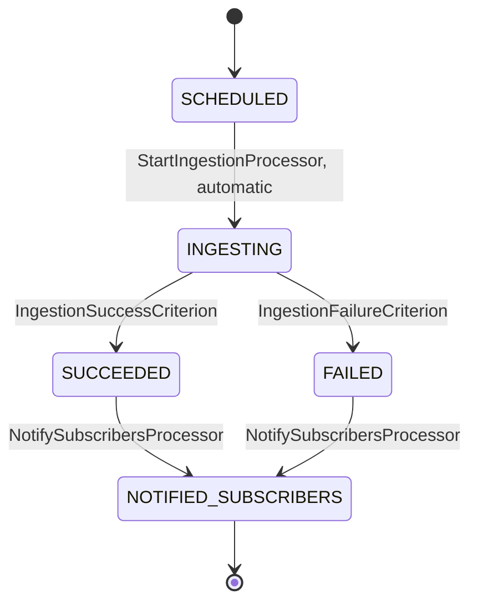
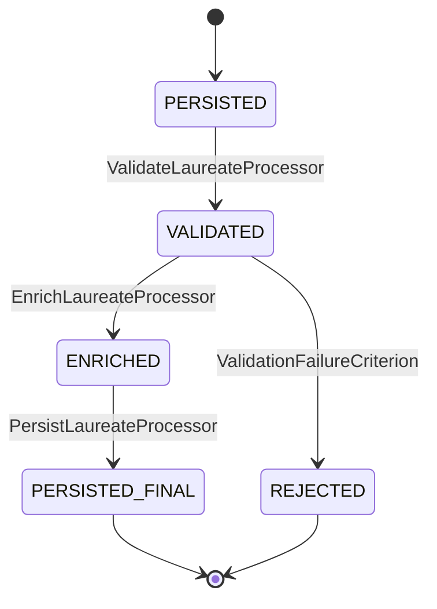
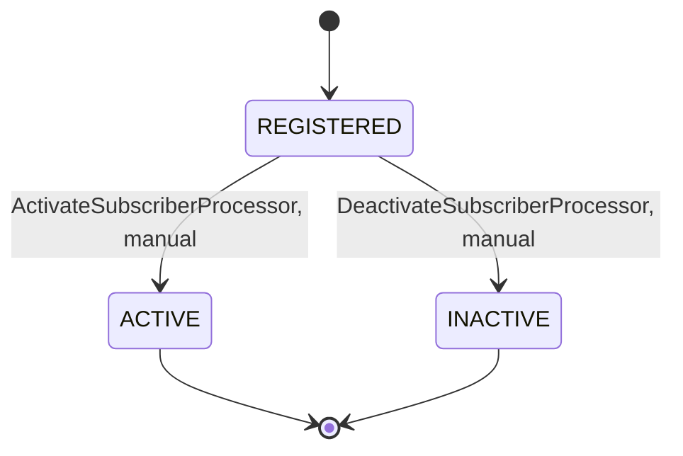

### 1. Entity Definitions
```
Job:
- id: String (business id supplied on create)
- schedule: String (cron or manual descriptor)
- status: String (SCHEDULED INGINGESTING SUCCEEDED FAILED NOTIFIED_SUBSCRIBERS)
- startedAt: String (timestamp)
- finishedAt: String (timestamp)
- source: String (API endpoint)
- scope: String (full incremental selective)
- resultSummary: Object (ingestedCount updatedCount errorCount)
- errorDetails: Array (list of error messages)
- notificationsSent: Boolean
- subscribersSnapshot: Array (list of subscriberIds to notify)

Laureate:
- laureateId: String (source id)
- firstname: String
- surname: String
- gender: String
- born: String (date)
- died: String|null (date)
- borncountry: String
- borncountrycode: String
- borncity: String
- awardYear: String
- category: String
- motivation: String
- affiliationName: String
- affiliationCity: String
- affiliationCountry: String
- ageAtAward: Integer|null (enriched)
- processingStatus: String (VALIDATED ENRICHED REJECTED)
- validationErrors: Array
- provenance: Object (sourceTimestamp sourceRecordId ingestionJobId)

Subscriber:
- subscriberId: String
- name: String
- contactMethods: Object (email webhookUrl)
- interests: Object (categories array years array countries array)
- active: Boolean
- preferredPayload: String (summary full minimal)
- lastNotifiedJobId: String|null
- lastNotificationStatus: String|null
```

### 2. Entity workflows

Job workflow:
1. Initial State: Job persisted (EVENT) -> status SCHEDULED (automatic trigger by Cyoda)
2. Validation: Check source reachable and preconditions (automatic)
3. Ingestion: Fetch records -> for each create Laureate entities (automatic)
4. Finalization: Set SUCCEEDED or FAILED (automatic)
5. Notification: Notify Subscribers and set NOTIFIED_SUBSCRIBERS (automatic)


```mermaid
stateDiagram-v2
    [*] --> SCHEDULED
    SCHEDULED --> INGESTING : StartIngestionProcessor, automatic
    INGESTING --> SUCCEEDED : IngestionSuccessCriterion
    INGESTING --> FAILED : IngestionFailureCriterion
    SUCCEEDED --> NOTIFIED_SUBSCRIBERS : NotifySubscribersProcessor
    FAILED --> NOTIFIED_SUBSCRIBERS : NotifySubscribersProcessor
    NOTIFIED_SUBSCRIBERS --> [*]
```

Job processors & criteria:
- Processors: StartIngestionProcessor, FetchLaureatesProcessor, AggregateResultsProcessor, NotifySubscribersProcessor
- Criteria: SourceAvailableCriterion, IngestionSuccessCriterion, IngestionFailureCriterion

Laureate workflow:
1. Persisted (EVENT) by Job ingestion -> processingStatus VALIDATED pending
2. Validation: run Validation Processor -> VALIDATED or REJECTED (automatic)
3. Enrichment: run Enrichment Processor -> ENRICHED (automatic)
4. Persist final and mark for notification if new/changed (automatic)


```mermaid
stateDiagram-v2
    [*] --> PERSISTED
    PERSISTED --> VALIDATED : ValidateLaureateProcessor
    VALIDATED --> ENRICHED : EnrichLaureateProcessor
    VALIDATED --> REJECTED : ValidationFailureCriterion
    ENRICHED --> PERSISTED_FINAL : PersistLaureateProcessor
    PERSISTED_FINAL --> [*]
    REJECTED --> [*]
```

Laureate processors & criteria:
- Processors: ValidateLaureateProcessor, EnrichLaureateProcessor, DeduplicateProcessor, PersistLaureateProcessor
- Criteria: ValidationFailureCriterion, DuplicateDetectCriterion

Subscriber workflow:
1. Persisted (manual POST create) -> active/inactive stored
2. No orchestration lifecycle; used by Job NotifySubscribersProcessor to filter & deliver


```mermaid
stateDiagram-v2
    [*] --> REGISTERED
    REGISTERED --> ACTIVE : ActivateSubscriberProcessor, manual
    REGISTERED --> INACTIVE : DeactivateSubscriberProcessor, manual
    ACTIVE --> [*]
    INACTIVE --> [*]
```

Subscriber processors & criteria:
- Processors: ActivateSubscriberProcessor, DeactivateSubscriberProcessor, RecordNotificationResultProcessor
- Criteria: SubscriberActiveCriterion, InterestsMatchCriterion

### 3. Pseudo code for processor classes

- StartIngestionProcessor
```java
void process(Job job) {
  // Cyoda triggers this when Job persisted
  if (!SourceAvailableCriterion.test(job.source)) { job.status = "FAILED"; job.errorDetails.add("source unreachable"); return; }
  job.status = "INGESTING";
  List<Record> records = FetchLaureatesProcessor.fetch(job.scope, job.source);
  for (Record r : records) {
    // create Laureate entity persistence event (Cyoda will start Laureate workflow)
    persistLaureateEvent(r, job.id);
  }
  AggregateResultsProcessor.process(job, records);
}
```

- ValidateLaureateProcessor
```java
void process(Laureate l) {
  List<String> errors = validateRequiredFields(l);
  if (!errors.isEmpty()) { l.processingStatus = "REJECTED"; l.validationErrors = errors; return; }
  l.processingStatus = "VALIDATED";
}
```

- EnrichLaureateProcessor
```java
void process(Laureate l) {
  l.ageAtAward = computeAgeAtAward(l.born, l.awardYear);
  l.borncountrycode = normalizeCountryCode(l.borncountry, l.borncountrycode);
  l.processingStatus = "ENRICHED";
}
```

- NotifySubscribersProcessor
```java
void process(Job job) {
  List<Subscriber> subs = job.subscribersSnapshot;
  for (Subscriber s : subs) {
    if (!SubscriberActiveCriterion.test(s)) continue;
    List<Laureate> payload = selectPayloadForSubscriber(job, s);
    boolean sent = sendToSubscriber(s.contactMethods, s.preferredPayload, payload);
    RecordNotificationResultProcessor.record(s, job.id, sent);
  }
  job.status = "NOTIFIED_SUBSCRIBERS";
}
```

### 4. API Endpoints Design Rules

- Rules applied:
  - Only orchestration entity Job has POST endpoint (creates Job and triggers Cyoda workflow).
  - POST returns only technicalId.
  - GET by technicalId available for Job. GET endpoints allowed to retrieve Laureate and Subscriber records (read-only).

Endpoints:

1) Create Job (POST) -> returns technicalId only
Request:
```json
{
  "id": "job-2025-08-27-01",
  "schedule": "manual",
  "source": "https://public.opendatasoft.com/api/explore/v2.1/catalog/datasets/nobel-prize-laureates/records",
  "scope": "incremental",
  "subscribersSnapshot": ["sub-1","sub-2"]
}
```
Response:
```json
"technicalId-abc123"
```

2) Get Job by technicalId (GET)
Response:
```json
{
  "id": "job-2025-08-27-01",
  "technicalId": "technicalId-abc123",
  "status": "NOTIFIED_SUBSCRIBERS",
  "startedAt": "2025-08-27T12:00:00Z",
  "finishedAt": "2025-08-27T12:00:30Z",
  "resultSummary": {"ingestedCount":10,"updatedCount":2,"errorCount":1},
  "errorDetails": []
}
```

3) Get Laureate by technicalId (GET) — optional read
Response:
```json
{
  "laureateId": "853",
  "firstname": "Akira",
  "surname": "Suzuki",
  "processingStatus": "ENRICHED",
  "ageAtAward": 80,
  "provenance": {"ingestionJobId":"job-2025-08-27-01"}
}
```

4) Get Subscriber by technicalId (GET) — optional read
Response:
```json
{
  "subscriberId": "sub-1",
  "name": "Nobel Alerts",
  "active": true,
  "contactMethods": {"email":"alerts@example.com"}
}
```

Notes / assumptions
- Each entity persistence is an EVENT that triggers Cyoda workflows (Job create -> Job workflow; Laureate persisted by Job ingestion -> Laureate workflow).
- Only first 3 entities provided by user are used. If you want more entities (up to 10) tell me which ones and I will extend the model.