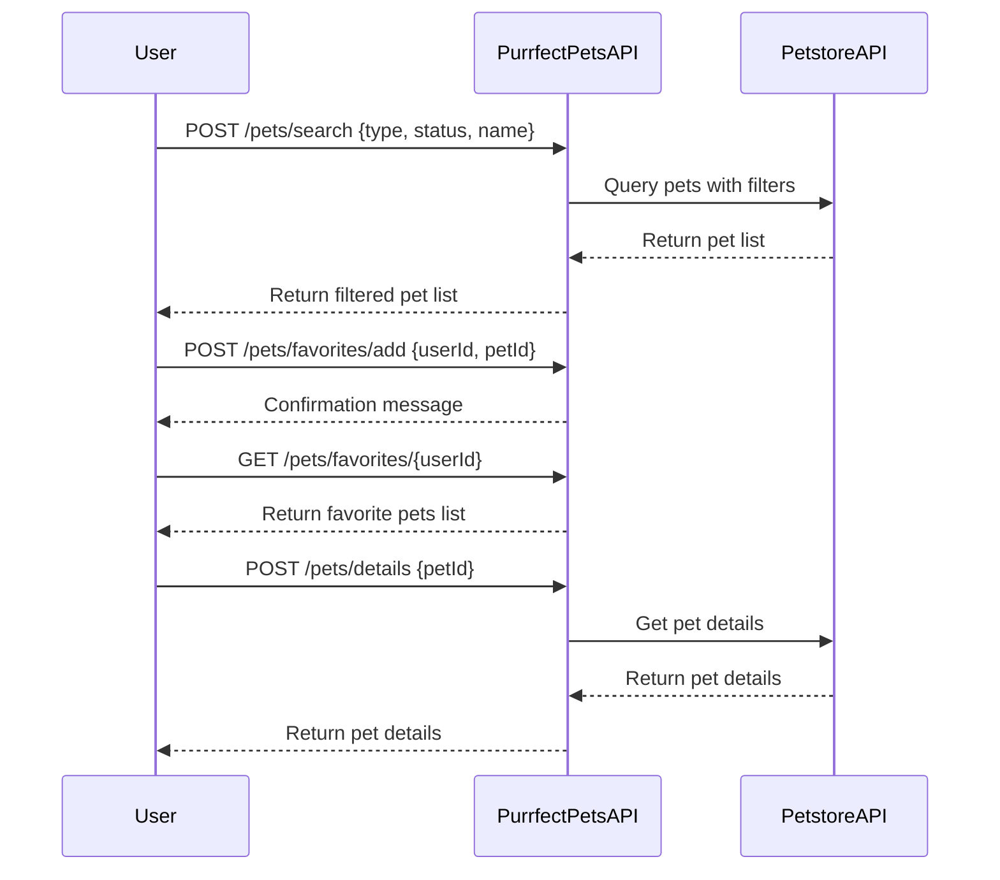

# Purrfect Pets API - Functional Requirements

## API Endpoints

### 1. POST /pets/search  
**Description:** Search pets by criteria (type, status, name, etc.) by invoking external Petstore API and returning filtered results.  
**Request:**  
```json
{
  "type": "string",        // optional: e.g. "cat", "dog"
  "status": "string",      // optional: e.g. "available", "sold"
  "name": "string"         // optional: partial or full name match
}
```  
**Response:**  
```json
[
  {
    "id": "integer",
    "name": "string",
    "type": "string",
    "status": "string",
    "tags": ["string"],
    "photoUrls": ["string"]
  },
  ...
]
```

---

### 2. POST /pets/favorites/add  
**Description:** Add a pet to user’s favorites list (stored internally).  
**Request:**  
```json
{
  "userId": "string",
  "petId": "integer"
}
```  
**Response:**  
```json
{
  "success": true,
  "message": "Pet added to favorites"
}
```

---

### 3. GET /pets/favorites/{userId}  
**Description:** Retrieve the list of favorite pets for a user.  
**Response:**  
```json
[
  {
    "id": "integer",
    "name": "string",
    "type": "string",
    "status": "string",
    "tags": ["string"],
    "photoUrls": ["string"]
  },
  ...
]
```

---

### 4. POST /pets/details  
**Description:** Retrieve detailed information for a specific pet by invoking external Petstore API.  
**Request:**  
```json
{
  "petId": "integer"
}
```  
**Response:**  
```json
{
  "id": "integer",
  "name": "string",
  "type": "string",
  "status": "string",
  "tags": ["string"],
  "photoUrls": ["string"],
  "description": "string"
}
```

---

## User-App Interaction Sequence Diagram


```mermaid
sequenceDiagram
  participant User
  participant PurrfectPetsAPI
  participant PetstoreAPI

  User->>PurrfectPetsAPI: POST /pets/search {type, status, name}
  PurrfectPetsAPI->>PetstoreAPI: Query pets with filters
  PetstoreAPI-->>PurrfectPetsAPI: Return pet list
  PurrfectPetsAPI-->>User: Return filtered pet list

  User->>PurrfectPetsAPI: POST /pets/favorites/add {userId, petId}
  PurrfectPetsAPI-->>User: Confirmation message

  User->>PurrfectPetsAPI: GET /pets/favorites/{userId}
  PurrfectPetsAPI-->>User: Return favorite pets list

  User->>PurrfectPetsAPI: POST /pets/details {petId}
  PurrfectPetsAPI->>PetstoreAPI: Get pet details
  PetstoreAPI-->>PurrfectPetsAPI: Return pet details
  PurrfectPetsAPI-->>User: Return pet details
```