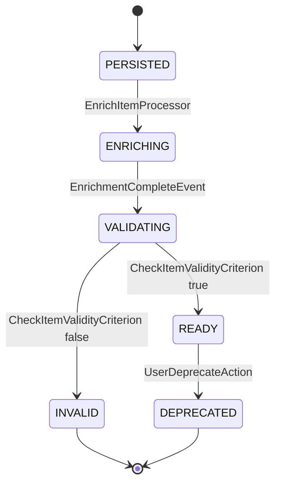
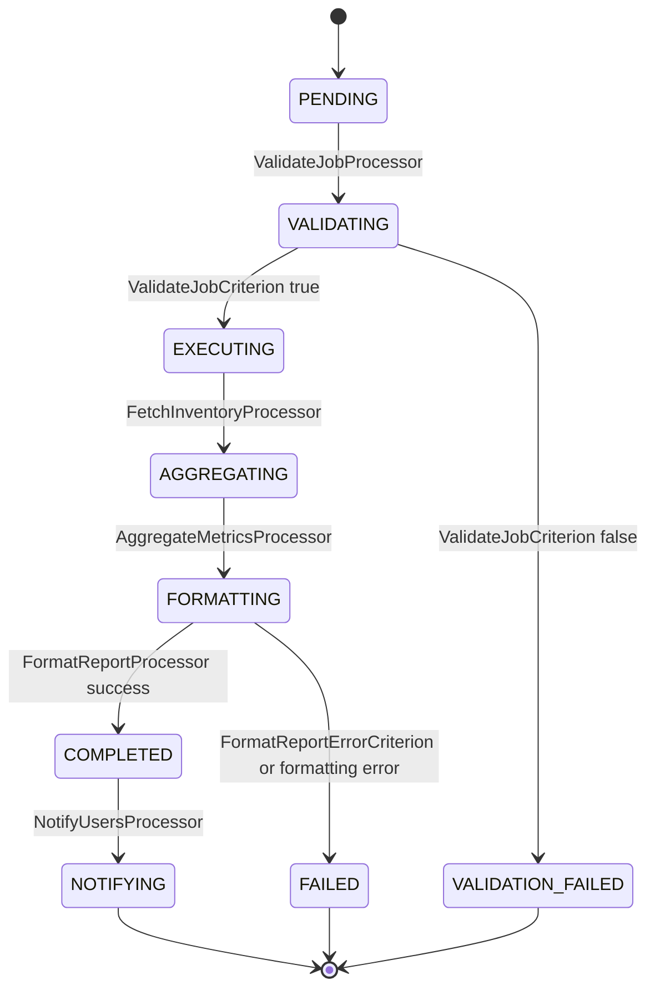
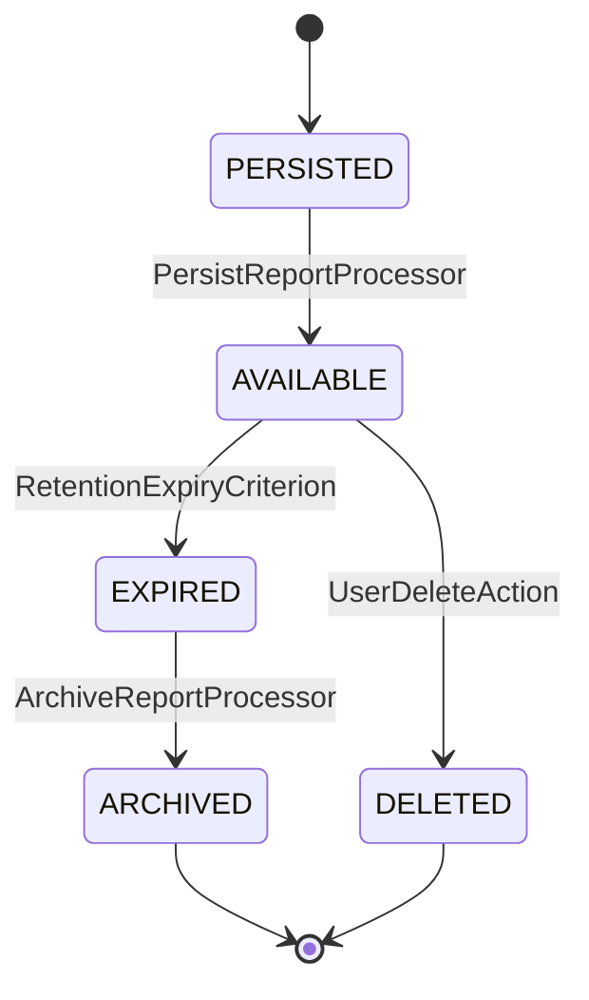

# Functional Requirements — Inventory Reporting Prototype

This document describes the entities, workflows, processors, criteria, and API design rules for the Inventory Reporting prototype. It updates and harmonizes prior logic so entity definitions, workflow states, processors, and API behavior are consistent.

---

## 1. Entity Definitions

All timestamps are ISO-8601 strings. Field types assume appropriate language/DB types (String, Integer, Decimal, DateTime, Array, Object, Boolean).

### InventoryItem
- id / technicalId: String (opaque internal id)
- sku: String (unique product code from upstream API)
- name: String (product display name)
- category: String (categorization for grouping)
- quantity: Integer (available units)
- unitPrice: Decimal (price per unit, may be null)
- location: String (warehouse/location)
- lastUpdated: DateTime (timestamp from source)
- sourceId: String (origin identifier from upstream API)
- status: String (one of: PERSISTED, ENRICHING, VALIDATING, READY, INVALID, DEPRECATED)
- metadata: Object (optional, free-form hints from source)

Notes:
- sku is unique per sourceId. If multiple sources exist, (sourceId, sku) is unique.
- unitPrice may be null; price-based metrics must handle nulls explicitly.

### InventoryReportJob
- technicalId: String (opaque id returned on POST)
- jobName: String (user-friendly name)
- requestedBy: String (user id or system)
- metricsRequested: Array(String) (e.g., totalCount, avgPrice, totalValue; see metrics section)
- filters: Object (category, location, minDate/maxDate, supplier, other filter predicates)
- groupBy: Array(String) (fields to group by: category, location, supplier, etc.)
- presentationType: String (table, chart)
- schedule: Object | null (optional; cron or interval description)
- createdAt: DateTime
- status: String (one of: PENDING, VALIDATING, EXECUTING, COMPLETED, FAILED, VALIDATION_FAILED, NOTIFYING)
- reportRef: String | null (technicalId of resulting InventoryReport when available)
- retentionUntil: DateTime | null (optional job-level retention override)

Notes:
- POSTing a job always returns a technicalId and starts the workflow asynchronously.

### InventoryReport
- technicalId: String (opaque id)
- reportName: String
- jobRef: String (technicalId of originating InventoryReportJob)
- generatedAt: DateTime
- status: String (one of: SUCCESS, FAILED, EMPTY, EXPIRED, ARCHIVED, DELETED)
- metricsSummary: Object (key metric name -> value)
- groupedSummaries: Array(Object) (per-group metrics; groupKey -> metrics)
- presentationPayload: Object (table rows and/or chart series, exact schema depends on presentationType)
- errorMessage: String | null (when status == FAILED)
- suggestion: String | null (optional, for EMPTY or incomplete data responses)
- retentionUntil: DateTime | null

---

## 2. Workflows (harmonized)

Each workflow uses a set of processors (stateless or stateful), emits events, and evaluates criteria. The diagrams use consistent state names matching entity.status values.

### InventoryItem workflow

States: PERSISTED -> ENRICHING -> VALIDATING -> READY or INVALID -> DEPRECATED

Mermaid state diagram:


```mermaid
stateDiagram-v2
    [*] --> PERSISTED
    PERSISTED --> ENRICHING : EnrichItemProcessor
    ENRICHING --> VALIDATING : EnrichmentCompleteEvent
    VALIDATING --> READY : CheckItemValidityCriterion true
    VALIDATING --> INVALID : CheckItemValidityCriterion false
    READY --> DEPRECATED : UserDeprecateAction
    INVALID --> [*]
    DEPRECATED --> [*]
```

Processors and criteria (InventoryItem)
- Processors: EnrichItemProcessor, NormalizeFieldsProcessor, IndexItemProcessor
- Criteria: CheckItemValidityCriterion, PricePresentCriterion

Behavior notes:
- EnrichItemProcessor attempts to fill missing unitPrice or location from configured hints or external price lookup. If enrichment takes time, set status ENRICHING.
- CheckItemValidityCriterion returns true if required fields (sku, name, quantity, sourceId) are present and values in acceptable range. If price is required by later metrics but missing, that is handled at job time (see DataSufficientCriterion).
- Deprecated items are archived and excluded from normal reporting unless explicitly included.


### InventoryReportJob workflow

States: PENDING -> VALIDATING -> EXECUTING -> (COMPLETED | FAILED | VALIDATION_FAILED) -> NOTIFYING -> [terminal]

Mermaid state diagram:


```mermaid
stateDiagram-v2
    [*] --> PENDING
    PENDING --> VALIDATING : ValidateJobProcessor
    VALIDATING --> VALIDATION_FAILED : ValidateJobCriterion false
    VALIDATING --> EXECUTING : ValidateJobCriterion true
    EXECUTING --> AGGREGATING : FetchInventoryProcessor
    AGGREGATING --> FORMATTING : AggregateMetricsProcessor
    FORMATTING --> COMPLETED : FormatReportProcessor success
    FORMATTING --> FAILED : FormatReportErrorCriterion or formatting error
    COMPLETED --> NOTIFYING : NotifyUsersProcessor
    NOTIFYING --> [*]
    FAILED --> [*]
    VALIDATION_FAILED --> [*]
```

Processors and criteria (InventoryReportJob)
- Processors: ValidateJobProcessor, FetchInventoryProcessor, AggregateMetricsProcessor, FormatReportProcessor, NotifyUsersProcessor
- Criteria: ValidateJobCriterion, DataSufficientCriterion, FormatReportErrorCriterion

Behavior notes:
- ValidateJobProcessor marks the job status to VALIDATING while checks run. On success it transitions the job to EXECUTING or to VALIDATION_FAILED on error.
- FetchInventoryProcessor executes searches against persisted InventoryItem data (respecting filters) and returns a list of candidate items. It emits NoDataEvent if zero items are returned.
- DataSufficientCriterion is evaluated before metric aggregation for metric types that require specific fields (e.g., avgPrice requires at least one non-null unitPrice). If criterion fails, the pipeline should produce an InventoryReport with status EMPTY and a suggestion for the user.
- Errors at any stage should cause the job to transition to FAILED and persist an InventoryReport with status FAILED and an informative errorMessage.


### InventoryReport workflow

States: PERSISTED -> AVAILABLE -> EXPIRED -> ARCHIVED | DELETED

Mermaid state diagram:


```mermaid
stateDiagram-v2
    [*] --> PERSISTED
    PERSISTED --> AVAILABLE : PersistReportProcessor
    AVAILABLE --> EXPIRED : RetentionExpiryCriterion
    EXPIRED --> ARCHIVED : ArchiveReportProcessor
    ARCHIVED --> [*]
    AVAILABLE --> DELETED : UserDeleteAction
    DELETED --> [*]
```

Processors and criteria (InventoryReport)
- Processors: PersistReportProcessor, GeneratePresentationProcessor, ArchiveReportProcessor
- Criteria: RetentionExpiryCriterion, ReportCompleteCriterion

Behavior notes:
- PersistReportProcessor saves the report object and sets status (SUCCESS/FAILED/EMPTY) and retentionUntil.
- When retentionUntil passes, RetentionExpiryCriterion marks the report EXPIRED and ArchiveReportProcessor moves it to ARCHIVED.
- Users can manually delete or archive reports via API/UI. Deleted reports change status to DELETED; archived reports are retained but removed from normal lists.

---

## 3. Pseudo code for processors (updated and consistent)

ValidateJobProcessor

```
class ValidateJobProcessor {
  process(job) {
    job.status = "VALIDATING"
    emit InventoryReportJobUpdated(job)

    if missing(job.metricsRequested) or invalidFilters(job.filters) {
      job.status = "VALIDATION_FAILED"
      emit InventoryReportJobUpdated(job)
      return
    }

    // Additional checks: metrics supported, groupBy allowed, schedule valid
    job.status = "EXECUTING"
    emit StartExecutionEvent(job)
  }
}
```

FetchInventoryProcessor

```
class FetchInventoryProcessor {
  process(job) {
    items = callSourceSearch(job.filters) // fetch persisted InventoryItem data matching filters
    if items.empty() {
      emit NoDataEvent(job)
      // downstream: create InventoryReport with status EMPTY and suggestion
      return
    }
    emit ItemsFetchedEvent(job, items)
  }
}
```

AggregateMetricsProcessor

```
class AggregateMetricsProcessor {
  process(job, items) {
    if DataSufficientCriterion(job.metricsRequested, items) == false {
      emit InsufficientDataEvent(job, items)
      // downstream: create EMPTY InventoryReport with suggestion
      return
    }

    metrics = computeRequestedMetrics(job.metricsRequested, items)
    grouped = groupBy(items, job.groupBy)
    emit MetricsAggregatedEvent(job, metrics, grouped)
  }
}
```

FormatReportProcessor

```
class FormatReportProcessor {
  process(job, metrics, grouped) {
    try {
      payload = buildPresentation(metrics, grouped, job.presentationType)
      report = InventoryReport{ jobRef: job.technicalId,
                                reportName: job.jobName,
                                generatedAt: now(),
                                status: "SUCCESS",
                                metricsSummary: metrics,
                                groupedSummaries: grouped,
                                presentationPayload: payload,
                                retentionUntil: job.retentionUntil }
      persist(report)
      job.reportRef = report.technicalId
      job.status = "COMPLETED"
      emit ReportPersistedEvent(report)
    } catch (err) {
      // attempt to persist a FAILED InventoryReport with errorMessage
      report = InventoryReport{ jobRef: job.technicalId, generatedAt: now(), status: "FAILED", errorMessage: err.message }
      persist(report)
      job.status = "FAILED"
      emit ReportPersistedEvent(report)
    }
  }
}
```

NotifyUsersProcessor

```
class NotifyUsersProcessor {
  process(job, report) {
    if job.requestedBy then queueNotification(report, job.requestedBy)
    job.status = "NOTIFYING"
    emit InventoryReportJobUpdated(job)
  }
}
```

Criteria (concise)
- ValidateJobCriterion: true if required fields are present, metrics are supported, and filters parse correctly.
- DataSufficientCriterion: false if zero items OR if metric requires non-null values (e.g., avgPrice) and all corresponding fields are null.
- RetentionExpiryCriterion: true if now > report.retentionUntil.

---

## 4. API Endpoints Design Rules (updated)

Design principles:
- POST endpoints create orchestration jobs only (InventoryReportJob). Domain entities (InventoryItem, InventoryReport) are created by workflows/processors.
- POST is asynchronous: client receives a technicalId and must poll or subscribe for job/report completion.
- GET can be used to retrieve job state and report contents by technicalId.
- Idempotency: POST /report-jobs should accept an idempotency key to prevent duplicate job creation.
- Errors: Job-level errors are surfaced by persisting an InventoryReport with status FAILED and a user-friendly errorMessage; job status becomes FAILED or VALIDATION_FAILED.

Endpoints

POST /report-jobs
- Request JSON (example):
{
  "jobName":"Monthly Inventory Summary",
  "requestedBy":"user123",
  "metricsRequested":["totalCount","avgPrice","totalValue"],
  "filters":{"category":"Electronics","minDate":"2025-01-01"},
  "groupBy":["category"],
  "presentationType":"table",
  "schedule":null,
  "retentionUntil": null
}
- Response JSON:
{ "technicalId":"<opaque-id>" }
- Behavior: creates InventoryReportJob with status PENDING (or VALIDATING immediately if validation executed eagerly), starts the workflow asynchronously.

GET /report-jobs/{technicalId}
- Response JSON (example):
{
  "technicalId":"<opaque-id>",
  "jobName":"Monthly Inventory Summary",
  "status":"COMPLETED",
  "createdAt":"2025-08-19T12:00:00Z",
  "reportRef":"<report-technical-id>"
}
- Notes: status may be PENDING, VALIDATING, EXECUTING, COMPLETED, FAILED, VALIDATION_FAILED, NOTIFYING.

GET /reports/{technicalId}
- Response JSON (example):
{
  "technicalId":"<opaque-id>",
  "reportName":"Monthly Inventory Summary",
  "generatedAt":"2025-08-19T12:05:00Z",
  "status":"SUCCESS",
  "metricsSummary":{ "totalCount":1000, "avgPrice":12.5, "totalValue":12500 },
  "presentationPayload":{ "table":[ /* rows */ ], "charts":[ /* series */ ] }
}
- Notes: status may be SUCCESS, FAILED, EMPTY, EXPIRED, ARCHIVED, DELETED. For EMPTY reports include suggestion text explaining data gaps.

Optional endpoints (recommended additions)
- GET /report-jobs?requestedBy={user} & status={status} (list and filter jobs)
- GET /reports?jobRef={technicalId} (list reports for a job)

---

## 5. Business Rules & Operational Notes

- Every InventoryReportJob POST triggers the workflow automatically (unless an idempotency key indicates a duplicate).
- When metrics cannot be computed due to missing data, the system must persist an InventoryReport with status EMPTY and a suggestion message describing remediation (e.g., "No price data for requested items — enable price enrichment or remove price-based metrics").
- Errors are surfaced as InventoryReport with status FAILED and the errorMessage should be user-friendly; logs should contain full error details.
- Retention policy: retentionUntil can be set per-job or per-report. When retentionUntil is reached, report transitions EXPIRED, then ARCHIVED.
- Notifications: a NotifyUsersProcessor sends a notification to requestedBy when the report is available. Notification failures should not mark report status FAILED; they should be retried separately and job status recorded as NOTIFYING.
- Retry and resiliency: processors interacting with external systems should implement retries with exponential backoff, idempotent operations, and dead-letter handling for persistent failures.
- Security: endpoints must authenticate callers and authorize requestedBy actions. Sensitive data in reports should be redacted where required.

---

If you'd like, I can now:
- Add a detailed metric specification (median, percentiles, min/max, counts by category).
- Add sequence diagrams for error flows and retry/backoff.
- Add example JSON schema definitions for each entity.

