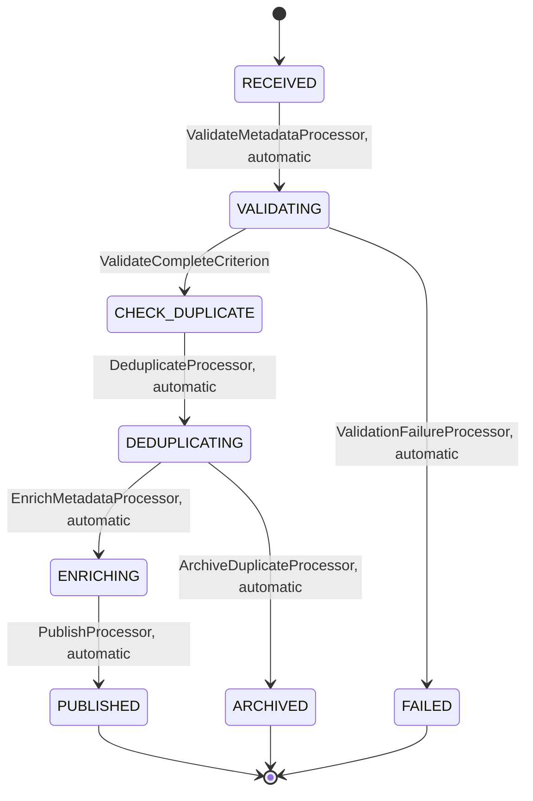
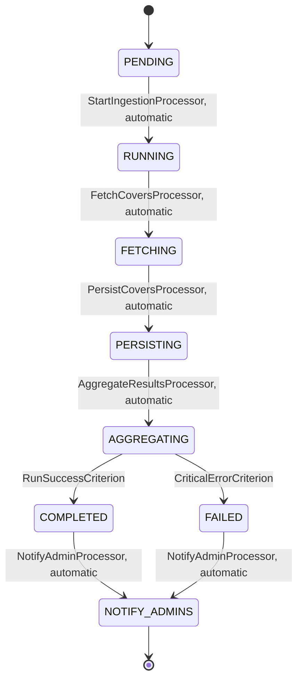
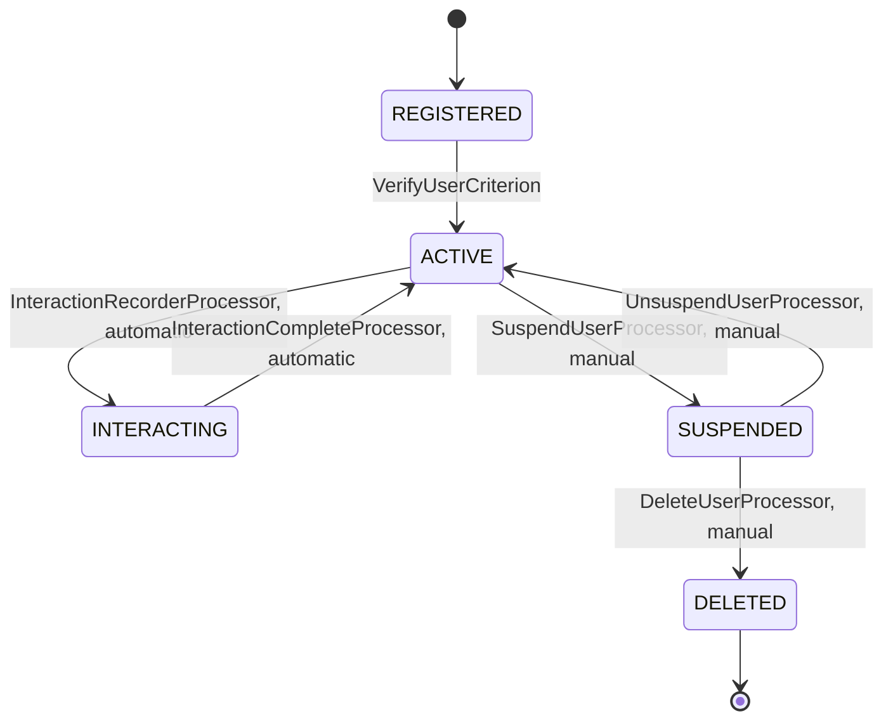

### 1. Entity Definitions

```
CoverPhoto:
- coverId: String (origin identifier from Fakerest)
- title: String (display title)
- bookId: String (related book id from source)
- imageUrl: String (location of image)
- fetchedAt: DateTime (when fetched)
- tags: List<String> (classification tags)
- status: String (active/archived/failed etc)
- metadata: Object (dimensions, size, mimeType)
- originPayload: Object (raw source payload)
- duplicateOf: String (coverId it duplicates or empty)
- ingestionJobId: String (technicalId of the ingestion job that created it)
- errorFlag: Boolean (true when validation/processing failed)
- processingAttempts: Integer (retry counter)
- lastProcessedAt: DateTime (last processing timestamp)

IngestionJob:
- jobName: String (human readable name)
- scheduledFor: DateTime (planned start time)
- startedAt: DateTime (actual start)
- finishedAt: DateTime (actual end)
- fetchedCount: Integer (total items fetched)
- newCount: Integer (new cover photos created)
- duplicateCount: Integer (duplicates detected)
- errorSummary: String (short summary of errors)
- status: String (PENDING/RUNNING/COMPLETED/FAILED)
- initiatedBy: String (scheduler/manual user id)
- runParameters: Object (options for this run)
- createdAt: DateTime (when job persisted)

User:
- userId: String (business user identifier)
- role: String (viewer/admin/etc)
- email: String (contact)
- preferences: Object (filters, display preferences)
- favorites: List<String> (list of coverIds)
- notificationPreferences: Object (which notifications to receive)
- createdAt: DateTime (registration time)
- lastActiveAt: DateTime (last activity)
- status: String (ACTIVE/SUSPENDED/DELETED)
```

Notes: Defaulting to 3 entities as none were explicitly provided. If you want more, name up to 10 and I will expand.

---

### 2. Entity workflows

CoverPhoto workflow:
1. Initial State: CoverPhoto persisted by IngestionJob with RECEIVED status (automatic event).
2. Validation: Validate metadata and image accessibility.
3. Deduplication: Check duplicates against existing CoverPhotos.
4. Enrichment: Derive tags/metadata (dimensions, thumbnails).
5. Publishing: If valid and not duplicate → mark ACTIVE.
6. Archival or Link: If duplicate → link to original and mark ARCHIVED.
7. Failure: If validation or enrichment fails after retries → mark FAILED and flag for manual review.

Mermaid state diagram


```mermaid
stateDiagram-v2
    [*] --> RECEIVED
    RECEIVED --> VALIDATING : ValidateMetadataProcessor, automatic
    VALIDATING --> CHECK_DUPLICATE : ValidateCompleteCriterion
    CHECK_DUPLICATE --> DEDUPLICATING : DeduplicateProcessor, automatic
    DEDUPLICATING --> ENRICHING : EnrichMetadataProcessor, automatic
    ENRICHING --> PUBLISHED : PublishProcessor, automatic
    DEDUPLICATING --> ARCHIVED : ArchiveDuplicateProcessor, automatic
    VALIDATING --> FAILED : ValidationFailureProcessor, automatic
    PUBLISHED --> [*]
    ARCHIVED --> [*]
    FAILED --> [*]
```

Processors and criteria for CoverPhoto:
- Processors: ValidateMetadataProcessor, DeduplicateProcessor, EnrichMetadataProcessor, PublishProcessor, ArchiveDuplicateProcessor, ValidationFailureProcessor
- Criteria: ValidateCompleteCriterion (ensure required fields present), DuplicateDetectedCriterion (search by imageUrl/hash)

IngestionJob workflow:
1. Initial State: IngestionJob created with PENDING (POST triggers event).
2. Start: Transition to RUNNING (scheduler or manual start).
3. Fetching: Call external source and fetch cover items.
4. Persist Items: For each fetched item persist CoverPhoto entity (this persistence triggers CoverPhoto workflow).
5. Aggregate: Count new/duplicate/errors as items are processed.
6. Complete: Set status to COMPLETED if success threshold met, or FAILED if critical errors.
7. Notify: Send summary notifications to admins if configured.

Mermaid state diagram


```mermaid
stateDiagram-v2
    [*] --> PENDING
    PENDING --> RUNNING : StartIngestionProcessor, automatic
    RUNNING --> FETCHING : FetchCoversProcessor, automatic
    FETCHING --> PERSISTING : PersistCoversProcessor, automatic
    PERSISTING --> AGGREGATING : AggregateResultsProcessor, automatic
    AGGREGATING --> COMPLETED : RunSuccessCriterion
    AGGREGATING --> FAILED : CriticalErrorCriterion
    COMPLETED --> NOTIFY_ADMINS : NotifyAdminProcessor, automatic
    FAILED --> NOTIFY_ADMINS : NotifyAdminProcessor, automatic
    NOTIFY_ADMINS --> [*]
```

Processors and criteria for IngestionJob:
- Processors: StartIngestionProcessor, FetchCoversProcessor, PersistCoversProcessor, AggregateResultsProcessor, NotifyAdminProcessor
- Criteria: RunSuccessCriterion (no critical errors), CriticalErrorCriterion (error rate above threshold)

User workflow:
1. Initial State: User created via POST → REGISTERED.
2. Activation: Automatic or manual verification moves REGISTERED → ACTIVE.
3. Interaction: ACTIVE users perform interactions (favorites, downloads) recorded by InteractionRecorderProcessor.
4. Suspension: Manual action by admin moves ACTIVE → SUSPENDED.
5. Deletion: Manual action moves to DELETED (terminal).

Mermaid state diagram


```mermaid
stateDiagram-v2
    [*] --> REGISTERED
    REGISTERED --> ACTIVE : VerifyUserCriterion
    ACTIVE --> INTERACTING : InteractionRecorderProcessor, automatic
    INTERACTING --> ACTIVE : InteractionCompleteProcessor, automatic
    ACTIVE --> SUSPENDED : SuspendUserProcessor, manual
    SUSPENDED --> ACTIVE : UnsuspendUserProcessor, manual
    SUSPENDED --> DELETED : DeleteUserProcessor, manual
    DELETED --> [*]
```

Processors and criteria for User:
- Processors: WelcomeNotificationProcessor, InteractionRecorderProcessor, PreferenceUpdateProcessor, SuspendUserProcessor
- Criteria: VerifyUserCriterion (email or admin verification), IsActiveCriterion

---

### 3. Pseudo code for processor classes

Note: Pseudo code outlines business logic executed when an entity persists; each processor runs as part of the entity workflow.

ValidateMetadataProcessor
```
class ValidateMetadataProcessor {
  void process(CoverPhoto cp) {
    if cp.imageUrl is missing or cp.title is missing then
      cp.errorFlag = true
      mark entity status = FAILED
    else
      set cp.metadata.basicChecked = true
      persist cp
    end
  }
}
```

DeduplicateProcessor
```
class DeduplicateProcessor {
  void process(CoverPhoto cp) {
    match = findExistingByImageHashOrUrl(cp.imageUrl, cp.metadata)
    if match found then
      cp.duplicateOf = match.coverId
      cp.status = ARCHIVED
    else
      cp.duplicateOf = null
    end
    persist cp
  }
}
```

EnrichMetadataProcessor
```
class EnrichMetadataProcessor {
  void process(CoverPhoto cp) {
    // derive dimensions, generate thumbnail metadata, categorize tags
    cp.metadata.dimensions = getImageDimensions(cp.imageUrl)
    cp.tags = deriveTagsFromTitleAndImage(cp.title, cp.metadata)
    persist cp
  }
}
```

PublishProcessor
```
class PublishProcessor {
  void process(CoverPhoto cp) {
    if !cp.errorFlag and cp.duplicateOf is null then
      cp.status = ACTIVE
      cp.publishedAt = now()
    else
      // leave archive or failed
    end
    persist cp
  }
}
```

FetchCoversProcessor (IngestionJob)
```
class FetchCoversProcessor {
  void process(IngestionJob job) {
    items = callExternalApi(job.runParameters)
    job.fetchedCount = items.length
    persist job
    for each item in items do
      create CoverPhoto entity with status RECEIVED and ingestionJobId = job.technicalId
      persist CoverPhoto // triggers CoverPhoto workflow
    end
  }
}
```

AggregateResultsProcessor
```
class AggregateResultsProcessor {
  void process(IngestionJob job) {
    job.newCount = countNewCoversLinkedToJob(job.technicalId)
    job.duplicateCount = countDuplicatesLinkedToJob(job.technicalId)
    job.errorSummary = summarizeErrors(job.technicalId)
    job.finishedAt = now()
    job.status = job.errorSummary.critical ? FAILED : COMPLETED
    persist job
  }
}
```

NotifyAdminProcessor
```
class NotifyAdminProcessor {
  void process(IngestionJob job) {
    if job.status == FAILED or job.errorSummary.thresholdExceeded then
      create admin notification (summary)
    end
  }
}
```

InteractionRecorderProcessor (User)
```
class InteractionRecorderProcessor {
  void process(User user, action) {
    record action (userId, coverId, actionType, timestamp)
    update user.lastActiveAt = now()
    persist user
  }
}
```

---

### 4. API Endpoints Design Rules

Rules applied:
- POST endpoints return only technicalId.
- GET endpoints return stored entity data.
- Orchestration entity (IngestionJob) has POST + GET by technicalId.
- User creation is via POST + GET by technicalId.
- CoverPhoto created by IngestionJob processing; GET by technicalId provided for retrieval.
- No GET by condition added (not explicitly requested).

Endpoints and JSON structures:

1) Create IngestionJob
- POST /ingestion-jobs
Request:
```json
{
  "jobName": "weekly-cover-fetch",
  "scheduledFor": "2025-08-23T02:00:00Z",
  "initiatedBy": "scheduler",
  "runParameters": {
    "source": "fakerest",
    "maxItems": 500
  }
}
```
Response:
```json
{
  "technicalId": "ingest-uuid-1234"
}
```

2) Get IngestionJob by technicalId
- GET /ingestion-jobs/{technicalId}
Response:
```json
{
  "technicalId": "ingest-uuid-1234",
  "jobName": "weekly-cover-fetch",
  "scheduledFor": "2025-08-23T02:00:00Z",
  "startedAt": "2025-08-23T02:00:05Z",
  "finishedAt": "2025-08-23T02:05:00Z",
  "fetchedCount": 120,
  "newCount": 100,
  "duplicateCount": 20,
  "errorSummary": "5 transient fetch errors",
  "status": "COMPLETED",
  "initiatedBy": "scheduler",
  "runParameters": {"source":"fakerest","maxItems":500},
  "createdAt": "2025-08-23T01:59:00Z"
}
```

3) Create User
- POST /users
Request:
```json
{
  "userId": "u-456",
  "email": "alice@example.com",
  "role": "viewer",
  "preferences": {"viewMode":"grid"}
}
```
Response:
```json
{
  "technicalId": "user-uuid-789"
}
```

4) Get User by technicalId
- GET /users/{technicalId}
Response:
```json
{
  "technicalId": "user-uuid-789",
  "userId": "u-456",
  "email": "alice@example.com",
  "role": "viewer",
  "preferences": {"viewMode":"grid"},
  "favorites": [],
  "notificationPreferences": {"dailySummary":true},
  "createdAt": "2025-08-01T12:00:00Z",
  "lastActiveAt": "2025-08-20T09:00:00Z",
  "status": "ACTIVE"
}
```

5) Get CoverPhoto by technicalId
- GET /coverphotos/{technicalId}
Response:
```json
{
  "technicalId": "cover-uuid-111",
  "coverId": "o-77",
  "title": "Example Cover",
  "bookId": "b-77",
  "imageUrl": "https://...",
  "fetchedAt": "2025-08-23T02:01:00Z",
  "tags": ["fiction"],
  "status": "ACTIVE",
  "metadata": {"dimensions":"600x800","size":12345},
  "originPayload": {},
  "duplicateOf": null,
  "ingestionJobId": "ingest-uuid-1234",
  "errorFlag": false,
  "processingAttempts": 1,
  "lastProcessedAt": "2025-08-23T02:02:00Z"
}
```

Optional:
- GET /coverphotos (all) can be provided for listing; not required by rules but allowed for UI.

---

If you want, next I can:
- Expand to additional entities (Report, Notification, ActionLog) up to 10.
- Tune criteria thresholds (error rates, duplicate matching logic).
- Add example admin notification payloads or sample ingestion schedules.

Which would you like to refine first?