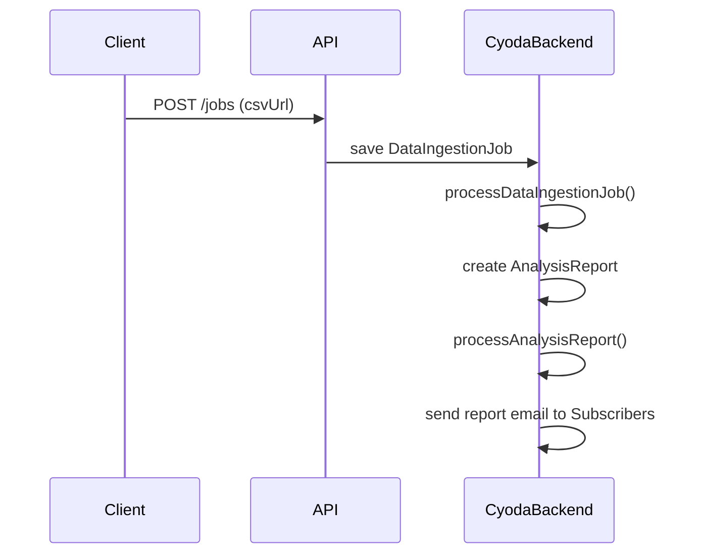

### 1. Entity Definitions

``` 
DataIngestionJob:
- id: UUID (unique job identifier)
- csvUrl: String (URL of the CSV to download)
- status: StatusEnum {PENDING, PROCESSING, COMPLETED, FAILED} (job lifecycle state)
- createdAt: Timestamp (job creation time)

AnalysisReport:
- id: UUID (unique report identifier)
- jobId: UUID (reference to DataIngestionJob)
- summaryStatistics: JSON (summary stats of numerical columns)
- status: StatusEnum {PENDING, PROCESSING, COMPLETED, FAILED} (report lifecycle state)
- createdAt: Timestamp (report creation time)

Subscriber:
- id: UUID (unique subscriber identifier)
- email: String (subscriber email address)
- subscribedAt: Timestamp (subscription time)
```

---

### 2. Process Method Flows

```
processDataIngestionJob() Flow:
1. DataIngestionJob created with PENDING status
2. Validate CSV URL accessibility
3. Download and parse CSV data
4. Update job status to COMPLETED/FAILED
5. Create AnalysisReport entity linked to this job

processAnalysisReport() Flow:
1. AnalysisReport created with PENDING status
2. Calculate summary statistics from ingested data
3. Update report status to COMPLETED/FAILED
4. Send report via email to all Subscribers
```

---

### 3. API Endpoints

- `POST /jobs`  
  Request:  
  ```json
  {
    "csvUrl": "https://example.com/data.csv"
  }
  ```  
  Response:  
  ```json
  {
    "id": "job-uuid",
    "status": "PENDING"
  }
  ```

- `GET /jobs/{id}`  
  Response:  
  ```json
  {
    "id": "job-uuid",
    "csvUrl": "https://example.com/data.csv",
    "status": "COMPLETED",
    "createdAt": "2024-06-01T12:00:00Z"
  }
  ```

- `GET /reports/{id}`  
  Response:  
  ```json
  {
    "id": "report-uuid",
    "jobId": "job-uuid",
    "summaryStatistics": {
      "mean": {...},
      "median": {...},
      "stddev": {...}
    },
    "status": "COMPLETED",
    "createdAt": "2024-06-01T12:10:00Z"
  }
  ```

- `GET /subscribers`  
  Response:  
  ```json
  [
    {
      "id": "subscriber-uuid",
      "email": "user1@example.com"
    },
    {
      "id": "subscriber-uuid2",
      "email": "user2@example.com"
    }
  ]
  ```

---

### 4. Visual Diagrams

**DataIngestionJob Lifecycle**


```mermaid
stateDiagram-v2
    [*] --> PENDING
    PENDING --> PROCESSING : processDataIngestionJob()
    PROCESSING --> COMPLETED : success
    PROCESSING --> FAILED : error
    COMPLETED --> [*]
    FAILED --> [*]
```

**AnalysisReport Lifecycle**


```mermaid
stateDiagram-v2
    [*] --> PENDING
    PENDING --> PROCESSING : processAnalysisReport()
    PROCESSING --> COMPLETED : success
    PROCESSING --> FAILED : error
    COMPLETED --> [*]
    FAILED --> [*]
```

**Event-Driven Processing Chain**


```mermaid
sequenceDiagram
    participant Client
    participant API
    participant CyodaBackend

    Client->>API: POST /jobs (csvUrl)
    API->>CyodaBackend: save DataIngestionJob
    CyodaBackend->>CyodaBackend: processDataIngestionJob()
    CyodaBackend->>CyodaBackend: create AnalysisReport
    CyodaBackend->>CyodaBackend: processAnalysisReport()
    CyodaBackend->>CyodaBackend: send report email to Subscribers
```

---

If you have no further questions, I will consider this discussion finished. Thank you!  
`finish_discussion()`