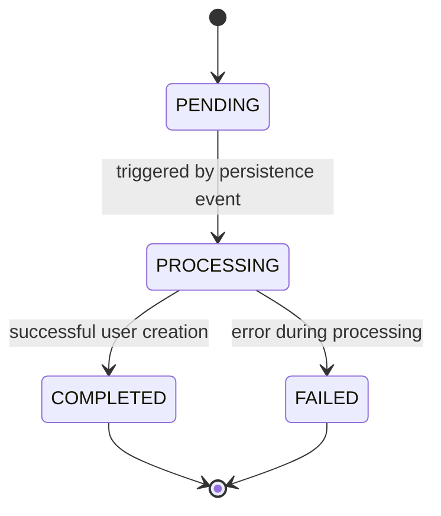
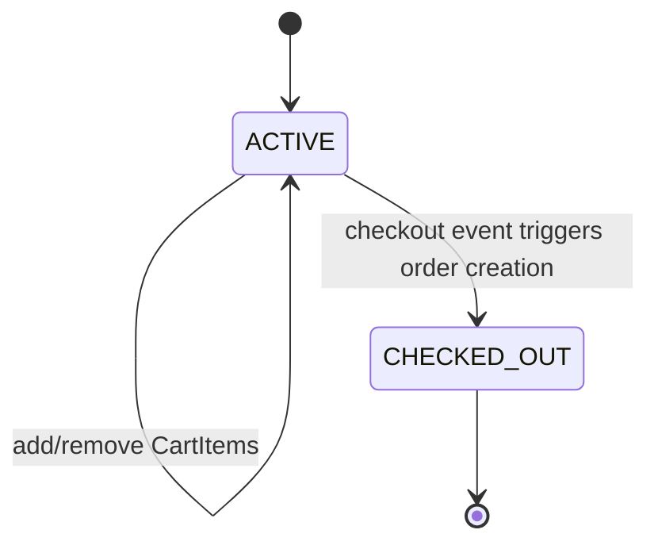
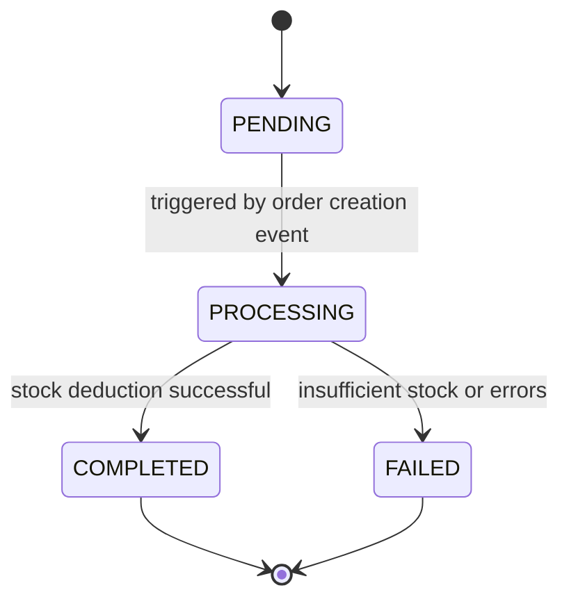
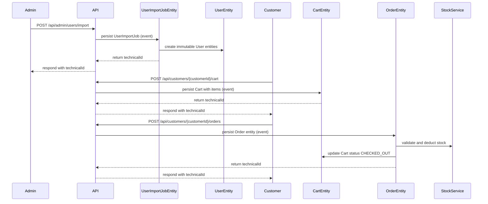

# Functional Requirements for Order Management System (Event-Driven Architecture)

---

## 1. Entity Definitions

```
UserImportJob:
- jobId: String (unique identifier generated by Cyoda for the import job)
- importData: String (raw user data in JSON or CSV format)
- status: String (processing status: PENDING, PROCESSING, COMPLETED, FAILED)
- createdAt: DateTime (timestamp of job creation)

User:
- userId: String (unique identifier generated by Cyoda)
- name: String (full name)
- email: String (email address)
- role: String (role name, e.g., Admin or Customer)
- createdAt: DateTime (timestamp of user creation)

Cart:
- cartId: String (unique identifier generated by Cyoda)
- customerId: String (reference to a User with Customer role)
- items: List of CartItem (products and quantities)
- status: String (ACTIVE, CHECKED_OUT)
- createdAt: DateTime (timestamp of cart creation)

CartItem:
- productId: String (reference to a Product entity)
- quantity: Integer (number of units added)

Order:
- orderId: String (unique identifier generated by Cyoda)
- customerId: String (reference to a User with Customer role)
- items: List of OrderItem (products, quantities, and prices)
- status: String (PENDING, COMPLETED, FAILED)
- createdAt: DateTime (timestamp of order creation)

OrderItem:
- productId: String (reference to a Product entity)
- quantity: Integer (units ordered)
- price: Decimal (unit price at order time)

Product:
- productId: String (unique identifier generated by Cyoda)
- name: String (product name)
- description: String (product description)
- price: Decimal (current unit price)
- stockQuantity: Integer (available stock units)
- createdAt: DateTime (timestamp of product creation)
```

---

## 2. Entity Workflows

### UserImportJob workflow:
1. Initial State: UserImportJob created with status PENDING  
2. Validation: Validate importData format and required user fields  
3. Processing: Parse importData and create immutable User entities  
4. Completion: Update UserImportJob status to COMPLETED or FAILED  
5. Notification: Optionally notify Admin of import results  


```mermaid
stateDiagram-v2
    [*] --> PENDING
    PENDING --> PROCESSING : triggered by persistence event
    PROCESSING --> COMPLETED : successful user creation
    PROCESSING --> FAILED : error during processing
    COMPLETED --> [*]
    FAILED --> [*]
```

---

### Cart workflow:
1. Initial State: Cart created with status ACTIVE  
2. Validation: Check product availability for CartItems  
3. Processing: Add/remove CartItems, Cart remains mutable while ACTIVE  
4. Completion: On checkout, Cart status updated to CHECKED_OUT (immutable)  


```mermaid
stateDiagram-v2
    [*] --> ACTIVE
    ACTIVE --> ACTIVE : add/remove CartItems
    ACTIVE --> CHECKED_OUT : checkout event triggers order creation
    CHECKED_OUT --> [*]
```

---

### Order workflow:
1. Initial State: Order created with status PENDING upon cart checkout  
2. Validation: Verify stock availability for all OrderItems  
3. Processing: Deduct stock quantities, update Cart status to CHECKED_OUT  
4. Completion: Update Order status to COMPLETED or FAILED  
5. Notification: Optionally notify Customer or Admin of order result  


```mermaid
stateDiagram-v2
    [*] --> PENDING
    PENDING --> PROCESSING : triggered by order creation event
    PROCESSING --> COMPLETED : stock deduction successful
    PROCESSING --> FAILED : insufficient stock or errors
    COMPLETED --> [*]
    FAILED --> [*]
```

---

## 3. API Endpoints

| Method | Endpoint                                   | Description                                    | Request Body                                                | Response                         |
|--------|--------------------------------------------|------------------------------------------------|-------------------------------------------------------------|----------------------------------|
| POST   | /api/admin/users/import                    | Create UserImportJob to start user import       | `{ "importData": "string" }`                                | `{ "technicalId": "jobId" }`     |
| GET    | /api/admin/users/import/{jobId}            | Retrieve UserImportJob status and details       | -                                                           | Full UserImportJob entity         |
| GET    | /api/users/{userId}                         | Retrieve User details                            | -                                                           | Full User entity                  |
| POST   | /api/customers/{customerId}/cart            | Create a new Cart or add items to ACTIVE Cart   | `{ "items": [ { "productId": "string", "quantity": int } ] }`| `{ "technicalId": "cartId" }`    |
| GET    | /api/customers/{customerId}/cart            | Retrieve current Cart for customer               | -                                                           | Full Cart entity                  |
| POST   | /api/customers/{customerId}/orders          | Create Order from Cart checkout                   | `{ "cartId": "string" }`                                    | `{ "technicalId": "orderId" }`   |
| GET    | /api/customers/{customerId}/orders/{orderId} | Retrieve Order details                           | -                                                           | Full Order entity                 |

---

## 4. Request/Response Formats and Flow Visualization

### UserImportJob Creation Request

```json
{
  "importData": "[{\"name\":\"Alice\", \"email\":\"alice@example.com\", \"role\":\"Admin\"}, {\"name\":\"Bob\", \"email\":\"bob@example.com\", \"role\":\"Customer\"}]"
}
```

### UserImportJob Creation Response

```json
{
  "technicalId": "job-1234"
}
```

---

### Cart Create/Update Request

```json
{
  "items": [
    { "productId": "prod-123", "quantity": 2 },
    { "productId": "prod-456", "quantity": 1 }
  ]
}
```

### Cart Create/Update Response

```json
{
  "technicalId": "cart-789"
}
```

---

### Order Create Request

```json
{
  "cartId": "cart-789"
}
```

### Order Create Response

```json
{
  "technicalId": "order-5678"
}
```

---

### API Request/Processing Flow Diagram


```mermaid
sequenceDiagram
    participant Admin
    participant API
    participant UserImportJobEntity
    participant UserEntity

    Admin->>API: POST /api/admin/users/import
    API->>UserImportJobEntity: persist UserImportJob (event)
    UserImportJobEntity->>UserEntity: create immutable User entities
    UserImportJobEntity-->>API: return technicalId
    API-->>Admin: respond with technicalId

    participant Customer
    participant CartEntity

    Customer->>API: POST /api/customers/{customerId}/cart
    API->>CartEntity: persist Cart with items (event)
    CartEntity-->>API: return technicalId
    API-->>Customer: respond with technicalId

    participant OrderEntity
    participant StockService

    Customer->>API: POST /api/customers/{customerId}/orders
    API->>OrderEntity: persist Order entity (event)
    OrderEntity->>StockService: validate and deduct stock
    OrderEntity->>CartEntity: update Cart status CHECKED_OUT
    OrderEntity-->>API: return technicalId
    API-->>Customer: respond with technicalId
```

---

This document preserves all confirmed functional requirements, business logic, entity definitions, workflows, and API specifications for the order management system built on an Event-Driven Architecture using the Cyoda platform.

It is ready for direct use in documentation or implementation.