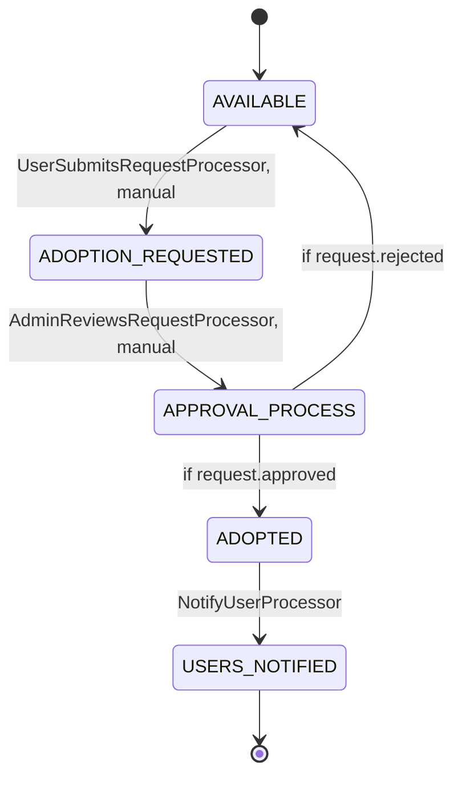
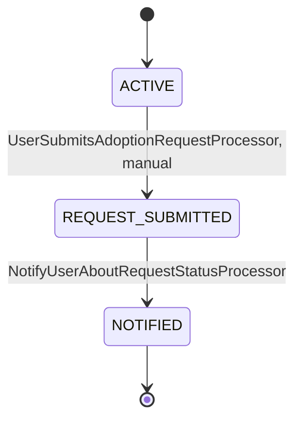
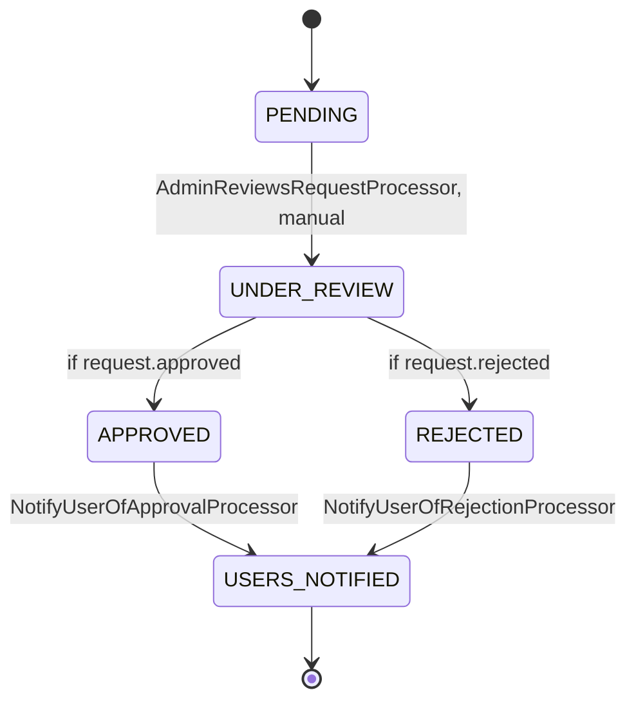

# Functional Requirements Document for 'Purrfect Pets' API App

This document outlines the functional requirements for the 'Purrfect Pets' API app using an Event-Driven Architecture (EDA) approach. It focuses on the business entities and workflows relevant to a pet adoption scenario.

## 1. Entity Definitions
```
Pet:
- id: String (Unique identifier for each pet)
- name: String (Name of the pet)
- type: String (Type of pet: Dog, Cat, etc.)
- age: Integer (Age of the pet)
- status: String (Current status: Available, Adopted, etc.)

User:
- id: String (Unique identifier for the user)
- name: String (Name of the user)
- email: String (Email address of the user)
- phone: String (Contact number of the user)

AdoptionRequest:
- id: String (Unique identifier for the adoption request)
- petId: String (ID of the pet being requested for adoption)
- userId: String (ID of the user requesting the adoption)
- status: String (Current status of the request: Pending, Approved, Rejected)
```

## 2. Entity Workflows

### Pet Workflow
1. Initial State: Pet created with AVAILABLE status
2. Adoption Request: User submits an adoption request
3. Approval Process: Admin reviews the request
4. Adoption Completion: Update pet status to ADOPTED if approved
5. Notification: Send confirmation to the user


```mermaid
stateDiagram-v2
    [*] --> AVAILABLE
    AVAILABLE --> ADOPTION_REQUESTED : UserSubmitsRequestProcessor, manual
    ADOPTION_REQUESTED --> APPROVAL_PROCESS : AdminReviewsRequestProcessor, manual
    APPROVAL_PROCESS --> ADOPTED : if request.approved
    APPROVAL_PROCESS --> AVAILABLE : if request.rejected
    ADOPTED --> USERS_NOTIFIED : NotifyUserProcessor
    USERS_NOTIFIED --> [*]
```

### User Workflow
1. Initial State: User created
2. Adoption Request: User submits a request for a pet
3. Notification: User receives updates on request status


```mermaid
stateDiagram-v2
    [*] --> ACTIVE
    ACTIVE --> REQUEST_SUBMITTED : UserSubmitsAdoptionRequestProcessor, manual
    REQUEST_SUBMITTED --> NOTIFIED : NotifyUserAboutRequestStatusProcessor
    NOTIFIED --> [*]
```

### Adoption Request Workflow
1. Initial State: Request created with PENDING status
2. Admin Review: Admin reviews the request
3. Completion: Update status to APPROVED/REJECTED based on admin decision
4. Notification: Notify user of request status


```mermaid
stateDiagram-v2
    [*] --> PENDING
    PENDING --> UNDER_REVIEW : AdminReviewsRequestProcessor, manual
    UNDER_REVIEW --> APPROVED : if request.approved
    UNDER_REVIEW --> REJECTED : if request.rejected
    APPROVED --> USERS_NOTIFIED : NotifyUserOfApprovalProcessor
    REJECTED --> USERS_NOTIFIED : NotifyUserOfRejectionProcessor
    USERS_NOTIFIED --> [*]
```

## 3. Pseudo Code for Each Processor Class
```java
class UserSubmitsRequestProcessor {
    void process(AdoptionRequest request) {
        // Validate user and pet details
        // Trigger adoption request workflow
    }
}

class AdminReviewsRequestProcessor {
    void process(AdoptionRequest request) {
        // Review adoption request
        // Update request status based on review
    }
}

class NotifyUserProcessor {
    void process(User user, AdoptionRequest request) {
        // Send notification to user about request status
    }
}
```

## 4. API Endpoints Design Rules
- **POST /pets**: Create a new pet.
  - Request:
  ```json
  {
      "name": "Fluffy",
      "type": "Cat",
      "age": 2,
      "status": "Available"
  }
  ```
  - Response:
  ```json
  {
      "technicalId": "pet1234"
  }
  ```

- **POST /users**: Create a new user.
  - Request:
  ```json
  {
      "name": "John Doe",
      "email": "john@example.com",
      "phone": "1234567890"
  }
  ```
  - Response:
  ```json
  {
      "technicalId": "user5678"
  }
  ```

- **POST /adoptionRequests**: Create a new adoption request.
  - Request:
  ```json
  {
      "petId": "pet1234",
      "userId": "user5678"
  }
  ```
  - Response:
  ```json
  {
      "technicalId": "request91011"
  }
  ```

- **GET /pets/{technicalId}**: Retrieve pet details by technicalId.
- **GET /users/{technicalId}**: Retrieve user details by technicalId.
- **GET /adoptionRequests/{technicalId}**: Retrieve adoption request details by technicalId.

This document provides a comprehensive foundation for the 'Purrfect Pets' API app and is suitable for direct use in documentation or implementation.