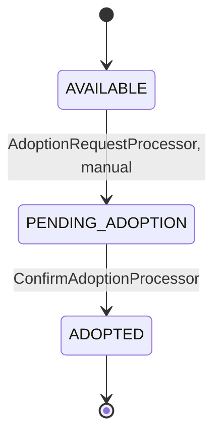
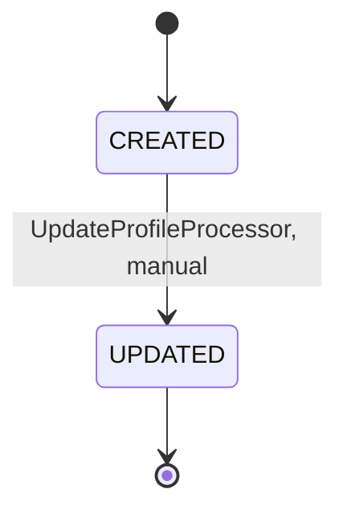
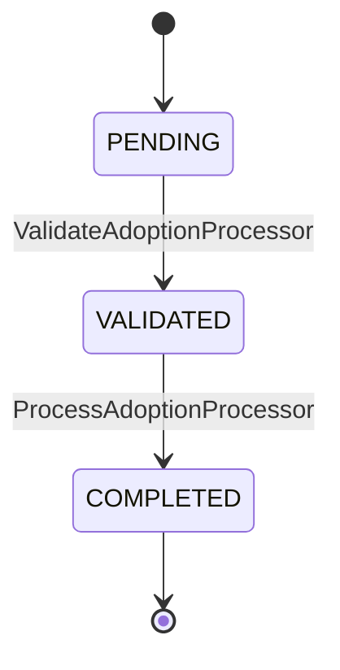

```markdown
# Functional Requirements for Purrfect Pets API App

Based on the requirement to build the "Purrfect Pets" API app, the following functional requirements are defined using an Event-Driven Architecture (EDA) approach, focusing on essential entities and their workflows.

### 1. Entity Definitions
```
Pet:
- id: String (unique identifier for each pet)
- name: String (name of the pet)
- type: String (type of the pet, e.g., cat, dog)
- breed: String (breed of the pet)
- age: Integer (age of the pet)
- status: String (availability status, e.g., available, adopted)

User:
- id: String (unique identifier for each user)
- name: String (name of the user)
- email: String (email address of the user)
- phone: String (contact number of the user)

Adoption:
- id: String (unique identifier for each adoption)
- userId: String (the user adopting the pet)
- petId: String (the pet being adopted)
- status: String (current status of the adoption, e.g., pending, completed)
```

### 2. Entity Workflows

**Pet workflow:**
1. Initial State: Pet is created with AVAILABLE status.
2. Adoption Request: User requests to adopt the pet.
3. Transition: Pet status updates to PENDING_ADOPTION.
4. Completion: Update status to ADOPTED once the adoption is confirmed.
5. Notification: Notify the user about the adoption status.


```mermaid
stateDiagram-v2
    [*] --> AVAILABLE
    AVAILABLE --> PENDING_ADOPTION : AdoptionRequestProcessor, manual
    PENDING_ADOPTION --> ADOPTED : ConfirmAdoptionProcessor
    ADOPTED --> [*]
```

**User workflow:**
1. Initial State: User is created.
2. Profile Update: User updates their profile (manual).
3. Notification: Notify the user about changes in pet availability (automatic).


```mermaid
stateDiagram-v2
    [*] --> CREATED
    CREATED --> UPDATED : UpdateProfileProcessor, manual
    UPDATED --> [*]
```

**Adoption workflow:**
1. Initial State: Adoption created with PENDING status.
2. Validation: Validate user and pet details.
3. Processing: Complete the adoption process.
4. Completion: Update status to COMPLETED.
5. Notification: Notify the user about the successful adoption.


```mermaid
stateDiagram-v2
    [*] --> PENDING
    PENDING --> VALIDATED : ValidateAdoptionProcessor
    VALIDATED --> COMPLETED : ProcessAdoptionProcessor
    COMPLETED --> [*]
```

### 3. Pseudo Code for Processor Classes
```java
class AdoptionRequestProcessor {
    void process(Adoption adoption) {
        // Logic for processing adoption requests
        // Update pet status to PENDING_ADOPTION
    }
}

class ConfirmAdoptionProcessor {
    void process(Adoption adoption) {
        // Logic for confirming adoption
        // Update pet status to ADOPTED
    }
}

class UpdateProfileProcessor {
    void process(User user) {
        // Logic for updating user profile
    }
}

class ValidateAdoptionProcessor {
    void process(Adoption adoption) {
        // Logic for validating the adoption details
    }
}

class ProcessAdoptionProcessor {
    void process(Adoption adoption) {
        // Logic for finalizing the adoption process
        // Update adoption status to COMPLETED
    }
}
```

### 4. API Endpoints Design Rules
- **POST /pets**: Create a new pet (returns `technicalId`).
- **GET /pets/{technicalId}**: Retrieve a pet by technicalId.
- **POST /users**: Create a new user (returns `technicalId`).
- **GET /users/{technicalId}**: Retrieve a user by technicalId.
- **POST /adoptions**: Create a new adoption (returns `technicalId`).
- **GET /adoptions/{technicalId}**: Retrieve an adoption by technicalId.

#### Request/Response Formats:
```json
// Example for creating a new pet
{
  "name": "Fluffy",
  "type": "Cat",
  "breed": "Persian",
  "age": 2,
  "status": "available"
}

// Response for creating a new pet
{
  "technicalId": "12345"
}
```

This structure ensures events trigger the appropriate workflows, simulating a realistic adoption process in the "Purrfect Pets" application.
```