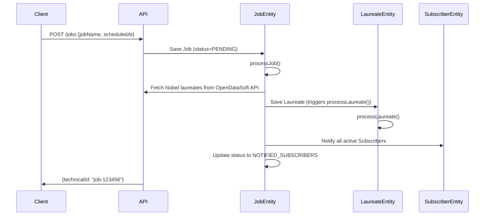
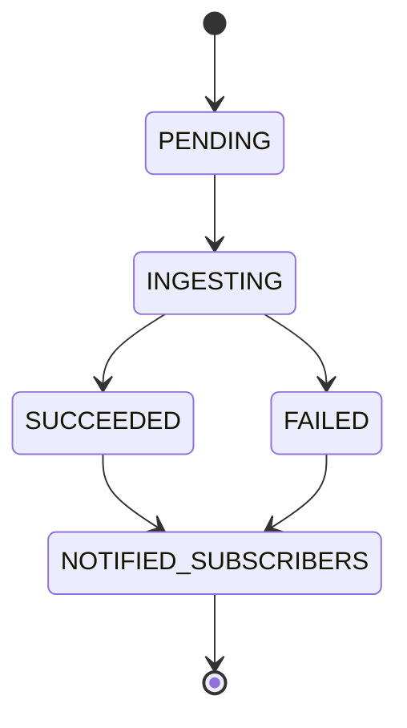

### 1. Entity Definitions

```
Job:
- jobName: String (name or identifier of the ingestion job)
- status: String (current job status, e.g., PENDING, INGESTING, SUCCEEDED, FAILED, NOTIFIED_SUBSCRIBERS)
- scheduledAt: String (ISO-8601 datetime when job is scheduled)
- startedAt: String (ISO-8601 datetime when job started)
- finishedAt: String (ISO-8601 datetime when job finished)
- resultSummary: String (summary or message of job outcome)

Laureate:
- laureateId: Integer (unique id from data source)
- firstname: String (laureate first name)
- surname: String (laureate surname)
- gender: String (gender of laureate)
- born: String (ISO-8601 date of birth)
- died: String (ISO-8601 date of death or null)
- borncountry: String (country of birth)
- borncountrycode: String (country code of birth)
- borncity: String (city of birth)
- year: String (award year)
- category: String (prize category)
- motivation: String (award motivation)
- affiliationName: String (affiliation institution name)
- affiliationCity: String (affiliation city)
- affiliationCountry: String (affiliation country)

Subscriber:
- subscriberName: String (name or identifier for subscriber)
- contactType: String (e.g., EMAIL, WEBHOOK)
- contactAddress: String (email address or webhook URL)
- active: Boolean (subscriber active status)
```

---

### 2. Process Method Flows

```
processJob() Flow:
1. Initial State: Job entity saved with status = PENDING
2. Validation: Validate job information and schedule constraints
3. Processing: 
   - Fetch Nobel laureates data from OpenDataSoft API
   - For each laureate record, create an immutable Laureate entity triggering processLaureate()
4. Completion: Update Job status to SUCCEEDED or FAILED based on ingestion result
5. Notification: Create notification events or messages to all active Subscribers,
   then update Job status to NOTIFIED_SUBSCRIBERS
```

```
processLaureate() Flow:
1. Validation: Check required fields (firstname, surname, year, category) via checkLaureateValid()
2. Enrichment: Normalize fields such as country codes, calculate derived data if needed
3. Persistence: Save Laureate entity immutably (no updates)
4. Optional Filtering: (If applicable) Flag laureates matching recent years or categories
5. Notification Trigger: Trigger notification event to Subscribers related to this Laureate
```

```
processSubscriber() Flow:
1. Validation: Validate contactType and contactAddress formats
2. Persistence: Save Subscriber entity immutably
3. Activation: Ensure Subscriber is active before receiving notifications
```

---

### 3. API Endpoints Design

| HTTP Method | Endpoint                    | Description                                     | Request Body                      | Response                     |
|-------------|-----------------------------|------------------------------------------------|---------------------------------|------------------------------|
| POST        | /jobs                      | Create a new ingestion Job (triggers processJob) | `{ jobName, scheduledAt }`       | `{ technicalId }`             |
| GET         | /jobs/{technicalId}        | Retrieve Job details by technicalId             | N/A                             | Full Job entity details       |
| POST        | /subscribers               | Register a new Subscriber                        | `{ subscriberName, contactType, contactAddress, active }` | `{ technicalId }`             |
| GET         | /subscribers/{technicalId} | Retrieve Subscriber details by technicalId      | N/A                             | Full Subscriber entity details|
| GET         | /subscribers               | (Optional) Retrieve all Subscribers              | N/A                             | List of Subscriber entities   |
| GET         | /laureates/{technicalId}   | Retrieve Laureate details by technicalId        | N/A                             | Full Laureate entity details  |
| GET         | /laureates                 | (Optional) Retrieve Laureates by conditions (e.g., year, category) if explicitly requested | Query params (e.g., year=2019) | List of Laureate entities     |

---

### 4. Request/Response Formats

**POST /jobs**  
Request:
```json
{
  "jobName": "NobelIngestionJob-2024-06-20",
  "scheduledAt": "2024-06-20T10:00:00Z"
}
```
Response:
```json
{
  "technicalId": "job-123456"
}
```

**GET /jobs/{technicalId}**  
Response:
```json
{
  "jobName": "NobelIngestionJob-2024-06-20",
  "status": "NOTIFIED_SUBSCRIBERS",
  "scheduledAt": "2024-06-20T10:00:00Z",
  "startedAt": "2024-06-20T10:01:00Z",
  "finishedAt": "2024-06-20T10:05:00Z",
  "resultSummary": "Ingested 15 laureates successfully"
}
```

**POST /subscribers**  
Request:
```json
{
  "subscriberName": "ResearchDept",
  "contactType": "EMAIL",
  "contactAddress": "research@example.com",
  "active": true
}
```
Response:
```json
{
  "technicalId": "subscriber-98765"
}
```

**GET /subscribers/{technicalId}**  
Response:
```json
{
  "subscriberName": "ResearchDept",
  "contactType": "EMAIL",
  "contactAddress": "research@example.com",
  "active": true
}
```

**GET /laureates/{technicalId}**  
Response:
```json
{
  "laureateId": 853,
  "firstname": "Akira",
  "surname": "Suzuki",
  "gender": "male",
  "born": "1930-09-12",
  "died": null,
  "borncountry": "Japan",
  "borncountrycode": "JP",
  "borncity": "Mukawa",
  "year": "2010",
  "category": "Chemistry",
  "motivation": "for palladium-catalyzed cross couplings in organic synthesis",
  "affiliationName": "Hokkaido University",
  "affiliationCity": "Sapporo",
  "affiliationCountry": "Japan"
}
```

---

### 5. Mermaid Visualizations


```mermaid
sequenceDiagram
  participant Client
  participant API
  participant JobEntity
  participant LaureateEntity
  participant SubscriberEntity

  Client->>API: POST /jobs {jobName, scheduledAt}
  API->>JobEntity: Save Job (status=PENDING)
  JobEntity->>JobEntity: processJob()
  JobEntity->>API: Fetch Nobel laureates from OpenDataSoft API
  JobEntity->>LaureateEntity: Save Laureate (triggers processLaureate())
  LaureateEntity->>LaureateEntity: processLaureate()
  JobEntity->>SubscriberEntity: Notify all active Subscribers
  JobEntity->>JobEntity: Update status to NOTIFIED_SUBSCRIBERS
  API->>Client: {technicalId: "job-123456"}
```


```mermaid
stateDiagram-v2
  [*] --> PENDING
  PENDING --> INGESTING
  INGESTING --> SUCCEEDED
  INGESTING --> FAILED
  SUCCEEDED --> NOTIFIED_SUBSCRIBERS
  FAILED --> NOTIFIED_SUBSCRIBERS
  NOTIFIED_SUBSCRIBERS --> [*]
```