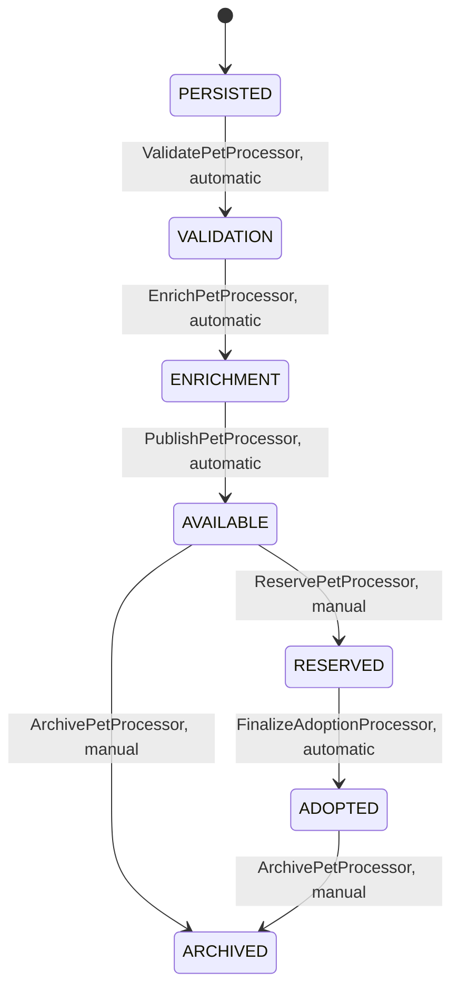
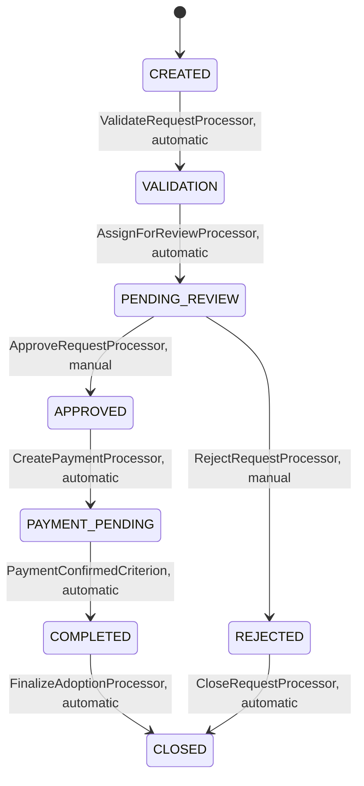
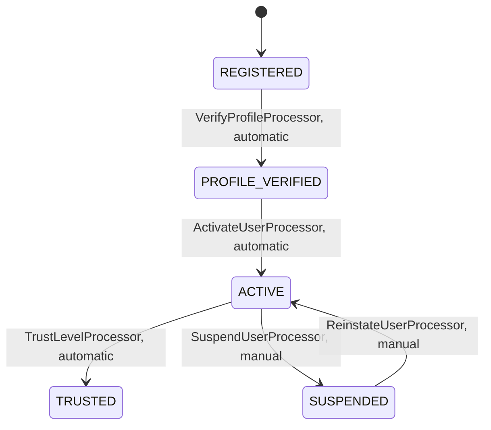

### 1. Entity Definitions
```
Pet:
- petId: String (external catalog id from Petstore)
- name: String (pet name)
- species: String (cat/dog/etc.)
- breed: String (breed description)
- age: Integer (years)
- status: String (Available/Reserved/Adopted/Archived)
- healthRecords: Array<String> (short health notes)
- images: Array<String> (image URLs)
- source: String (origin e.g. Petstore API)
- createdAt: DateTime (ingestion time)
- metadata: Object (freeform data)

User:
- userId: String (business id)
- fullName: String (user name)
- email: String (contact)
- phone: String (contact phone)
- address: String (primary address)
- registeredAt: DateTime
- preferences: Object (pet preferences)
- adoptedPetIds: Array<String> (linked petIds)
- status: String (Registered/Active/Suspended)

AdoptionRequest:
- requestId: String (business id)
- petId: String (target petId)
- userId: String (requester)
- requestedAt: DateTime
- status: String (CREATED/PENDING_REVIEW/APPROVED/REJECTED/PAYMENT_PENDING/COMPLETED/CLOSED)
- homeVisitRequired: Boolean
- adoptionFee: Number
- paymentStatus: String (NOT_PAID/PENDING/PAID)
- notes: String
```

### 2. Entity workflows

Pet workflow:
1. Initial State: PERSISTED (pet added from Petstore or manually)
2. Validation: Validate data completeness and health basic checks
3. Enrichment: Add images, breed info, tags
4. Available: Published for adoption
5. Reserved: Temporarily held for an AdoptionRequest
6. Adopted: Adoption finalized
7. Archived: Removed or retired


```mermaid
stateDiagram-v2
    [*] --> PERSISTED
    PERSISTED --> VALIDATION : ValidatePetProcessor, automatic
    VALIDATION --> ENRICHMENT : EnrichPetProcessor, automatic
    ENRICHMENT --> AVAILABLE : PublishPetProcessor, automatic
    AVAILABLE --> RESERVED : ReservePetProcessor, manual
    RESERVED --> ADOPTED : FinalizeAdoptionProcessor, automatic
    AVAILABLE --> ARCHIVED : ArchivePetProcessor, manual
    ADOPTED --> ARCHIVED : ArchivePetProcessor, manual
```

Pet processors/criteria:
- Processors: ValidatePetProcessor, EnrichPetProcessor, PublishPetProcessor, ReservePetProcessor, FinalizeAdoptionProcessor, ArchivePetProcessor
- Criteria: IsDataCompleteCriterion, IsHealthyCriterion

AdoptionRequest workflow:
1. Initial State: CREATED (POST triggers event)
2. Validation: Check user eligibility and pet availability
3. Pending Review: Human review for home visit / extra checks
4. Approved/Rejected: Manual decision
5. Payment Pending: If approved, create payment
6. Completed: Payment received and adoption finalized
7. Closed: Final state


```mermaid
stateDiagram-v2
    [*] --> CREATED
    CREATED --> VALIDATION : ValidateRequestProcessor, automatic
    VALIDATION --> PENDING_REVIEW : AssignForReviewProcessor, automatic
    PENDING_REVIEW --> APPROVED : ApproveRequestProcessor, manual
    PENDING_REVIEW --> REJECTED : RejectRequestProcessor, manual
    APPROVED --> PAYMENT_PENDING : CreatePaymentProcessor, automatic
    PAYMENT_PENDING --> COMPLETED : PaymentConfirmedCriterion, automatic
    COMPLETED --> CLOSED : FinalizeAdoptionProcessor, automatic
    REJECTED --> CLOSED : CloseRequestProcessor, automatic
```

AdoptionRequest processors/criteria:
- Processors: ValidateRequestProcessor, AssignForReviewProcessor, ApproveRequestProcessor, RejectRequestProcessor, CreatePaymentProcessor, FinalizeAdoptionProcessor, CloseRequestProcessor
- Criteria: AgeEligibilityCriterion, PaymentConfirmedCriterion

User workflow:
1. Initial State: REGISTERED (user signed up)
2. Profile Verified: Basic identity/email verification
3. Active: Can request adoptions
4. Trusted: Elevated after successful adoptions
5. Suspended: Manual action for policy violations
6. Reinstated: Manual return to Active


```mermaid
stateDiagram-v2
    [*] --> REGISTERED
    REGISTERED --> PROFILE_VERIFIED : VerifyProfileProcessor, automatic
    PROFILE_VERIFIED --> ACTIVE : ActivateUserProcessor, automatic
    ACTIVE --> TRUSTED : TrustLevelProcessor, automatic
    ACTIVE --> SUSPENDED : SuspendUserProcessor, manual
    SUSPENDED --> ACTIVE : ReinstateUserProcessor, manual
```

User processors/criteria:
- Processors: VerifyProfileProcessor, ActivateUserProcessor, TrustLevelProcessor, SuspendUserProcessor, ReinstateUserProcessor
- Criteria: IdentityVerifiedCriterion, PastBehaviorCriterion

### 3. Pseudo code for processor classes
```pseudo
// ValidatePetProcessor
process(pet):
  if not IsDataCompleteCriterion(pet): mark pet.status = "NEEDS_INFO" else mark valid
  emit event PetValidated

// ReservePetProcessor (manual trigger from an AdoptionRequest)
process(pet, request):
  if pet.status == "Available":
    pet.status = "Reserved"
    pet.metadata.reservedBy = request.requestId
    emit event PetReserved

// FinalizeAdoptionProcessor
process(adoptionRequest):
  if PaymentConfirmedCriterion(adoptionRequest):
    update pet.status = "Adopted"
    add petId to user.adoptedPetIds
    adoptionRequest.status = "COMPLETED"
    emit event AdoptionCompleted
```

### 4. API Endpoints Design Rules (functional)
- POST /pets
  - Purpose: persist a Pet (triggers Pet workflow)
  - Request returns only technicalId
```json
// Request
{
  "petId":"ext-123",
  "name":"Mittens",
  "species":"Cat",
  "breed":"Tabby",
  "age":2,
  "healthRecords":["vaccinated"],
  "images":["https://..."],
  "source":"PetstoreAPI"
}
// Response
{
  "technicalId":"pet_abc123"
}
```

- GET /pets/{technicalId}
```json
// Response
{
  "technicalId":"pet_abc123",
  "petId":"ext-123",
  "name":"Mittens",
  "species":"Cat",
  "breed":"Tabby",
  "age":2,
  "status":"Available",
  "healthRecords":["vaccinated"],
  "images":["https://..."],
  "source":"PetstoreAPI",
  "createdAt":"2025-08-28T12:00:00Z",
  "metadata":{}
}
```

- POST /users
  - Persist user, triggers User workflow
```json
// Request
{
  "userId":"u_001",
  "fullName":"Ava Smith",
  "email":"ava@example.com",
  "phone":"555-0100",
  "address":"123 Cat Ln"
}
// Response
{
  "technicalId":"user_xyz789"
}
```

- GET /users/{technicalId} — returns stored user

- POST /adoptionRequests
  - Persist adoption request, triggers AdoptionRequest workflow
```json
// Request
{
  "requestId":"r_1001",
  "petId":"ext-123",
  "userId":"u_001",
  "homeVisitRequired":true,
  "adoptionFee":50.0
}
// Response
{
  "technicalId":"req_mno456"
}
```

- GET /adoptionRequests/{technicalId} — returns stored request

Notes (API rules):
- All POSTs return only technicalId.
- All entities created via POST have GET by technicalId.
- GET by non-technical fields not included (only add if you request it).
- POST actions are events that start Cyoda entity workflows described above.

Would you like to add Payment or Review as extra entities, or adjust any workflow states (e.g., add an automated background health-check job) before I finalize this into a Cyoda-ready requirement set?