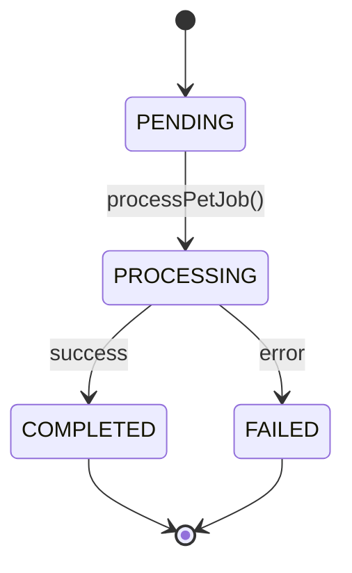
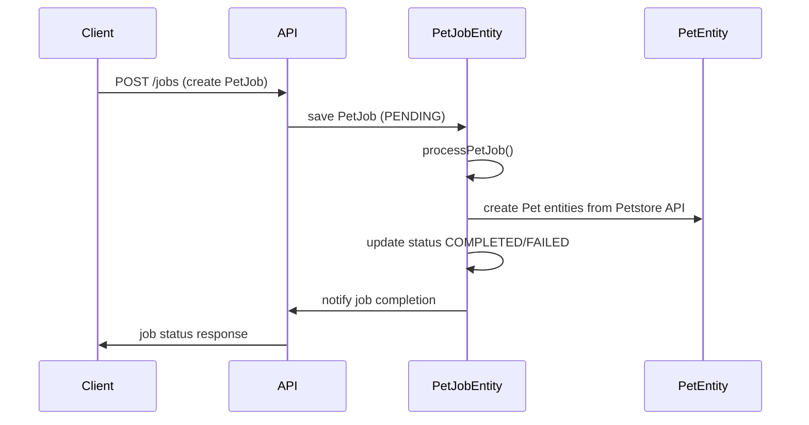
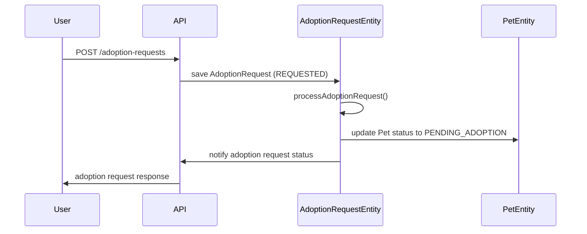

Certainly! Here is the well-formatted final version of your functional requirements for the "Purrfect Pets" API app using Event-Driven Architecture on Cyoda:

---

### 1. Entity Definitions

``` 
PetJob:
- id: String (unique identifier for the job)
- requestType: String (e.g., FETCH_ALL, FETCH_BY_TYPE)
- petType: String (optional, filter like "cat", "dog")
- status: StatusEnum (PENDING, PROCESSING, COMPLETED, FAILED)
- createdAt: DateTime (job creation timestamp)
- resultCount: Integer (number of pets retrieved)

Pet:
- id: Long (unique Petstore API pet ID)
- name: String (pet's name)
- category: String (e.g., cat, dog, bird)
- photoUrls: List<String> (pictures of the pet)
- tags: List<String> (optional tags)
- status: StatusEnum (AVAILABLE, PENDING_ADOPTION, ADOPTED)

AdoptionRequest:
- id: String (unique identifier for adoption request)
- petId: Long (reference to Pet)
- requesterName: String (name of the potential adopter)
- contactInfo: String (email or phone)
- status: StatusEnum (REQUESTED, APPROVED, REJECTED)
- requestedAt: DateTime (timestamp)
```

---

### 2. Process Method Flows

```
processPetJob() Flow:
1. Initial State: PetJob created with PENDING status.
2. Validation: Verify requestType and petType values.
3. Processing: Call Petstore API to retrieve pets according to requestType and petType.
4. Persistence: Save retrieved Pet entities.
5. Completion: Update PetJob status to COMPLETED or FAILED.
6. Notification: (Optional) Notify API client of job completion.

processAdoptionRequest() Flow:
1. Initial State: AdoptionRequest created with REQUESTED status.
2. Validation: Confirm petId exists and is AVAILABLE.
3. Processing: Update Pet status to PENDING_ADOPTION.
4. Decision: Await manual or automated approval step (outside current scope).
5. Completion: AdoptionRequest status updated to APPROVED or REJECTED.
6. Notification: Inform requester about adoption status.
```

---

### 3. API Endpoints Design

| Method | Path               | Purpose                             | Request Body Example                                         | Response Example                                |
|--------|--------------------|-----------------------------------|--------------------------------------------------------------|-------------------------------------------------|
| POST   | /jobs              | Create PetJob (triggers pet data fetch) | `{ "requestType": "FETCH_ALL" }`                             | `{ "id": "job123", "status": "PENDING" }`       |
| GET    | /pets              | Retrieve stored pets               | N/A                                                          | `[ { "id": 1, "name": "Whiskers", "category": "cat", ... } ]` |
| POST   | /adoption-requests | Create AdoptionRequest             | `{ "petId": 1, "requesterName": "Alice", "contactInfo": "alice@example.com" }` | `{ "id": "req456", "status": "REQUESTED" }`     |
| GET    | /adoption-requests | Retrieve adoption requests         | N/A                                                          | `[ { "id": "req456", "petId": 1, "status": "REQUESTED", ... } ]` |

---

### 4. Request/Response JSON Formats

**Create PetJob Request:**

```json
{
  "requestType": "FETCH_ALL",
  "petType": "cat" // optional
}
```

**Create PetJob Response:**

```json
{
  "id": "job123",
  "status": "PENDING"
}
```

**Create AdoptionRequest Request:**

```json
{
  "petId": 1,
  "requesterName": "Alice",
  "contactInfo": "alice@example.com"
}
```

**Create AdoptionRequest Response:**

```json
{
  "id": "req456",
  "status": "REQUESTED"
}
```

---

### Mermaid Diagrams

**Entity Lifecycle State Diagram for PetJob**


```mermaid
stateDiagram-v2
    [*] --> PENDING
    PENDING --> PROCESSING : processPetJob()
    PROCESSING --> COMPLETED : success
    PROCESSING --> FAILED : error
    COMPLETED --> [*]
    FAILED --> [*]
```

**Event-Driven Processing Chain**


```mermaid
sequenceDiagram
    participant Client
    participant API
    participant PetJobEntity
    participant PetEntity
    Client->>API: POST /jobs (create PetJob)
    API->>PetJobEntity: save PetJob (PENDING)
    PetJobEntity->>PetJobEntity: processPetJob()
    PetJobEntity->>PetEntity: create Pet entities from Petstore API
    PetJobEntity->>PetJobEntity: update status COMPLETED/FAILED
    PetJobEntity->>API: notify job completion
    API->>Client: job status response
```

**User Interaction Sequence: Adoption Request**


```mermaid
sequenceDiagram
    participant User
    participant API
    participant AdoptionRequestEntity
    participant PetEntity
    User->>API: POST /adoption-requests
    API->>AdoptionRequestEntity: save AdoptionRequest (REQUESTED)
    AdoptionRequestEntity->>AdoptionRequestEntity: processAdoptionRequest()
    AdoptionRequestEntity->>PetEntity: update Pet status to PENDING_ADOPTION
    AdoptionRequestEntity->>API: notify adoption request status
    API->>User: adoption request response
```

---

If you need any further customization or additional entities later on, feel free to ask. Wishing you a smooth and fun build with your "Purrfect Pets" API!

