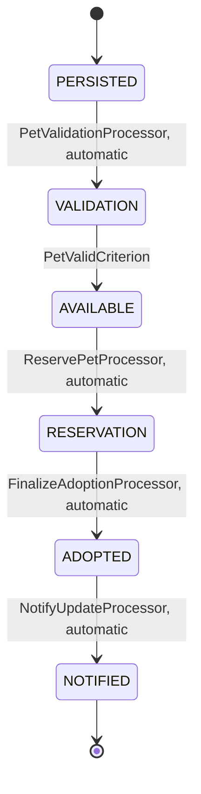
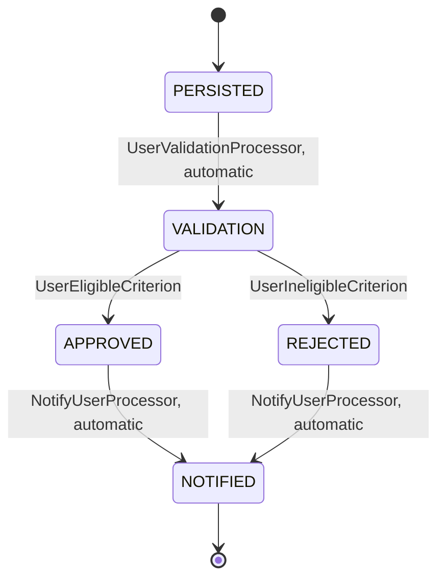
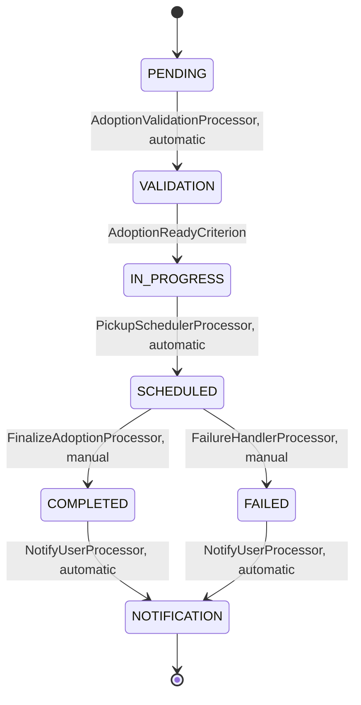

Quick clarifying questions before I draft the EDA requirements (functionality only):
1. Do you want the system to import Petstore API data automatically (as an ingest job) or will Pets be created only via adoption flows?
2. Should adoptions require manual admin approval, or be fully automated if user & pet are eligible?
3. Do you want notifications (email/SMS) or just status updates stored in the system?

Answer any of the above and I will tailor the flows. Meanwhile I assume: automatic Petstore import possible, adoptions can be auto or manual (configurable), and notifications are recorded.

### 1. Entity Definitions
```
Pet:
- id: String (unique business id from source)
- name: String (pet name)
- species: String (cat, dog, etc.)
- breed: String (breed info)
- ageMonths: Integer (age in months)
- status: String (AVAILABLE, RESERVED, ADOPTED - stored as string)
- ownerUserId: String (user id when adopted or null)
- healthNotes: String (short health description)

User:
- id: String (unique user id)
- fullName: String (user display name)
- email: String (contact)
- phone: String (optional)
- preferences: String (preferred species/breed etc.)
- isVerified: Boolean (user verified flag)
- notes: String (admin notes)

AdoptionJob:
- jobName: String (human label)
- jobType: String (ADOPT or IMPORT)
- userId: String (requesting user id, for ADOPT)
- petId: String (target pet id, for ADOPT)
- requestedAt: String (ISO datetime)
- status: String (PENDING, VALIDATED, IN_PROGRESS, SCHEDULED, COMPLETED, FAILED)
- resultNotes: String (summary or reason)
```

### 2. Entity workflows

Pet workflow:
1. Initial State: PERSISTED (created via ingestion or process)
2. Validation: Validate pet data
3. AVAILABLE: Pet ready for adoption
4. RESERVATION: Reserved by a job
5. ADOPTED: Adoption completed
6. NOTIFIED: Notification recorded

```mermaid
stateDiagram-v2
    [*] --> PERSISTED
    PERSISTED --> VALIDATION : PetValidationProcessor, automatic
    VALIDATION --> AVAILABLE : PetValidCriterion
    AVAILABLE --> RESERVATION : ReservePetProcessor, automatic
    RESERVATION --> ADOPTED : FinalizeAdoptionProcessor, automatic
    ADOPTED --> NOTIFIED : NotifyUpdateProcessor, automatic
    NOTIFIED --> [*]
```
Pet processors/criteria:
- Processors: PetValidationProcessor, ReservePetProcessor, FinalizeAdoptionProcessor, NotifyUpdateProcessor
- Criteria: PetValidCriterion, PetAvailableCriterion

User workflow:
1. Initial State: PERSISTED
2. Validation: Verify user info
3. APPROVED or REJECTED
4. NOTIFIED

```mermaid
stateDiagram-v2
    [*] --> PERSISTED
    PERSISTED --> VALIDATION : UserValidationProcessor, automatic
    VALIDATION --> APPROVED : UserEligibleCriterion
    VALIDATION --> REJECTED : UserIneligibleCriterion
    APPROVED --> NOTIFIED : NotifyUserProcessor, automatic
    REJECTED --> NOTIFIED : NotifyUserProcessor, automatic
    NOTIFIED --> [*]
```
User processors/criteria:
- Processors: UserValidationProcessor, NotifyUserProcessor
- Criteria: UserEligibleCriterion

AdoptionJob workflow:
1. Initial State: PENDING (job created via POST -> triggers workflow)
2. VALIDATION: Check user & pet eligibility
3. IN_PROGRESS: Reserve pet & schedule pickup
4. SCHEDULED: Pickup scheduled (manual confirmation possible)
5. COMPLETED or FAILED
6. NOTIFICATION: Notify user and update records

```mermaid
stateDiagram-v2
    [*] --> PENDING
    PENDING --> VALIDATION : AdoptionValidationProcessor, automatic
    VALIDATION --> IN_PROGRESS : AdoptionReadyCriterion
    IN_PROGRESS --> SCHEDULED : PickupSchedulerProcessor, automatic
    SCHEDULED --> COMPLETED : FinalizeAdoptionProcessor, manual
    SCHEDULED --> FAILED : FailureHandlerProcessor, manual
    COMPLETED --> NOTIFICATION : NotifyUserProcessor, automatic
    NOTIFICATION --> [*]
    FAILED --> NOTIFICATION : NotifyUserProcessor, automatic
```
AdoptionJob processors/criteria:
- Processors: AdoptionValidationProcessor, AdoptionProcessor (reservation + owner assign), PickupSchedulerProcessor, FinalizeAdoptionProcessor, FailureHandlerProcessor, NotifyUserProcessor
- Criteria: AdoptionReadyCriterion, PetAvailableCriterion, UserEligibleCriterion

### 3. Pseudo code for processor classes
Example: AdoptionValidationProcessor
```java
class AdoptionValidationProcessor {
  void process(AdoptionJob job) {
    User user = UserStore.find(job.userId);
    Pet pet = PetStore.find(job.petId);
    if (!UserEligibleCriterion.test(user)) {
      job.status = "FAILED";
      job.resultNotes = "User not eligible";
      return;
    }
    if (!PetAvailableCriterion.test(pet)) {
      job.status = "FAILED";
      job.resultNotes = "Pet not available";
      return;
    }
    job.status = "IN_PROGRESS";
  }
}
```
Example: AdoptionProcessor (reserve + assign owner)
```java
class AdoptionProcessor {
  void process(AdoptionJob job) {
    Pet pet = PetStore.find(job.petId);
    pet.status = "RESERVED";
    PetStore.save(pet);
    job.resultNotes = "Pet reserved";
  }
}
```
Example: FinalizeAdoptionProcessor
```java
class FinalizeAdoptionProcessor {
  void process(AdoptionJob job) {
    Pet pet = PetStore.find(job.petId);
    pet.ownerUserId = job.userId;
    pet.status = "ADOPTED";
    PetStore.save(pet);
    job.status = "COMPLETED";
  }
}
```

### 4. API Endpoints Design Rules (functional)
Rules applied: POST triggers events; POST returns only technicalId.

Endpoints:
- POST /adoption-jobs
Request:
```json
{
  "jobName": "Adopt Luna",
  "jobType": "ADOPT",
  "userId": "user-123",
  "petId": "pet-987",
  "requestedAt": "2025-08-29T10:00:00Z"
}
```
Response:
```json
{ "technicalId": "job-0001" }
```

- GET /adoption-jobs/{technicalId}
Response (example):
```json
{
  "technicalId": "job-0001",
  "jobName": "Adopt Luna",
  "jobType": "ADOPT",
  "userId": "user-123",
  "petId": "pet-987",
  "requestedAt": "2025-08-29T10:00:00Z",
  "status": "IN_PROGRESS",
  "resultNotes": "Pet reserved"
}
```

- GET /pets/{technicalId}
Response:
```json
{
  "technicalId": "pet-987",
  "id": "pet-987",
  "name": "Luna",
  "species": "cat",
  "breed": "Siamese",
  "ageMonths": 12,
  "status": "RESERVED",
  "ownerUserId": null,
  "healthNotes": "Vaccinated"
}
```

- GET /users/{technicalId}
Response:
```json
{
  "technicalId": "user-123",
  "id": "user-123",
  "fullName": "Alex Doe",
  "email": "alex@example.com",
  "isVerified": true,
  "preferences": "cats",
  "notes": ""
}
```

Notes and next steps (questions):
- Confirm whether you want a separate ingest job type to import Petstore API data automatically (AdoptionJob.jobType = IMPORT covers this), and whether adoptions require manual admin finalize step (CURRENT workflow includes a manual finalize transition).
- Confirm notification channels and whether you want a pickup scheduling calendar integration (functional requirement only).

Tell me your preferences on the questions above and I will refine the entities/workflows.