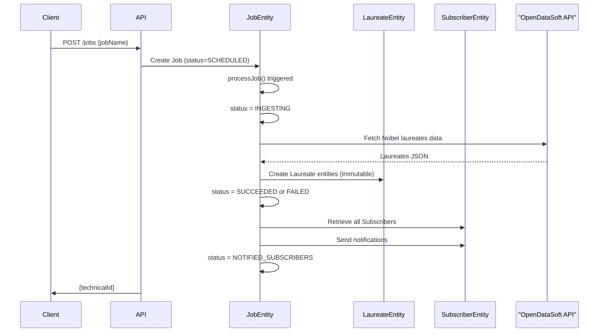
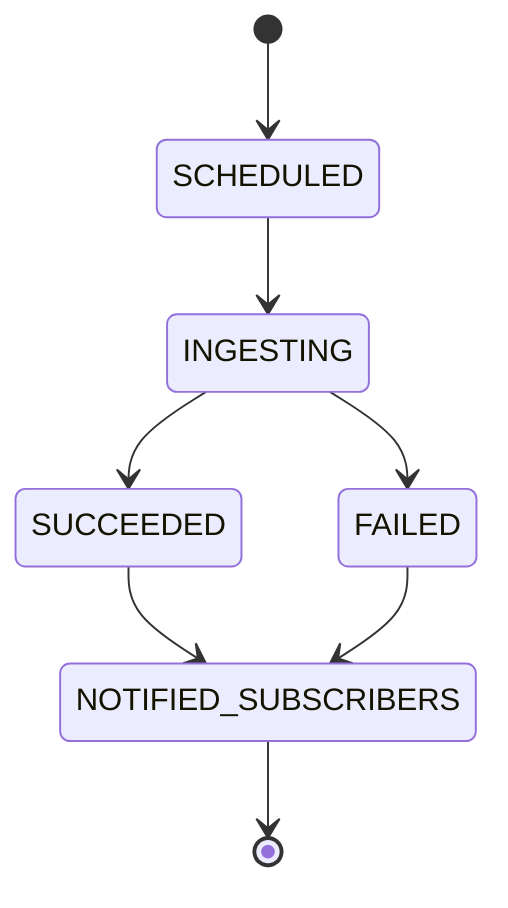

### 1. Entity Definitions

```
Job:
- jobName: String (Name or identifier of the ingestion job)
- status: String (Current lifecycle state: SCHEDULED, INGESTING, SUCCEEDED, FAILED, NOTIFIED_SUBSCRIBERS)
- createdAt: String (Timestamp when job was created)
- details: String (Optional details or metadata about the job)

Laureate:
- laureateId: Integer (Unique identifier of the laureate)
- firstname: String (Laureate's first name)
- surname: String (Laureate's surname)
- gender: String (Laureate's gender)
- born: String (Birth date)
- died: String (Death date or null)
- borncountry: String (Country of birth)
- borncountrycode: String (Country code of birth)
- borncity: String (City of birth)
- year: String (Year of Nobel Prize award)
- category: String (Category of Nobel Prize)
- motivation: String (Award motivation text)
- affiliationName: String (Affiliated institution name)
- affiliationCity: String (Affiliated institution city)
- affiliationCountry: String (Affiliated institution country)

Subscriber:
- subscriberName: String (Name or identifier of the subscriber)
- contactEmail: String (Email address for notifications)
- webhookUrl: String (Optional webhook URL for notifications)
```

---

### 2. Process Method Flows

```
processJob() Flow:
1. Initial State: Job entity is created with status = "SCHEDULED"
2. Validation: Check required jobName and status correctness
3. Processing: 
   - Transition status to "INGESTING"
   - Fetch Nobel laureates data from OpenDataSoft API
   - For each laureate record, create a new Laureate entity (immutable creation)
4. Completion:
   - If ingestion successful, update Job status to "SUCCEEDED"
   - If any errors, update Job status to "FAILED"
5. Notification:
   - Trigger notification dispatch to all active Subscribers
   - Update Job status to "NOTIFIED_SUBSCRIBERS"
```

```
processLaureate() Flow:
1. Validation: Verify essential fields are present and valid (e.g., laureateId, firstname, surname)
2. Enrichment: Normalize borncountrycode, calculate derived fields if needed (optional)
3. Persistence: Save the immutable Laureate record for event history
```

```
processSubscriber() Flow:
1. Validation: Check valid email format or webhook URL presence
2. Persistence: Save Subscriber contact details
3. No further processing; Subscribers are passive receivers of notifications
```

---

### 3. API Endpoints Design

| Entity     | HTTP Method | Endpoint               | Request Body                  | Response Body                 | Notes                                      |
|------------|-------------|------------------------|-------------------------------|-------------------------------|--------------------------------------------|
| Job        | POST        | /jobs                  | { "jobName": "string" }        | { "technicalId": "string" }    | Creates Job, triggers processJob() event  |
| Job        | GET         | /jobs/{technicalId}    | N/A                           | Full Job entity with status    | Retrieve Job by technicalId                 |
| Laureate   | GET         | /laureates/{technicalId}| N/A                           | Full Laureate entity           | Retrieve Laureate by technicalId           |
| Subscriber | POST        | /subscribers           | { "subscriberName": "string", "contactEmail": "string", "webhookUrl": "string (optional)" } | { "technicalId": "string" }    | Creates Subscriber, triggers processSubscriber() |
| Subscriber | GET         | /subscribers/{technicalId}| N/A                         | Full Subscriber entity         | Retrieve Subscriber by technicalId          |

- No update or delete endpoints to maintain immutability.
- Laureates are created internally by the Job process; no public POST endpoint for Laureate.
- GET by condition endpoints are omitted unless explicitly requested.

---

### 4. Request/Response Formats

**POST /jobs Request:**
```json
{
  "jobName": "Nobel Laureates Ingestion Job"
}
```

**POST /jobs Response:**
```json
{
  "technicalId": "job-uuid-1234"
}
```

---

**GET /jobs/{technicalId} Response:**
```json
{
  "jobName": "Nobel Laureates Ingestion Job",
  "status": "NOTIFIED_SUBSCRIBERS",
  "createdAt": "2024-06-01T10:00:00Z",
  "details": "Ingested 100 laureates"
}
```

---

**POST /subscribers Request:**
```json
{
  "subscriberName": "Research Team",
  "contactEmail": "team@example.com",
  "webhookUrl": "https://example.com/webhook"
}
```

**POST /subscribers Response:**
```json
{
  "technicalId": "subscriber-uuid-5678"
}
```

---

**GET /subscribers/{technicalId} Response:**
```json
{
  "subscriberName": "Research Team",
  "contactEmail": "team@example.com",
  "webhookUrl": "https://example.com/webhook"
}
```

---

**GET /laureates/{technicalId} Response:**
```json
{
  "laureateId": 853,
  "firstname": "Akira",
  "surname": "Suzuki",
  "gender": "male",
  "born": "1930-09-12",
  "died": null,
  "borncountry": "Japan",
  "borncountrycode": "JP",
  "borncity": "Mukawa",
  "year": "2010",
  "category": "Chemistry",
  "motivation": "\"for palladium-catalyzed cross couplings in organic synthesis\"",
  "affiliationName": "Hokkaido University",
  "affiliationCity": "Sapporo",
  "affiliationCountry": "Japan"
}
```

---

### 5. Visual Representation


```mermaid
sequenceDiagram
  participant Client
  participant API
  participant JobEntity
  participant LaureateEntity
  participant SubscriberEntity
  participant ExternalAPI as "OpenDataSoft API"

  Client->>API: POST /jobs {jobName}
  API->>JobEntity: Create Job (status=SCHEDULED)
  JobEntity->>JobEntity: processJob() triggered
  JobEntity->>JobEntity: status = INGESTING
  JobEntity->>ExternalAPI: Fetch Nobel laureates data
  ExternalAPI-->>JobEntity: Laureates JSON
  JobEntity->>LaureateEntity: Create Laureate entities (immutable)
  JobEntity->>JobEntity: status = SUCCEEDED or FAILED
  JobEntity->>SubscriberEntity: Retrieve all Subscribers
  JobEntity->>SubscriberEntity: Send notifications
  JobEntity->>JobEntity: status = NOTIFIED_SUBSCRIBERS
  API->>Client: {technicalId}
```


```mermaid
stateDiagram-v2
  [*] --> SCHEDULED
  SCHEDULED --> INGESTING
  INGESTING --> SUCCEEDED
  INGESTING --> FAILED
  SUCCEEDED --> NOTIFIED_SUBSCRIBERS
  FAILED --> NOTIFIED_SUBSCRIBERS
  NOTIFIED_SUBSCRIBERS --> [*]
```

---