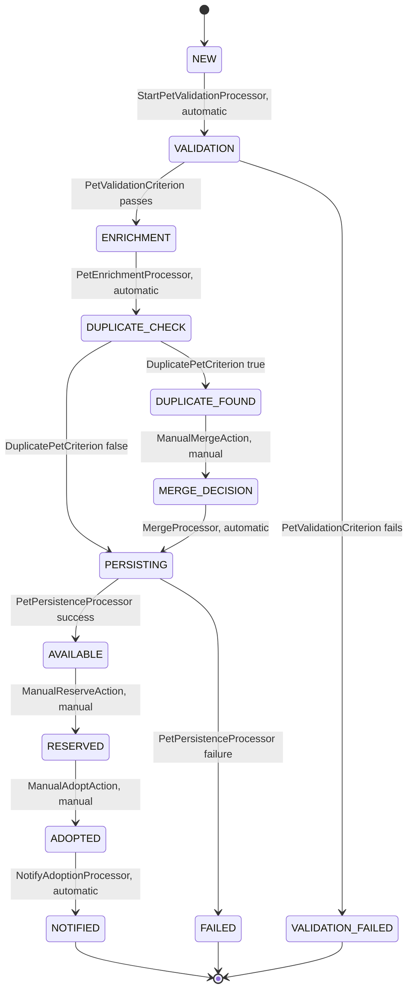
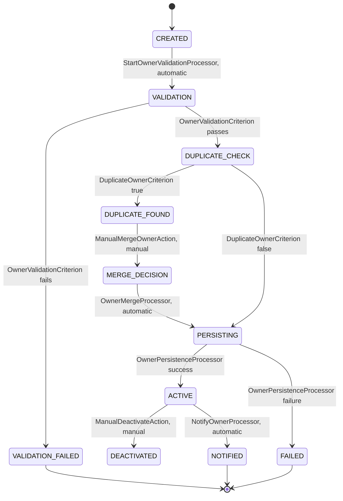
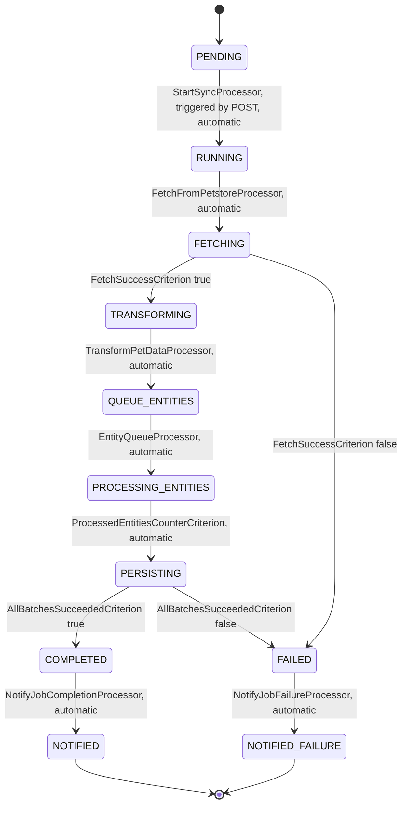
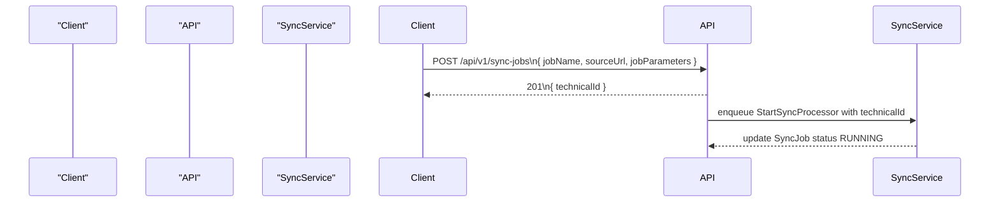
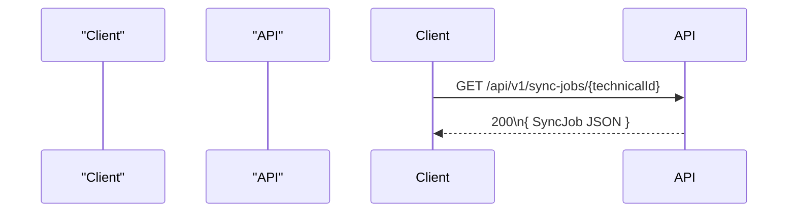
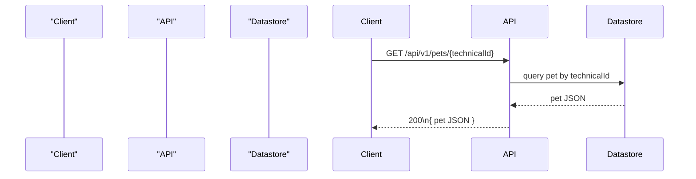
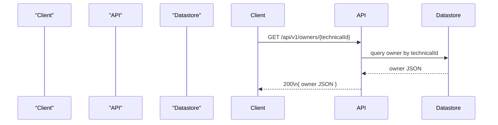

### 1. Entity Definitions

Note: The user did not explicitly list entities. Defaulting to 3 entities as requested.

```
Pet:
- petId: String (external ID from Petstore API or source system; business identifier)
- name: String (pet name)
- species: String (e.g., cat, dog)
- breed: String (breed description)
- age: Integer (age in years)
- status: String (availability status; e.g., available, reserved, adopted)
- location: String (shelter or store location)
- ownerExternalId: String (external owner id if present in source)
- ownerTechnicalId: String (datastore technicalId of associated Owner, nullable)
- source: String (data source identifier, e.g., Petstore API)
- lastSyncedAt: String (ISO-8601 timestamp when this entity was last synced)
- createdAt: String (ISO-8601)
- updatedAt: String (ISO-8601)
 Do not use enum - not supported temporarily.
```

```
Owner:
- ownerId: String (external owner id from source systems; business identifier)
- firstName: String
- lastName: String
- email: String
- phone: String
- address: String
- source: String (data source identifier, e.g., Petstore API)
- petExternalIds: List<String> (list of external petIds associated in source)
- petTechnicalIds: List<String> (list of persisted Pet technicalIds associated, nullable)
- createdAt: String (ISO-8601)
- updatedAt: String (ISO-8601)
 Do not use enum - not supported temporarily.
```

```
SyncJob:
- jobName: String (human-friendly name for the sync job, e.g., Petstore_Ingest_2025_08)
- sourceUrl: String (e.g., Petstore API base URL or OpenAPI endpoint)
- sourceType: String (e.g., PetstoreAPI)
- jobParameters: Map<String,Object> (free-form parameters: filters, maxRecords, concurrency, etc.)
- scheduleCron: String (optional cron expression if scheduled)
- status: String (PENDING, IN_PROGRESS, COMPLETED, FAILED, CANCELLED)
- startedAt: String (ISO-8601)
- finishedAt: String (ISO-8601)
- processedCount: Integer
- persistedCount: Integer
- failedCount: Integer
- errors: List<String> (human readable error messages)
- createdAt: String (ISO-8601)
- updatedAt: String (ISO-8601)
 Do not use enum - not supported temporarily.
```

---

### 2. Entity workflows

For each entity below: transitions list (manual vs automatic), state diagram (Mermaid), and required criterion/processor classes.

Pet workflow:
1. Initial State: NEW (created by ingestion job process)
2. Validation: Automatic validation of required fields (name, species, petId)
3. Enrichment: Automatic enrichment (resolve owner by ownerExternalId; fetch breed metadata)
4. Duplicate check: Automatic criterion to detect duplicates (existing pet with same external id or name+breed+location)
5. Persistence: Automatic save/persist to datastore (assign technicalId)
6. Availability update: Manual or automatic transition to AVAILABLE/RESERVED/ADOPTED based on business rules or manual intervention
7. Notification: Automatic notification processors for certain status changes (e.g., when AVAILABLE -> ADOPTED send confirmation)
8. Archive: Manual or automatic archival for old records

Mermaid state diagram (Pet):

```mermaid
stateDiagram-v2
    [*] --> NEW
    NEW --> VALIDATION : StartPetValidationProcessor, automatic
    VALIDATION --> VALIDATION_FAILED : PetValidationCriterion fails
    VALIDATION --> ENRICHMENT : PetValidationCriterion passes
    ENRICHMENT --> DUPLICATE_CHECK : PetEnrichmentProcessor, automatic
    DUPLICATE_CHECK --> DUPLICATE_FOUND : DuplicatePetCriterion true
    DUPLICATE_CHECK --> PERSISTING : DuplicatePetCriterion false
    DUPLICATE_FOUND --> MERGE_DECISION : ManualMergeAction, manual
    MERGE_DECISION --> PERSISTING : MergeProcessor, automatic
    PERSISTING --> AVAILABLE : PetPersistenceProcessor success
    PERSISTING --> FAILED : PetPersistenceProcessor failure
    AVAILABLE --> RESERVED : ManualReserveAction, manual
    RESERVED --> ADOPTED : ManualAdoptAction, manual
    ADOPTED --> NOTIFIED : NotifyAdoptionProcessor, automatic
    NOTIFIED --> [*]
    FAILED --> [*]
    VALIDATION_FAILED --> [*]
```

Pet - Criterion and Processor classes needed:
- PetValidationCriterion (Java class): checks required fields and basic sanity checks.
- PetEnrichmentProcessor: enrich pet (lookup breed metadata, standardize species).
- DuplicatePetCriterion: checks datastore for possible duplicate pets by petId or heuristic (name+breed+location).
- MergeProcessor: merges incoming pet with existing pet record when a duplicate is found.
- PetPersistenceProcessor: persists or updates Pet into datastore and sets technicalId.
- NotifyAdoptionProcessor: sends notifications when adoption occurs.

Pseudo-signature examples (to implement in Java):
- class PetValidationCriterion { boolean evaluate(Pet pet) }
- class PetEnrichmentProcessor { Pet process(Pet pet) }
- class DuplicatePetCriterion { Optional<String> findDuplicateTechnicalId(Pet pet) }
- class PetPersistenceProcessor { String processAndPersist(Pet pet) // returns technicalId }

---

Owner workflow:
1. Initial State: CREATED (created by ingestion or derived from Pet data)
2. Validation: Automatic email/phone validation, minimal completeness
3. Merge: Automatic or manual merge if duplicate owner detected (same email or phone)
4. Activation: Automatic set to ACTIVE when linked to a Pet or manually activated
5. Deactivation: Manual or automatic (inactive after long inactivity)
6. Notification: Automatic notifications on important events (e.g., owner linked to adoption)

Mermaid state diagram (Owner):

```mermaid
stateDiagram-v2
    [*] --> CREATED
    CREATED --> VALIDATION : StartOwnerValidationProcessor, automatic
    VALIDATION --> VALIDATION_FAILED : OwnerValidationCriterion fails
    VALIDATION --> DUPLICATE_CHECK : OwnerValidationCriterion passes
    DUPLICATE_CHECK --> DUPLICATE_FOUND : DuplicateOwnerCriterion true
    DUPLICATE_CHECK --> PERSISTING : DuplicateOwnerCriterion false
    DUPLICATE_FOUND --> MERGE_DECISION : ManualMergeOwnerAction, manual
    MERGE_DECISION --> PERSISTING : OwnerMergeProcessor, automatic
    PERSISTING --> ACTIVE : OwnerPersistenceProcessor success
    PERSISTING --> FAILED : OwnerPersistenceProcessor failure
    ACTIVE --> DEACTIVATED : ManualDeactivateAction, manual
    ACTIVE --> NOTIFIED : NotifyOwnerProcessor, automatic
    NOTIFIED --> [*]
    FAILED --> [*]
    VALIDATION_FAILED --> [*]
```

Owner - Criterion and Processor classes needed:
- OwnerValidationCriterion: verifies email format, phone format, minimal required fields.
- DuplicateOwnerCriterion: finds duplicates by email or phone.
- OwnerMergeProcessor: merges owner records and updates petTechnicalIds.
- OwnerPersistenceProcessor: persists Owner and returns technicalId.
- NotifyOwnerProcessor: sends notifications (email/sms) when needed.

Pseudo-signature examples:
- class OwnerValidationCriterion { boolean evaluate(Owner owner) }
- class DuplicateOwnerCriterion { Optional<String> findDuplicateTechnicalId(Owner owner) }
- class OwnerMergeProcessor { Owner process(Owner existing, Owner incoming) }
- class OwnerPersistenceProcessor { String processAndPersist(Owner owner) }

---

SyncJob workflow:
1. Initial State: PENDING (created via POST /sync-jobs)
2. Scheduling/Start: Automatic start if schedule triggers or manual start via POST triggers automatic StartSyncProcessor
3. Fetching: Automatic fetching from Petstore API (FetchFromPetstoreProcessor)
4. Transforming: Automatic transforming raw data into Pet and Owner domain shapes (TransformPetDataProcessor)
5. Processing per entity: For each transformed record, system triggers Pet and Owner processing workflows (automatic)
6. Persisting: Automatic persist counts updated (processedCount, persistedCount, failedCount)
7. Completion: Automatic mark job COMPLETED if all batches succeeded or FAILED with errors if unrecoverable
8. Notification/Audit: Automatic notifications and audit logging after completion

Mermaid state diagram (SyncJob):

```mermaid
stateDiagram-v2
    [*] --> PENDING
    PENDING --> RUNNING : StartSyncProcessor, triggered by POST, automatic
    RUNNING --> FETCHING : FetchFromPetstoreProcessor, automatic
    FETCHING --> TRANSFORMING : FetchSuccessCriterion true
    FETCHING --> FAILED : FetchSuccessCriterion false
    TRANSFORMING --> QUEUE_ENTITIES : TransformPetDataProcessor, automatic
    QUEUE_ENTITIES --> PROCESSING_ENTITIES : EntityQueueProcessor, automatic
    PROCESSING_ENTITIES --> PERSISTING : ProcessedEntitiesCounterCriterion, automatic
    PERSISTING --> COMPLETED : AllBatchesSucceededCriterion true
    PERSISTING --> FAILED : AllBatchesSucceededCriterion false
    COMPLETED --> NOTIFIED : NotifyJobCompletionProcessor, automatic
    NOTIFIED --> [*]
    FAILED --> NOTIFIED_FAILURE : NotifyJobFailureProcessor, automatic
    NOTIFIED_FAILURE --> [*]
```

SyncJob - Criterion and Processor classes needed:
- StartSyncProcessor: invoked after job POST to begin the job (schedules or immediately starts).
- FetchFromPetstoreProcessor: executes HTTP calls to Petstore API and returns raw records (handles pagination).
- FetchSuccessCriterion: checks whether fetch succeeded or not.
- TransformPetDataProcessor: maps raw Petstore API payload to Pet and Owner domain DTOs.
- EntityQueueProcessor: enqueues each domain entity into the entity processing pipeline (triggers Pet/Owner processing).
- ProcessedEntitiesCounterCriterion: checks batch processing progress to move to persisting/completion.
- PetProcessingProcessor / OwnerProcessingProcessor: orchestrate the validation/enrichment/duplicate/persist processors for each entity.
- PetPersistenceProcessor & OwnerPersistenceProcessor (already listed in entity-specific sections).
- NotifyJobCompletionProcessor / NotifyJobFailureProcessor: send notifications and audit logs.

Pseudo-signature examples:
- class StartSyncProcessor { void process(SyncJob job) }
- class FetchFromPetstoreProcessor { List<Map<String,Object>> fetch(SyncJob job) }
- class TransformPetDataProcessor { List<Pet> transform(List<Map<String,Object>> raw) }

---

### 3. Pseudo code for processor classes

Below are representative Java-style pseudocode snippets for key processors (preserve business logic and references to Petstore API and java):

Sync job processors

- StartSyncProcessor
```java
public class StartSyncProcessor {
    public void process(SyncJob job) {
        job.setStatus("IN_PROGRESS");
        job.setStartedAt(Instant.now().toString());
        jobRepository.updateStatus(job);
        // Kick off fetch in a background thread / executor
        fetchProcessor.process(job);
    }
}
```

- FetchFromPetstoreProcessor
```java
public class FetchFromPetstoreProcessor {
    // Uses Petstore API data (HTTP calls). Implement HTTP client in Java.
    public List<Map<String,Object>> fetch(SyncJob job) {
        List<Map<String,Object>> all = new ArrayList<>();
        String url = job.getSourceUrl(); // e.g., Petstore base path
        // Example: use Java HTTP client to call the Petstore endpoint with pagination
        while(url != null) {
            HttpResponse<String> resp = httpClient.get(url);
            if(resp.statusCode() != 200) {
                job.addError("Fetch failed with status " + resp.statusCode());
                return Collections.emptyList();
            }
            Map<String,Object> page = jsonMapper.readValue(resp.body(), Map.class);
            List<Map<String,Object>> items = (List) page.get("items"); // depends on Petstore response shape
            all.addAll(items);
            url = nextPageUrlFrom(page); // implement pagination logic
        }
        return all;
    }
}
```

- TransformPetDataProcessor
```java
public class TransformPetDataProcessor {
    public List<Pet> transform(List<Map<String,Object>> rawRecords) {
        List<Pet> pets = new ArrayList<>();
        for(Map<String,Object> r : rawRecords) {
            Pet p = new Pet();
            // Map fields from Petstore API payload to our Pet fields
            p.setPetId((String) r.get("id"));
            p.setName((String) r.get("name"));
            p.setSpecies((String) r.get("category"));
            p.setBreed((String) r.get("breed"));
            p.setSource("Petstore API");
            p.setCreatedAt(Instant.now().toString());
            pets.add(p);
        }
        return pets;
    }
}
```

- EntityQueueProcessor (triggers Pet/Owner pipelines)
```java
public class EntityQueueProcessor {
    private PetProcessingProcessor petProcessor;
    private OwnerProcessingProcessor ownerProcessor;

    public void process(List<Pet> pets) {
        for(Pet p : pets) {
            // for each pet, first transform owner info if present
            if(p.getOwnerExternalId() != null) {
                Owner owner = ownerRepository.findByExternalId(p.getOwnerExternalId());
                if(owner == null) {
                    owner = new Owner();
                    owner.setOwnerId(p.getOwnerExternalId());
                    owner.setSource(p.getSource());
                    ownerProcessor.process(owner); // owner created via processor
                    p.setOwnerTechnicalId(owner.getTechnicalId());
                } else {
                    p.setOwnerTechnicalId(owner.getTechnicalId());
                }
            }
            petProcessor.process(p);
        }
    }
}
```

Pet/Owner processors and criteria

- PetValidationCriterion
```java
public class PetValidationCriterion {
    public boolean evaluate(Pet pet) {
        if(pet.getPetId() == null) return false;
        if(pet.getName() == null) return false;
        if(pet.getSpecies() == null) return false;
        return true;
    }
}
```

- DuplicatePetCriterion
```java
public class DuplicatePetCriterion {
    public Optional<String> findDuplicateTechnicalId(Pet pet) {
        // check by external petId first
        Optional<String> byExternal = petRepository.findTechnicalIdByPetId(pet.getPetId());
        if(byExternal.isPresent()) return byExternal;
        // fallback heuristic: name+breed+location
        Optional<String> byHeuristic = petRepository.findTechnicalIdByNameBreedLocation(
            pet.getName(), pet.getBreed(), pet.getLocation());
        return byHeuristic;
    }
}
```

- PetPersistenceProcessor
```java
public class PetPersistenceProcessor {
    public String processAndPersist(Pet pet) {
        // If duplicate, update existing
        Optional<String> existingTechId = duplicatePetCriterion.findDuplicateTechnicalId(pet);
        if(existingTechId.isPresent()) {
            Pet existing = petRepository.findByTechnicalId(existingTechId.get());
            Pet merged = merge(existing, pet);
            petRepository.update(merged);
            return existingTechId.get();
        } else {
            // create new record in datastore and return technicalId
            String technicalId = petRepository.insert(pet);
            return technicalId;
        }
    }
    private Pet merge(Pet existing, Pet incoming) {
        // merge logic: prefer non-null incoming fields, preserve createdAt
        if(incoming.getName() != null) existing.setName(incoming.getName());
        // ... other merge rules
        existing.setUpdatedAt(Instant.now().toString());
        return existing;
    }
}
```

- OwnerProcessingProcessor (simplified)
```java
public class OwnerProcessingProcessor {
    public String process(Owner owner) {
        if(!ownerValidationCriterion.evaluate(owner)) {
            // either discard or mark as incomplete and persist a minimal record
        }
        Optional<String> existing = duplicateOwnerCriterion.findDuplicateTechnicalId(owner);
        if(existing.isPresent()) {
            Owner merged = ownerMergeProcessor.process(ownerRepository.findByTechnicalId(existing.get()), owner);
            ownerRepository.update(merged);
            return existing.get();
        } else {
            return ownerRepository.insert(owner);
        }
    }
}
```

Notification processors should integrate with email/sms services (implement using Java mail client or external messaging service connectors).

---

### 4. API Endpoints Design Rules

High-level rules (preserve rules exactly):
- POST endpoints: Entity creation (triggers events) + business logic. POST endpoint that adds an entity should return only entity technicalId - this field is not included in the entity itself, it's a datastore imitated specific field. Nothing else.
- GET endpoints: ONLY for retrieving stored application results
- GET by technicalId: ONLY for retrieving stored application results by technicalId - should be present for all entities that are created via POST endpoints.
- GET by condition: ONLY for retrieving stored application results by non-technicalId fields - should be present only if explicitly asked by the user.
- GET all: optional.
- If you have an orchestration entity (like Job, Task, Workflow), it should have a POST endpoint to create it, and a GET by technicalId to retrieve it. You will most likely not need any other POST endpoints for business entities as saving business entity is done via the process method.
- Business logic rule: External data sources, calculations, processing → POST endpoints

Defined endpoints for Purrfect Pets (based on above):

1) Create a Sync Job (orchestration entity)
- POST /api/v1/sync-jobs
  - Purpose: create a SyncJob that triggers ingestion from Petstore API data. Creating this job persists the SyncJob entity (PENDING) and triggers StartSyncProcessor automatically.
  - Request JSON:
```json
{
  "jobName": "Petstore_Ingest_2025_08",
  "sourceUrl": "https://petstore.example.com/v1/pets",
  "sourceType": "PetstoreAPI",
  "jobParameters": {
    "maxRecords": 1000,
    "pageSize": 100
  },
  "scheduleCron": null
}
```
  - Response (must return only technicalId):
```json
{
  "technicalId": "string-job-technical-id"
}
```

Visualize request/response flow using Mermaid (sequence):

```mermaid
sequenceDiagram
    participant "Client"
    participant "API"
    participant "SyncService"
    Client ->> API : POST /api/v1/sync-jobs\n{ jobName, sourceUrl, jobParameters }
    API -->> Client : 201\n{ technicalId }
    API ->> SyncService : enqueue StartSyncProcessor with technicalId
    SyncService -->> API : update SyncJob status RUNNING
```

2) Get SyncJob status by technicalId
- GET /api/v1/sync-jobs/{technicalId}
  - Purpose: retrieve stored SyncJob entity and status/results
  - Response JSON example:
```json
{
  "technicalId": "string-job-technical-id",
  "jobName": "Petstore_Ingest_2025_08",
  "sourceUrl": "https://petstore.example.com/v1/pets",
  "status": "IN_PROGRESS",
  "processedCount": 123,
  "persistedCount": 120,
  "failedCount": 3,
  "errors": [],
  "startedAt": "2025-08-15T12:00:00Z",
  "finishedAt": null
}
```

Visualize GET flow using Mermaid:

```mermaid
sequenceDiagram
    participant "Client"
    participant "API"
    Client ->> API : GET /api/v1/sync-jobs/{technicalId}
    API -->> Client : 200\n{ SyncJob JSON }
```

3) Retrieve Pet by technicalId (business entity stored by job processes)
- GET /api/v1/pets/{technicalId}
  - Purpose: retrieve persisted Pet by datastore technicalId
  - Response JSON example:
```json
{
  "technicalId": "string-pet-technical-id",
  "petId": "ext-123",
  "name": "Whiskers",
  "species": "cat",
  "breed": "Siamese",
  "age": 2,
  "status": "available",
  "location": "Purrfect Pets - Uptown",
  "ownerExternalId": "owner-ext-456",
  "ownerTechnicalId": "string-owner-technical-id",
  "source": "Petstore API",
  "lastSyncedAt": "2025-08-15T12:01:00Z",
  "createdAt": "2025-08-15T12:01:00Z",
  "updatedAt": "2025-08-15T12:01:00Z"
}
```

Visualize GET flow using Mermaid:

```mermaid
sequenceDiagram
    participant "Client"
    participant "API"
    participant "Datastore"
    Client ->> API : GET /api/v1/pets/{technicalId}
    API ->> Datastore : query pet by technicalId
    Datastore -->> API : pet JSON
    API -->> Client : 200\n{ pet JSON }
```

4) Retrieve Owner by technicalId (business entity)
- GET /api/v1/owners/{technicalId}
  - Response JSON example:
```json
{
  "technicalId": "string-owner-technical-id",
  "ownerId": "owner-ext-456",
  "firstName": "Jane",
  "lastName": "Doe",
  "email": "jane.doe@example.com",
  "phone": "+1234567890",
  "address": "123 Cat St, Petcity",
  "source": "Petstore API",
  "petExternalIds": ["ext-123"],
  "petTechnicalIds": ["string-pet-technical-id"],
  "createdAt": "2025-08-15T12:01:00Z",
  "updatedAt": "2025-08-15T12:01:00Z"
}
```

Visualize GET flow using Mermaid:

```mermaid
sequenceDiagram
    participant "Client"
    participant "API"
    participant "Datastore"
    Client ->> API : GET /api/v1/owners/{technicalId}
    API ->> Datastore : query owner by technicalId
    Datastore -->> API : owner JSON
    API -->> Client : 200\n{ owner JSON }
```

Optional endpoints (GET all):
- GET /api/v1/pets (optional): list all pets (pagination recommended)
- GET /api/v1/owners (optional): list owners (pagination)

Notes on POST for business entities:
- Business entities (Pet, Owner) are created by the system during SyncJob processing (automatic). Therefore there are no direct POST endpoints for Pet or Owner in this design — creation handled by SyncJob pipeline. If you explicitly want to allow manual creation, a POST endpoint can be added later but per rules above, orchestration POST triggers processing and business entity saving is done by the process method.

Additional technical rules to observe in implementation (preserve semantics):
- POST endpoints must return only technicalId (string) and nothing else in the body.
- All GET endpoints return stored application results only; do not trigger processing.
- Use technicalId as the key for GET by technicalId across all entities persisted in datastore.
- The process method for each persisted entity is the main entry point for automated processing triggered by persistence (i.e., once saved, Cyoda starts workflows that call these processors/criteria).

---

If you want, I can:
- Expand to include explicit HTTP status codes, error formats, and examples for failure cases.
- Add optional POST endpoints for manual Pet/Owner creation (if desired).
- Provide more detailed Java class skeletons and repository interfaces for each processor/criterion.