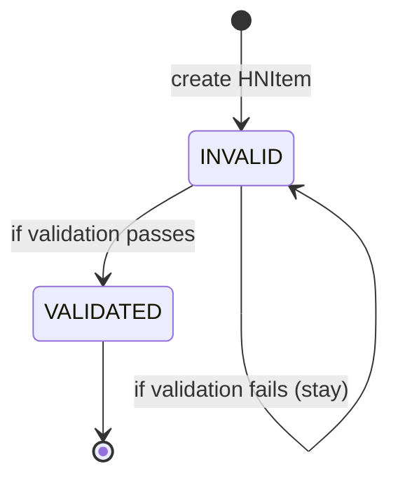
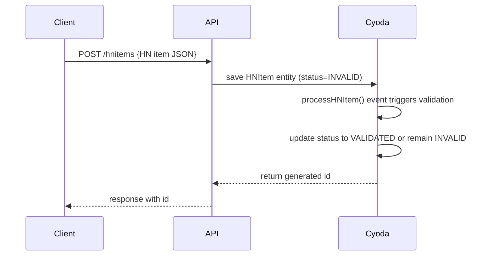
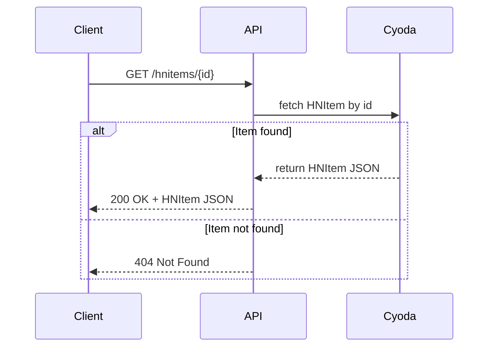

### 1. Entity Definitions

``` 
HNItem:
- id: String (unique identifier generated on creation)
- type: String (Hacker News item type, e.g., story, comment)
- content: JSON (full HN item payload as posted)
- status: StatusEnum (INVALID, VALIDATED)
```

### 2. Process Method Flows

```
processHNItem() Flow:
1. Initial State: HNItem saved with status = INVALID
2. Validation: Check presence of "id" and "type" fields in content JSON
3. State Transition:
   - If valid, update status to VALIDATED
   - If invalid, retain status INVALID for later review
4. Completion: Processing ends with entity in either VALIDATED or INVALID state
```

### 3. API Endpoints Design

- POST /hnitems  
  Request: JSON body representing HN item (matches Firebase HN API format)  
  Response: JSON with generated id  
  Behavior: Creates an immutable HNItem entity (status=INVALID), triggers `processHNItem()` event

- GET /hnitems/{id}  
  Response: JSON of stored HNItem if exists (any status) or 404 if not found

### 4. Request/Response Formats

```
POST /hnitems Request:
{
  "type": "story",
  "id": 12345,
  ... other Hacker News fields ...
}

POST /hnitems Response:
{
  "id": "generated-unique-id"
}

GET /hnitems/{id} Response (status=VALIDATED or INVALID):
{
  "id": "generated-unique-id",
  "type": "story",
  "content": { ... full original JSON ... },
  "status": "VALIDATED"
}

GET /hnitems/{id} Response if not found:
404 Not Found
```

### 5. Mermaid Diagrams

**Entity lifecycle state diagram for HNItem**


```mermaid
stateDiagram-v2
    [*] --> INVALID : create HNItem
    INVALID --> VALIDATED : if validation passes
    INVALID --> INVALID : if validation fails (stay)
    VALIDATED --> [*]
```

**Event-driven processing chain**


```mermaid
sequenceDiagram
    participant Client
    participant API
    participant Cyoda

    Client->>API: POST /hnitems {HN item JSON}
    API->>Cyoda: save HNItem entity (status=INVALID)
    Cyoda->>Cyoda: processHNItem() event triggers validation
    Cyoda->>Cyoda: update status to VALIDATED or remain INVALID
    Cyoda-->>API: return generated id
    API-->>Client: response with id
```

**User interaction sequence for GET**


```mermaid
sequenceDiagram
    participant Client
    participant API
    participant Cyoda

    Client->>API: GET /hnitems/{id}
    API->>Cyoda: fetch HNItem by id
    alt Item found
        Cyoda-->>API: return HNItem JSON
        API-->>Client: 200 OK + HNItem JSON
    else Item not found
        API-->>Client: 404 Not Found
    end
```

---

If you need any further adjustments or the next step in the specification, I’m here to help!