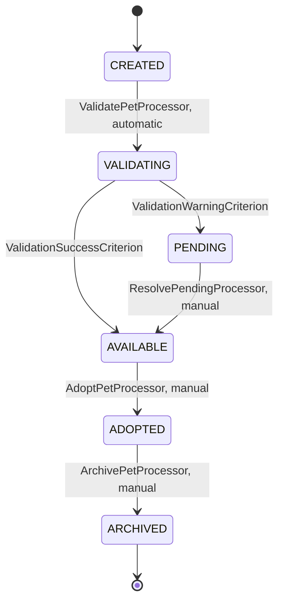
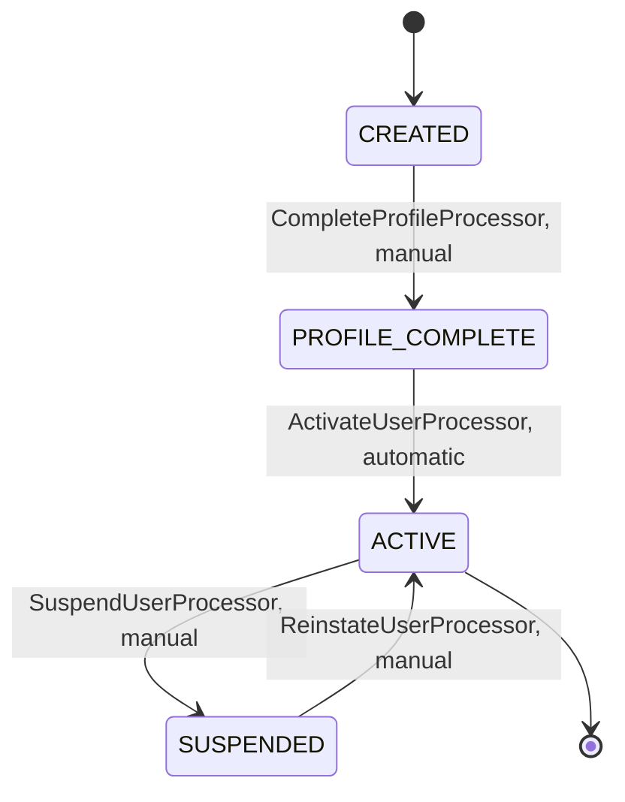
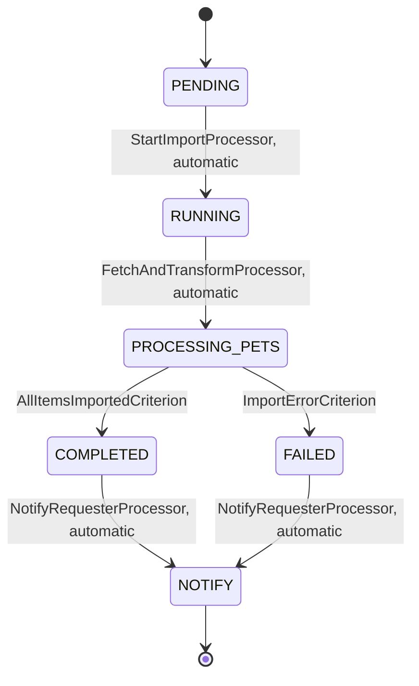
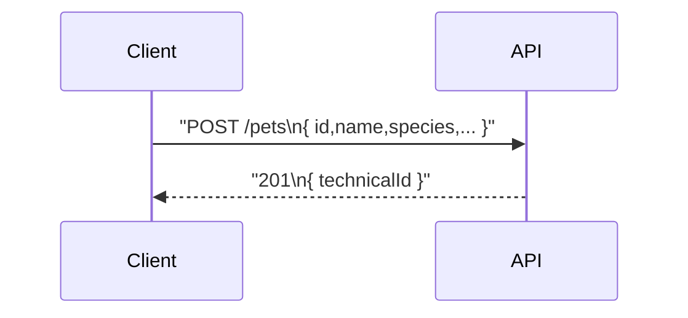
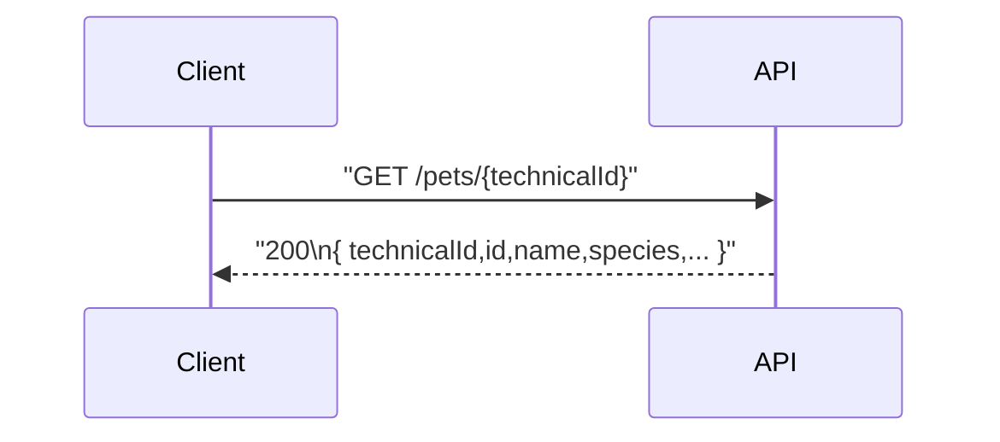
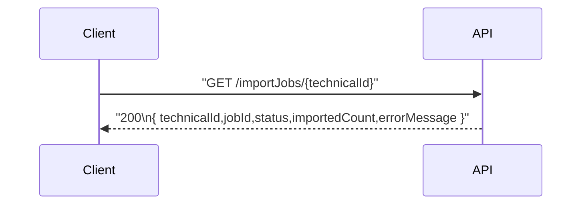

### 1. Entity Definitions
Pet:
- id: String (business id)
- name: String (pet name)
- species: String (cat/dog/etc)
- breed: String (breed info)
- age: Integer (years)
- gender: String (M/F/other)
- status: String (available/adopted/pending)
- description: String (short description)
- images: Array(String) (URLs)
- healthSummary: String (brief health notes)

User:
- id: String (business id)
- name: String
- email: String
- contact: String
- role: String (customer/admin/staff)
- favorites: Array(String) (pet ids)

ImportJob:
- jobId: String (business id)
- sourceUrl: String (Petstore API endpoint)
- requestedBy: String (user id)
- status: String (PENDING/RUNNING/COMPLETED/FAILED)
- importedCount: Integer
- errorMessage: String

### 2. Entity workflows

Pet workflow:
1. Initial State: CREATED (automatic when Pet persisted via process)
2. Validation: Validate fields and images (automatic)
3. Availability Check: set AVAILABLE or PENDING (automatic)
4. Adoption: MANUAL transition to ADOPTED (manual)
5. Archive: MANUAL/automatic (if removed)

```mermaid
stateDiagram-v2
    [*] --> CREATED
    CREATED --> VALIDATING : ValidatePetProcessor, automatic
    VALIDATING --> AVAILABLE : ValidationSuccessCriterion
    VALIDATING --> PENDING : ValidationWarningCriterion
    AVAILABLE --> ADOPTED : AdoptPetProcessor, manual
    ADOPTED --> ARCHIVED : ArchivePetProcessor, manual
    PENDING --> AVAILABLE : ResolvePendingProcessor, manual
    ARCHIVED --> [*]
```
Needed: ValidatePetProcessor, AdoptPetProcessor, ArchivePetProcessor, ValidationSuccessCriterion, ValidationWarningCriterion, ResolvePendingProcessor.

User workflow:
1. CREATED
2. PROFILE_COMPLETE (manual)
3. ACTIVE
4. SUSPENDED (manual)

```mermaid
stateDiagram-v2
    [*] --> CREATED
    CREATED --> PROFILE_COMPLETE : CompleteProfileProcessor, manual
    PROFILE_COMPLETE --> ACTIVE : ActivateUserProcessor, automatic
    ACTIVE --> SUSPENDED : SuspendUserProcessor, manual
    SUSPENDED --> ACTIVE : ReinstateUserProcessor, manual
    ACTIVE --> [*]
```
Needed: CompleteProfileProcessor, ActivateUserProcessor, SuspendUserProcessor, ReinstateUserProcessor, ProfileCompleteCriterion.

ImportJob workflow (orchestration):
1. PENDING (created via POST -> triggers process)
2. RUNNING (automatic)
3. PROCESSING_PETS (automatic)
4. COMPLETED or FAILED (automatic)
5. NOTIFY (automatic)

```mermaid
stateDiagram-v2
    [*] --> PENDING
    PENDING --> RUNNING : StartImportProcessor, automatic
    RUNNING --> PROCESSING_PETS : FetchAndTransformProcessor, automatic
    PROCESSING_PETS --> COMPLETED : AllItemsImportedCriterion
    PROCESSING_PETS --> FAILED : ImportErrorCriterion
    COMPLETED --> NOTIFY : NotifyRequesterProcessor, automatic
    NOTIFY --> [*]
    FAILED --> NOTIFY : NotifyRequesterProcessor, automatic
```
Needed: StartImportProcessor, FetchAndTransformProcessor, NotifyRequesterProcessor, AllItemsImportedCriterion, ImportErrorCriterion.

### 3. Pseudo code for processor classes (concise)
ValidatePetProcessor:
- fetch pet fields
- if images reachable and required fields present set validationOk true
- persist updated status
Pseudo:
class ValidatePetProcessor { process(pet){ if ok pet.status=AVAILABLE else pet.status=PENDING save(pet) } }

FetchAndTransformProcessor:
- call sourceUrl, map items to Pet entities, persist each (each persist triggers Pet workflow)
Pseudo:
class FetchAndTransformProcessor { process(job){ items=fetch(job.sourceUrl) for item in items persist Pet(item); job.importedCount++ save(job) } }

StartImportProcessor:
class StartImportProcessor { process(job){ job.status=RUNNING save(job) } }

NotifyRequesterProcessor:
class NotifyRequesterProcessor { process(job){ send notification to job.requestedBy with summary save(job) } }

### 4. API Endpoints Design Rules & JSON formats

Rules summary:
- POST creates entity and triggers Cyoda workflows. POST returns only technicalId.
- All POST-created entities have GET by technicalId.
- ImportJob (orchestration) must have POST and GET by technicalId.
- GET endpoints only retrieve stored results.

Examples (request/response mermaid visuals)

Pet POST:

```mermaid
sequenceDiagram
    participant Client
    participant API
    Client->>API: "POST /pets\n{ id,name,species,... }"
    API-->>Client: "201\n{ technicalId }"
```

Pet GET by technicalId:

```mermaid
sequenceDiagram
    participant Client
    participant API
    Client->>API: "GET /pets/{technicalId}"
    API-->>Client: "200\n{ technicalId,id,name,species,... }"
```

ImportJob POST:

```mermaid
sequenceDiagram
    participant Client
    participant API
    Client->>API: "POST /importJobs\n{ sourceUrl,requestedBy }"
    API-->>Client: "201\n{ technicalId }"
```

ImportJob GET by technicalId:

```mermaid
sequenceDiagram
    participant Client
    participant API
    Client->>API: "GET /importJobs/{technicalId}"
    API-->>Client: "200\n{ technicalId,jobId,status,importedCount,errorMessage }"
```

If you want, I can expand fields, add up to 10 entities (notify me) or add GET-by-condition endpoints. Cyoda will run each entity's process method when persisted to execute these workflows.