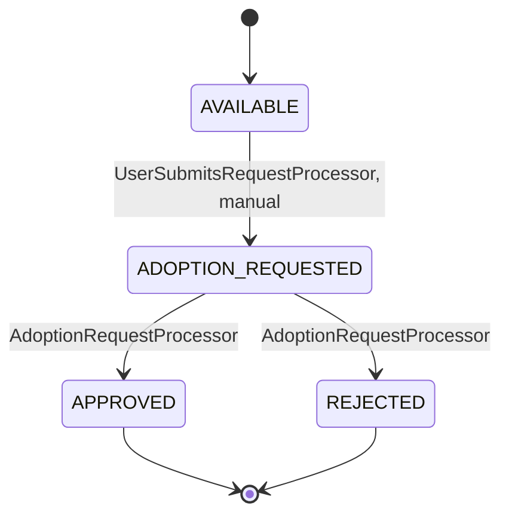
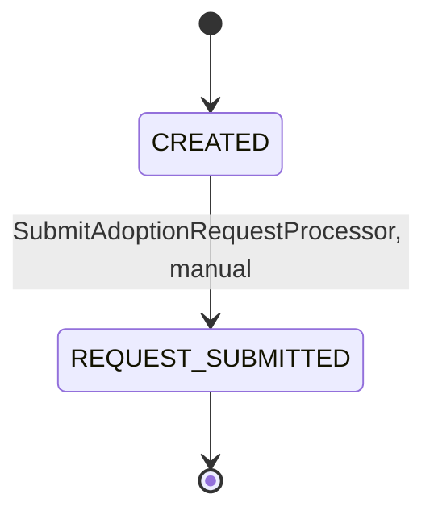
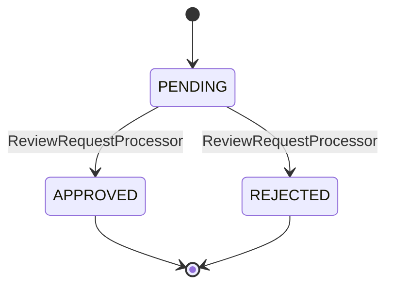

# Functional Requirements for "Purrfect Pets" API Application

This document outlines the functional requirements for the "Purrfect Pets" API application, designed using an Event-Driven Architecture (EDA) approach. The focus is on core entities and their workflows.

## 1. Entity Definitions
```
Pet:
- id: String (unique identifier for each pet)
- name: String (name of the pet)
- type: String (type of pet - e.g., dog, cat)
- age: Integer (age of the pet)
- status: String (current status, e.g., available for adoption, adopted)

User:
- id: String (unique identifier for each user)
- name: String (name of the user)
- email: String (contact email of the user)
- adoptionRequests: List<String> (list of pet IDs the user has requested to adopt)

AdoptionRequest:
- id: String (unique identifier for each adoption request)
- petId: String (ID of the pet being requested for adoption)
- userId: String (ID of the user making the request)
- status: String (current status of the request, e.g., pending, approved, rejected)
```

## 2. Entity Workflows

### Pet Workflow:
1. **Initial State**: Pet created with AVAILABLE status.
2. **Adoption Process**: User submits an adoption request.
3. **Approval**: Review adoption request and update status to ADOPTED or AVAILABLE.
4. **Notification**: Notify user of the adoption outcome.


```mermaid
stateDiagram-v2
    [*] --> AVAILABLE
    AVAILABLE --> ADOPTION_REQUESTED : UserSubmitsRequestProcessor, manual
    ADOPTION_REQUESTED --> APPROVED : AdoptionRequestProcessor
    ADOPTION_REQUESTED --> REJECTED : AdoptionRequestProcessor
    APPROVED --> [*]
    REJECTED --> [*]
```

### User Workflow:
1. **Initial State**: User created.
2. **Submit Request**: User submits an adoption request.
3. **Notification**: User notified of request status (approved/rejected).


```mermaid
stateDiagram-v2
    [*] --> CREATED
    CREATED --> REQUEST_SUBMITTED : SubmitAdoptionRequestProcessor, manual
    REQUEST_SUBMITTED --> [*]
```

### AdoptionRequest Workflow:
1. **Initial State**: Request created with PENDING status.
2. **Processing**: Review request and update status based on approval.
3. **Notification**: Notify user of request status.


```mermaid
stateDiagram-v2
    [*] --> PENDING
    PENDING --> APPROVED : ReviewRequestProcessor
    PENDING --> REJECTED : ReviewRequestProcessor
    APPROVED --> [*]
    REJECTED --> [*]
```

## 3. Pseudo Code for Processor Classes
```java
class UserSubmitsRequestProcessor {
    void process(AdoptionRequest request) {
        // Logic to submit the adoption request
    }
}

class AdoptionRequestProcessor {
    void process(AdoptionRequest request) {
        // Logic to approve or reject the request
    }
}

class ReviewRequestProcessor {
    void process(AdoptionRequest request) {
        // Logic to review the request and update its status
    }
}
```

## 4. API Endpoints Design Rules
- **POST /pets**: 
  - **Request**: 
  ```json
  {
      "name": "Fluffy",
      "type": "cat",
      "age": 2
  }
  ```
  - **Response**: 
  ```json
  {
      "technicalId": "petId123"
  }
  ```

- **POST /users**: 
  - **Request**: 
  ```json
  {
      "name": "John Doe",
      "email": "john@example.com"
  }
  ```
  - **Response**: 
  ```json
  {
      "technicalId": "userId123"
  }
  ```

- **POST /adoptionRequests**: 
  - **Request**: 
  ```json
  {
      "petId": "petId123",
      "userId": "userId123"
  }
  ```
  - **Response**: 
  ```json
  {
      "technicalId": "requestId123"
  }
  ```

- **GET /pets/{technicalId}**: Retrieve pet details by technicalId.
- **GET /users/{technicalId}**: Retrieve user details by technicalId.
- **GET /adoptionRequests/{technicalId}**: Retrieve adoption request details by technicalId.

This document provides a comprehensive overview of the functional requirements for the "Purrfect Pets" API application, outlining the essential entities, their workflows, and the API specifications.