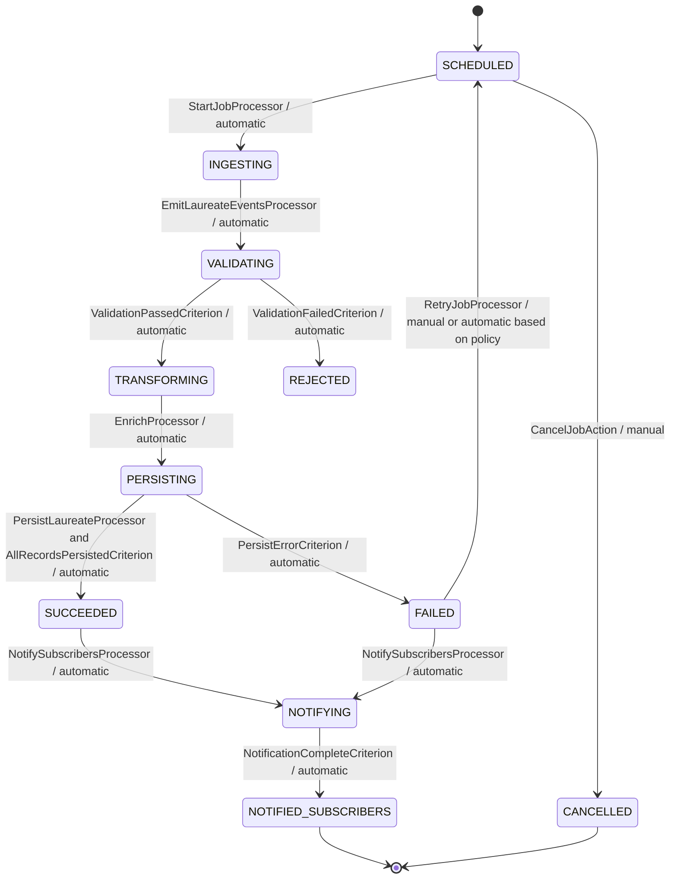
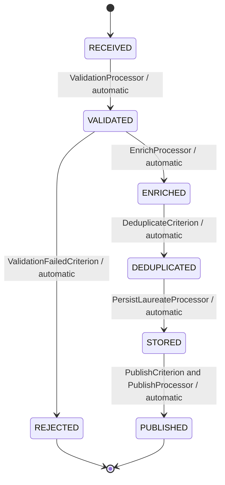
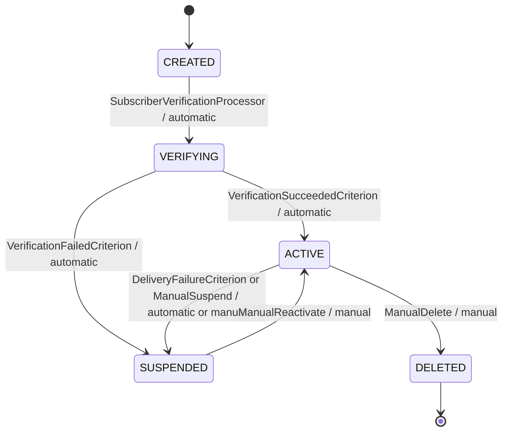
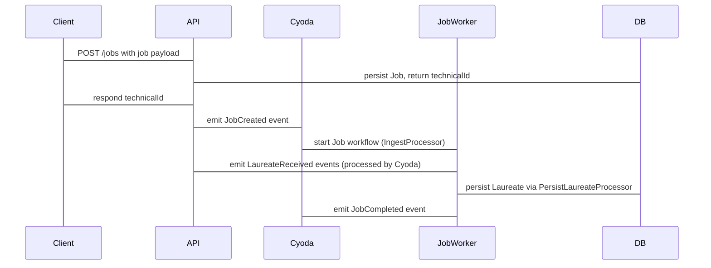

# Complete Functional Requirements — Finalized

Develop a Java-based application that ingests Nobel laureates data from the OpenDataSoft API and distributes relevant updates to subscribers. The system should model three core entities (Job, Laureate, Subscriber) and implement a basic workflow engine for data processing and notification.

## Overview
Develop a Java-based application that ingests Nobel laureates data from the OpenDataSoft API https://public.opendatasoft.com/api/explore/v2.1/catalog/datasets/nobel-prize-laureates/records?limit=1 and distributes relevant updates to subscribers. The system should model three core entities (Job, Laureate, Subscriber) and implement a basic workflow engine for data processing and notification.

🔗 Data Source
API Endpoint:
https://public.opendatasoft.com/api/explore/v2.1/catalog/datasets/nobel-prize-laureates/records  
This endpoint returns structured JSON data representing Nobel Prize laureates.

---

## 1. Entity Definitions

```
Job:
- id: String (business job identifier, e.g., ingest-2025-08-01)
- name: String (human-friendly name of the job)
- schedule: String (cron expression or human schedule descriptor)
- sourceEndpoint: String (https://public.opendatasoft.com/api/explore/v2.1/catalog/datasets/nobel-prize-laureates/records)
- parameters: Map<String,Object> (additional parameters for ingestion, e.g., limit, offset, filters)
- status: String (current lifecycle state: SCHEDULED, INGESTING, VALIDATING, TRANSFORMING, PERSISTING, SUCCEEDED, FAILED, NOTIFYING, NOTIFIED_SUBSCRIBERS, CANCELLED)
- createdAt: String (ISO-8601 timestamp)
- startedAt: String (ISO-8601 timestamp)
- completedAt: String (ISO-8601 timestamp)
- processedRecordsCount: Integer (number of laureates processed)
- lastError: String (last error message/stack trace)
- attemptCount: Integer (retry attempts made)
- maxAttempts: Integer (maximum retry attempts)
- subscriberFilters: Map<String,Object> (filters to select target subscribers for notifications, e.g., category: Chemistry, year: 2010)

Laureate:
- id: Integer (source laureate id from OpenDataSoft)
- firstname: String (given name)
- surname: String (family name)
- name: String (affiliation or full name where applicable)
- born: String (date of birth ISO-8601 or null)
- died: String (date of death ISO-8601 or null)
- gender: String (male/female/other)
- borncountry: String (country name)
- borncountrycode: String (ISO country code)
- borncity: String (city of birth)
- year: String (award year)
- category: String (award category)
- motivation: String (award motivation text)
- city: String (affiliation city)
- country: String (affiliation country)
- ageAtAward: Integer (enriched field: computed age at award if born present)
- normalizedCountryCode: String (enriched standardized country code)
- sourceFetchedAt: String (ISO-8601 timestamp when data pulled)
- status: String (RECEIVED, VALIDATED, ENRICHED, DEDUPLICATED, STORED, PUBLISHED, REJECTED)
- duplicateOf: Integer (id of existing laureate record if deduplicated/merged)
- validations: Map<String,String> (validation messages/warnings)

Subscriber:
- id: String (business subscriber id)
- name: String (subscriber name or organization)
- email: String (contact email, optional)
- webhookUrl: String (HTTP endpoint for push notifications, optional)
- channels: List<String> (preferred channels: EMAIL, WEBHOOK)
- active: Boolean (whether notifications are enabled)
- filters: Map<String,Object> (subscriber-level filters, e.g., categories: [Chemistry], years: [2010,2011])
- createdAt: String (ISO-8601 timestamp)
- verifiedAt: String (ISO-8601 timestamp when contact verified)
- lastNotifiedAt: String (ISO-8601 timestamp)
- retryPolicy: Map<String,Object> (e.g., maxRetries, backoffSeconds)
```

---

## 2. Entity Workflows

For each entity, the transitions can be manual or automatic. Manual transitions require human intervention and are triggered by a user. Automatic transitions are triggered by the system. Each state transition references processors and criteria implemented as Java classes.

### Job workflow:
1. Initial State: Job created with SCHEDULED status (creation via POST /jobs triggers this event)  
2. Start Ingestion: System triggers INGESTING based on schedule or manual start  
3. Fetching: IngestProcessor calls external API and emits Laureate RECEIVED events for each record  
4. Validation: For each Laureate, ValidationProcessor runs; laureate transitions to VALIDATED or REJECTED  
5. Enrichment & Deduplication: EnrichProcessor and DeduplicateCriterion run; laureate transitions to ENRICHED and DEDUPLICATED or STORED  
6. Persisting: PersistLaureateProcessor stores laureate(s)  
7. Completion Determination: Job transitions to SUCCEEDED if all required processing passed, otherwise FAILED  
8. Notification: NotifySubscribersProcessor triggers notifications to matched Subscribers; Job transitions to NOTIFIED_SUBSCRIBERS after notifications attempted (success/failure recorded)  
9. Retries / Manual Override: If FAILED and attemptCount < maxAttempts, RetryJobProcessor schedules re-ingestion; human can manually CANCEL or RESTART job

Job state diagram

```mermaid
stateDiagram-v2
    [*] --> SCHEDULED
    SCHEDULED --> INGESTING : StartJobProcessor / automatic
    INGESTING --> VALIDATING : EmitLaureateEventsProcessor / automatic
    VALIDATING --> TRANSFORMING : ValidationPassedCriterion / automatic
    VALIDATING --> REJECTED : ValidationFailedCriterion / automatic
    TRANSFORMING --> PERSISTING : EnrichProcessor / automatic
    PERSISTING --> SUCCEEDED : PersistLaureateProcessor and AllRecordsPersistedCriterion / automatic
    PERSISTING --> FAILED : PersistErrorCriterion / automatic
    SUCCEEDED --> NOTIFYING : NotifySubscribersProcessor / automatic
    FAILED --> NOTIFYING : NotifySubscribersProcessor / automatic
    NOTIFYING --> NOTIFIED_SUBSCRIBERS : NotificationCompleteCriterion / automatic
    NOTIFIED_SUBSCRIBERS --> [*]
    FAILED --> SCHEDULED : RetryJobProcessor / manual or automatic based on policy
    SCHEDULED --> CANCELLED : CancelJobAction / manual
    CANCELLED --> [*]
```

Job processors & criteria (pseudo code snippets)
- IngestProcessor
  - Purpose: call OpenDataSoft API, page through results, emit Laureate persistence events.
  - Pseudo:
    ```
    class IngestProcessor {
        void process(Job job) {
            HttpResponse resp = httpGet(job.sourceEndpoint with job.parameters);
            List<LaureatePayload> items = parse(resp);
            for each item -> emitEvent("LaureateReceived", item);
            job.processedRecordsCount = items.size();
            job.startedAt = now();
        }
    }
    ```
- PersistLaureateProcessor
  - Purpose: persist validated/enriched laureate into datastore
  - Pseudo:
    ```
    class PersistLaureateProcessor {
        void process(Laureate l) {
            if not exists(l.id) save(l) else mergeIfNew(l)
        }
    }
    ```
- NotifySubscribersProcessor
  - Purpose: query subscribers using job.subscriberFilters and subscriber.filters, send notifications via email/webhook asynchronously
  - Pseudo:
    ```
    class NotifySubscribersProcessor {
        void process(Job job, List<Laureate> laureates) {
            subscribers = querySubscribers(job.subscriberFilters);
            for s in subscribers where s.active and matchesFilters(s, laureates) {
                if s.webhookUrl sendWebhookAsync(s.webhookUrl, payload);
                if s.email sendEmailAsync(s.email, payload);
            }
            job.lastNotifiedAt = now();
        }
    }
    ```
- Criteria
  - AllRecordsPersistedCriterion: checks database persistence counts match processedRecordsCount.
  - ValidationPassedCriterion: ensures laureate.validations empty or all OK.
  - PersistErrorCriterion: checks lastError not null or DB transaction failures.

---

### Laureate workflow:
1. Initial State: RECEIVED upon ingestion event (automatic)  
2. Validation: VALIDATED if required fields present; else REJECTED  
3. Enrichment: ENRICHED (compute ageAtAward, normalizedCountryCode)  
4. Deduplication check: DEDUPLICATED if duplicate found and merged; otherwise STORED  
5. Persistence: STORED in dataset  
6. Publishing/Notification: PUBLISHED when eligible to be visible to subscribers  
7. Reject path: REJECTED if validation fails or business rules block it

Laureate state diagram

```mermaid
stateDiagram-v2
    [*] --> RECEIVED
    RECEIVED --> VALIDATED : ValidationProcessor / automatic
    VALIDATED --> REJECTED : ValidationFailedCriterion / automatic
    VALIDATED --> ENRICHED : EnrichProcessor / automatic
    ENRICHED --> DEDUPLICATED : DeduplicateCriterion / automatic
    DEDUPLICATED --> STORED : PersistLaureateProcessor / automatic
    STORED --> PUBLISHED : PublishCriterion and PublishProcessor / automatic
    REJECTED --> [*]
    PUBLISHED --> [*]
```

Laureate processors & criteria (pseudo code)
- ValidationProcessor
  - Check id non-null, firstname/surname not empty, year present, category present, born date format.
  - Pseudo:
    ```
    class ValidationProcessor {
        boolean process(Laureate l) {
            List<String> errors;
            if l.id == null errors.add("id missing");
            if empty(l.firstname) errors.add("firstname missing");
            ...
            l.validations = errors;
            return errors.isEmpty();
        }
    }
    ```
- EnrichProcessor
  - Compute ageAtAward = year - bornYear if born present; normalize borncountrycode using ISO library.
- DeduplicateCriterion
  - If exists record with same firstname, surname, year, category and affiliation similarity threshold then mark duplicateOf and merge.

---

### Subscriber workflow:
1. Initial State: CREATED (POST /subscribers triggers this)  
2. Verification: VERIFYING (system optionally sends verification to email/webhook)  
3. Active: ACTIVE after verification (manual confirm or automatic callback)  
4. Suspended: SUSPENDED if deliveries fail repeatedly or manually suspended  
5. Deleted: DELETED after manual deletion

Subscriber state diagram

```mermaid
stateDiagram-v2
    [*] --> CREATED
    CREATED --> VERIFYING : SubscriberVerificationProcessor / automatic
    VERIFYING --> ACTIVE : VerificationSucceededCriterion / automatic
    VERIFYING --> SUSPENDED : VerificationFailedCriterion / automatic
    ACTIVE --> SUSPENDED : DeliveryFailureCriterion or ManualSuspend / automatic or manual
    SUSPENDED --> ACTIVE : ManualReactivate / manual
    ACTIVE --> DELETED : ManualDelete / manual
    DELETED --> [*]
```

Subscriber processors & criteria (pseudo code)
- SubscriberVerificationProcessor
  - Send verification email or call verification webhook. Set verifiedAt on success.
- DeliveryAttemptProcessor
  - Attempt to deliver payload; update subscriber.retryPolicy and active flag on repeated failures.
- Criteria
  - VerificationSucceededCriterion: checks callback or email confirmation token.
  - DeliveryFailureCriterion: consecutive failed deliveries > retryPolicy.maxRetries.

---

## 3. API Endpoints (aligned to EDA principles)

Notes:
- POST endpoints create orchestration or management entities and MUST return only technicalId (datastore-imitation field). technicalId is not a field in entity definitions.
- Entity creation triggers events processed by Cyoda (process method).
- GET endpoints are read-only for stored application results.
- All POST-created entities MUST have GET by technicalId.

Endpoints:

- POST /jobs
  - Purpose: Create and schedule an ingestion Job (triggers SCHEDULED event and will invoke Job workflow).
  - Request JSON:
    ```
    {
      "id": "string",
      "name": "string",
      "schedule": "string",
      "sourceEndpoint": "https://public.opendatasoft.com/api/explore/v2.1/catalog/datasets/nobel-prize-laureates/records",
      "parameters": { "limit": 100, "offset": 0 },
      "maxAttempts": 3,
      "subscriberFilters": { "category": "Chemistry" }
    }
    ```
  - Response JSON:
    ```
    {
      "technicalId": "string"
    }
    ```
  - Behavior: Persists Job, emits JobCreated event; Cyoda starts Job workflow automatically if schedule immediate or according to schedule.

- GET /jobs/{technicalId}
  - Purpose: Retrieve job status and metadata.
  - Response JSON:
    ```
    {
      "id": "string",
      "name": "string",
      "schedule": "string",
      "sourceEndpoint": "string",
      "parameters": { ... },
      "status": "string",
      "createdAt": "string",
      "startedAt": "string",
      "completedAt": "string",
      "processedRecordsCount": 0,
      "lastError": "string",
      "attemptCount": 0,
      "maxAttempts": 3,
      "subscriberFilters": { ... }
    }
    ```

- POST /subscribers
  - Purpose: Register a subscriber (triggers SubscriberCreated event and starts Subscriber workflow).
  - Request JSON:
    ```
    {
      "name": "string",
      "email": "user@example.com",
      "webhookUrl": "https://example.com/webhook",
      "channels": ["EMAIL","WEBHOOK"],
      "filters": { "categories": ["Chemistry"], "years": ["2010"] },
      "retryPolicy": { "maxRetries": 3, "backoffSeconds": 60 }
    }
    ```
  - Response JSON:
    ```
    {
      "technicalId": "string"
    }
    ```

- GET /subscribers/{technicalId}
  - Purpose: Retrieve subscriber details and status.
  - Response JSON:
    ```
    {
      "id": "string",
      "name": "string",
      "email": "user@example.com",
      "webhookUrl":"https://example.com/webhook",
      "channels": ["EMAIL","WEBHOOK"],
      "active": true,
      "filters": { ... },
      "createdAt": "string",
      "verifiedAt": "string",
      "lastNotifiedAt": "string",
      "retryPolicy": { "maxRetries": 3, "backoffSeconds": 60 }
    }
    ```

- GET /laureates/{id}
  - Purpose: Retrieve stored laureate by source id (read-only). No POST endpoint since Laureates are created via Job processing (EDA).
  - Response JSON:
    ```
    {
      "id": 853,
      "firstname": "Akira",
      "surname": "Suzuki",
      "born": "1930-09-12",
      "died": null,
      "borncountry": "Japan",
      "borncountrycode": "JP",
      "borncity": "Mukawa",
      "gender": "male",
      "year": "2010",
      "category": "Chemistry",
      "motivation": "for palladium-catalyzed cross couplings in organic synthesis",
      "name": "Hokkaido University",
      "city": "Sapporo",
      "country": "Japan",
      "ageAtAward": 80,
      "normalizedCountryCode": "JP",
      "sourceFetchedAt": "2025-08-15T10:00:00Z",
      "status": "PUBLISHED",
      "duplicateOf": null,
      "validations": {}
    }
    ```

API flows visualization (request -> event -> processing -> response)

```mermaid
sequenceDiagram
    participant Client
    participant API
    participant Cyoda
    participant JobWorker
    participant DB
    Client->API: POST /jobs with job payload
    API->DB: persist Job, return technicalId
    API->Client: respond technicalId
    API->Cyoda: emit JobCreated event
    Cyoda->JobWorker: start Job workflow (IngestProcessor)
    JobWorker->API: emit LaureateReceived events (processed by Cyoda)
    JobWorker->DB: persist Laureate via PersistLaureateProcessor
    JobWorker->Cyoda: emit JobCompleted event
```

---

## 4. Event & EDA specifics

- Event model:
  - JobCreated (payload: job minimal metadata + technicalId)
  - LaureateReceived (payload: laureate raw JSON + source metadata)
  - LaureateValidated (payload: laureate id + validation result)
  - LaureatePersisted (payload: laureate id + persistence status)
  - JobCompleted (payload: job technicalId + result summary)
  - SubscriberCreated (payload: subscriber minimal metadata + technicalId)
  - NotificationSent (payload: subscriber id, laureate id, channel, status)

- Entity persistence triggers Cyoda process method:
  - POST /jobs -> Job persisted -> Cyoda starts Job.process(jobTechnicalId)
  - Job.process executes IngestProcessor and emits LaureateReceived events
  - LaureateReceived -> Laureate persisted (by PersistLaureateProcessor) -> triggers Laureate.process(laureateId) for validation/enrichment/deduplication/publishing
  - SubscriberCreated -> Subscriber.process for verification workflow

---

## 5. Processors and Criteria list (high level)

- Job processors:
  - StartJobProcessor / IngestProcessor
  - RetryJobProcessor
  - MarkJobFailedProcessor
  - NotifySubscribersProcessor
- Laureate processors:
  - ValidationProcessor
  - EnrichProcessor
  - PersistLaureateProcessor
  - PublishProcessor
- Subscriber processors:
  - SubscriberVerificationProcessor
  - DeliveryAttemptProcessor
- Criteria classes:
  - ValidationPassedCriterion
  - AllRecordsPersistedCriterion
  - PersistErrorCriterion
  - DeduplicateCriterion
  - NotificationCompleteCriterion
  - VerificationSucceededCriterion
  - DeliveryFailureCriterion

---

## 6. Error handling and retries (functional behavior)

- Each automatic transition that can fail must record lastError on Job and increment attemptCount.  
- RetryJobProcessor re-schedules a job after backoff until maxAttempts reached; upon exceeding, Job transitions to FAILED and notifications are sent.  
- Notification failures for individual subscribers are recorded as NotificationSent events with failure details; subscriber may be suspended after threshold per retryPolicy.

---

## 7. Implementation notes (preserve technical details)

- Use asynchronous processing patterns for ingestion and notification.  
- Use Jackson or Gson for JSON parsing.  
- Schedule jobs using Quartz or Spring Scheduler (Job.schedule field contains cron).  
- All processors and criteria implemented as Java classes invoked by Cyoda process method as events occur.

---

## Example Ready-to-Copy User Response

```markdown
Please proceed with the functional requirements as defined:
- Entities: Job, Laureate, Subscriber (fields and workflows as specified)
- Job orchestration via POST /jobs (returns technicalId) which triggers ingestion from https://public.opendatasoft.com/api/explore/v2.1/catalog/datasets/nobel-prize-laureates/records
- Laureates are created via Job processing (no POST /laureates). GET /laureates/{id} available for retrieval.
- Subscriber management via POST /subscribers (returns technicalId) and GET /subscribers/{technicalId}.
- Processors and criteria list accepted for implementation.

If this matches, reply: Approve. If you need changes, list fields or workflow transitions to adjust.
```

Please review the generated entities and workflows. If you need any changes, please let me know. Feel free to click Approve if this requirement meets your expectations or if you are ready to proceed.