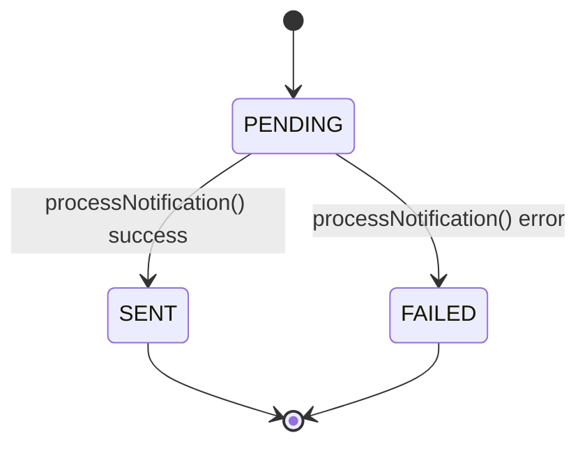
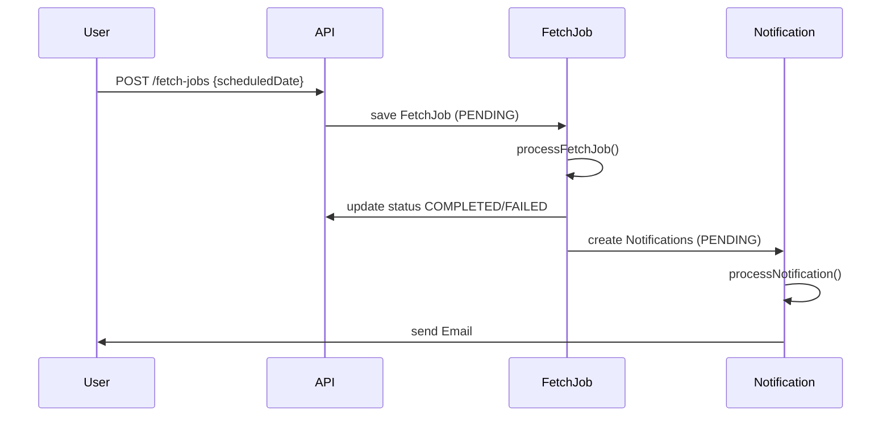

### 1. Entity Definitions

``` 
FetchJob:
- id: String (unique identifier for the fetch job)
- scheduledDate: LocalDate (date the NBA game scores are fetched for)
- status: StatusEnum (PENDING, PROCESSING, COMPLETED, FAILED)
- resultSummary: String (summary or metadata about fetch results)

Subscriber:
- id: String (unique identifier for subscriber)
- email: String (subscriber's email address)
- status: StatusEnum (ACTIVE, INACTIVE)

Notification:
- id: String (unique identifier for notification event)
- subscriberId: String (reference to Subscriber)
- jobId: String (reference to FetchJob)
- status: StatusEnum (PENDING, SENT, FAILED)
- sentAt: OffsetDateTime (timestamp when email was sent)
```

---

### 2. Process Method Flows

``` 
processFetchJob() Flow:
1. Initial State: FetchJob created with PENDING status
2. Execution: Fetch NBA scores from external API for scheduledDate
3. Persistence: Save fetched game data locally (immutable records)
4. Status Update: Update FetchJob status to COMPLETED or FAILED
5. Trigger Notifications: Create Notification entities with PENDING status for all ACTIVE Subscribers

processNotification() Flow:
1. Initial State: Notification created with PENDING status
2. Email Dispatch: Send game score email to subscriber.email
3. Status Update: Update Notification status to SENT or FAILED with sentAt timestamp
```

---

### 3. API Endpoints Design

| Method | Endpoint                 | Description                             | Request Body Example                          | Response Example                             |
|--------|--------------------------|-------------------------------------|-----------------------------------------------|----------------------------------------------|
| POST   | /fetch-jobs              | Create a new FetchJob (triggers data fetch) | `{ "scheduledDate": "2024-06-15" }`           | `{ "id": "job123", "status": "PENDING" }`   |
| GET    | /fetch-jobs/{id}         | Retrieve details and status of a FetchJob | N/A                                           | `{ "id": "job123", "status": "COMPLETED", "resultSummary": "20 games fetched" }` |
| POST   | /subscribers             | Create new subscriber (starts subscription) | `{ "email": "user@example.com" }`              | `{ "id": "sub123", "status": "ACTIVE" }`    |
| GET    | /subscribers/{id}        | Get subscriber info                    | N/A                                           | `{ "id": "sub123", "email": "user@example.com", "status": "ACTIVE" }` |
| GET    | /notifications/{subscriberId} | Retrieve notification history for subscriber | N/A                                           | `[ { "id": "notif456", "jobId": "job123", "status": "SENT", "sentAt": "2024-06-15T10:00:00Z" } ]` |

---

### 4. Request/Response JSON Formats

**Create FetchJob (POST /fetch-jobs)**
```json
{
  "scheduledDate": "2024-06-15"
}
```

**FetchJob Response**
```json
{
  "id": "job123",
  "status": "PENDING"
}
```

**Create Subscriber (POST /subscribers)**
```json
{
  "email": "user@example.com"
}
```

**Subscriber Response**
```json
{
  "id": "sub123",
  "status": "ACTIVE"
}
```

---

### Mermaid Diagrams

**FetchJob Lifecycle State Diagram**


```mermaid
stateDiagram-v2
    [*] --> PENDING
    PENDING --> PROCESSING : processFetchJob()
    PROCESSING --> COMPLETED : success
    PROCESSING --> FAILED : error
    COMPLETED --> [*]
    FAILED --> [*]
```

**Notification Lifecycle State Diagram**


```mermaid
stateDiagram-v2
    [*] --> PENDING
    PENDING --> SENT : processNotification() success
    PENDING --> FAILED : processNotification() error
    SENT --> [*]
    FAILED --> [*]
```

**Event-Driven Processing Chain**

```mermaid
graph TD
    A[Create FetchJob POST] --> B[processFetchJob()]
    B --> C[Save NBA Scores]
    C --> D[Create Notification entities for Subscribers]
    D --> E[processNotification() for each Notification]
    E --> F[Send Email]
```

**User Interaction Sequence**


```mermaid
sequenceDiagram
    participant User
    participant API
    participant FetchJob
    participant Notification
    User->>API: POST /fetch-jobs {scheduledDate}
    API->>FetchJob: save FetchJob (PENDING)
    FetchJob->>FetchJob: processFetchJob()
    FetchJob->>API: update status COMPLETED/FAILED
    FetchJob->>Notification: create Notifications (PENDING)
    Notification->>Notification: processNotification()
    Notification->>User: send Email
```

---

Thank you! Please let me know if you need any further details or adjustments.