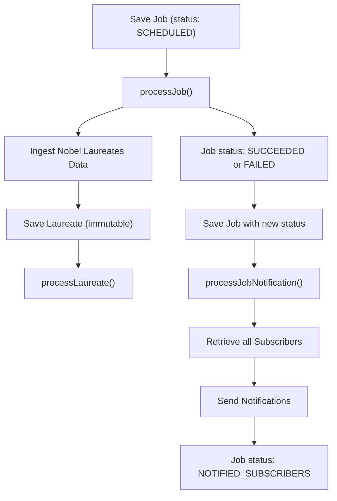

# Functional Requirements for Nobel Laureates Data Ingestion Application

---

## 1. Entity Definitions

```
Job:
- jobName: String (unique name or identifier for the ingestion job)
- status: String (current state: SCHEDULED, INGESTING, SUCCEEDED, FAILED, NOTIFIED_SUBSCRIBERS)
- createdAt: String (timestamp when the job was created)
- completedAt: String (timestamp when the job finished, optional)
- errorMessage: String (optional, populated if job failed)

Laureate:
- laureateId: String (unique identifier from the data source)
- firstname: String
- surname: String
- gender: String
- born: String (date of birth)
- died: String (date of death or empty)
- bornCountry: String
- bornCountryCode: String
- bornCity: String
- year: String (award year)
- category: String (award category)
- motivation: String (award motivation text)
- affiliationName: String
- affiliationCity: String
- affiliationCountry: String
- ingestedAt: String (timestamp when laureate was ingested)

Subscriber:
- subscriberId: String (unique subscriber identifier)
- contactType: String (e.g., email, webhook)
- contactValue: String (email address or webhook URL)
- subscribedAt: String (timestamp of subscription)
```

---

## 2. Process Method Flows

### processJob() Flow
1. Initial State: Job created with status **SCHEDULED**  
2. Transition: Update status to **INGESTING**  
3. Data Ingestion: Call OpenDataSoft API to fetch Nobel laureates data  
4. For each laureate record:  
   - Save **Laureate** entity (immutable creation)  
   - Triggers `processLaureate()` event  
5. On success:  
   - Update Job status to **SUCCEEDED**  
6. On failure:  
   - Update Job status to **FAILED**, save `errorMessage`  
7. Trigger notification workflow by saving Job with new status (either SUCCEEDED or FAILED)  

### processLaureate() Flow
1. Validate required laureate fields (optional explicit checks if requested)  
2. Enrich data if needed (e.g., normalize country codes)  
3. Mark processing complete (no update, since entity is immutable)  

### processJobNotification() Flow
1. Triggered after Job entity saved with **SUCCEEDED** or **FAILED** status  
2. Retrieve all **Subscriber** entities  
3. For each Subscriber:  
   - Send notification with Job result and optionally new laureates ingested  
4. Update Job status to **NOTIFIED_SUBSCRIBERS**  

---

## 3. API Endpoints Design

| Entity     | POST Endpoint                | GET Endpoint by technicalId            | GET All / By Condition          |
|------------|-----------------------------|---------------------------------------|--------------------------------|
| Job        | POST /jobs                  | GET /jobs/{technicalId}                | Optional GET /jobs              |
| Laureate   | No POST (created via Job)   | GET /laureates/{technicalId}           | Optional GET /laureates         |
| Subscriber | POST /subscribers           | GET /subscribers/{technicalId}         | Optional GET /subscribers       |

- **POST /jobs**: Create a new Job entity with status **SCHEDULED** and trigger ingestion  
- **POST /subscribers**: Add a new Subscriber  
- No update or delete endpoints for any entity (immutable creation only)  

---

## 4. Request/Response Formats

### POST /jobs

**Request:**
```json
{
  "jobName": "NobelIngestionJob-2024-06-01"
}
```

**Response:**
```json
{
  "technicalId": "generated-job-id-123"
}
```

---

### GET /jobs/{technicalId}

**Response:**
```json
{
  "jobName": "NobelIngestionJob-2024-06-01",
  "status": "SUCCEEDED",
  "createdAt": "2024-06-01T10:00:00Z",
  "completedAt": "2024-06-01T10:05:00Z",
  "errorMessage": null
}
```

---

### POST /subscribers

**Request:**
```json
{
  "contactType": "email",
  "contactValue": "subscriber@example.com"
}
```

**Response:**
```json
{
  "technicalId": "generated-subscriber-id-456"
}
```

---

### GET /subscribers/{technicalId}

**Response:**
```json
{
  "contactType": "email",
  "contactValue": "subscriber@example.com",
  "subscribedAt": "2024-06-01T09:00:00Z"
}
```

---

### GET /laureates/{technicalId}

**Response:**
```json
{
  "laureateId": "12345",
  "firstname": "Albert",
  "surname": "Einstein",
  "gender": "male",
  "born": "1879-03-14",
  "died": "1955-04-18",
  "bornCountry": "Germany",
  "bornCountryCode": "DE",
  "bornCity": "Ulm",
  "year": "1921",
  "category": "Physics",
  "motivation": "for his services to Theoretical Physics",
  "affiliationName": "Princeton University",
  "affiliationCity": "Princeton",
  "affiliationCountry": "USA",
  "ingestedAt": "2024-06-01T10:02:00Z"
}
```

---

## 5. Event-Driven Processing Chain Diagram


```mermaid
flowchart TD
  A["Save Job (status: SCHEDULED)"]
  B["processJob()"]
  C["Ingest Nobel Laureates Data"]
  D["Save Laureate (immutable)"]
  E["processLaureate()"]
  F["Job status: SUCCEEDED or FAILED"]
  G["Save Job with new status"]
  H["processJobNotification()"]
  I["Retrieve all Subscribers"]
  J["Send Notifications"]
  K["Job status: NOTIFIED_SUBSCRIBERS"]

  A --> B
  B --> C
  C --> D
  D --> E
  B --> F
  F --> G
  G --> H
  H --> I
  I --> J
  J --> K
```

---

This document represents the finalized functional specification for the backend application implementing Nobel laureates data ingestion and subscriber notification using Event-Driven Architecture principles on the Cyoda platform.