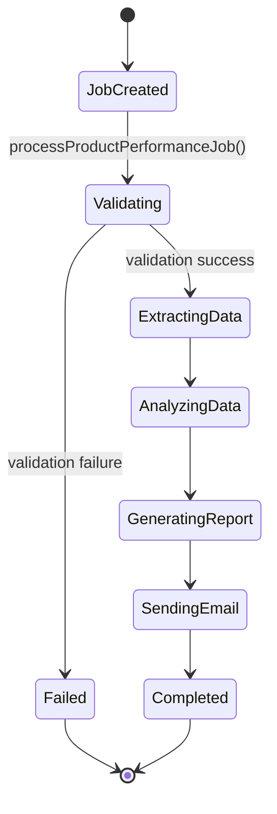
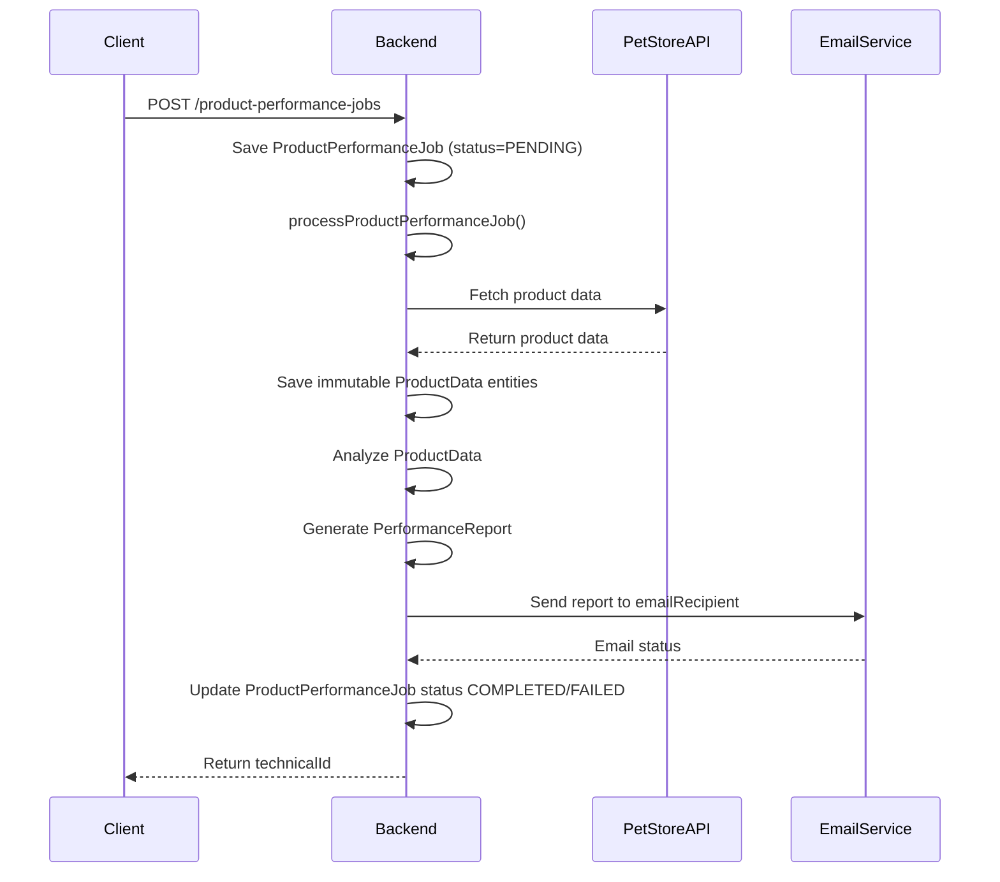
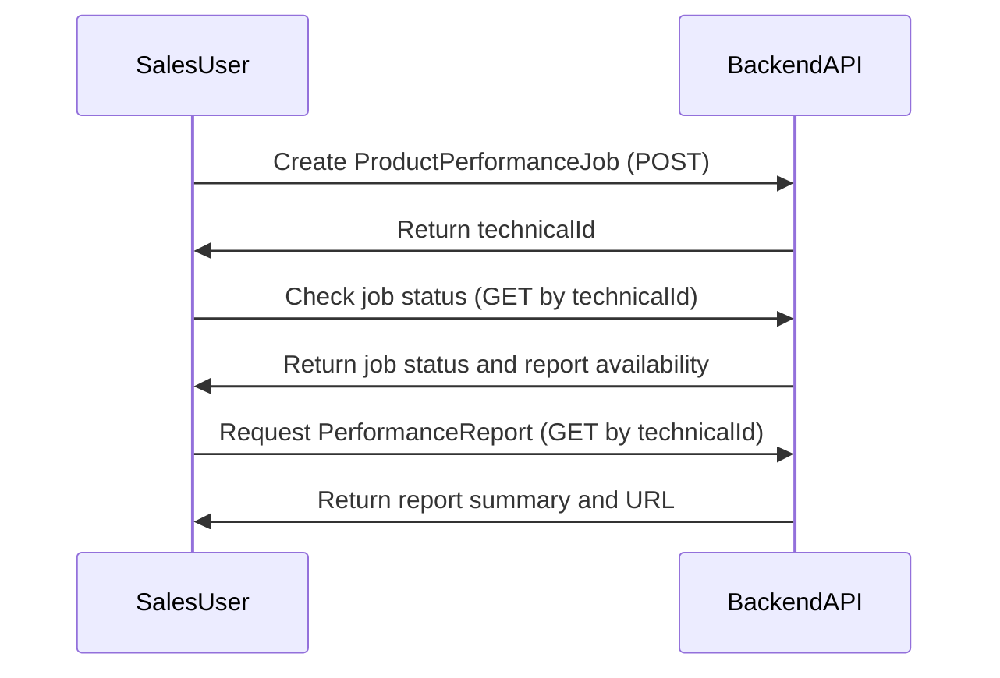

### 1. Entity Definitions

``` 
ProductPerformanceJob:
- requestDate: LocalDateTime (timestamp when the job was created/requested)
- status: String (status of the job, e.g., PENDING, PROCESSING, COMPLETED, FAILED)
- reportFormat: String (desired format of the output report, e.g., PDF)
- emailRecipient: String (email address to send the report to, e.g., victoria.sagdieva@cyoda.com)
- scheduledDay: String (day of week when job runs, e.g., MONDAY)

ProductData:
- productId: String (unique identifier of the product from Pet Store API)
- name: String (name of the product)
- category: String (product category)
- salesVolume: Integer (number of units sold in the reporting period)
- revenue: Double (total revenue generated in the reporting period)
- inventoryCount: Integer (current stock level)

PerformanceReport:
- jobTechnicalId: String (reference to ProductPerformanceJob technicalId)
- generatedAt: LocalDateTime (timestamp when report was generated)
- summary: String (text summary of key insights)
- reportFileUrl: String (URL or location of the generated report file)
```

---

### 2. Process Method Flows

```
processProductPerformanceJob() Flow:
1. Initial State: ProductPerformanceJob created with status PENDING.
2. Validation: Check if scheduledDay is MONDAY and emailRecipient is valid.
3. Data Extraction: Fetch all product data from Pet Store API.
4. Data Persistence: Save retrieved ProductData entities immutably.
5. Analysis: Calculate KPIs such as total sales, revenue, inventory turnover.
6. Report Generation: Create PerformanceReport in desired format (e.g., PDF).
7. Email Dispatch: Send report to emailRecipient.
8. Completion: Update ProductPerformanceJob status to COMPLETED or FAILED.
```

```
processProductData() Flow:
1. Initial State: ProductData entity created from API fetch.
2. Validation: Ensure data completeness (productId, salesVolume, revenue, inventoryCount).
3. Persistence: Store immutable snapshot of product performance data.
4. Notification: Trigger any downstream processing if needed (optional).
```

```
processPerformanceReport() Flow:
1. Initial State: PerformanceReport entity created after analysis.
2. Validation: Confirm report integrity and format.
3. Persistence: Save report metadata and file URL.
4. Notification: Confirm email sent or retry if failed.
```

---

### 3. API Endpoints Design

| Method | Path                         | Description                                      | Request Body         | Response                      |
|--------|------------------------------|------------------------------------------------|----------------------|-------------------------------|
| POST   | /product-performance-jobs    | Create a new ProductPerformanceJob (triggers job execution) | ProductPerformanceJob (without technicalId) | `{ "technicalId": "uuid" }`   |
| GET    | /product-performance-jobs/{technicalId} | Retrieve job status and metadata                | N/A                  | ProductPerformanceJob details  |
| GET    | /product-data/{technicalId}  | Retrieve stored ProductData by technicalId     | N/A                  | ProductData details            |
| GET    | /performance-report/{technicalId} | Retrieve generated PerformanceReport metadata  | N/A                  | PerformanceReport details      |

---

### 4. Request/Response Formats

**POST /product-performance-jobs**  
Request:  
```json
{
  "requestDate": "2024-06-10T09:00:00",
  "reportFormat": "PDF",
  "emailRecipient": "victoria.sagdieva@cyoda.com",
  "scheduledDay": "MONDAY"
}
```

Response:  
```json
{
  "technicalId": "123e4567-e89b-12d3-a456-426614174000"
}
```

**GET /product-performance-jobs/{technicalId}**  
Response:  
```json
{
  "requestDate": "2024-06-10T09:00:00",
  "status": "COMPLETED",
  "reportFormat": "PDF",
  "emailRecipient": "victoria.sagdieva@cyoda.com",
  "scheduledDay": "MONDAY"
}
```

**GET /product-data/{technicalId}**  
Response:  
```json
{
  "productId": "p001",
  "name": "Cat Food",
  "category": "Food",
  "salesVolume": 150,
  "revenue": 2250.00,
  "inventoryCount": 75
}
```

**GET /performance-report/{technicalId}**  
Response:  
```json
{
  "jobTechnicalId": "123e4567-e89b-12d3-a456-426614174000",
  "generatedAt": "2024-06-10T12:00:00",
  "summary": "Top products: Cat Food, Dog Toy; Inventory low for Bird Cage.",
  "reportFileUrl": "https://reports.cyoda.com/report123.pdf"
}
```

---

### 5. Visual Representations

**Entity Lifecycle State Diagram (ProductPerformanceJob)**


```mermaid
stateDiagram-v2
    [*] --> JobCreated
    JobCreated --> Validating : processProductPerformanceJob()
    Validating --> ExtractingData : validation success
    Validating --> Failed : validation failure
    ExtractingData --> AnalyzingData
    AnalyzingData --> GeneratingReport
    GeneratingReport --> SendingEmail
    SendingEmail --> Completed
    Failed --> [*]
    Completed --> [*]
```

**Event-Driven Processing Chain**


```mermaid
sequenceDiagram
    participant Client
    participant Backend
    participant PetStoreAPI
    participant EmailService

    Client->>Backend: POST /product-performance-jobs
    Backend->>Backend: Save ProductPerformanceJob (status=PENDING)
    Backend->>Backend: processProductPerformanceJob()
    Backend->>PetStoreAPI: Fetch product data
    PetStoreAPI-->>Backend: Return product data
    Backend->>Backend: Save immutable ProductData entities
    Backend->>Backend: Analyze ProductData
    Backend->>Backend: Generate PerformanceReport
    Backend->>EmailService: Send report to emailRecipient
    EmailService-->>Backend: Email status
    Backend->>Backend: Update ProductPerformanceJob status COMPLETED/FAILED
    Backend-->>Client: Return technicalId
```

**User Interaction Sequence Flow**


```mermaid
sequenceDiagram
    participant SalesUser
    participant BackendAPI

    SalesUser->>BackendAPI: Create ProductPerformanceJob (POST)
    BackendAPI->>SalesUser: Return technicalId
    SalesUser->>BackendAPI: Check job status (GET by technicalId)
    BackendAPI->>SalesUser: Return job status and report availability
    SalesUser->>BackendAPI: Request PerformanceReport (GET by technicalId)
    BackendAPI->>SalesUser: Return report summary and URL
```

---

This completes the finalized functional requirements for your Product Performance Analysis and Reporting System using Event-Driven Architecture principles. Please feel free to request any further clarifications or additions!