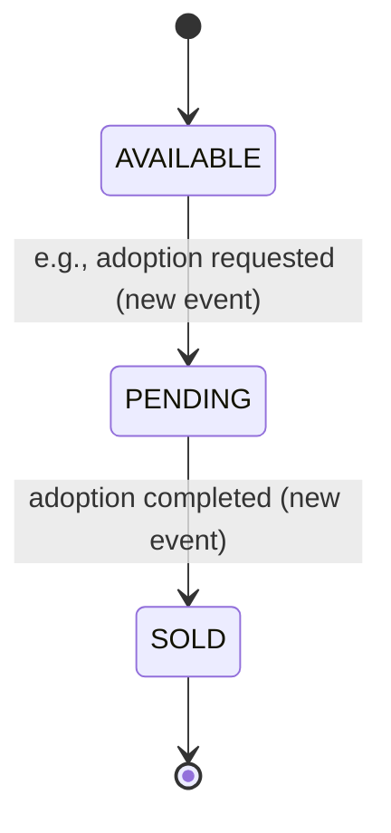
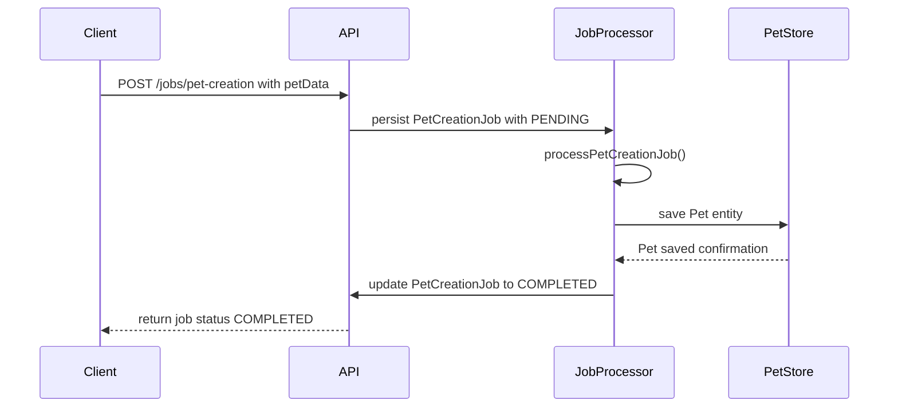

Certainly! Here is the final well-formatted version of your functional requirements for the 'Purrfect Pets' API app using Event-Driven Architecture:

---

### 1. Entity Definitions

``` 
PetCreationJob:
- jobId: String (unique identifier for the job)
- petData: JSON (raw data payload for pet creation)
- status: JobStatusEnum (PENDING, PROCESSING, COMPLETED, FAILED)

Pet:
- petId: Long (unique pet identifier)
- name: String (pet's name)
- category: String (e.g., Cat, Dog)
- photoUrls: List<String> (images of the pet)
- tags: List<String> (descriptive tags)
- status: PetStatusEnum (AVAILABLE, PENDING, SOLD)
```

---

### 2. Process Method Flows

```
processPetCreationJob() Flow:
1. Initial State: PetCreationJob created with PENDING status.
2. Validation: Verify petData structure and mandatory fields.
3. Transformation: Map petData into Pet entity fields.
4. Persistence: Save new Pet entity with status AVAILABLE.
5. Completion: Update PetCreationJob status to COMPLETED or FAILED.
6. Notification: Log results or trigger downstream events if needed.
```

```
processPet() Flow:
1. Initial State: Pet created with AVAILABLE status.
2. Business Logic: (Optional) Could trigger notifications or inventory updates.
3. Completion: Status remains unless changed by a new event.
```

---

### 3. API Endpoints Design

| Method | Path                  | Description                                      | Request Body                   | Response Body                   |
|--------|-----------------------|------------------------------------------------|--------------------------------|--------------------------------|
| POST   | /jobs/pet-creation    | Create PetCreationJob (triggers pet creation)  | `{ "petData": {…} }`           | `{ "jobId": "...", "status": "PENDING" }` |
| GET    | /pets/{petId}         | Retrieve Pet details                             | N/A                            | `{ "petId": ..., "name": "...", "category": "...", ... }` |
| GET    | /jobs/{jobId}         | Retrieve PetCreationJob status                   | N/A                            | `{ "jobId": "...", "status": "COMPLETED" }` |

---

### 4. Request/Response JSON Examples

**POST /jobs/pet-creation**

Request:

```json
{
  "petData": {
    "name": "Whiskers",
    "category": "Cat",
    "photoUrls": ["http://example.com/whiskers1.jpg"],
    "tags": ["cute", "fluffy"],
    "status": "AVAILABLE"
  }
}
```

Response:

```json
{
  "jobId": "job-12345",
  "status": "PENDING"
}
```

---

**GET /pets/{petId}**

Response:

```json
{
  "petId": 101,
  "name": "Whiskers",
  "category": "Cat",
  "photoUrls": ["http://example.com/whiskers1.jpg"],
  "tags": ["cute", "fluffy"],
  "status": "AVAILABLE"
}
```

---

### Mermaid Diagrams

**Entity Lifecycle State Diagram for PetCreationJob**


```mermaid
stateDiagram-v2
    [*] --> PENDING
    PENDING --> PROCESSING : processPetCreationJob()
    PROCESSING --> COMPLETED : success
    PROCESSING --> FAILED : error
    COMPLETED --> [*]
    FAILED --> [*]
```

---

**Entity Lifecycle State Diagram for Pet**


```mermaid
stateDiagram-v2
    [*] --> AVAILABLE
    AVAILABLE --> PENDING : e.g., adoption requested (new event)
    PENDING --> SOLD : adoption completed (new event)
    SOLD --> [*]
```

---

**Event-Driven Processing Chain**


```mermaid
sequenceDiagram
    participant Client
    participant API
    participant JobProcessor
    participant PetStore

    Client->>API: POST /jobs/pet-creation with petData
    API->>JobProcessor: persist PetCreationJob with PENDING
    JobProcessor->>JobProcessor: processPetCreationJob()
    JobProcessor->>PetStore: save Pet entity
    PetStore-->>JobProcessor: Pet saved confirmation
    JobProcessor->>API: update PetCreationJob to COMPLETED
    API-->>Client: return job status COMPLETED
```

---

If you need any further assistance or adjustments, feel free to ask!