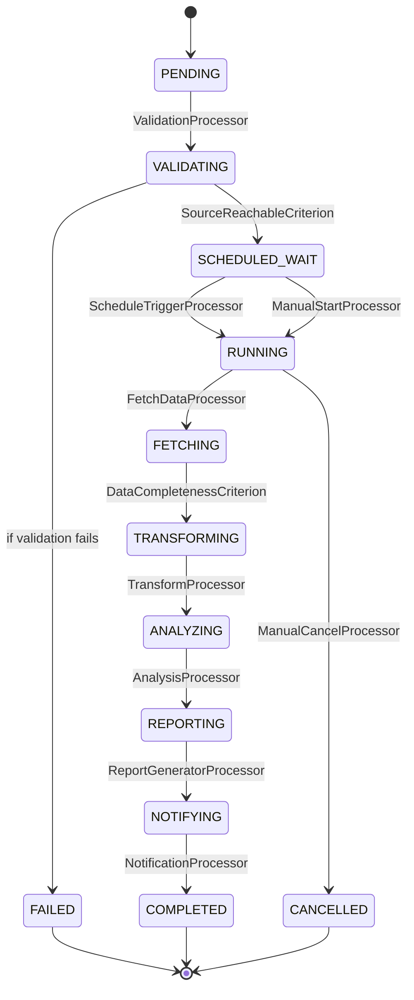
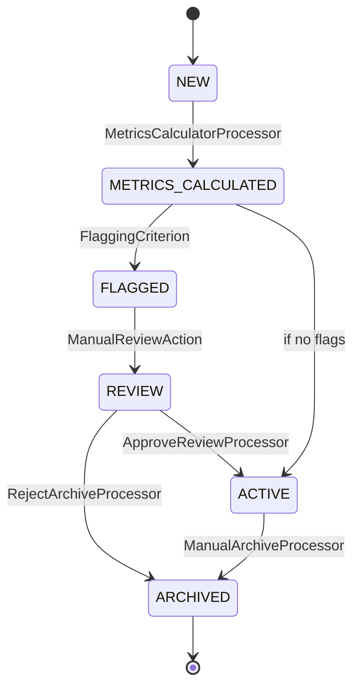
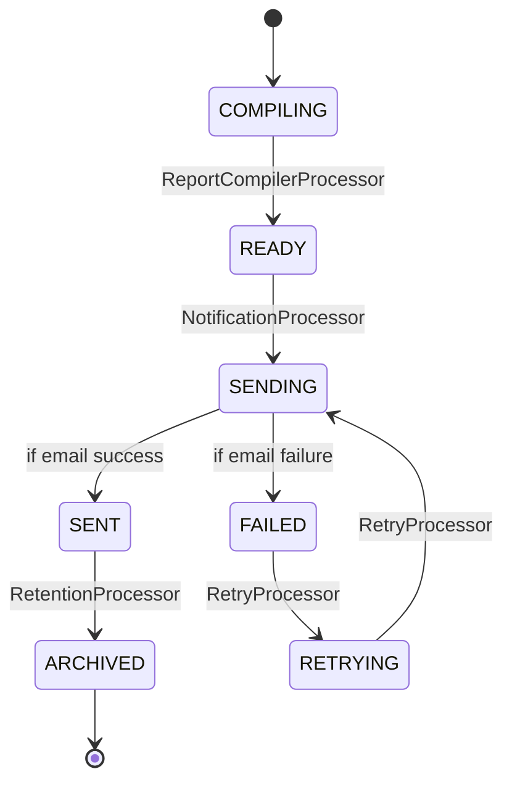
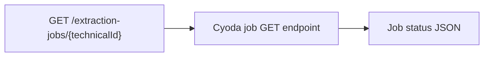
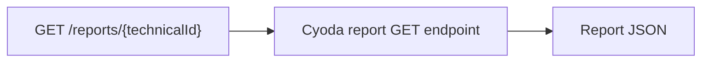
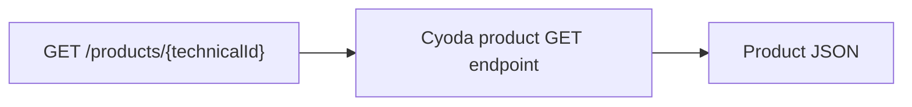

### Note
You did not request a different entity count, so I used the default of 3 entities (max allowed 10). If you want more entities (up to 10) tell me which ones to add.

### 1. Entity Definitions
```
ExtractionJob:
- jobId: String (business id for the job)
- schedule: String (human/corn-like representation, e.g., weekly Monday 09:00 Europe/Moscow)
- sourceUrl: String (Pet Store API endpoint base)
- parameters: Object (filters, formats to request e.g., JSON or XML)
- recipients: Array[String] (email addresses to send report to)
- reportTemplateId: String (reference to chosen report layout)
- lastRunAt: DateTime (timestamp of last attempt)
- status: String (PENDING, SCHEDULED, RUNNING, FAILED, COMPLETED, CANCELLED)
- createdAt: DateTime

Product:
- productId: String (id from Pet Store API)
- name: String (product title)
- category: String (product category)
- sku: String (stock keeping unit)
- price: Number (unit price)
- stockLevel: Integer (current inventory)
- salesHistory: Array[Object] (time series entries: {date, unitsSold, revenue})
- metrics: Object (computed KPIs: salesVolume, revenue, turnoverRate, lastPeriodComparison)
- lastUpdated: DateTime

Report:
- reportId: String (report business id)
- periodStart: Date (report period start)
- periodEnd: Date (report period end)
- generatedAt: DateTime
- summaryMetrics: Object (topSellers, lowMovers, restockCandidates, highlights)
- attachments: Array[Object] (entries: {type, url, filename, size})
- status: String (COMPILING, READY, SENT, FAILED)
- recipients: Array[String]
- createdFromJobId: String (references ExtractionJob.jobId)
```

---

### 2. Entity workflows

ExtractionJob workflow:
1. Initial State: Job created with PENDING status (persisted -> event triggers workflow)
2. Validation: Check parameters and source reachability (automatic)
3. Scheduled wait or Manual start: wait until schedule trigger or manual START (automatic/manual)
4. Fetching: Invoke FetchDataProcessor to retrieve product and sales data (automatic)
5. Transformation: Normalize and store Product entities (automatic)
6. Analysis: Compute KPIs per Product (automatic)
7. Report Generation: Create Report entity and attachments (automatic)
8. Notification: Email recipients and update status (automatic)
9. Completion: Mark job COMPLETED or FAILED (automatic) ; manual CANCEL allowed


```mermaid
stateDiagram-v2
    [*] --> PENDING
    PENDING --> VALIDATING : ValidationProcessor
    VALIDATING --> SCHEDULED_WAIT : SourceReachableCriterion
    VALIDATING --> FAILED : if validation fails
    SCHEDULED_WAIT --> RUNNING : ScheduleTriggerProcessor
    SCHEDULED_WAIT --> RUNNING : ManualStartProcessor
    RUNNING --> FETCHING : FetchDataProcessor
    FETCHING --> TRANSFORMING : DataCompletenessCriterion
    TRANSFORMING --> ANALYZING : TransformProcessor
    ANALYZING --> REPORTING : AnalysisProcessor
    REPORTING --> NOTIFYING : ReportGeneratorProcessor
    NOTIFYING --> COMPLETED : NotificationProcessor
    FAILED --> [*]
    COMPLETED --> [*]
    RUNNING --> CANCELLED : ManualCancelProcessor
    CANCELLED --> [*]
```

Processors (suggested) for ExtractionJob:
- ValidationProcessor
- ScheduleTriggerProcessor / ManualStartProcessor
- FetchDataProcessor
- TransformProcessor
- AnalysisProcessor
- ReportGeneratorProcessor
- NotificationProcessor

Criteria:
- SourceReachableCriterion (is API reachable/auth valid)
- DataCompletenessCriterion (required fields present)
- AnalysisCompleteCriterion (analysis produced required KPIs)

Product workflow:
1. Initial State: Product persisted (by transform) as NEW
2. Metrics Calculation: compute metrics for this product (automatic)
3. Flagging: if metrics show low performance or restock need, set flags (automatic)
4. Review: optional manual review by a user (manual)
5. Active / Archived: remain active or archived (manual/automatic)


```mermaid
stateDiagram-v2
    [*] --> NEW
    NEW --> METRICS_CALCULATED : MetricsCalculatorProcessor
    METRICS_CALCULATED --> FLAGGED : FlaggingCriterion
    FLAGGED --> REVIEW : ManualReviewAction
    REVIEW --> ACTIVE : ApproveReviewProcessor
    REVIEW --> ARCHIVED : RejectArchiveProcessor
    METRICS_CALCULATED --> ACTIVE : if no flags
    ACTIVE --> ARCHIVED : ManualArchiveProcessor
    ARCHIVED --> [*]
```

Processors for Product:
- MetricsCalculatorProcessor
- FlaggingProcessor
- ManualReviewProcessor

Criteria:
- FlaggingCriterion (underperformer or restock threshold)
- FreshDataCriterion (is product data updated recently)

Report workflow:
1. Initial State: Report created with COMPILING status (triggered by job)
2. Compile: assemble summary metrics and attachments (automatic)
3. Ready: mark READY when attachments are available (automatic)
4. Send: NotificationProcessor sends email and attachments (automatic/manual resend)
5. Finalize: mark SENT or FAILED; archive after retention period (automatic/manual)


```mermaid
stateDiagram-v2
    [*] --> COMPILING
    COMPILING --> READY : ReportCompilerProcessor
    READY --> SENDING : NotificationProcessor
    SENDING --> SENT : if email success
    SENDING --> FAILED : if email failure
    SENT --> ARCHIVED : RetentionProcessor
    FAILED --> RETRYING : RetryProcessor
    RETRYING --> SENDING : RetryProcessor
    ARCHIVED --> [*]
```

Processors for Report:
- ReportCompilerProcessor
- AttachmentGeneratorProcessor
- NotificationProcessor
- RetryProcessor
- RetentionProcessor

Criteria:
- AttachmentsReadyCriterion
- RecipientsReachableCriterion

---

### 3. Pseudo code for processor classes (concise)

Extraction FetchDataProcessor
```
class FetchDataProcessor {
  process(job) {
    for endpoint in job.parameters.endpoints:
      resp = httpGet(job.sourceUrl + endpoint, job.parameters.format)
      if resp.status != 200 throw FetchError
      emit RawDataEvent with payload resp.body and jobId
  }
}
```

TransformProcessor
```
class TransformProcessor {
  process(rawEvent) {
    records = parse(rawEvent.payload)
    for r in records:
      product = mapToProduct(r)
      persist product
      emit ProductPersistedEvent(product.productId)
  }
}
```

AnalysisProcessor
```
class AnalysisProcessor {
  process(job) {
    products = queryProducts(since job.lastRunAt)
    for p in products:
      metrics = computeKPIs(p.salesHistory, p.stockLevel)
      update p.metrics
      if shouldFlag(metrics) emit ProductFlaggedEvent(p.productId, reason)
    emit AnalysisCompleteEvent(job.jobId, summary)
  }
}
```

ReportGeneratorProcessor
```
class ReportGeneratorProcessor {
  process(analysisEvent) {
    report = buildSummary(analysisEvent.summary)
    attachments = createAttachments(report, formats requested)
    persist report and attachments
    emit ReportPersistedEvent(report.reportId)
  }
}
```

NotificationProcessor
```
class NotificationProcessor {
  process(reportEvent) {
    try sendEmail(reportEvent.report.recipients, body summary, attachments)
    on success update report.status = SENT
    on failure schedule RetryProcessor
  }
}
```

Criteria examples (pseudo):
- SourceReachableCriterion: try HEAD request to sourceUrl; pass if 200 within timeout.
- DataCompletenessCriterion: check required fields exist in fetched payload.
- FlaggingCriterion: if turnoverRate < threshold OR stockLevel < reorderPoint -> true.

---

### 4. API Endpoints Design Rules and JSON formats

Rules applied:
- Only orchestration entity ExtractionJob has POST endpoint (creates a job and triggers workflows).
- POST returns only technicalId.
- GET endpoints provided to retrieve job, report, and product results by technicalId.
- No POST for Product or Report (they are created by processing events).

APIs
1) Create Extraction Job (POST) — creates an orchestration event that triggers full flow
- POST /extraction-jobs
Request JSON:
```
{
  "schedule": "weekly Monday 09:00 Europe/Moscow",
  "sourceUrl": "https://petstore.swagger.io/v2",
  "parameters": {"endpoints":["/store/inventory","/product"], "format":"JSON"},
  "recipients": ["victoria.sagdieva@cyoda.com"],
  "reportTemplateId": "weekly_summary_v1"
}
```
Response JSON (must contain only technicalId):
```
{
  "technicalId": "job_abc123"
}
```

Mermaid visualization of request/response:

```mermaid
flowchart LR
  RequestNode["POST /extraction-jobs request JSON"]
  Service["Cyoda ExtractionJob POST endpoint"]
  ResponseNode["Response JSON with technicalId"]
  RequestNode --> Service
  Service --> ResponseNode
```

2) Get Extraction Job by technicalId (GET)
- GET /extraction-jobs/{technicalId}
Response JSON:
```
{
  "jobId":"job_abc123",
  "schedule":"weekly Monday 09:00 Europe/Moscow",
  "status":"RUNNING",
  "lastRunAt":"2025-08-18T09:00:00Z",
  "createdAt":"2025-01-01T10:00:00Z",
  "progress":{"stage":"ANALYZING","percent":65}
}
```

Mermaid:

```mermaid
flowchart LR
  Client["GET /extraction-jobs/{technicalId}"]
  Service["Cyoda job GET endpoint"]
  Response["Job status JSON"]
  Client --> Service
  Service --> Response
```

3) Get Report by technicalId (GET)
- GET /reports/{technicalId}
Response JSON:
```
{
  "reportId":"report_987",
  "periodStart":"2025-08-11",
  "periodEnd":"2025-08-17",
  "status":"SENT",
  "generatedAt":"2025-08-18T02:00:00Z",
  "summaryMetrics":{...},
  "attachments":[{"type":"PDF","url":"https://.../report_987.pdf"}],
  "recipients":["victoria.sagdieva@cyoda.com"]
}
```

Mermaid:

```mermaid
flowchart LR
  Client["GET /reports/{technicalId}"]
  Service["Cyoda report GET endpoint"]
  Response["Report JSON"]
  Client --> Service
  Service --> Response
```

4) Get Product by technicalId (GET)
- GET /products/{technicalId}
Response JSON:
```
{
  "productId":"p_555",
  "name":"Dog Toy",
  "category":"toys",
  "price":9.99,
  "stockLevel":12,
  "metrics":{"salesVolume":34,"revenue":339.66,"turnoverRate":0.7},
  "lastUpdated":"2025-08-17T12:00:00Z"
}
```

Mermaid:

```mermaid
flowchart LR
  Client["GET /products/{technicalId}"]
  Service["Cyoda product GET endpoint"]
  Response["Product JSON"]
  Client --> Service
  Service --> Response
```

Notes and open questions (please confirm):
- What exact Monday time and timezone should the schedule use?
- Confirm report format preference (PDF + CSV attachment, or other).
- Restock/flag thresholds: do you want fixed rules (e.g., stockLevel < 10) or dynamic (turnover based)?
- Do you want a manual POST to trigger an ad-hoc report job (in addition to scheduled ExtractionJob)?

If you confirm these, I will update thresholds, include any additional processors or entities, or expand to more entities (up to 10).