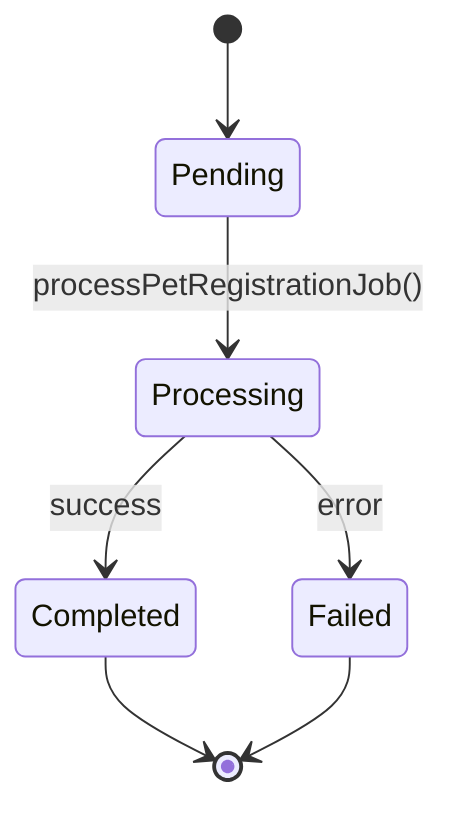
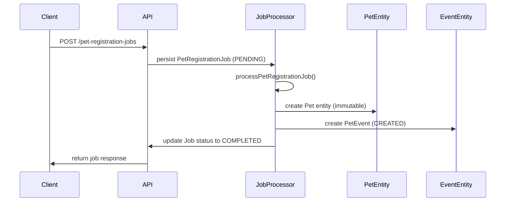
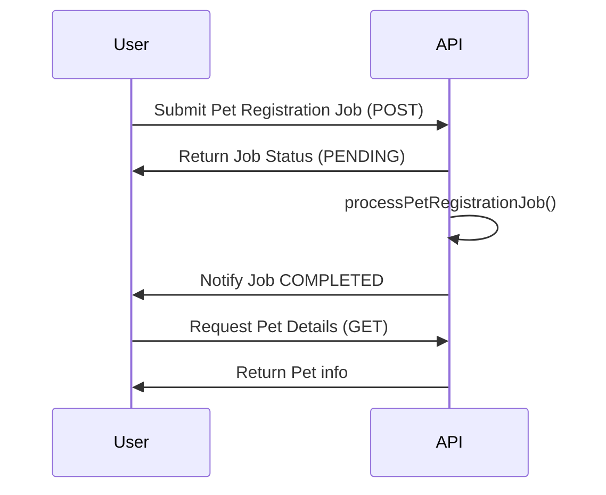

Certainly! Here is the well-formatted final version of your "Purrfect Pets" API functional requirements following the Event-Driven Architecture approach on Cyoda:

---

### 1. Entity Definitions

``` 
PetRegistrationJob:
- jobId: String (unique identifier for the job)
- petName: String (name of the pet to register)
- petType: String (type/species of the pet, e.g., cat, dog)
- ownerName: String (owner's name)
- status: StatusEnum (PENDING, PROCESSING, COMPLETED, FAILED)

Pet:
- petId: String (unique pet identifier)
- name: String (pet's name)
- type: String (species/category)
- owner: String (owner's name)
- registeredAt: DateTime (timestamp of registration)
- status: StatusEnum (ACTIVE, INACTIVE)

PetEvent:
- eventId: String (unique event identifier)
- petId: String (associated pet identifier)
- eventType: String (e.g., CREATED, UPDATED)
- eventTimestamp: DateTime (when the event occurred)
- status: StatusEnum (RECORDED, PROCESSED)
```

---

### 2. Process Method Flows

``` 
processPetRegistrationJob() Flow:
1. Initial State: PetRegistrationJob created with PENDING status
2. Validation: Validate pet details (name, type, owner)
3. Processing: Create new Pet entity (immutable creation)
4. Event Creation: Generate PetEvent with eventType CREATED
5. Completion: Update PetRegistrationJob status to COMPLETED or FAILED
6. Notification: Log job completion and event creation
```

``` 
processPetEvent() Flow:
1. Initial State: PetEvent created with RECORDED status
2. Processing: Handle event-driven updates or triggers (e.g., notify owner)
3. Completion: Update PetEvent status to PROCESSED
```

---

### 3. API Endpoints Design

- `POST /pet-registration-jobs`  
  - Creates a PetRegistrationJob entity  
  - Triggers `processPetRegistrationJob()` event  
  - Returns job details with current status  

- `GET /pets/{petId}`  
  - Retrieves Pet entity details by petId  

- `GET /pets`  
  - Lists all registered Pets  

- `POST /pet-events`  
  - Creates a PetEvent entity  
  - Triggers `processPetEvent()` event  
  - Returns event details with status  

---

### 4. Request / Response Formats

**POST /pet-registration-jobs Request JSON**  
```json
{
  "petName": "Whiskers",
  "petType": "Cat",
  "ownerName": "Alice"
}
```

**POST /pet-registration-jobs Response JSON**  
```json
{
  "jobId": "job-123",
  "petName": "Whiskers",
  "petType": "Cat",
  "ownerName": "Alice",
  "status": "PENDING"
}
```

**GET /pets/{petId} Response JSON**  
```json
{
  "petId": "pet-456",
  "name": "Whiskers",
  "type": "Cat",
  "owner": "Alice",
  "registeredAt": "2024-06-01T12:34:56Z",
  "status": "ACTIVE"
}
```

**POST /pet-events Request JSON**  
```json
{
  "petId": "pet-456",
  "eventType": "CREATED"
}
```

**POST /pet-events Response JSON**  
```json
{
  "eventId": "event-789",
  "petId": "pet-456",
  "eventType": "CREATED",
  "eventTimestamp": "2024-06-01T12:35:00Z",
  "status": "RECORDED"
}
```

---

### Mermaid Diagrams

**Entity Lifecycle State Diagram - PetRegistrationJob**  

```mermaid
stateDiagram-v2
    [*] --> Pending
    Pending --> Processing : processPetRegistrationJob()
    Processing --> Completed : success
    Processing --> Failed : error
    Completed --> [*]
    Failed --> [*]
```

**Event-Driven Processing Chain**  

```mermaid
sequenceDiagram
    participant Client
    participant API
    participant JobProcessor
    participant PetEntity
    participant EventEntity

    Client->>API: POST /pet-registration-jobs
    API->>JobProcessor: persist PetRegistrationJob (PENDING)
    JobProcessor->>JobProcessor: processPetRegistrationJob()
    JobProcessor->>PetEntity: create Pet entity (immutable)
    JobProcessor->>EventEntity: create PetEvent (CREATED)
    JobProcessor->>API: update Job status to COMPLETED
    API->>Client: return job response
```

**User Interaction Sequence Flow**  

```mermaid
sequenceDiagram
    participant User
    participant API

    User->>API: Submit Pet Registration Job (POST)
    API->>User: Return Job Status (PENDING)
    API->>API: processPetRegistrationJob()
    API->>User: Notify Job COMPLETED
    User->>API: Request Pet Details (GET)
    API->>User: Return Pet info
```

---

Please let me know if you need any further refinement or additional features!