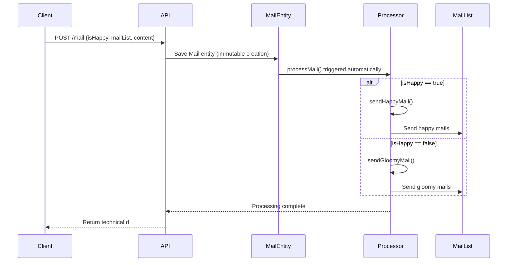

### 1. Entity Definitions
```
Mail:
- isHappy: Boolean (Indicates if the mail is happy (true) or gloomy (false))
- mailList: List<String> (List of recipient email addresses)
- content: String (Optional field to hold the mail content, to be used by processors)
```

### 2. Process Method Flows

```
processMail() Flow:
1. Initial State: Mail entity is created and persisted (immutable creation)
2. Validation: Optional checkMailIsHappy() or checkMailIsGloomy() criteria can be triggered if explicitly requested
3. Processing: 
   - If isHappy == true → trigger sendHappyMail() processor
   - If isHappy == false → trigger sendGloomyMail() processor
4. Execution: Corresponding processor sends emails to all addresses in mailList with respective content/templates
5. Completion: Processing completes, mail sent status can be logged or stored if needed (optional)
```

---

### 3. API Endpoints Design

| Endpoint                        | Description                                                                    | Request Body       | Response            |
|--------------------------------|--------------------------------------------------------------------------------|--------------------|---------------------|
| POST /mail                     | Create a new Mail entity, triggers `processMail()`                            | `{ isHappy, mailList, content? }` | `{ technicalId }`    |
| GET /mail/{technicalId}         | Retrieve Mail entity result/status by technicalId                             | N/A                | Mail entity details (including `isHappy`, `mailList`, content) |
| (Optional) GET /mail?isHappy=true/false | Retrieve mails filtered by `isHappy` value (only if explicitly requested) | N/A                | List of Mail entities matching criteria |

---

### 4. Request/Response Formats

**POST /mail Request Example**  
```json
{
  "isHappy": true,
  "mailList": ["user1@example.com", "user2@example.com"],
  "content": "Wishing you a wonderful day!"
}
```

**POST /mail Response Example**  
```json
{
  "technicalId": "abc123xyz"
}
```

**GET /mail/{technicalId} Response Example**  
```json
{
  "isHappy": true,
  "mailList": ["user1@example.com", "user2@example.com"],
  "content": "Wishing you a wonderful day!"
}
```

**Optional GET /mail?isHappy=true Response Example**  
```json
[
  {
    "isHappy": true,
    "mailList": ["user1@example.com"],
    "content": "Happy mail content"
  },
  {
    "isHappy": true,
    "mailList": ["user2@example.com", "user3@example.com"],
    "content": "Another happy mail"
  }
]
```

---

### 5. Mermaid Diagram: Event-Driven Processing Chain


```mermaid
sequenceDiagram
    participant Client
    participant API
    participant MailEntity
    participant Processor

    Client->>API: POST /mail {isHappy, mailList, content}
    API->>MailEntity: Save Mail entity (immutable creation)
    MailEntity->>Processor: processMail() triggered automatically
    alt isHappy == true
        Processor->>Processor: sendHappyMail()
        Processor->>MailList: Send happy mails
    else isHappy == false
        Processor->>Processor: sendGloomyMail()
        Processor->>MailList: Send gloomy mails
    end
    Processor-->>API: Processing complete
    API-->>Client: Return technicalId
```
