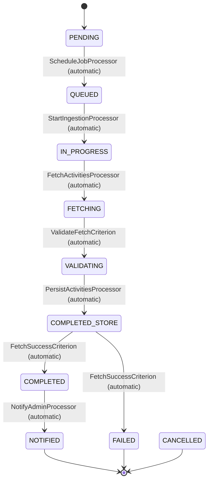
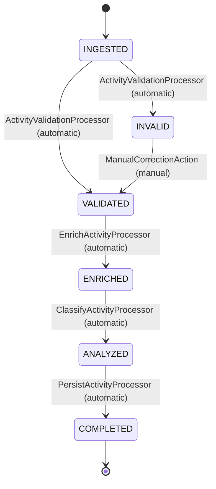
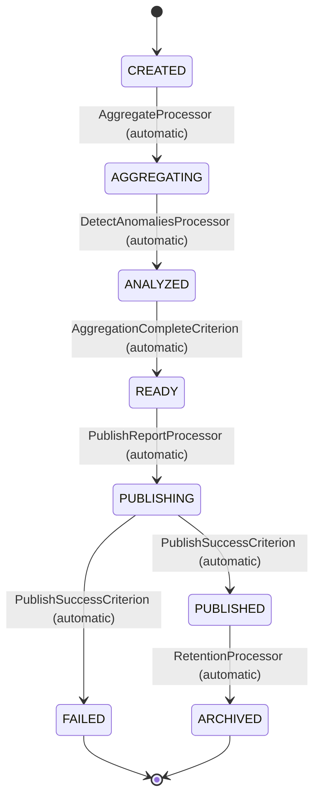

# Functional Requirements — Ingestion & Reporting Prototype

## Overview
This document defines the functional requirements for the ingestion, processing, and reporting pipelines for the activities ingestion prototype. It describes the domain entities, their attributes, their lifecycle (state machines), processors and criteria that drive transitions, and the public API surface.

The system is event-driven: persistence of an entity emits an event that triggers processors (business workers) which perform actions and update the entity. All processors below are specified at the business logic level (no implementation details).

---

## 1. Entity Definitions

Note: each entity includes a stable `technicalId` (opaque id returned by POST creation endpoints). Unless stated otherwise, all timestamps are ISO 8601 UTC.

### 1.1 IngestionJob

Attributes:
- technicalId: string (opaque id assigned on create)
- jobName: string (friendly name for the ingestion run)
- scheduleDate: string (ISO datetime when job is scheduled to run)
- windowStart: string (ISO datetime start of ingestion window)
- windowEnd: string (ISO datetime end of ingestion window)
- status: string (enumeration; see below)
- createdAt: string (ISO datetime)
- startedAt: string (ISO datetime)
- finishedAt: string (ISO datetime)
- notifiedAt: string (ISO datetime when admins were notified)
- summary: object (counts, errors, metrics; example: { fetched, persisted, errors })
- recipients: array (emails to notify on completion/failure)
- metadata: object (optional free-form metadata)

Status (enumeration):
- PENDING — created but not yet queued or scheduled
- QUEUED — scheduled and queued for immediate start
- IN_PROGRESS — processing has begun (umbrella state)
- FETCHING — currently fetching activity payloads from the external API
- VALIDATING — validating fetched payloads
- COMPLETED_STORE — all activities have been persisted (intermediate completion)
- COMPLETED — job finished successfully
- FAILED — job finished with unrecoverable errors
- NOTIFIED — notification step completed (finalization)
- CANCELLED — job intentionally cancelled

Notes:
- The `status` value must come from the above set; workflows below reference these states.


### 1.2 Activity

Attributes:
- technicalId: string (opaque id)
- activityId: string (external API id)
- userId: string (id of user from external system)
- timestamp: string (ISO datetime of activity)
- activityType: string (resolved type/category of activity)
- rawPayload: object (raw JSON from external API)
- validated: boolean (validation result; true when passed validation)
- validationErrors: array (optional list of validation failure reasons)
- enriched: object (derived metadata e.g., duration, tags, normalized fields)
- classificationScore: number (confidence of classification, 0..1)
- ingestionJobTechnicalId: string (foreign reference to job. Not nullable for ingested activities)
- persistedAt: string (ISO datetime when activity persisted)
- status: string (enumeration; see below)

Status (enumeration):
- INGESTED — created/ingested (raw payload persisted)
- VALIDATED — passed validation
- INVALID — failed validation and awaiting manual correction or discard
- ENRICHED — enrichment applied
- ANALYZED — classification/analysis applied
- COMPLETED — final persisted state (ready for reporting)

Notes:
- `validated` provides a quick boolean but `status` is authoritative for workflow progression.


### 1.3 DailyReport

Attributes:
- technicalId: string (opaque id)
- reportDate: string (ISO date for the report, e.g., 2025-08-20)
- generatedAt: string (ISO datetime when generation started)
- jobTechnicalId: string (IngestionJob technicalId used to build the report, optional)
- summaryMetrics: object (e.g., totalActivities, perTypeCounts, perUserCounts, hourlyDistribution)
- anomalies: array (list of detected anomalies with context)
- recipients: array (admin emails to receive the report)
- status: string (enumeration; see below)
- publishedAt: string (ISO datetime when report published)
- archivedAt: string (ISO datetime when archived)
- metadata: object (optional)

Status (enumeration):
- CREATED — report entity created, not yet aggregated
- AGGREGATING — aggregation in progress
- ANALYZED — anomaly detection and analysis complete
- READY — ready for publishing
- PUBLISHING — publishing step underway
- PUBLISHED — successfully published to recipients
- FAILED — failed during aggregation or publish
- ARCHIVED — archived after retention

Notes:
- `jobTechnicalId` links the report to the job that triggered generation. Reports can also be scheduled independently.

---

## 2. Entity Workflows (State Machines)

All workflows are event-driven; persistence updates and emitted events cause processors to run which may update the entity state and persist again (causing further events).

### 2.1 IngestionJob Workflow

Summary of transitions (states kept consistent with the IngestionJob.status enumeration):

1. Initial: PENDING (created via POST or scheduler)
2. Scheduling: If scheduleDate <= now => QUEUED (ScheduleJobProcessor)
3. Start: QUEUED => IN_PROGRESS (StartIngestionProcessor)
4. Fetching: IN_PROGRESS => FETCHING (FetchActivitiesProcessor)
5. Post-Fetch Validation: FETCHING => VALIDATING (ValidateFetchCriterion -> triggers PersistActivitiesProcessor)
6. Store Activities: VALIDATING -> COMPLETED_STORE (PersistActivitiesProcessor)
7. Finalization: COMPLETED_STORE -> COMPLETED or FAILED (FetchSuccessCriterion decides)
8. Notification: COMPLETED/FAILED -> NOTIFIED (NotifyAdminProcessor) [NOTIFIED is used to record notify completion]
9. Terminal: NOTIFIED -> [*] or CANCELLED/FAILED -> [*]

Mermaid (state diagram):


```mermaid
stateDiagram-v2
    [*] --> PENDING
    PENDING --> QUEUED : ScheduleJobProcessor (automatic)
    QUEUED --> IN_PROGRESS : StartIngestionProcessor (automatic)
    IN_PROGRESS --> FETCHING : FetchActivitiesProcessor (automatic)
    FETCHING --> VALIDATING : ValidateFetchCriterion (automatic)
    VALIDATING --> COMPLETED_STORE : PersistActivitiesProcessor (automatic)
    COMPLETED_STORE --> COMPLETED : FetchSuccessCriterion (automatic)
    COMPLETED_STORE --> FAILED : FetchSuccessCriterion (automatic)
    COMPLETED --> NOTIFIED : NotifyAdminProcessor (automatic)
    NOTIFIED --> [*]
    FAILED --> [*]
    CANCELLED --> [*]
```

Processors used (non-exhaustive):
- ScheduleJobProcessor (queues job when scheduleDate reached)
- StartIngestionProcessor (initial orchestration to set startedAt, status)
- FetchActivitiesProcessor (calls external API, persists Activity entities)
- ActivityValidationProcessor (applied per activity — may be invoked by FetchActivitiesProcessor, or by Activity persistence event)
- PersistActivitiesProcessor (ensures all activity records persisted, updates job summary)
- NotifyAdminProcessor (sends notifications and sets notifiedAt)

Criteria examples:
- ValidateFetchCriterion: API returned valid payloads and minimal structural checks passed
- FetchSuccessCriterion: all critical activities persisted and no unrecoverable errors

Notes:
- Cancellation is allowed if job is in PENDING/QUEUED before heavy processing begins.
- Errors and retry policies are outside this document but processors should record error details in job.summary.errors.


### 2.2 Activity Workflow

Summary:

1. Initial: INGESTED (created by FetchActivitiesProcessor)
2. Validation: INGESTED -> VALIDATED (ActivityValidationProcessor) or -> INVALID
3. Enrichment: VALIDATED -> ENRICHED (EnrichActivityProcessor)
4. Classification/Analysis: ENRICHED -> ANALYZED (ClassifyActivityProcessor)
5. Persist/Complete: ANALYZED -> COMPLETED (PersistActivityProcessor)
6. Manual Correction: INVALID -> VALIDATED (ManualCorrectionAction)

Mermaid (state diagram):


```mermaid
stateDiagram-v2
    [*] --> INGESTED
    INGESTED --> VALIDATED : ActivityValidationProcessor (automatic)
    INGESTED --> INVALID : ActivityValidationProcessor (automatic)
    VALIDATED --> ENRICHED : EnrichActivityProcessor (automatic)
    ENRICHED --> ANALYZED : ClassifyActivityProcessor (automatic)
    ANALYZED --> COMPLETED : PersistActivityProcessor (automatic)
    INVALID --> VALIDATED : ManualCorrectionAction (manual)
    COMPLETED --> [*]
```

Processors and criteria:
- ActivityValidationProcessor — checks required fields and timestamp within job window (ActivityValidityCriterion)
- EnrichActivityProcessor — derives additional fields (duration, tags, normalization)
- ClassifyActivityProcessor — assigns activityType and classificationScore
- PersistActivityProcessor — final persistence and indexing for reporting
- ManualCorrectionAction — admin UI/process to fix invalid activities

Notes:
- `validationErrors` should capture reasons for INVALID status.
- Activities that remain INVALID after a TTL may be flagged for deletion or manual review depending on operational policy.


### 2.3 DailyReport Workflow

Summary:
1. Initial: CREATED (report entity created by schedule or job completion)
2. Aggregation: CREATED -> AGGREGATING (AggregateProcessor)
3. Anomaly Detection: AGGREGATING -> ANALYZED (DetectAnomaliesProcessor)
4. Ready: ANALYZED -> READY (AggregationCompleteCriterion)
5. Publishing: READY -> PUBLISHING (PublishReportProcessor)
6. Completed: PUBLISHING -> PUBLISHED or -> FAILED (PublishSuccessCriterion)
7. Archive: PUBLISHED -> ARCHIVED (RetentionProcessor after retention period)

Mermaid (state diagram):


```mermaid
stateDiagram-v2
    [*] --> CREATED
    CREATED --> AGGREGATING : AggregateProcessor (automatic)
    AGGREGATING --> ANALYZED : DetectAnomaliesProcessor (automatic)
    ANALYZED --> READY : AggregationCompleteCriterion (automatic)
    READY --> PUBLISHING : PublishReportProcessor (automatic)
    PUBLISHING --> PUBLISHED : PublishSuccessCriterion (automatic)
    PUBLISHING --> FAILED : PublishSuccessCriterion (automatic)
    PUBLISHED --> ARCHIVED : RetentionProcessor (automatic)
    FAILED --> [*]
    ARCHIVED --> [*]
```

Processors and criteria:
- AggregateProcessor — computes summaryMetrics from Activities in the report window
- DetectAnomaliesProcessor — compares metrics to baseline and appends anomalies
- PublishReportProcessor — renders and delivers report to recipients
- RetentionProcessor — transitions to ARCHIVED per retention policy
- AggregationCompleteCriterion, PublishSuccessCriterion, AnomalyDetectionCriterion

Notes:
- Reports can be created on-demand or triggered by IngestionJob completion; `jobTechnicalId` is optional.

---

## 3. Processor Pseudocode (Business Logic)

Pseudocode below focuses on business logic and state updates. Implementations must persist state after each authoritative change so event-driven processors may react.

FetchActivitiesProcessor
```
class FetchActivitiesProcessor {
  process(IngestionJob job) {
    job.startedAt = now();
    job.status = FETCHING;
    persist(job);

    // Determine windowStart/windowEnd from job
    // Call external API to list activities for window

    activities = externalApi.listActivities(windowStart, windowEnd);
    fetchedCount = 0;

    for (payload in activities) {
      activity = new Activity(
        activityId = payload.id,
        userId = payload.userId,
        timestamp = payload.timestamp,
        rawPayload = payload,
        ingestionJobTechnicalId = job.technicalId,
        status = INGESTED,
        persistedAt = now()
      );
      persist(activity); // triggers Activity workflow
      fetchedCount++;
    }

    job.summary.fetched = fetchedCount;
    // Do not mark job as COMPLETED here; PersistActivitiesProcessor will finalize
    persist(job);
  }
}
```

ActivityValidationProcessor
```
class ActivityValidationProcessor {
  process(Activity activity) {
    errors = [];
    // Ensure required fields exist
    if (missing(activity.activityId) or missing(activity.userId) or missing(activity.timestamp)) {
      errors.add("missing required fields");
    }

    // Check timestamp within job window if job available
    job = findJob(activity.ingestionJobTechnicalId);
    if (job and (activity.timestamp < job.windowStart or activity.timestamp > job.windowEnd)) {
      errors.add("timestamp outside job window");
    }

    if (errors.empty()) {
      activity.validated = true;
      activity.validationErrors = [];
      activity.status = VALIDATED;
    } else {
      activity.validated = false;
      activity.validationErrors = errors;
      activity.status = INVALID;
    }

    persist(activity);
  }
}
```

EnrichActivityProcessor
```
class EnrichActivityProcessor {
  process(Activity activity) {
    // Derive additional fields (example rules)
    activity.enriched.duration = deriveDuration(activity.rawPayload);
    activity.enriched.tags = inferTags(activity.rawPayload);
    activity.status = ENRICHED;
    persist(activity);
  }
}
```

ClassifyActivityProcessor
```
class ClassifyActivityProcessor {
  process(Activity activity) {
    // Use business rules to assign activityType and classificationScore
    (activity.activityType, activity.classificationScore) = classify(activity.enriched or activity.rawPayload);
    activity.status = ANALYZED;
    persist(activity);
  }
}
```

PersistActivitiesProcessor (job-level)
```
class PersistActivitiesProcessor {
  process(IngestionJob job) {
    // Ensure all relevant activities have been persisted and processed through activity workflow
    job.summary.persisted = countActivitiesPersistedForJob(job.technicalId);
    job.finishedAt = now();
    job.status = COMPLETED_STORE;
    persist(job);

    // Evaluate fetch success criteria
    if (FetchSuccessCriterion(job)) {
      job.status = COMPLETED;
    } else {
      job.status = FAILED;
    }
    persist(job);

    // Emit event / trigger NotifyAdminProcessor
  }
}
```

AggregateProcessor
```
class AggregateProcessor {
  process(DailyReport report) {
    report.generatedAt = now();
    report.status = AGGREGATING;
    persist(report);

    activities = queryActivitiesForReportDate(report.reportDate, report.jobTechnicalId);
    report.summaryMetrics.totalActivities = activities.size();
    report.summaryMetrics.perTypeCounts = groupByType(activities);
    report.summaryMetrics.perUserCounts = groupByUser(activities);
    report.summaryMetrics.hourlyDistribution = distributionByHour(activities);

    persist(report);
  }
}
```

DetectAnomaliesProcessor
```
class DetectAnomaliesProcessor {
  process(DailyReport report) {
    baselines = loadBaselines(report.reportDate);
    anomalies = [];
    // Simple rule: compare perTypeCounts to 7-day averages
    for (type in report.summaryMetrics.perTypeCounts.keys()) {
      if (deviation(report.summaryMetrics.perTypeCounts[type], baselines[type]) > threshold) {
        anomalies.add({ type: "spike", metric: type, details: "deviation > threshold" });
      }
    }
    report.anomalies = anomalies;
    report.status = ANALYZED;
    persist(report);
  }
}
```

PublishReportProcessor
```
class PublishReportProcessor {
  process(DailyReport report) {
    report.status = PUBLISHING;
    persist(report);

    body = renderReport(report.summaryMetrics, report.anomalies);
    ok = sendEmail(report.recipients, "Daily report: " + report.reportDate, body);

    if (ok) {
      report.status = PUBLISHED;
      report.publishedAt = now();
    } else {
      report.status = FAILED;
    }
    persist(report);
  }
}
```

NotifyAdminProcessor
```
class NotifyAdminProcessor {
  process(IngestionJob job) {
    body = renderJobSummary(job.summary, job.status);
    ok = sendNotification(job.recipients, "Ingestion job " + job.jobName, body);
    job.notifiedAt = now();
    // keep job.status as COMPLETED/FAILED; set a notification marker
    persist(job);
  }
}
```

Criteria (examples):
- FetchSuccessCriterion(job): true if persisted count >= expected minimal threshold and no unrecoverable errors
- ActivityValidityCriterion(activity): true when required fields present and timestamp within window
- AggregationCompleteCriterion(report): true when summaryMetrics populated and persisted
- PublishSuccessCriterion(report): true when email/send returns success

---

## 4. API Endpoints Design Rules

Guiding rules:
- Job creation is the orchestration entry point. POST to create a job should return only `technicalId` (opaque id) and HTTP 201.
- All GET endpoints return the full persisted entity by `technicalId`.
- Additional query endpoints (GET by condition) are optional and can be added to support browsing and operational queries.

Endpoints (primary):

1) Create Ingestion Job
POST /jobs/ingest
Request body (example):
```json
{
  "jobName": "daily-user-activities",
  "scheduleDate": "2025-08-21T02:00:00Z",
  "windowStart": "2025-08-20T00:00:00Z",
  "windowEnd": "2025-08-20T23:59:59Z",
  "recipients": ["admin@example.com"]
}
```
Response (201 Created):
```json
{ "technicalId": "job_abc123" }
```

Notes:
- Server may also accept a `now` override or `immediate` flag for ad-hoc runs; scheduler will create jobs automatically for recurring runs.

2) Get Ingestion Job by technicalId
GET /jobs/ingest/{technicalId}
Response (example):
```json
{
  "technicalId": "job_abc123",
  "jobName": "daily-user-activities",
  "scheduleDate": "2025-08-21T02:00:00Z",
  "windowStart": "2025-08-20T00:00:00Z",
  "windowEnd": "2025-08-20T23:59:59Z",
  "status": "COMPLETED",
  "createdAt": "2025-08-21T02:00:00Z",
  "startedAt": "2025-08-21T02:00:05Z",
  "finishedAt": "2025-08-21T02:03:10Z",
  "notifiedAt": "2025-08-21T02:03:15Z",
  "summary": { "fetched": 120, "persisted": 118, "errors": 2 }
}
```

3) Get Activity by technicalId
GET /activities/{technicalId}
Response (example):
```json
{
  "technicalId": "activity_def456",
  "activityId": "42",
  "userId": "7",
  "timestamp": "2025-08-20T10:12:00Z",
  "activityType": "login",
  "validated": true,
  "validationErrors": [],
  "enriched": { "duration": 0, "tags": ["auth"] },
  "classificationScore": 0.98,
  "ingestionJobTechnicalId": "job_abc123",
  "persistedAt": "2025-08-21T02:00:10Z",
  "status": "COMPLETED",
  "rawPayload": { "id": 42, "userId": 7, "action": "login" }
}
```

4) Get DailyReport by technicalId
GET /reports/daily/{technicalId}
Response (example):
```json
{
  "technicalId": "report_ghi789",
  "reportDate": "2025-08-20",
  "generatedAt": "2025-08-21T03:00:00Z",
  "jobTechnicalId": "job_abc123",
  "summaryMetrics": {
    "totalActivities": 118,
    "perTypeCounts": { "login": 60, "purchase": 10, "view": 48 },
    "perUserCounts": { "7": 12, "8": 9 },
    "hourlyDistribution": { "00": 2, "01": 1, "10": 25 }
  },
  "anomalies": [ { "type": "spike", "metric": "login", "details": "200% above 7-day avg" } ],
  "recipients": ["admin@example.com"],
  "status": "PUBLISHED",
  "publishedAt": "2025-08-21T03:05:00Z"
}
```

Optional endpoints (operational):
- GET /activities?userId={userId}&date={date}
- GET /reports/daily?reportDate={date}
- GET /jobs/ingest?status={status}

---

## 5. Operational Notes & Extensions

- Retention/archival: RetentionProcessor should be scheduled to transition old reports/activities to ARCHIVED and optionally purge raw payloads after policy-driven TTLs.
- Manual remediation: UI/actions must be available to correct INVALID activities and re-trigger the Activity workflow.
- Idempotency: Processors that call external APIs or send notifications should be idempotent and resilient to retries.
- Observability: Job.summary should include counts for fetched, persisted, retried, and error details to enable debugging.
- Expansion: It is straightforward to add a User entity if richer per-user reporting is needed.

---

## 6. Notable updates (this document)
- Aligned entity `status` enumerations with the workflows so state names are consistent across definitions and diagrams.
- Clarified that `validated` boolean is a convenience field and `status` is authoritative for Activity workflows.
- Added `notifiedAt` and `persistedAt` timestamps to record finalization events.
- Ensured PersistActivitiesProcessor writes an intermediate COMPLETED_STORE state prior to final COMPLETED/FAILED decision.


End of functional requirements.
