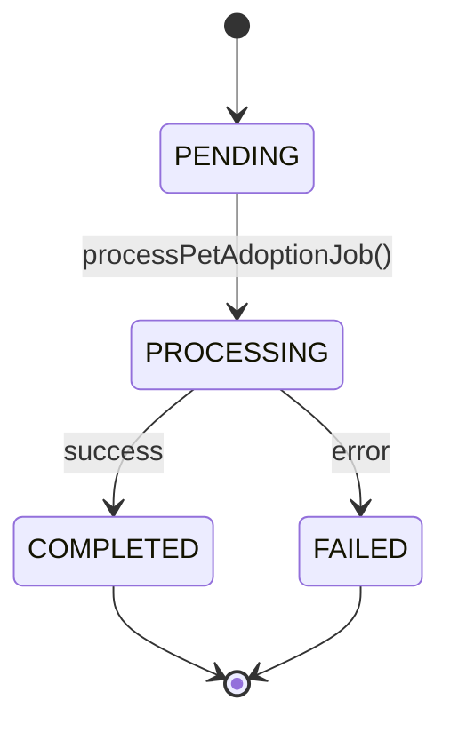
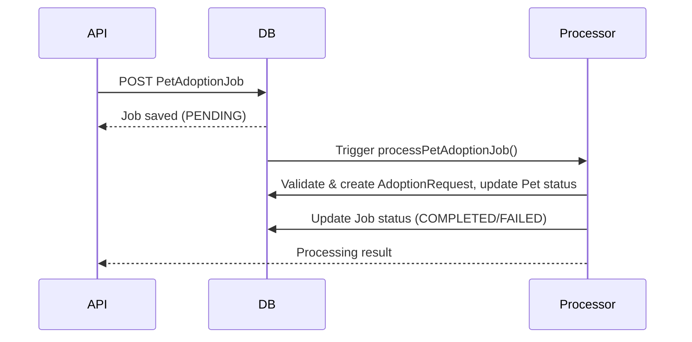
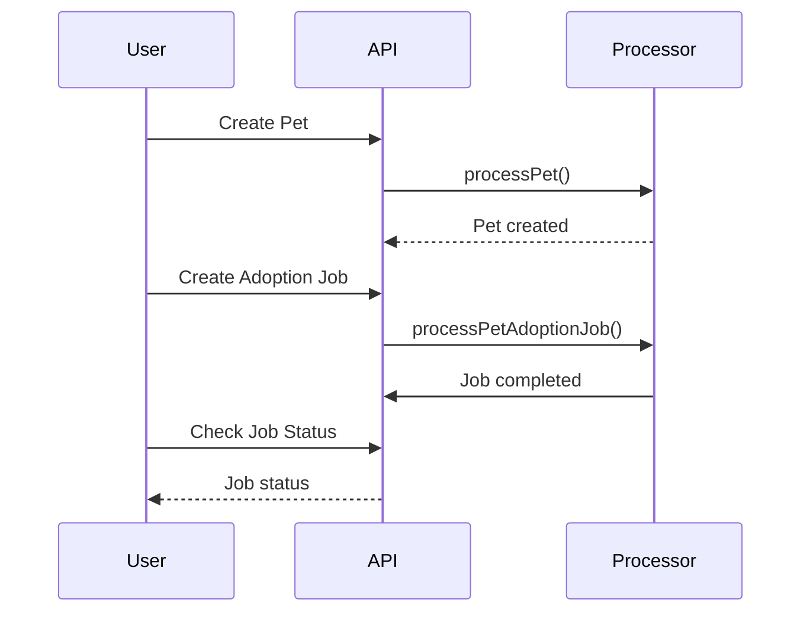

Certainly! Here is the well-formatted final version of your functional requirements for the 'Purrfect Pets' API app using Event-Driven Architecture on Cyoda:

---

### 1. Entity Definitions
```
PetAdoptionJob:
- jobId: String (unique job identifier)
- petId: String (ID of the pet for adoption)
- adopterName: String (name of the person adopting)
- adopterContact: String (contact info)
- status: JobStatusEnum (PENDING, PROCESSING, COMPLETED, FAILED)

Pet:
- petId: String (unique pet identifier)
- name: String (pet's name)
- category: String (e.g., cat, dog)
- status: PetStatusEnum (AVAILABLE, ADOPTED)

AdoptionRequest:
- requestId: String (unique request identifier)
- petId: String (ID of the pet requested)
- requesterName: String (person requesting adoption)
- requestDate: DateTime (timestamp of request)
- status: RequestStatusEnum (PENDING, APPROVED, REJECTED)
```

---

### 2. Process Method Flows

```
processPetAdoptionJob() Flow:
1. Initial State: Job created with PENDING status
2. Validation: Check pet availability and adopter info
3. Processing: Create AdoptionRequest entity, mark Pet status as ADOPTED
4. Completion: Update job status to COMPLETED or FAILED based on outcome
5. Notification: Optionally notify adopter of success/failure

processPet() Flow:
1. Initial State: Pet created with AVAILABLE status
2. Validation: Check mandatory fields (name, category)
3. Completion: Pet stored and ready for adoption listings

processAdoptionRequest() Flow:
1. Initial State: Request created with PENDING status
2. Validation: Verify pet availability and requester info
3. Decision: Approve or reject adoption request
4. Completion: Update request status accordingly
5. Notification: Notify requester of decision
```

---

### 3. API Endpoints Design

| Method | Endpoint                | Description                                 | Request Body Entity       | Response                     |
|--------|-------------------------|---------------------------------------------|---------------------------|------------------------------|
| POST   | /pets                   | Create a new pet (triggers processPet)      | Pet (without status)       | Created Pet with status       |
| POST   | /adoption-jobs          | Create adoption job (triggers processPetAdoptionJob) | PetAdoptionJob (PENDING) | Job status and details        |
| POST   | /adoption-requests      | Create adoption request (triggers processAdoptionRequest) | AdoptionRequest (PENDING) | Request status and details    |
| GET    | /pets/{petId}           | Retrieve pet details                         | -                         | Pet details                  |
| GET    | /adoption-jobs/{jobId}  | Retrieve adoption job status                 | -                         | Job status                   |
| GET    | /adoption-requests/{requestId} | Retrieve adoption request status       | -                         | Request status               |

---

### 4. Request/Response JSON Examples

**POST /pets**
```json
{
  "petId": "p001",
  "name": "Whiskers",
  "category": "cat"
}
```
Response:
```json
{
  "petId": "p001",
  "name": "Whiskers",
  "category": "cat",
  "status": "AVAILABLE"
}
```

**POST /adoption-jobs**
```json
{
  "jobId": "job123",
  "petId": "p001",
  "adopterName": "Alice",
  "adopterContact": "alice@example.com"
}
```
Response:
```json
{
  "jobId": "job123",
  "status": "PENDING"
}
```

---

### Mermaid Diagrams

**Entity Lifecycle State Diagram for PetAdoptionJob**

```mermaid
stateDiagram-v2
    [*] --> PENDING
    PENDING --> PROCESSING : processPetAdoptionJob()
    PROCESSING --> COMPLETED : success
    PROCESSING --> FAILED : error
    COMPLETED --> [*]
    FAILED --> [*]
```

**Event-Driven Processing Chain**

```mermaid
sequenceDiagram
    participant API
    participant DB
    participant Processor

    API->>DB: POST PetAdoptionJob
    DB-->>API: Job saved (PENDING)
    DB->>Processor: Trigger processPetAdoptionJob()
    Processor->>DB: Validate & create AdoptionRequest, update Pet status
    Processor->>DB: Update Job status (COMPLETED/FAILED)
    Processor-->>API: Processing result
```

**User Interaction Sequence Flow for Adoption**

```mermaid
sequenceDiagram
    participant User
    participant API
    participant Processor

    User->>API: Create Pet
    API->>Processor: processPet()
    Processor-->>API: Pet created

    User->>API: Create Adoption Job
    API->>Processor: processPetAdoptionJob()
    Processor->>API: Job completed

    User->>API: Check Job Status
    API-->>User: Job status
```

---

If you need any further refinements or additions, please feel free to ask!