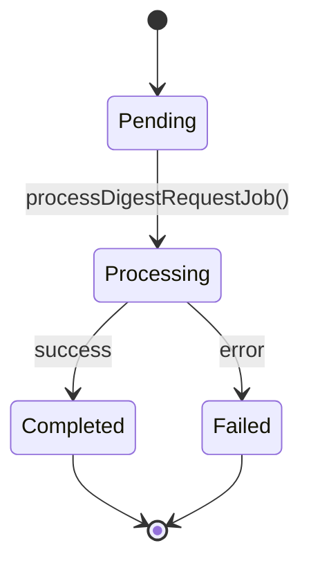
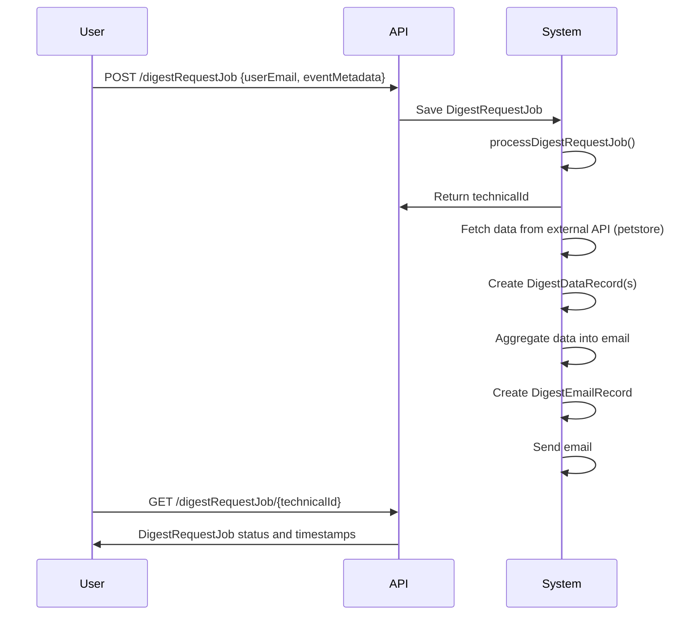

### 1. Entity Definitions

``` 
DigestRequestJob:
- userEmail: String (email address to send the digest to)
- eventMetadata: String (JSON or stringified metadata about the digest request)
- status: String (job status: PENDING, PROCESSING, COMPLETED, FAILED)
- createdAt: String (timestamp of job creation)
- completedAt: String (timestamp of job completion)

DigestDataRecord:
- jobTechnicalId: String (reference to DigestRequestJob technicalId)
- apiEndpoint: String (external API endpoint used to fetch data)
- responseData: String (raw JSON/string data retrieved from external API)
- fetchedAt: String (timestamp of data retrieval)

DigestEmailRecord:
- jobTechnicalId: String (reference to DigestRequestJob technicalId)
- emailContent: String (compiled digest content, HTML or plain text)
- emailSentAt: String (timestamp when email was dispatched)
- emailStatus: String (status of email sending: SENT, FAILED)
```

---

### 2. Process Method Flows

```
processDigestRequestJob() Flow:
1. Initial State: DigestRequestJob created with status = PENDING
2. Validation: Validate userEmail format and presence of eventMetadata
3. Processing:
   - Parse eventMetadata to determine API endpoints or use defaults
   - Create DigestDataRecord entities by fetching data from petstore API endpoints
4. Data Aggregation:
   - Aggregate fetched data into digest email content (HTML/plain text)
   - Save DigestEmailRecord with compiled content
5. Email Dispatch:
   - Send email to userEmail using email content
   - Update DigestEmailRecord.emailStatus accordingly
6. Completion:
   - Update DigestRequestJob.status to COMPLETED if all succeeded or FAILED if errors occurred
   - Record completedAt timestamp
```

```
processDigestDataRecord() Flow:
1. Initial State: DigestDataRecord created after API data fetch
2. Validation: Verify responseData integrity (optional)
3. Persistence: Store fetched data for aggregation
4. Completion: Mark fetch as completed (could be implicit by creation)
```

```
processDigestEmailRecord() Flow:
1. Initial State: DigestEmailRecord created with compiled content
2. Email Sending:
   - Dispatch email to the userEmail referenced by jobTechnicalId
3. Status Update:
   - Mark emailStatus as SENT or FAILED based on outcome
```

---

### 3. API Endpoints Design

| HTTP Method | Endpoint                        | Description                                   | Request Body                             | Response Body          |
|-------------|--------------------------------|-----------------------------------------------|-----------------------------------------|-----------------------|
| POST        | `/digestRequestJob`             | Create a new DigestRequestJob (triggers processing) | `{ "userEmail": "...", "eventMetadata": "..." }` | `{ "technicalId": "..." }` |
| GET         | `/digestRequestJob/{technicalId}` | Retrieve DigestRequestJob status and metadata | N/A                                     | `{ "userEmail": "...", "status": "...", "createdAt": "...", "completedAt": "..." }` |
| GET         | `/digestDataRecord/{technicalId}` | Retrieve DigestDataRecord by technicalId      | N/A                                     | `{ "apiEndpoint": "...", "responseData": "...", "fetchedAt": "..." }` |
| GET         | `/digestEmailRecord/{technicalId}` | Retrieve DigestEmailRecord by technicalId     | N/A                                     | `{ "emailContent": "...", "emailStatus": "...", "emailSentAt": "..." }` |

*Note:* No update or delete endpoints are provided, following immutable event-driven principles.

---

### 4. Request/Response JSON Examples

**POST /digestRequestJob Request:**

```json
{
  "userEmail": "user@example.com",
  "eventMetadata": "{\"status\":\"available\"}"
}
```

**POST /digestRequestJob Response:**

```json
{
  "technicalId": "job-12345"
}
```

**GET /digestRequestJob/job-12345 Response:**

```json
{
  "userEmail": "user@example.com",
  "status": "COMPLETED",
  "createdAt": "2024-06-01T10:00:00Z",
  "completedAt": "2024-06-01T10:05:00Z"
}
```

---

### 5. Mermaid Diagrams

#### Entity Lifecycle State Diagram (DigestRequestJob)


```mermaid
stateDiagram-v2
    [*] --> Pending
    Pending --> Processing : processDigestRequestJob()
    Processing --> Completed : success
    Processing --> Failed : error
    Completed --> [*]
    Failed --> [*]
```

#### Event-Driven Processing Chain

```mermaid
graph TD
    A[POST DigestRequestJob] --> B[processDigestRequestJob()]
    B --> C[Create DigestDataRecord(s)]
    C --> D[processDigestDataRecord()]
    D --> E[Aggregate Data & Create DigestEmailRecord]
    E --> F[processDigestEmailRecord()]
    F --> G[Send Email]
    G --> H[Update Job Status]
```

#### User Interaction Sequence Flow


```mermaid
sequenceDiagram
    participant User
    participant API
    participant System

    User->>API: POST /digestRequestJob {userEmail, eventMetadata}
    API->>System: Save DigestRequestJob
    System->>System: processDigestRequestJob()
    System->>API: Return technicalId
    System->>System: Fetch data from external API (petstore)
    System->>System: Create DigestDataRecord(s)
    System->>System: Aggregate data into email
    System->>System: Create DigestEmailRecord
    System->>System: Send email
    User->>API: GET /digestRequestJob/{technicalId}
    API->>User: DigestRequestJob status and timestamps
```

---

If you have no further questions or adjustments, I will proceed to finish_discussion.