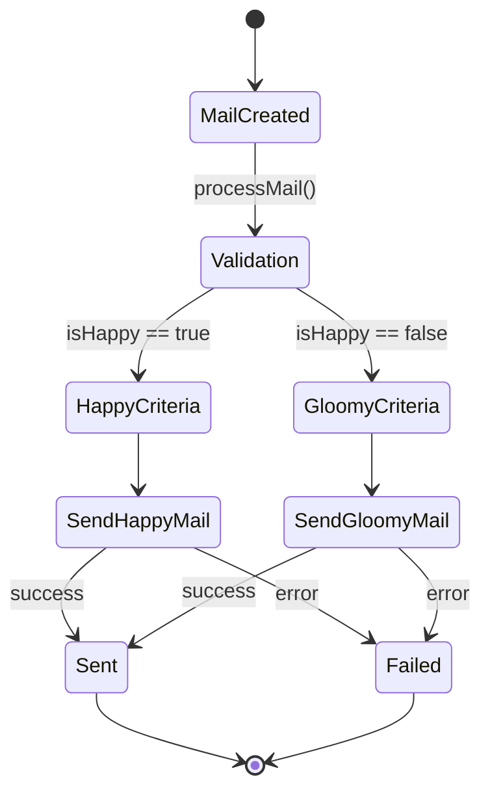
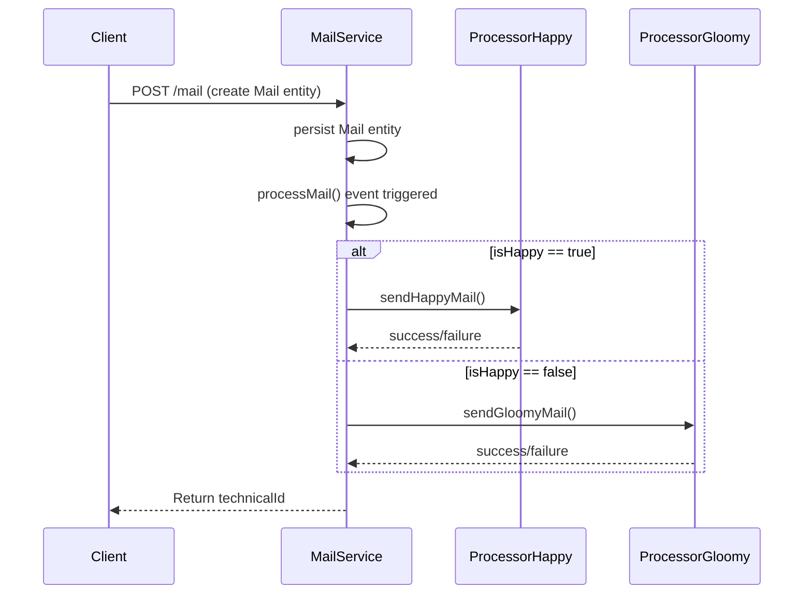
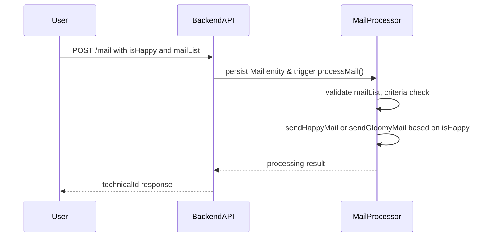

### 1. Entity Definitions

``` 
Mail:
- isHappy: Boolean (Indicates if the mail is happy or gloomy)
- mailList: List<String> (List of recipient email addresses)
- content: String (Optional field for mail message content, if needed)
```

### 2. Process Method Flows

```
processMail() Flow:
1. Initial State: Mail entity is created with `isHappy` and `mailList`
2. Validation: 
   - Check mailList is not empty
   - Validate email formats in mailList (optional)
3. Criteria Check:
   - If `isHappy == true` → process sendHappyMail()
   - If `isHappy == false` → process sendGloomyMail()
4. Processing:
   - sendHappyMail(): Compose and send happy mail to all addresses in mailList
   - sendGloomyMail(): Compose and send gloomy mail to all addresses in mailList
5. Completion: Mark mail as sent (event history persists via immutable creation)
6. Notification: Optionally log success/failure or emit further events
```

### 3. API Endpoints Design Rules

- **POST /mail**  
  - Creates a new `Mail` entity (immutable creation)  
  - Triggers `processMail()` event automatically on save  
  - Returns only `{ "technicalId": "uuid-string" }`  
- **GET /mail/{technicalId}**  
  - Retrieves stored `Mail` entity status and details by `technicalId`  
- **GET /mail** (optional)  
  - Retrieve all mail entities or by query parameters (only if explicitly requested)  

_No update or delete endpoints are included to maintain event history._

### 4. Request/Response Formats

**POST /mail**

_Request JSON:_

```json
{
  "isHappy": true,
  "mailList": ["user1@example.com", "user2@example.com"],
  "content": "Wishing you all the best!"
}
```

_Response JSON:_

```json
{
  "technicalId": "123e4567-e89b-12d3-a456-426614174000"
}
```

**GET /mail/{technicalId}**

_Response JSON:_

```json
{
  "technicalId": "123e4567-e89b-12d3-a456-426614174000",
  "isHappy": true,
  "mailList": ["user1@example.com", "user2@example.com"],
  "content": "Wishing you all the best!",
  "status": "SENT",
  "sentAt": "2024-06-01T12:00:00Z"
}
```

---

### Visual Representations

**Entity lifecycle state diagram**


```mermaid
stateDiagram-v2
    [*] --> MailCreated
    MailCreated --> Validation : processMail()
    Validation --> HappyCriteria : isHappy == true
    Validation --> GloomyCriteria : isHappy == false
    HappyCriteria --> SendHappyMail
    GloomyCriteria --> SendGloomyMail
    SendHappyMail --> Sent : success
    SendGloomyMail --> Sent : success
    SendHappyMail --> Failed : error
    SendGloomyMail --> Failed : error
    Sent --> [*]
    Failed --> [*]
```

**Event-driven processing chain**


```mermaid
sequenceDiagram
    participant Client
    participant MailService
    participant ProcessorHappy
    participant ProcessorGloomy

    Client->>MailService: POST /mail (create Mail entity)
    MailService->>MailService: persist Mail entity
    MailService->>MailService: processMail() event triggered
    alt isHappy == true
        MailService->>ProcessorHappy: sendHappyMail()
        ProcessorHappy-->>MailService: success/failure
    else isHappy == false
        MailService->>ProcessorGloomy: sendGloomyMail()
        ProcessorGloomy-->>MailService: success/failure
    end
    MailService-->>Client: Return technicalId
```

**User interaction sequence flow**


```mermaid
sequenceDiagram
    participant User
    participant BackendAPI
    participant MailProcessor

    User->>BackendAPI: POST /mail with isHappy and mailList
    BackendAPI->>MailProcessor: persist Mail entity & trigger processMail()
    MailProcessor->>MailProcessor: validate mailList, criteria check
    MailProcessor->>MailProcessor: sendHappyMail or sendGloomyMail based on isHappy
    MailProcessor-->>BackendAPI: processing result
    BackendAPI-->>User: technicalId response
```

---

This completes the confirmed functional requirements for your Happy Mail application using Event-Driven Architecture principles on the Cyoda platform.