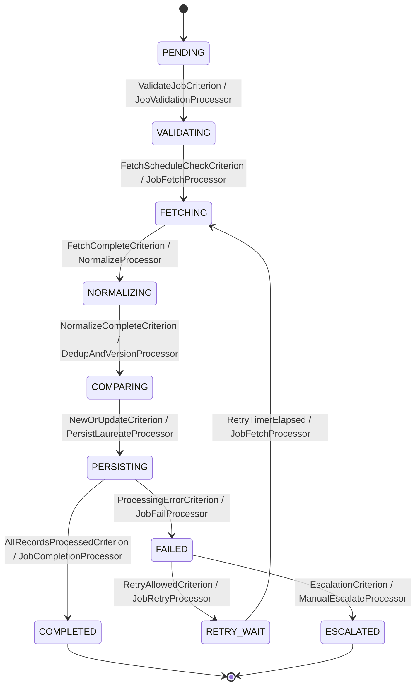
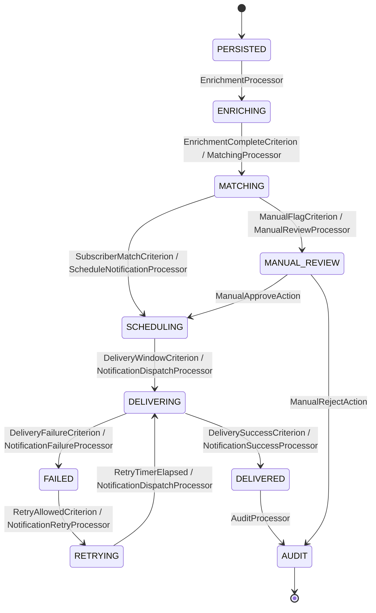
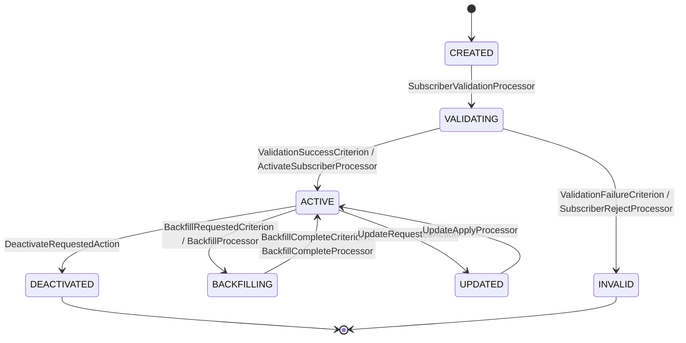
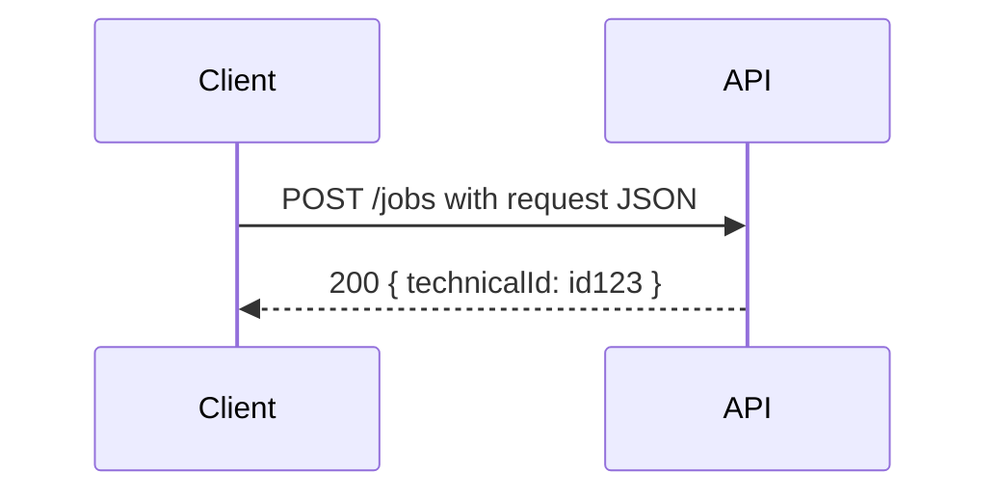
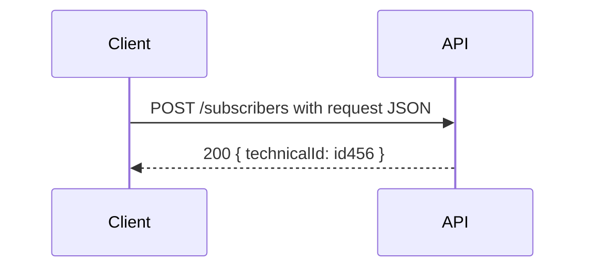
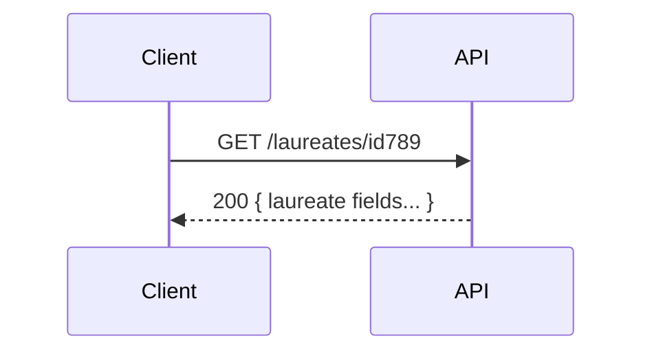

### 1. Entity Definitions
```
Job:
- name: String (human name of the ingestion job)
- sourceUrl: String (OpenDataSoft feed endpoint)
- schedule: String (cron-like schedule or manual flag)
- transformRules: String (rules or filter expression for normalization)
- status: String (current job status)
- lastRunAt: String (timestamp of last run)
- resultSummary: String (created/updated/skipped counts)
- retryCount: Integer (retry attempts counter)
- createdBy: String (operator who created the job)
- createdAt: String (timestamp)

Laureate:
- laureateId: String (canonical id assigned by system)
- fullName: String (person or organization name)
- year: Integer (award year)
- category: String (award category)
- citation: String (award citation text)
- affiliations: String (affiliations or institutions)
- nationality: String (country string)
- sourceRecord: String (raw payload reference)
- lifecycleStatus: String (New/Updated/Unchanged)
- matchTags: String (computed keywords/categories)
- createdAt: String (timestamp)
- updatedAt: String (timestamp)
- version: Integer (change version number)

Subscriber:
- name: String (subscriber name)
- contactMethod: String (email/webhook/sms)
- contactAddress: String (destination address or endpoint)
- active: Boolean (is subscription active)
- filters: String (categories/keywords/year range expression)
- deliveryPreference: String (immediate/digest/daily)
- backfillFromDate: String (optional date to backfill historical matches)
- lastNotifiedAt: String (timestamp)
- notificationHistory: String (reference to recent notifications)
- createdAt: String (timestamp)
```

### 2. Entity workflows

Job workflow:
1. Initial State: Job created with PENDING status (POST triggers event → Cyoda starts workflow)
2. Validation: Validate schedule, sourceUrl and transformRules (automatic)
3. Fetching: Execute data fetch from sourceUrl (automatic)
4. Normalization: Apply transformRules to raw records (automatic)
5. Comparison: For each normalized record evaluate dedupe and versioning (automatic)
6. Persist Laureate: Create or update Laureate entities (automatic → emits Laureate added/updated events)
7. Result: Update Job status to COMPLETED or FAILED and fill resultSummary (automatic)
8. Retry/Escalate: On failures apply retry policy or escalate for manual intervention (manual escalate)


```mermaid
stateDiagram-v2
    [*] --> PENDING
    PENDING --> VALIDATING : ValidateJobCriterion / JobValidationProcessor
    VALIDATING --> FETCHING : FetchScheduleCheckCriterion / JobFetchProcessor
    FETCHING --> NORMALIZING : FetchCompleteCriterion / NormalizeProcessor
    NORMALIZING --> COMPARING : NormalizeCompleteCriterion / DedupAndVersionProcessor
    COMPARING --> PERSISTING : NewOrUpdateCriterion / PersistLaureateProcessor
    PERSISTING --> COMPLETED : AllRecordsProcessedCriterion / JobCompletionProcessor
    PERSISTING --> FAILED : ProcessingErrorCriterion / JobFailProcessor
    FAILED --> RETRY_WAIT : RetryAllowedCriterion / JobRetryProcessor
    RETRY_WAIT --> FETCHING : RetryTimerElapsed / JobFetchProcessor
    FAILED --> ESCALATED : EscalationCriterion / ManualEscalateProcessor
    COMPLETED --> [*]
    ESCALATED --> [*]
```

Required criteria and processors for Job:
- ValidateJobCriterion, JobValidationProcessor
- FetchScheduleCheckCriterion, JobFetchProcessor
- NormalizeCompleteCriterion, NormalizeProcessor
- NewOrUpdateCriterion, DedupAndVersionProcessor
- PersistLaureateProcessor (creates Laureate entities)
- JobCompletionProcessor, JobFailProcessor, JobRetryProcessor, ManualEscalateProcessor

Laureate workflow:
1. Initial State: Laureate persisted (New or Updated) by Job process (event triggers workflow)
2. Enrichment: Compute matchTags, normalize names and affiliations (automatic)
3. Matching: Evaluate Subscriber filters to find matches (automatic)
4. Notification Scheduling: For each matched Subscriber enqueue notification according to deliveryPreference (automatic)
5. Delivered/Queued: Notifications either queued for digest or attempted delivery (automatic)
6. Audit/Archive: Store history and mark lifecycleStatus (automatic)
7. Manual Review: If flagged (e.g., high-impact change) require manual approval before notifications (manual)


```mermaid
stateDiagram-v2
    [*] --> PERSISTED
    PERSISTED --> ENRICHING : EnrichmentProcessor
    ENRICHING --> MATCHING : EnrichmentCompleteCriterion / MatchingProcessor
    MATCHING --> SCHEDULING : SubscriberMatchCriterion / ScheduleNotificationProcessor
    SCHEDULING --> DELIVERING : DeliveryWindowCriterion / NotificationDispatchProcessor
    DELIVERING --> DELIVERED : DeliverySuccessCriterion / NotificationSuccessProcessor
    DELIVERING --> FAILED : DeliveryFailureCriterion / NotificationFailureProcessor
    FAILED --> RETRYING : RetryAllowedCriterion / NotificationRetryProcessor
    DELIVERED --> AUDIT : AuditProcessor
    AUDIT --> [*]
    RETRYING --> DELIVERING : RetryTimerElapsed / NotificationDispatchProcessor
    MATCHING --> MANUAL_REVIEW : ManualFlagCriterion / ManualReviewProcessor
    MANUAL_REVIEW --> SCHEDULING : ManualApproveAction
    MANUAL_REVIEW --> AUDIT : ManualRejectAction
```

Required criteria and processors for Laureate:
- EnrichmentProcessor
- MatchingProcessor
- SubscriberMatchCriterion
- ScheduleNotificationProcessor
- NotificationDispatchProcessor
- NotificationSuccessProcessor, NotificationFailureProcessor, NotificationRetryProcessor
- ManualReviewProcessor, AuditProcessor

Subscriber workflow:
1. Initial State: Subscriber created via POST (event triggers workflow)
2. Validation: Validate contactAddress and filters (automatic)
3. Activation: Mark active and optionally run backfill (automatic/manual depending on backfill size)
4. Backfill Matching: If backfill requested, run matching against recent Laureate history and enqueue notifications (automatic)
5. Update/Deactivate: Manual transitions to update preferences or deactivate (manual)
6. Audit: Log subscription changes and notificationHistory (automatic)


```mermaid
stateDiagram-v2
    [*] --> CREATED
    CREATED --> VALIDATING : SubscriberValidationProcessor
    VALIDATING --> ACTIVE : ValidationSuccessCriterion / ActivateSubscriberProcessor
    VALIDATING --> INVALID : ValidationFailureCriterion / SubscriberRejectProcessor
    ACTIVE --> BACKFILLING : BackfillRequestedCriterion / BackfillProcessor
    BACKFILLING --> ACTIVE : BackfillCompleteCriterion / BackfillCompleteProcessor
    ACTIVE --> UPDATED : UpdateRequestedAction
    UPDATED --> ACTIVE : UpdateApplyProcessor
    ACTIVE --> DEACTIVATED : DeactivateRequestedAction
    DEACTIVATED --> [*]
    INVALID --> [*]
```

Required criteria and processors for Subscriber:
- SubscriberValidationProcessor
- ActivateSubscriberProcessor
- BackfillProcessor
- BackfillCompleteProcessor
- SubscriberRejectProcessor
- UpdateApplyProcessor

### 3. Pseudo code for processor classes

JobFetchProcessor
```
class JobFetchProcessor {
  process(job) {
    validate job.sourceUrl
    response = httpGet(job.sourceUrl)
    if response.success then
      for record in response.records:
        normalized = NormalizeProcessor.normalize(record, job.transformRules)
        sendEvent PersistLaureateEvent with normalized
    else
      throw ProcessingError
  }
}
```

DedupAndVersionProcessor
```
class DedupAndVersionProcessor {
  process(normalizedRecord) {
    existing = findLaureateByNaturalKey(normalizedRecord.key)
    if not existing:
      normalizedRecord.lifecycleStatus = New
      sendEvent PersistLaureate(normalizedRecord)
    else if recordDifferent(existing, normalizedRecord):
      normalizedRecord.version = existing.version + 1
      normalizedRecord.lifecycleStatus = Updated
      sendEvent PersistLaureate(normalizedRecord)
    else:
      normalizedRecord.lifecycleStatus = Unchanged
      // optionally skip persistence or update timestamps
  }
}
```

PersistLaureateProcessor
```
class PersistLaureateProcessor {
  process(payload) {
    persist Laureate entity
    sendEvent LaureatePersisted with laureateId and lifecycleStatus
  }
}
```

MatchingProcessor
```
class MatchingProcessor {
  process(laureate) {
    subscribers = queryActiveSubscribers()
    for s in subscribers:
      if SubscriberMatchCriterion.matches(s.filters, laureate.matchTags):
        enqueue NotificationItem(subscriberId=s.id, laureateId=laureate.id, deliveryPreference=s.deliveryPreference)
  }
}
```

NotificationDispatchProcessor
```
class NotificationDispatchProcessor {
  process(notificationItem) {
    if notificationItem.deliveryPreference == immediate:
      deliver(notificationItem)
      record delivery result
    else
      add to digest queue
  }
  deliver(item) {
    attempt delivery to subscriber.contactAddress
    if success mark delivered else mark failed and schedule retry
  }
}
```

BackfillProcessor
```
class BackfillProcessor {
  process(subscriber) {
    records = queryLaureatesSince(subscriber.backfillFromDate)
    for r in records:
      if SubscriberMatchCriterion.matches(subscriber.filters, r.matchTags):
        enqueue NotificationItem for r
  }
}
```

Keep processors idempotent: check existing notification history before enqueueing duplicate notifications.

### 4. API Endpoints Design Rules

Rules applied:
- POST endpoints create orchestration or user-triggered entities and return only technicalId.
- GET by technicalId available for entities created via POST.
- Laureate entities are created by Job workflow (no POST for Laureate).
- GET endpoints return stored application results.

Endpoints

1) Create Job
- POST /jobs
Request JSON:
```
{
  "name": "String",
  "sourceUrl": "String",
  "schedule": "String",
  "transformRules": "String",
  "createdBy": "String"
}
```
Response JSON (exactly):
```
{
  "technicalId": "String"
}
```

Mermaid for POST /jobs

```mermaid
sequenceDiagram
    participant Client
    participant API
    Client->>API: POST /jobs with request JSON
    API-->>Client: 200 { technicalId: id123 }
```

GET Job by technicalId
- GET /jobs/{technicalId}
Response JSON: full Job entity persisted (include fields listed in definitions)

2) Create Subscriber
- POST /subscribers
Request JSON:
```
{
  "name": "String",
  "contactMethod": "String",
  "contactAddress": "String",
  "filters": "String",
  "deliveryPreference": "String",
  "backfillFromDate": "String"
}
```
Response JSON:
```
{
  "technicalId": "String"
}
```

Mermaid for POST /subscribers

```mermaid
sequenceDiagram
    participant Client
    participant API
    Client->>API: POST /subscribers with request JSON
    API-->>Client: 200 { technicalId: id456 }
```

GET Subscriber by technicalId
- GET /subscribers/{technicalId}
Response JSON: full Subscriber entity persisted

3) Retrieve Laureate (read-only)
- GET /laureates/{technicalId}
Response JSON: full Laureate entity persisted

Mermaid for GET retrieval example

```mermaid
sequenceDiagram
    participant Client
    participant API
    Client->>API: GET /laureates/id789
    API-->>Client: 200 { laureate fields... }
```

Notes and business rules
- POST endpoints trigger Cyoda event processing immediately; Job POST starts Job workflow; Subscriber POST starts Subscriber workflow (validation + optional backfill).
- POST responses must include only technicalId and nothing else.
- All GET endpoints are read-only and must not trigger processing.
- Backfill is optional and can be large; recommend making it asynchronous (handled by Subscriber workflow).

If you want, I can:
- Add or trim fields to entities
- Expand criteria pseudo-code into more detailed logic
- Produce an example end-to-end event trace (Job POST → Laureate created → Subscriber notified) in mermaid sequence format

Which would you like to refine next?