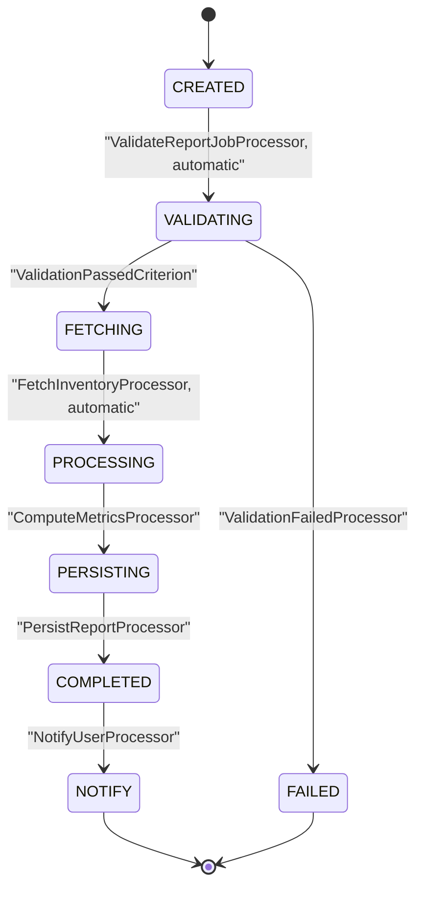
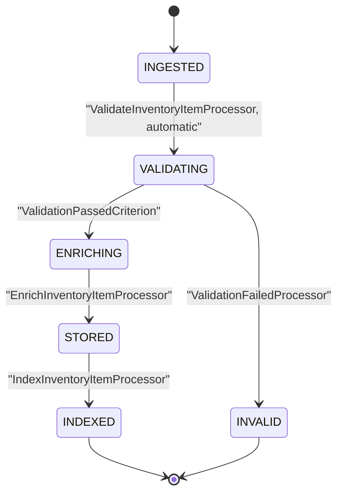
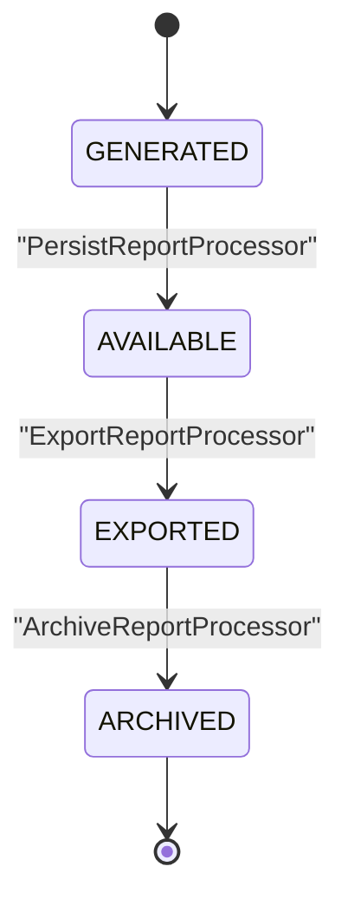

### 1. Entity Definitions
```
InventoryItem:
- id: String (external id from inventory source)
- name: String (product name)
- category: String (classification, optional)
- price: Number (unit price)
- quantity: Number (on-hand quantity)
- location: String (storage location, optional)
- supplier: String (supplier name, optional)
- dateAdded: String (ISO date, optional)
- status: String (ingested/validated/invalid)

ReportJob:
- requestedBy: String (user who requested the report)
- title: String (report title)
- createdAt: String (ISO timestamp)
- filters: Object (criteria to apply when fetching inventory)
- visualization: String (table/chart type preference)
- exportFormats: Array (CSV, PDF optional)
- notify: String (notification target, optional)
- status: String (CREATED/IN_PROGRESS/COMPLETED/FAILED)

Report:
- id: String (report id)
- jobReference: String (ReportJob technicalId)
- generatedAt: String (ISO timestamp)
- metrics: Object (totalItems, totalQuantity, averagePrice, totalValue, etc.)
- rows: Array (tabular rows used in visual)
- visuals: Object (chart specs or references)
- summary: String (text highlights)
- storageLocation: String (reference where exported files reside, optional)
```

### 2. Entity workflows

ReportJob workflow:
1. Initial State: CREATED when POSTed (event triggers process)
2. Validation: automatic validation of filters and parameters
3. Fetching: automatic fetch of inventory data (invokes InventoryItem ingestion)
4. Processing: compute metrics, build rows and visuals
5. Completion: store Report, update status to COMPLETED or FAILED
6. Notification/Export: optionally export and notify user


```mermaid
stateDiagram-v2
    [*] --> CREATED
    CREATED --> VALIDATING : "ValidateReportJobProcessor, automatic"
    VALIDATING --> FETCHING : "ValidationPassedCriterion"
    VALIDATING --> FAILED : "ValidationFailedProcessor"
    FETCHING --> PROCESSING : "FetchInventoryProcessor, automatic"
    PROCESSING --> PERSISTING : "ComputeMetricsProcessor"
    PERSISTING --> COMPLETED : "PersistReportProcessor"
    COMPLETED --> NOTIFY : "NotifyUserProcessor"
    NOTIFY --> [*]
    FAILED --> [*]
```

ReportJob processors and criteria:
- Processors: ValidateReportJobProcessor, FetchInventoryProcessor, ComputeMetricsProcessor, PersistReportProcessor, NotifyUserProcessor
- Criteria: ValidationPassedCriterion, FetchCompleteCriterion
- Short pseudo behaviour:
  - ValidateReportJobProcessor: verify filters and fields; set job.status FAILED on invalid.
  - FetchInventoryProcessor: trigger InventoryItem ingestion for each fetched item; wait for FetchCompleteCriterion.
  - ComputeMetricsProcessor: aggregate counts, sums, averages, topN by value.
  - PersistReportProcessor: create Report and set job.reportReference.
  - NotifyUserProcessor: send completion notice if notify present.

InventoryItem workflow:
1. Initial State: INGESTED when discovered by FetchInventoryProcessor
2. Validation: automatic field validation and normalization
3. Enrichment: automatic optional enrichment (supplier/location lookups)
4. Storage: persist to data store and mark STORED
5. Indexing: optional automatic indexing for querying


```mermaid
stateDiagram-v2
    [*] --> INGESTED
    INGESTED --> VALIDATING : "ValidateInventoryItemProcessor, automatic"
    VALIDATING --> ENRICHING : "ValidationPassedCriterion"
    VALIDATING --> INVALID : "ValidationFailedProcessor"
    ENRICHING --> STORED : "EnrichInventoryItemProcessor"
    STORED --> INDEXED : "IndexInventoryItemProcessor"
    INDEXED --> [*]
    INVALID --> [*]
```

InventoryItem processors and criteria:
- Processors: ValidateInventoryItemProcessor, ValidationFailedProcessor, EnrichInventoryItemProcessor, StoreInventoryItemProcessor, IndexInventoryItemProcessor
- Criteria: ValidationPassedCriterion, EnrichmentCompleteCriterion

Report workflow (business artifact created by job):
1. Initial State: GENERATED after PersistReportProcessor
2. Ready: AVAILABLE for retrieval
3. Exported: when user-requested export completed
4. Archived: optional retention-based archive


```mermaid
stateDiagram-v2
    [*] --> GENERATED
    GENERATED --> AVAILABLE : "PersistReportProcessor"
    AVAILABLE --> EXPORTED : "ExportReportProcessor"
    EXPORTED --> ARCHIVED : "ArchiveReportProcessor"
    ARCHIVED --> [*]
```

Report processors and criteria:
- Processors: PersistReportProcessor, ExportReportProcessor, ArchiveReportProcessor, NotifyUserProcessor
- Criteria: ExportRequestedCriterion, RetentionCriterion

### 3. Pseudo code for processor classes

ValidateReportJobProcessor
```
class ValidateReportJobProcessor {
  process(job) {
    if missing mandatory fields then job.status = FAILED
    else job.status = IN_PROGRESS
    emit job updated
  }
}
```

FetchInventoryProcessor
```
class FetchInventoryProcessor {
  process(job) {
    items = call external inventory API using job.filters
    for each item in items:
      create InventoryItem entity (event) // Cyoda will start InventoryItem workflow
    wait until FetchCompleteCriterion satisfied
  }
}
```

ComputeMetricsProcessor
```
class ComputeMetricsProcessor {
  process(job, items) {
    metrics.totalItems = count distinct items
    metrics.totalQuantity = sum quantity
    metrics.averagePrice = average price where price exists
    metrics.totalValue = sum price * quantity
    metrics.topByValue = compute top N
    job.metrics = metrics
  }
}
```

PersistReportProcessor
```
class PersistReportProcessor {
  process(job, metrics, rows, visuals) {
    report = new Report(...)
    save report
    job.reportReference = report.id
    job.status = COMPLETED
    emit job updated
  }
}
```

ValidateInventoryItemProcessor
```
class ValidateInventoryItemProcessor {
  process(item) {
    if required fields present then item.status = VALIDATED
    else item.status = INVALID
    emit item updated
  }
}
```

### 4. API Endpoints Design Rules

Rules applied:
- POST endpoints trigger events → return only technicalId
- GET endpoints retrieve stored results
- POST present for orchestration entity ReportJob
- GET by technicalId present for ReportJob and Report

Endpoints:

1) Create ReportJob (starts EDA processing)
POST /report-jobs
Request:
```json
{
  "requestedBy": "user@example.com",
  "title": "Monthly Inventory Value",
  "filters": { "dateRange": "last_30_days", "category": "all" },
  "visualization": "table_bar",
  "exportFormats": ["CSV"],
  "notify": "user@example.com"
}
```
Response:
```json
{
  "technicalId": "rj-0001-uuid"
}
```

2) Get ReportJob status/result reference
GET /report-jobs/{technicalId}
Response:
```json
{
  "technicalId": "rj-0001-uuid",
  "requestedBy": "user@example.com",
  "title": "Monthly Inventory Value",
  "createdAt": "2025-08-27T12:00:00Z",
  "status": "COMPLETED",
  "reportReference": "rep-0001-uuid"
}
```

3) Get Report by technicalId
GET /reports/{technicalId}
Response:
```json
{
  "technicalId": "rep-0001-uuid",
  "jobReference": "rj-0001-uuid",
  "generatedAt": "2025-08-27T12:05:00Z",
  "metrics": {
    "totalItems": 123,
    "totalQuantity": 456,
    "averagePrice": 12.34,
    "totalValue": 5600.12
  },
  "rows": [
    { "id": "A1", "name": "Item A", "price": 10.0, "quantity": 100, "value": 1000.0 }
  ],
  "summary": "Top category: Electronics with 40% of total value"
}
```

Notes and questions to finalize:
- Confirm must-have metrics (totalItems, averagePrice, totalValue) or additional metrics.
- Do you want scheduled recurring ReportJobs or only ad-hoc requests?
- Which visual types are preferred by default (table + bar by category)?