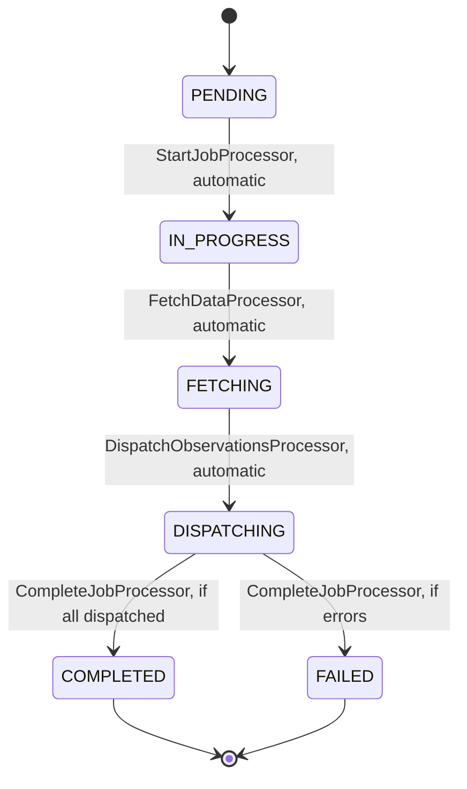
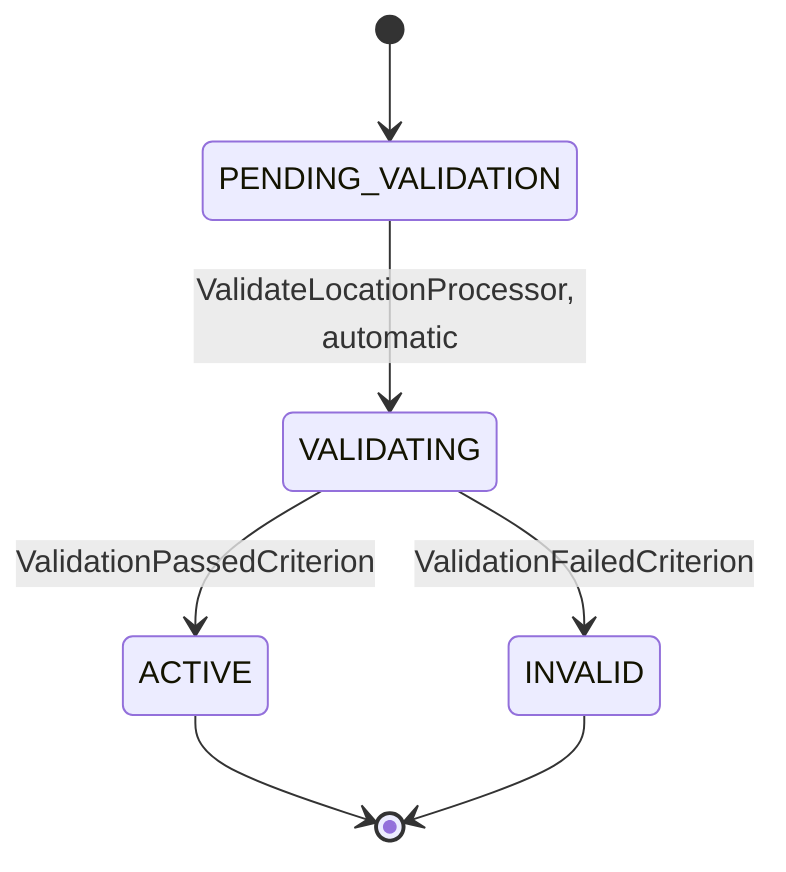
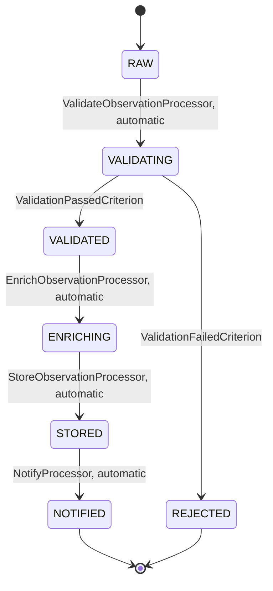

### Note
You did not specify entities, so I used the default of 3 entities (max allowed 10). If you want more, tell me which ones to add.

### 1. Entity Definitions
```
Job:
- jobName: String (human name for the ingestion job)
- source: String (data source, e.g., MSC GeoMet)
- locations: List<String> (locationId list to pull)
- schedule: String (cron or cadence description)
- status: String (PENDING IN_PROGRESS COMPLETED FAILED)
- createdAt: DateTime (creation timestamp)
- parameters: Map (extra parameters)

Location:
- locationId: String (domain id for place)
- name: String (place name)
- latitude: Double (decimal degrees)
- longitude: Double (decimal degrees)
- region: String (region or country)
- timezone: String (IANA timezone)
- active: Boolean (monitoring enabled)

WeatherObservation:
- observationId: String (domain observation id)
- locationId: String (links to Location)
- timestamp: DateTime (when measurement applies)
- temperature: Number (Celsius)
- humidity: Number (percentage)
- windSpeed: Number (m/s)
- precipitation: Number (mm)
- rawSourceId: String (source record id)
- processed: Boolean (true after enrichment)
```

### 2. Entity workflows

Job workflow:
1. Initial State: Job created with PENDING
2. Start: System triggers job at schedule -> IN_PROGRESS (automatic)
3. FetchData: Call MSC GeoMet and emit raw observations
4. Dispatch: For each raw record, create WeatherObservation entity (event)
5. Completion: Update status to COMPLETED or FAILED and notify


```mermaid
stateDiagram-v2
    [*] --> PENDING
    PENDING --> IN_PROGRESS : StartJobProcessor, automatic
    IN_PROGRESS --> FETCHING : FetchDataProcessor, automatic
    FETCHING --> DISPATCHING : DispatchObservationsProcessor, automatic
    DISPATCHING --> COMPLETED : CompleteJobProcessor, if all dispatched
    DISPATCHING --> FAILED : CompleteJobProcessor, if errors
    COMPLETED --> [*]
    FAILED --> [*]
```

Processors/Criteria for Job:
- Processors: StartJobProcessor, FetchDataProcessor, DispatchObservationsProcessor, CompleteJobProcessor
- Criteria: ScheduleCriterion, FetchSuccessCriterion

Location workflow:
1. Initial State: Location created with PENDING_VALIDATION
2. Validate: Validate coordinates -> ACTIVE or INVALID (manual fix)
3. Activate: Mark active for ingestion (manual)


```mermaid
stateDiagram-v2
    [*] --> PENDING_VALIDATION
    PENDING_VALIDATION --> VALIDATING : ValidateLocationProcessor, automatic
    VALIDATING --> ACTIVE : ValidationPassedCriterion
    VALIDATING --> INVALID : ValidationFailedCriterion
    ACTIVE --> [*]
    INVALID --> [*]
```

Processors/Criteria for Location:
- Processors: ValidateLocationProcessor, TagLocationProcessor
- Criteria: ValidationPassedCriterion, ValidationFailedCriterion

WeatherObservation workflow:
1. Initial State: observation created with RAW
2. Validate: Validate fields -> VALIDATED or REJECTED
3. Enrich: Map to Location, compute derived metrics -> ENRICHED
4. Store: Persist final record -> STORED
5. Notify: If thresholds or subscription match -> NOTIFIED


```mermaid
stateDiagram-v2
    [*] --> RAW
    RAW --> VALIDATING : ValidateObservationProcessor, automatic
    VALIDATING --> REJECTED : ValidationFailedCriterion
    VALIDATING --> VALIDATED : ValidationPassedCriterion
    VALIDATED --> ENRICHING : EnrichObservationProcessor, automatic
    ENRICHING --> STORED : StoreObservationProcessor, automatic
    STORED --> NOTIFIED : NotifyProcessor, automatic
    NOTIFIED --> [*]
    REJECTED --> [*]
```

Processors/Criteria for Observation:
- Processors: ValidateObservationProcessor, EnrichObservationProcessor, StoreObservationProcessor, NotifyProcessor
- Criteria: ValidationPassedCriterion, ValidationFailedCriterion, NotifyCriterion

### 3. Pseudo code for processor classes (concise)

StartJobProcessor:
```
class StartJobProcessor {
  process(job) {
    job.status = IN_PROGRESS
    emit job update
  }
}
```

FetchDataProcessor:
```
class FetchDataProcessor {
  process(job) {
    records = Cyoda.callSource(job.source, job.parameters)
    return records
  }
}
```

DispatchObservationsProcessor:
```
class DispatchObservationsProcessor {
  process(records) {
    for r in records: createEntity WeatherObservation with raw fields
  }
}
```

ValidateObservationProcessor:
```
class ValidateObservationProcessor {
  process(obs) {
    if obs.timestamp and obs.locationId and validNumbers then mark VALIDATED else REJECTED
  }
}
```

EnrichObservationProcessor:
```
class EnrichObservationProcessor {
  process(obs) {
    obs.processed = true
    // add derived metrics, normalize units, attach location metadata
  }
}
```

StoreObservationProcessor:
```
class StoreObservationProcessor {
  process(obs) {
    persist obs into results store
  }
}
```

NotifyProcessor:
```
class NotifyProcessor {
  process(obs) {
    if NotifyCriterion matches subscriptions then emit notification events
  }
}
```

### 4. API Endpoints Design Rules

POST /jobs
- Creates a Job entity (triggers event and workflow)
- Response MUST return only technicalId

Request:
```json
{
  "jobName":"DailyGeoMetIngest",
  "source":"MSC GeoMet",
  "locations":["LOC123","LOC456"],
  "schedule":"every 15 minutes",
  "parameters":{}
}
```

Response:
```json
{
  "technicalId":"job-tech-0001"
}
```

GET /jobs/{technicalId}
- Retrieve job status and summary

Response:
```json
{
  "technicalId":"job-tech-0001",
  "jobName":"DailyGeoMetIngest",
  "status":"COMPLETED",
  "createdAt":"2025-08-26T10:00:00Z",
  "processedCount":124,
  "failedCount":2
}
```

GET /observations/{technicalId}
- Retrieve stored observation result by technicalId

Response:
```json
{
  "technicalId":"obs-tech-0001",
  "observationId":"OBS-20250826-1",
  "locationId":"LOC123",
  "timestamp":"2025-08-26T09:45:00Z",
  "temperature":12.3,
  "humidity":78,
  "windSpeed":3.2,
  "precipitation":0.0,
  "processed":true
}
```

GET /locations/{technicalId}
- Retrieve stored location by technicalId

Response:
```json
{
  "technicalId":"loc-tech-001",
  "locationId":"LOC123",
  "name":"Station A",
  "latitude":59.1,
  "longitude":18.0,
  "region":"Stockholm",
  "timezone":"Europe/Stockholm",
  "active":true
}
```

If you want more entities (alerts, subscriptions, forecasts) or GET-by-condition endpoints, tell me which and I will extend the model.